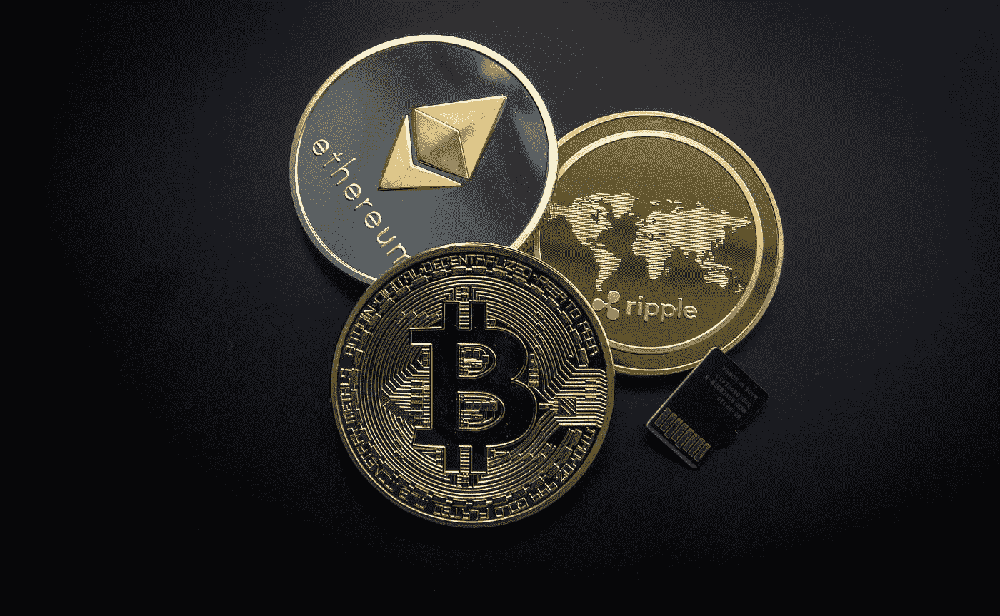
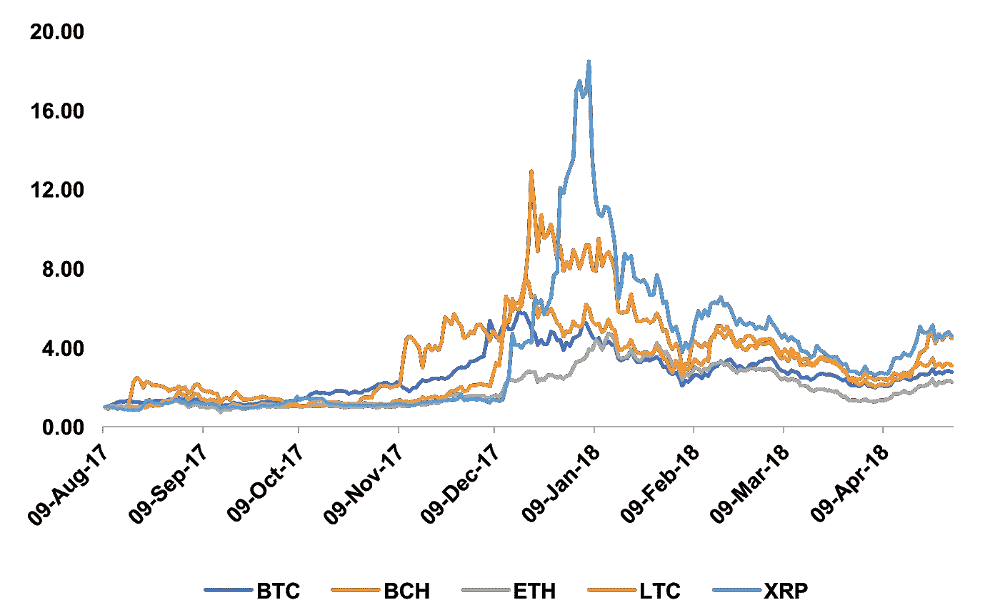
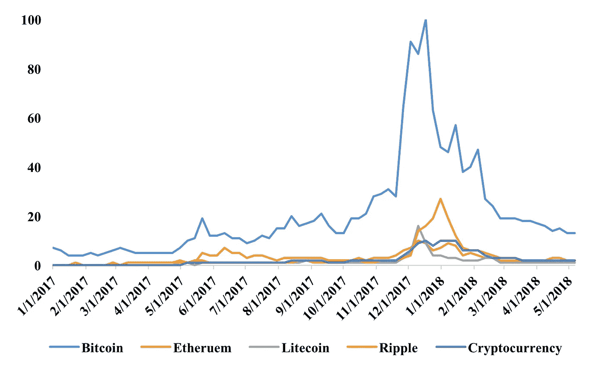
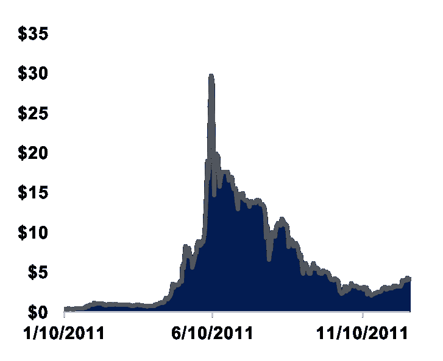
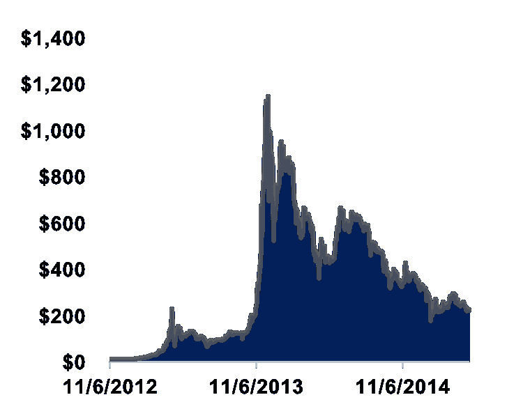
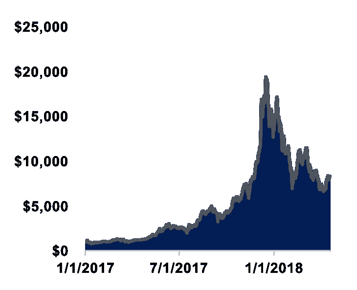

# 回顾过去，展望未来，横向观察:由三部分组成的加密行业概述—第一部分

> 原文：<https://medium.com/hackernoon/looking-back-looking-forward-looking-laterally-a-3-part-crypto-industry-overview-part-one-c67b5b4c3350>

*继我上一篇关于* [*HT*](http://www.huobi.pro) *的文章之后，我被联系到* [*火币*](http://bit.ly/2HFHJXm) *调研，并有幸提前获得了他们极为全面的 H1 2018 全球区块链行业战略概览的独家先睹为快。我将把内容分成三个部分，并把我认为最有趣的东西分出来，以便与大家分享这些知识。*

加密资产类别在 2017 年经历了第三次牛市。这一次，比特币不再是所有人关注的唯一主题，相反，由于年初以太坊的蓬勃发展，大量的 ERC20 令牌被创造出来并蓬勃发展——这标志着加密资产市场的范式转变，从对比特币等点对点现金的共识转向对智能合约的共识。进入 2018 年，市场在 2017 年 12 月利率和价格爆发后开始降温，但根据火币研究进行的情绪调查，**全球投资者仍然对 2018 年下半年的市场持乐观态度，**71.4%的受访者认为市值将增长 30%以上。

我们都知道，自年初以来，比特币的价格和加密货币的整体市值都在下降，但还有什么变化呢？该研究发现，随着价格的上涨，我们看到新代币发行和普遍兴趣的减少，但有趣的是，代币销售筹集的资金仍远高于 2017 年，但自 2 月份以来一直在下降。这也许显示了人们在低迷时期转向“小盘股”和“高风险高回报”的行为。

Figure 1 — Top 5 Crypto Assets Prices Index Evolution Chart (Huobi Research, 2018)

Figure 2 — Cryptocurrency search index (Note: Figures represent search activities relative to the highest level during a certain period. 100 = highest level, 0 = no related search) (Huobi Research, 2018)

从图 1 和图 2 中可以看出，随着价格的下降，大众的兴趣也在下降，但这并不奇怪。将 2017 年的牛市与前两次相比，有一些明显的相似之处，但也有许多不同之处。

Figure 3 — The first bull run. April 2011 to June 2011, 60 days and 38x from 0.75 USD to 30 USD

在 60 天的牛市中，比特币价格从 0.75 美元跃升至 30 美元，上涨了 38 倍。与比特币刚出现时的 0.06 美元相比，价格上涨了 492 倍。短期牛市是由 3 月份推出的比特币/英镑交易所引发的。后来，《时代》和《福布斯》的媒体文章赋予了“神奇的互联网货币”新的可信度，并推动了比特币投资。然而不久之后，Mt.Gox 交易所发生了众所周知的黑客攻击，导致比特币价格下跌 92%。从根本上说，这是 2018 年“崩盘”的一个不同原因。

Figure 4— The first bull run. One year from 13 USD to 1147 USD

第二次牛市持续了一年，比特币从 13 美元上涨了 82x，达到 1147 美元，峰值价格已经是最初比特币价格的 2 万倍。根据研究，这一牛市的原因是塞浦路斯债务危机导致的信贷危机。2013 年晚些时候，欧洲一些国家宣布了对比特币的友好政策，进一步提振了市场。然而，在 2015 年 1 月，价格再次下降了 82%，降至 210 美元。

Figure 4 — The third bull run. One year from 789 USD to 19343 USD

第三次牛市也持续了一年左右。尽管由于中国在 2017 年 9 月 4 日限制加密资产，比特币从 4950 美元小幅下跌至 3226 美元，但比特币从 789 美元上涨至 19343 美元。这一次，比特币的峰值价格几乎是最初价格的 32 万倍，蓬勃发展的 ICO 是这一挤兑的主要原因。与过去发生的情况类似，2018 年市场大幅下跌，比特币价格下跌 69%，至 2018 年 2 月的 6000 美元。

应该指出的是，与前两次相比，就百分比而言，这次下跌实际上没有那么糟糕。也许这是因为人们对这个领域的兴趣和信任增加了。在 2 月份泄露的一份私人摩根大通报告(我可能会单独撰写)中，他们得出结论，并随后建议他们的一位客户，加密货币在某些情况下可以为基金经理提供比传统资产更好的对冲，在传统的低迷时期往往会出现相反的趋势。除此之外，任何关注这一问题的人都清楚地看到，传统金融兴趣已经涌入，许多著名的风险投资家，如蒂姆·德雷珀(许多)、吉姆·布雷耶(圈子)、吴炯(矩阵)，都对他们的投资决策投下了信任票。

# **展望未来:什么将推动加密资产回到 2018 年 12 月的水平之上？**

在第二部分找到答案！其中包含了对下一轮牛市驱动力的敏锐洞察。对于任何想要获得完整报告的读者，它首先独家发布给[区块链节越南](http://www.blockchainfestival.com)的参与者，使用 code WRITE50 购买门票可以享受 50%的优惠。