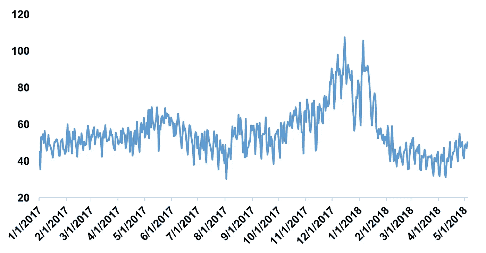
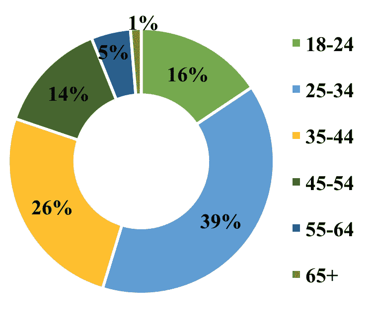

# 回顾过去，展望未来，横向观察——第二部分。什么会引发下一轮牛市？

> 原文：<https://medium.com/hackernoon/looking-back-looking-forward-looking-laterally-part-two-what-will-spark-the-next-bull-run-2ff77f5b48c8>

*继我上一篇关于* [*HT*](http://www.huobi.pro) *的文章之后，我被联系到* [*火币*](http://bit.ly/2HFHJXm) *调研，并有幸提前获得了他们极为全面的 H1 2018 全球区块链行业战略概览的独家先睹为快。我将把内容分成三个部分，并把我认为最有趣的东西分出来，以便与大家分享这些知识。* ***这是三部曲的第二部。读第一部分*** [***这里***](https://hackernoon.com/looking-back-looking-forward-looking-laterally-a-3-part-crypto-industry-overview-part-one-c67b5b4c3350) ***。***

因此，我们已经评估了整体形势，并将 2017 年的牛市与前两次进行了比较，所以下一步是向前看，并弄清楚到底是什么将带我们回到许多人渴望的新高。

根据 Huobi 研究报告，下一轮加密资产牛市有六个不同的驱动因素，即:

**金融渗透:** *加密金融将渗透传统金融*

**应用:** *专门为个别用例设计应用和区块链*

**M & A:** *通过加密资产获得优质互联网应用*

**用户:**bl*ock chain 用户群将保持增长*

**一代:** *用户平均年龄持续增加*

***性别:*** *预计将有更多女性进入市场，目前主要是男性*

在中，我们将深入探讨每个驱动因素，并在此阐述其背后的基本原理。

## 金融渗透

加密资产对传统金融的最大影响在于支付领域，特别是跨境支付和企业开展业务的方式。使用比特币等加密资产作为交换媒介，可以大大减少跨境支付的时间和费用，同时提高效率，分布式账本技术和智能合同可以广泛应用于清算和金融后台(MATRIX AI Network 表示有兴趣)，有助于降低运营和合规成本。

加密金融时代的到来似乎确实即将到来。越来越多的加密货币项目和公司正在采取不同的方法，我们看到 Circle 等大型投资银行支持的公司在新产品方面取得了很大进展，Stellar、Ripple 和 FUSION 等项目为传统金融领域令人印象深刻的利益相关者带来了独特的使用案例和解决方案。读者应该很清楚，弥合这一差距肯定会给加密货币注入新的生命，鉴于金融是世界最强大经济体的命脉，将部分资本从纯金融转移到加密金融将对前景产生巨大影响。

## 应用

Huobi Research 密切跟踪了以太坊上的 DApps，迄今为止日活跃用户最多的是区块链游戏(不包括分散式交易所)。还没有任何“严肃的”应用程序像脸书和推特这样为一些人的日常生活增加价值。由于目前的区块链技术仍处于早期阶段，大多数区块链应用程序都是不成熟的，功能有限。Huobi 认为，现在采用区块链应用程序的主要障碍是区块链先于用例，而“用例优先，区块链第二”是采用区块链的正确方式。他们表达了寻找共同需求和真实用例的重要性，*然后*将区块链作为一项基础技术添加到这些用例中，以优化用户体验。

## 兼并和收购

在传统金融领域，M&A 是项目市值的主要驱动因素之一。在分布式加密市场中，新加密资产的流通类似于 IPO，这同时也是目前加密市场的主要驱动力。随着区块链基础设施的不断成熟，Huobi 希望看到 M&A 技术在未来应用于区块链；大量的区块链平台，为了补充他们自己的 dApp 生态系统，将开始收购集中和分散的优质互联网应用，这反过来将为崭露头角的互联网初创企业提供新的退出策略。正如我们最近在新闻中看到的那样，这已经在相当大的规模上发生了——加密货币巨头比特币基地今年在不同的应用领域进行了多次收购，Earn.com 和密码浏览器是最近的一次。在这方面，我同意火币研究公司的观点，我确实相信 M&A 将成为加密货币领域的一个高产驱动力，不仅对比特币基地这样的公司，对项目也是如此。我预计，当这个领域变得更加成熟，平台开始真正成为去中心化的自治组织时，我们将见证有史以来第一次分布式公司收购。

## 用户增长

Figure 1: Number of Active Bitcoin Address vs Time (in thousands) (Huobi Research, 2018)

目前，比特币和以太坊的钱包地址分别超过 2400 万和 3200 万。预计全球区块链用户总数约为 2000 万，不到全球人口的 0.3%。根据 *We Are Social* 和 *Hootsuite* 的数据，2017 年全球互联网用户超过 40 亿，而区块链的普及率只有 2%。火币研究认为，用户总量的增长将刺激市场的活跃，加速社区的发展，从而推动加密市场的发展。此外，随着越来越多的机构投资者将加密资产视为一种新的资产类别，以使其投资组合多样化，市场深度和容量将受到显著影响。我们在牛市中也看到了这种效果。图 1 显示了活跃比特币用户地址的数量与时间的关系，趋势很明显。从历史上看，用户越多，价格越高。

## **一代:从年轻一代到大众**

Figure 2: Age distribution of BTC community (Huobi Research, 2018)

迄今为止，加密货币一直被一些人视为反叛。年轻人对当权派、对“婴儿潮”一代的反叛。尽管在某些方面这是真的，但为了接管世界并充分发挥潜力，加密货币必须是代际的，好消息是这正在发生。根据火币研究公司(Huobi Research)的最新调查，比特币社区中 39%的用户年龄在 25 至 34 岁之间，总用户中 55%的用户年龄在 35 岁以下，比 CoinDesk 公布的 2015 年的 60%有所下降。霍比认为，未来加密资产将越来越广泛地被大众接受，而不是一个只在年轻一代中产生共鸣的概念。更多具有更高风险承受能力和更大消费能力的中年人将把加密资产作为一种新的资产配置工具，针对不同年龄用户的 dApps 也将出现。

## **性别**

有趣的是，火币研究考虑的最终驱动因素是性别。根据该公司的调查，目前约有 17%的比特币社区用户是女性，比 CoinDesk 公布的 2015 年的 10%增加了 7%。Huobi Research 认为，女性投资者通常更谨慎，更喜欢可持续和长期的增长，她们有更普遍的支出激励，因此可以为 dApp 开发者创造新的应用领域，如在线购物，女性通常比男性更多。

总之，火币研究认为，加密市场将经历从“投资驱动”到“投资+应用”驱动的范式转变。各种使用案例和需求将在链上标记，这将反映在密码的市值中。上述六个驱动因素将以各自的方式促成这一转变，我认为金融渗透、M&A 和一般用户增长将是主要的三个驱动因素。

考虑到这些想法，我们必须注意到加密资产并不存在于泡沫中。这些驱动因素中的每一个都具有受政府和监管者监管的特征，因此，必须密切关注监管情况，以评估哪些驱动因素最有可能让项目在不久的将来蓬勃发展。**第 3 部分从横向看，将深入探讨日益关键的监管格局，并提供对开发者、投资者和用户在试图成功驾驭这一领域时必须了解的内容的见解。**

*正在讨论的报告全文将首先独家发布给* [*区块链节越南*](http://www.blockchainfestival.com) *的参会人员，用 code WRITE50 买票可以打五折。*