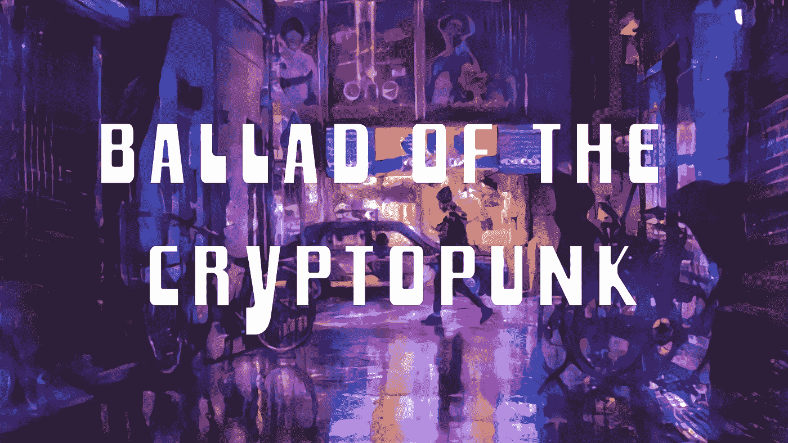
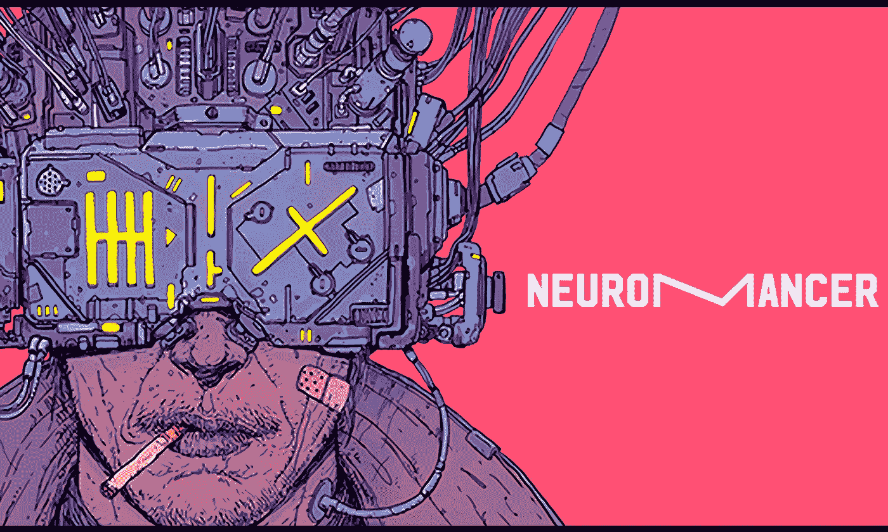
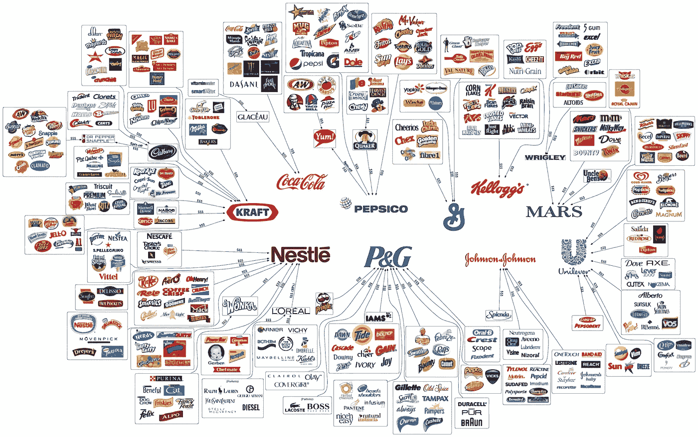
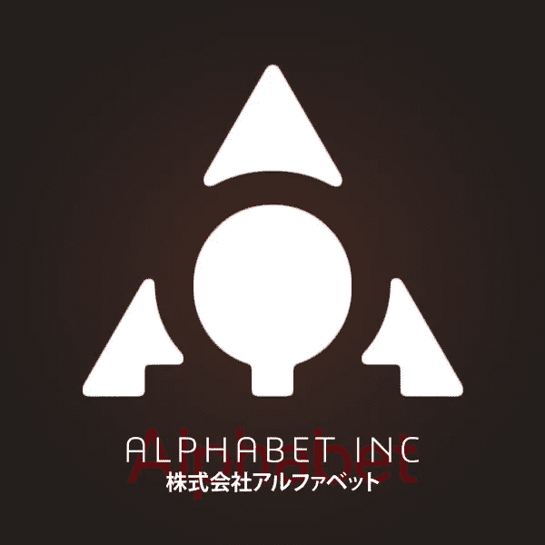
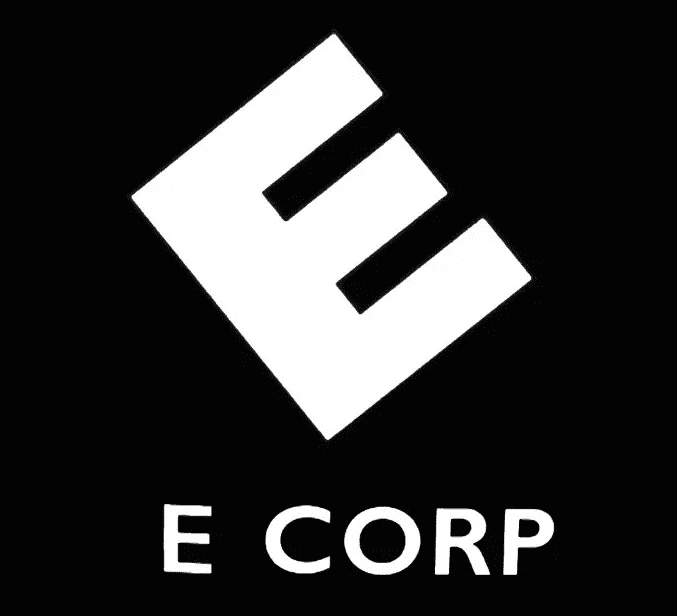
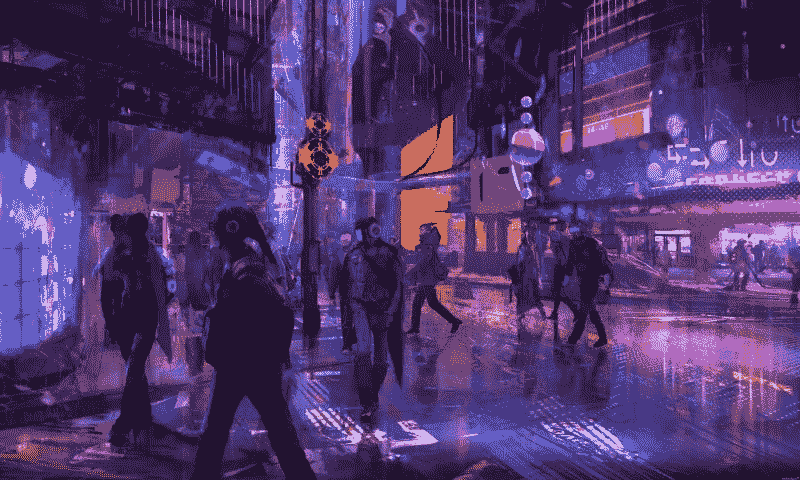

# 隐朋克民谣

> 原文：<https://medium.com/hackernoon/los-angeles-november-2019-9194c6d4d588>

洛杉矶，2019 年 11 月。城市景观中散落着无数的灯光，污染的薄雾笼罩着天空。持续的闪电风暴阻挡了阳光到达城市的底层。化工厂的山顶冒出了猛烈的火焰。一辆孤独的单车飞过夜空。

纯粹的技术成就的颓废，被贪婪和利润所驱使，以牺牲人性为代价，与普通人的困境形成了鲜明的对比:这是赛博朋克。

赛博朋克媒体为我们提供了身临其境的窗口，让我们了解令人惊叹的高科技成就的世界以及在这样的世界中生活的艰难，同时也让我们看到了未来完全被大公司控制的绝对恐怖。如果你给一个中央集权的公司(我们以富国银行为例，因为他们最近搞砸了)说，人类克隆的关键，会发生什么？拿一本菲利普·K·蒂克的*机器人会梦到电动绵羊吗？*一探究竟。这本书并没有明确说明这一点，但事情会是这样的:富国银行将单枪匹马地摧毁世界粮食生产，同时注定我们的物种将被生理上更优越的人造人所取代。赛博朋克的可怕之处不在于角色身上发生了什么——可怕之处在于意识到我们的世界可能会走上与这些赛博朋克反乌托邦相同的道路。谁或什么会阻止我们滑下这条路？

让我们回头看看*原著*赛博朋克小说:威廉·吉布森的*神经漫游者。《神经漫游者》*反映了一个未来，极端的技术进步是常态，企业控制渗透到生活的方方面面。人们用技术来逃避现实，把人性抛在脑后。

> 网络空间。每个国家数十亿合法经营者每天都经历的一种共识幻觉。
> 
> 神经学家(威廉·吉布森)

William Gibson’s Neuromancer

《神经漫游者》*中展示的“网络空间”提醒我们，我们的每一种感官——从视觉、听觉、嗅觉、触觉到味觉——都可以用一系列 0 和 1 来表示。从本质上来说，感觉是以电信号的形式传输到我们大脑的数据。闻向日葵并没有什么客观的特别之处；向日葵的香味和一块牛排的香味之间的界限可能只在一些非常小的数据片段之间划分。*

现在，我们进入了神经癌的恐怖方面。如果网络空间被那些只为赚取利润和控制其他公司而存在的大公司所控制，那会怎样？这部小说没有过多地涉及网络空间的社会政治方面，但其中的含义是:巨型企业存在于一个近乎极权的层面上。他们控制着公民生活的方方面面，无视法律，并垄断了多个市场。这似乎太疯狂了，甚至无法想象，但不要害怕！你不用想象。

“The Illusion of Choice” — courtesy of [/u/mod83](https://www.reddit.com/user/mod83) on Reddit

十个——数一数。同ＴＥＮＵＴＯ可口可乐、百事可乐、通用磨坊、家乐氏、玛氏、联合利华、强生、P&G、雀巢和卡夫控制了世界上大多数消费品。这些名字听起来可能不像“泰里尔公司”或“韦兰-尤塔尼”那样具有威胁性，也可能不像赛博朋克媒体中描述的那些巨型公司那样在众多行业中竞争，但它们正在向那个方向发展。如果可口可乐决定涉足其中呢？如果雀巢决定与美国电话电报公司合并会怎样？这似乎很荒谬，但就在最近，康卡斯特试图收购时代华纳有线电视。

> 不可能在任何层面上移动、生活、操作而不留下痕迹、比特、看似无意义的个人信息片段。可以被检索、放大的片段…
> 
> ——*约翰尼助记法*(威廉·吉布森)

The Alphabet (Google) logo reimagined as an evil megacorp (courtesy of [8th Mind](https://www.8thmind.com/article/120))

我们只是触及了那些有朝一日可能强大到足以影响人类生活方方面面的公司的皮毛。我们甚至还没有进入垄断用户数据的科技公司。就在最近，谷歌更新了 Chrome 浏览器，强制任何使用 Gmail 或其他谷歌服务的人也登录浏览器本身。当你登录 Chrome 浏览器时，谷歌会将你的网络活动保存到他们的服务器上，并根据他们想要的任何谷歌理由使用它。谷歌表示，这样做是为了解决 cookie 同步问题，用户在这种情况下不会“完全”登录。然而，关于隐私的众所周知的界线似乎已经改变，更能说明问题的是，谷歌没有在第一时间引起人们对这一变化的注意。

How do we stop Evil Corp from being the norm?

任何人都不可能预测巨型企业将在何时或如何涌现。更可怕的现实可能是，我们甚至不会注意到某些寡头何时完全控制了我们的生活方式。面对这种厄运和黑暗，我们该怎么办？

我们的第一道也是最后一道防线:密码朋克。Cryptopunks 是区块链的狂热分子，他们支持去中心化项目不是因为金钱利益，而是因为他们相信大公司反乌托邦之外的未来。

Cryptopunks: regular people who happen to be fighting for our future.

作为赛博朋克运动的自然延伸，赛博朋克是权力下放的积极分子。他们相信通过加密技术、区块链技术和真正不可信的系统来实现社会和政治变革。中本聪是一个创造了区块链技术的密码朋克——密码朋克是区块链的采纳者和支持者。关于密码朋克运动的更多信息可以在黑客正午的 Trent Lapinski 的这篇令人敬畏的文章中找到。

密码朋克的关键原则(去中心化、平等、透明系统、个人隐私和反社团主义)都与过去的密码朋克相同。这些理想主义运动之间的主要区别在于现有的技术。密码朋克使用的是 90 年代的技术——1995 年的顶级电脑拥有 8MB 内存和 33mhz CPU。今天，随着先进的处理速度和区块链技术的出现，密码朋克在摧毁和重建低效的旧世界系统方面有了更好的把握。随着区块链技术和硬件解决方案的发展，真正分散未来和打击社团主义的力量就在加密货币爱好者的指尖。

如果你相信加密的承诺，并积极支持它在摧毁企业系统中的腐败和贪婪，你就是一个加密朋克。

战斗已经开始了。**这是隐朋克的民谣。**

> 未来已经到来——只是分布不均匀。
> 
> —威廉·吉布森