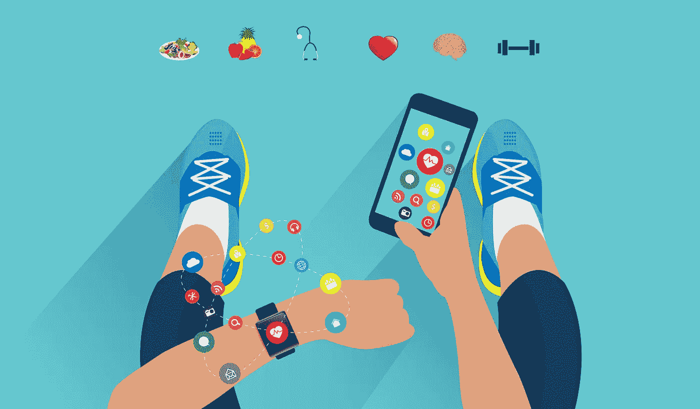
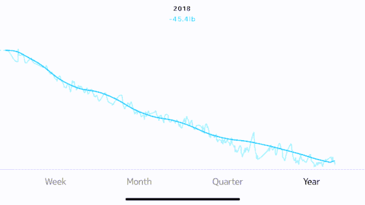
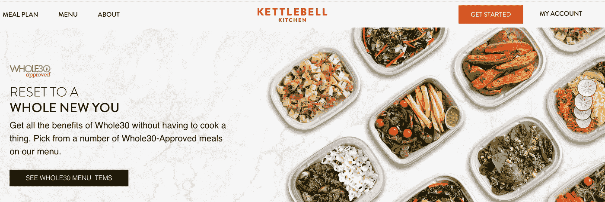
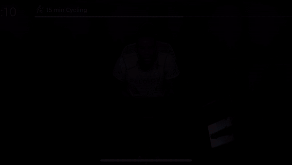
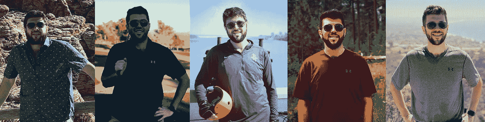

# 数字时代的减肥

> 原文：<https://medium.com/hackernoon/losing-weight-in-the-digital-age-c1a6d532e35b>

## 科技如何让我不像人而更像机器

Signed property release on file with Shutterstock, Inc.

# **9 磅 4 盎司**

我稳稳地排在第 95 百分位，是医院里最重的新生儿，遥遥领先。事实上，这种趋势一直持续到最近。然而，在各种新的食品品牌和技术的帮助下，我今年减掉了 45 磅，这引发了无数的疑问:一个如此明显对食物上瘾的 T2 人是如何突然扭转局面的。

表面上，我遵循了一个屡试不爽的方法:健康饮食，少吃，锻炼。在幕后，我在数字时代全力以赴减肥。这既昂贵，又累人，而且有争议。我不能说我采取的方法是否适合所有人，但也许对某些人有帮助。

*欢迎来到战场。*

# **动机**

每一次有意义的旅程都需要一个反派人物——逆境出英雄。对于节食来说确实如此，但不是以一种明显的方式。超重本身并不是一个足够的催化剂，因为很难将自己视为需要克服的敌人。数字时代使所有新的健康和健身技术成为可能，但如果没有最初的动力，这些技术是无法实现的，这令人沮丧。

去年，在一个经济论坛上，当我坐在我认为最无趣的研讨会上时，我的动力出乎意料地出现了。演讲者是一位名叫加里·陶布斯的研究员，他刚刚出版了他的最新作品 [*【反糖案*](https://www.amazon.com/Case-Against-Sugar-Gary-Taubes/dp/0307701646) 。他没有讲授健康或生物学，而是将注意力集中在工业复合体上，这种复合体延续了关于碳水化合物的所谓益处和脂肪的危害的错误信息。

> …如果你用一种全新的人造食品创造一个新市场，给它一个全新的名字，投入大量的广告预算，你就可以拥有一个完全属于你自己的市场，并迫使你的竞争对手迎头赶上。你不能对水果和蔬菜这样做。苹果和苹果很难区分。

陶布斯探究了私人和公共部门之间长达几十年的勾结，这种勾结[将任何敢于质疑食物金字塔正统理论的人边缘化](https://www.nytimes.com/2002/07/07/magazine/what-if-it-s-all-been-a-big-fat-lie.html)。尽管在政府制定的营养指南中一再获得有利的位置，加工碳水化合物可能是肥胖的主要原因。这种影响已经渗透到美国文化的方方面面，无论是在超市内部还是外部。事实证明，虽然没有人能帮你减肥，[但几乎每个人都在努力让你变胖。我知道这正是我需要的动力。我找到了我的恶棍。](https://thewalrus.ca/think-you-can-limit-your-kids-sugar-intake-think-again/)

# 心态

缩小后，我今天的减肥图看起来像一个向下的陡坡，也许是生活方式突然转变的结果。但是放大来看，你会发现减肥是一系列的起伏——后者由我因为各种原因而失败的战斗组成。

认为减肥可以用“前后”图来概括的想法只是许多误解之一。事实上，我发现很多关于节食的“专家建议”和“传统智慧”在最好的情况下是无益的，或者在最坏的情况下是适得其反的。

例如，在城市生活方式中，故意计划的“欺骗日”往往是不必要的。假期、社交活动和其他各种各样的活动本质上保证了它们的发生，不管有没有计划。我的苗条之路经常包括一次又一次地减掉同样的体重。

每一个高原都让我合理地怀疑这是不是路的尽头，这是我在理性范围内所能失去的最大限度。“身体积极性”运动经常出现在旅程中的对话中，反复宣称“你做到了——干得好！”但是照镜子的时候不开心，就一直推。

对我来说，一开始的关键是不断重新关注巨人复仇女神——一个无名的、复杂的有害激励系统，旨在让我们吃得不健康。但是任何一个曾经节食失败的人都知道，仅仅依靠动力是远远不够的。在没有永久改变我潜在的生活方式和观点的情况下，我只是在赌稍纵即逝的意志力和一连串幸运的日子能继续下去。在任何特定的时刻，我都有可能回到过去的生活方式。

我需要空中支援。通过无情地尝试不同的技术和食物，我建立了一个个性化的常规和习惯的对抗系统，帮助我获得了可持续的优势。

# 吃

节食对我来说就像建造一座沙堡，加工过的碳水化合物就像附近上涨的潮水。在我能够取得任何有意义的结果之前，我不得不承认在精神上和身体上都依赖糖的情况下减肥是多么的不可能。

“一切适度”被证明是又一个节食谬论。任何数量的加工碳水化合物都有可能破坏数周的进展。糖在节食地狱中有着特殊的地位:它的最轻微的味道[会引发进食、渴望和肥胖的飞轮](https://www.businessinsider.com/weight-loss-for-food-addiction-2018-4)。现在说起来似乎是显而易见的，但是*如果你不能感到饱，你就不能节食。*

我记得我感到愤怒，尤其是对那些似乎可以吃加工过的碳水化合物而没有负面影响的人。我想每个节食者都曾在某个时候希望肥胖降临到有任何遗传倾向的人身上，让他们在保持腰围的同时快乐地吃披萨。

但是我厌倦了借口。最终，我选择了一个月，从日历上删除了工作和家庭之外的所有人际交往。我用[壶铃厨房](https://www.kettlebellkitchen.com/)完成了整个 30 挑战，并从我的饮食中去除了加工过的碳水化合物和麸质。这是我旅途中最困难的部分之一。

我在我的日历上添加了一个下午 3 点的重复事件，上面写着“我要偏头痛了，我会活下来的。”对痛苦的预期是一种宣泄——一种尖锐的提醒，我的生理机能被利用了。

一天下午，偏头痛没来。食物开始变得不一样，让我饱了更久。我有更多的体力和脑力。我意识到“常态”实际上是一种持续膨胀的状态。面包突然看起来闻起来像塑料。*我可能是 2018 年唯一一个没有吃百吉饼的纽约人。*

当我达到目标体重时，我的饮食是这样的:

**早餐**(约 200 卡路里)

*   [超级咖啡](https://www.kitulife.com/collections/kitu-super-coffee)
*   两个煮熟的鸡蛋

**上午晚些时候** (~160 卡路里)

*   1 杯混合浆果
*   杏仁牛奶卡布奇诺

**午餐沙拉**(约 400 卡路里)

*   两杯菠菜
*   4 盎司鸡胸肉
*   1/3 杯红洋葱
*   1/3 芒果
*   1 盎司山羊奶酪
*   3 个蛋白
*   柠檬汁、盐和胡椒

**傍晚时分**(约 200 卡路里)

*   一个苹果
*   澳洲坚果牛奶抹茶拿铁

晚餐沙拉(大约 350 卡路里)

*   6 盎司火鸡肉丸
*   两杯菠菜
*   1/3 杯红洋葱
*   1 杯胡桃南瓜

**零食**(约 270 卡路里)

*   1 盎司[火鸡肉干](https://perkyjerky.com/collections/turkey/products/more-than-just-original-turkey-2-2)
*   1 杯混合浆果
*   1 个集装箱[好文化农家干酪](https://www.goodculture.com/)

细致的跟踪和优化使我能够轮换替代食物，像一个疯狂的科学家一样测试和学习，同时在每天 1600 卡路里的预算下保持理智。

# 最佳化

即使在古饮食的限制下，也有很多选择。关键的下一步是消除对减肥原因的猜测。

我花了 39.99 美元购买了 LoseIt 的高级年度会员资格，用于计算卡路里。免费选项已经足够了，为什么还要选择高级版本？因为，尽管行为经济学家错误地描述了这一点，沉没成本谬误是一种强大的动力，促使你在做出身体上的承诺之前继续你在精神上承诺的行为。欺骗自己利用过去购买的东西成为我最喜欢的节食技巧之一，也是我整个旅程中反复出现的主题。

然后我购买并连接了一个 [Apple Watch](https://www.apple.com/watch/) 和 [Withings Body Scale](https://www.withings.com/us/en/body) 。我每天早上和晚上同一时间称体重，以查明短期和长期波动的原因。我一开始并不太在意体重，但是没有什么比感觉自己今天过得很好，但第二天体重还是增加了更令人沮丧的了。这让我想把秤扔出窗外，因为整个过程感觉像是徒劳的练习。我越早了解我的身体对食物的反应，我就能越早避免这些经历。

通过仔细地交叉参考 LoseIt 和我体重秤上的数据，我对一系列食物和品牌对我体重的影响进行了分类。除了我日常饮食中列出的那些，对我减肥最有帮助的包括: [PB2](https://www.eatthis.com/pb2/) 、[乔氏菜花汤团](https://www.traderjoes.com/digin/post/cauliflower-gnocchi)、[从头开始的菜花饼干](https://www.amazon.com/Ground-Up-Cauliflower-Crackers-Cheddar/dp/B07D3F7YPV/ref=pd_bxgy_img_3)、海带面、海藻沙拉和椰子汁。

还有一些传统上被认为是“健康”的食物，我主要避免吃，因为它们要么不能填饱肚子，要么通常会导致体重增加:坚果、种子、鳄梨、鸡蛋、花生酱、酸奶和鹰嘴豆泥。我仍然对爆米花犹豫不决。

在不健身的情况下，我每天可以摄入的卡路里总量大致如下:

*   200 磅体重，1950 卡路里
*   190 磅体重，1900 卡路里
*   180 磅时 1825 卡路里
*   170 磅时 1725 卡路里
*   160 磅时 1600 卡路里

正如你所料，减肥变得越来越困难。制造一个飞轮来减肥要比依靠我们微调过的生物飞轮来帮助我们增重困难得多。大幅降低卡路里上限越来越多地涉及到咖啡因等食欲抑制剂以及各种“窍门”。

**旅游攻略**

久而久之，我发现旅行和度假是减肥的最大障碍。我不能依赖于我的日常生活之外的日常生活。事实上，我完全放弃了尝试，而是进入了“维护模式”我依赖一些专门为旅行设计的技巧:

*   代替酒店早餐的能量棒:[雷鸟](https://www.thunderbirdbar.com/)和 [GFB 咬伤](https://theglutenfreebar.com/)
*   [番泻叶茶](https://www.verywellhealth.com/senna-tea-what-should-i-know-about-it-89933)缓解时差反应，恢复精神💩日程安排
*   预约清晨的咖啡会议，以防止自己在前一天晚上参加派对和酗酒

**贪得无厌的饥饿黑客**

不时地，无尽的饥饿袭来。正如已故的米奇·赫德伯格对这一现象的解释:

> 如果你真的饿了，想吃两千块的话，米饭是很好的选择。

不幸的是，考虑到它的卡路里含量，当我想吃 2000 左右的东西时，米饭不是一个选择。但是三种食物在某种程度上是:

*   花椰菜米饭:热量太低，几乎不值得登录 LoseIt。一大份，这是一个荒谬的量吃，只有 200 卡路里。除了花椰菜米饭，我还经常烤它、炒它，或者脱水，把它变成比萨饼的花椰菜(上面有更多的花椰菜)。我真诚地相信 [*花椰菜是未来的*](https://www.fastcompany.com/90276575/why-trendy-cauliflower-products-will-soon-dominate-the-entire-grocery-store) *，因为它是世界上最通用的食物。*
*   墨西哥辣椒:有什么比吃 2000 个东西更好的？吃了一堆切好的辣椒，然后想吃其他任何东西，因为我的调色板被破坏了。如果这不起作用…
*   超咸牛肉干:用我的 [Excalibur 脱水机](https://www.amazon.com/gp/product/B008OV4FD0)，我完善了一个芒果哈瓦那牛肉干，它是如此的咸和辣，以至于我吃了一片就饱了，因为它让我在之后立即喝了两杯水。

Weekends are for working, working out, and jerky.

**心理黑客**

正如我前面提到的，利用沉没成本谬论是减肥的一个关键的和可重复使用的心理策略。除此之外，我发现以下两种方法非常有效:

*   抱负:我每天醒来都告诉自己肥胖是一种心态。为了把愿望变成现实，我经常买小一号的衣服。它们挂在我的衣柜里，不停地嘲笑我，直到我能穿上它们。
*   版本化:另一方面，我通过根除先前更重版本的自己来保持动力。当我缩小一个尺寸的时候，我就扔掉了我所有的比这个尺寸大的东西。在那之后就没有回头路了。

# 健康

一旦我有了一个可靠的系统来无情地减少热量摄入，我就开始锻炼。我认为提前这么做将会同时增加太多的变量，从而使优化变得复杂。不仅如此，我一直讨厌锻炼，过快地把它作为锻炼过程的一部分可能会产生负面影响。

然而，在我的旅程进行到大约 15 磅的时候，我又一次挖掘了沉没成本的神奇力量。在“周一中午”，我加入了数千人的行列，他们争先恐后地预订他们的 [Soul Cycle](https://www.soul-cycle.com/) 自行车，以参加本周很快就满员的课程。周六早上 8 点上课？当然，我会去的。去度假吗？预定了每天早上的动感单车课。只要我提前付钱，我就会出现。

Spin or get off the bike.

最终，我升级到了 [Peloton](https://www.onepeloton.com/) ，这是一种沉没成本即服务，具有非常合理的盈亏平衡分析(尤其是当你像我一样在 120 天内达到 100 次乘坐时)。然后是[拳击](https://www.rumble-boxing.com/)、[划船](https://www.cityrow.com/)、[举重](https://www.bodybuilding.com/content/dark-knight-workout.html)，谁知道接下来会是什么。

我只知道接下来总会有事情发生。因为如果我错过了一天的锻炼、饥饿锻炼或计算卡路里，就会发生一些奇妙又可怕的事情:我会出现退缩的迹象。

# 上瘾

这让我们走到了今天，也许是我的余生。

有一种流行的假设认为减肥纯粹是因为动机，就好像我直到现在才真正想变瘦。这些年来，我违背了无数次关于正确饮食的承诺，但仍然不能相信一盘饼干。在任何时候，开关可能会关闭，我会再次冲动地吃东西。

动机是点火，但我只能通过新兴的健康和健身技术领域来减肥，这使我能够将我的瘾从“食物”转向“食物以外的东西”对一个近乎疯狂的技术网络变得神经质绝不是我所期望发生的，也不是我所提倡的，但这是现实。

从某种意义上说，技术让我更像一台机器，而不是一个人。另一次，它让我意识到我是一个怎样的人，尽管我只有 45 磅重，比以前少了几千美元。

如果你一直超重，但真的想节食，我不能提供一个银弹。这不是在这个问题上砸钱——许多人在手术、私人教练、代餐和减肥社区上花的钱比我多得多，但都没有持续的成功。我提到的每一个技术和品牌你都可以书签，但它们不会为你减肥。我不能，任何人也不能，除了你自己。如果我希望你能从我的故事中学到什么的话，那就是:只要有用，你就做。

我非常感谢我的女朋友，她认识到我对权威的伪无政府主义怀疑，并把陶布斯的言论转化为成熟的行动。她继续每天催我。