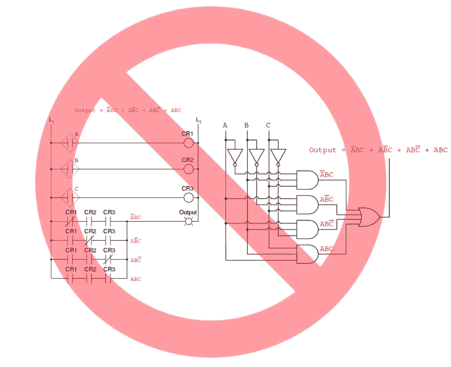
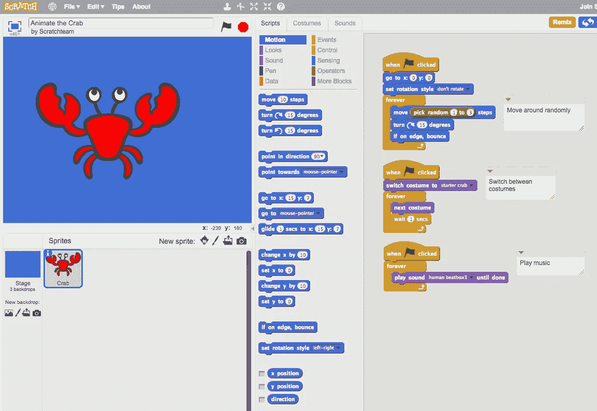
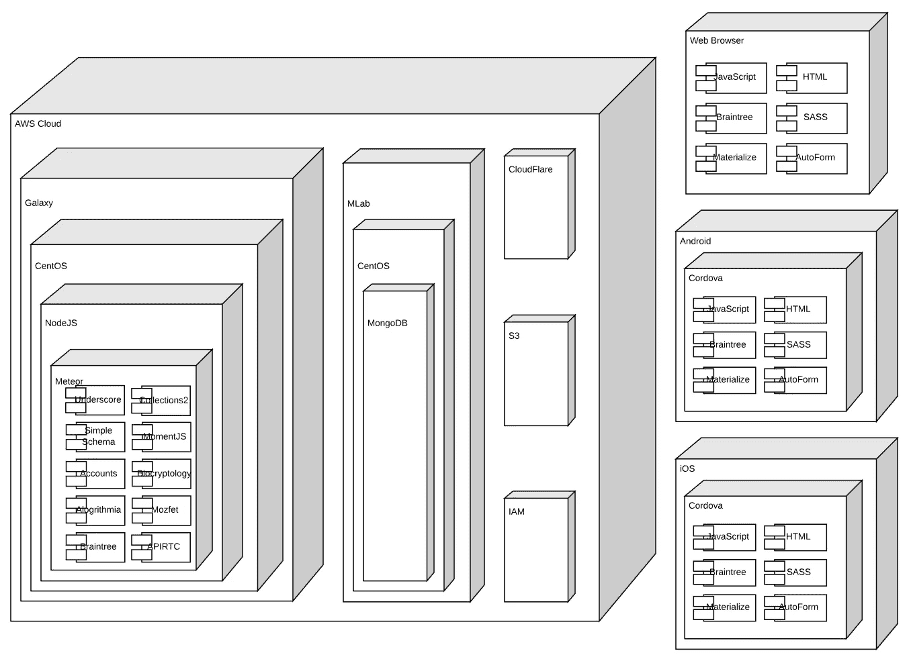
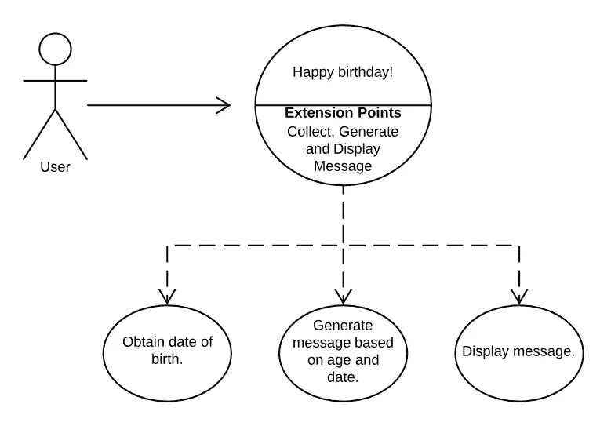
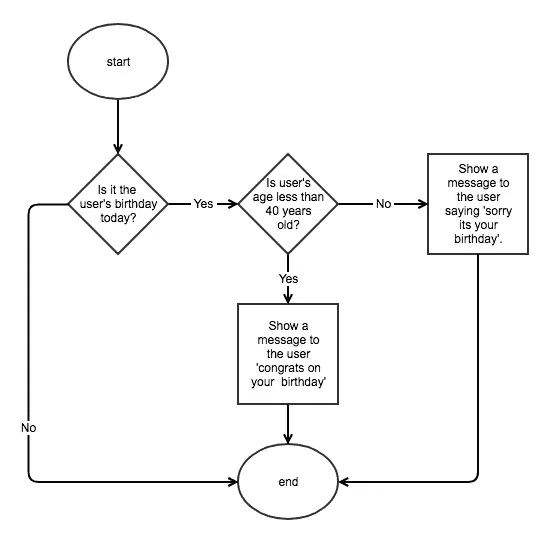

# 像专业人员一样编写代码

> 原文：<https://medium.com/hackernoon/low-code-like-a-pro-2c8a2b9e4226>


You do not need to be a software developer to create code.

虽然一幅画有千言万语，但它不能讲述整个故事，因为你需要文字。同样的，不使用代码可以在某种程度上快速完成一些基本的工作，但是如果你正在做一些新的有价值的事情，你需要使用一些低级代码，否则就是全代码。

全代码是开发软件的传统方式，它需要广泛的软件开发技能和大量的时间，是昂贵的，并需要不断的维护。完整的代码对于那些有大把大把的钱可以花的人来说是很棒的。

没有代码适合那些想要千篇一律的软件的模仿者，如果你想拥有和其他人一样的乏味的应用程序，这很好。

如果你的商业想法非常简单，不需要代码就可以创建，那么有人已经失败了，或者他们已经成功了，他们可能会成为你的竞争对手。所以，你应该想出一个更好的主意。

低代码是介于无代码和全代码之间的中间地带，是快速、廉价地创建创新软件解决方案的强大工具。低代码可以被所有人使用，而不仅仅是软件开发者。

# 通用的视觉逻辑并不存在

自从计算机发明以来已经过去 40 年了，我们仍然没有发明一种能够表示高级逻辑的视觉语言，而且我们可能永远也不会发明。

问题是如此之大，以至于人们似乎已经放弃了逻辑，并希望人工智能将为我们做所有的艰难思考，如果我们真的这么幸运的话！

真正的事实是，不幸的是，我们不得不继续思考。写下理由是如此具有挑战性，这违背了逻辑，或者有些人可能会这么想。也许这是因为逻辑是真的，或者是假的，但它通常取决于一些东西。

电子工程中使用了一些可视化语言，如梯形逻辑图和逻辑门图，用于设计处理二进制信号的逻辑。这些在处理二进制数据集时非常方便。然而，它们对于高级逻辑和执行计算通常是无用的，并且它们不支持复杂的数据结构。



Ladder Logic and Boolean Gate Diagrams are not suitable for high-level logic. Image adapted from [AllAboutCircuits.com](https://www.allaboutcircuits.com/textbook/digital/chpt-7/converting-truth-tables-boolean-expressions/)

不使用代码的挑战也是创建可视化逻辑的挑战。没有代码能够实现其承诺的主要原因是，没有通用的视觉语言来定义逻辑，就像没有相机可以拍摄照片来代替对文字的需求一样。因此，在不使用完整代码的情况下，我们能做的最好的事情就是使用低级代码。

可视化逻辑工具在工程中很有用，但不适合描述高级逻辑的工作，因为它们不能处理复杂的数据结构，如数字、字符串、数组和对象。你还需要一个广泛的电子背景来理解这些图表，并创建它们。

# 任何人都可以编写低级代码

总是需要代码的原因是，有无限多的条件集适用于无限多的不同场景，虽然有大量的重复模式，但没有一个是通用的。

每个新颖的应用程序在某些时候都需要定制逻辑。没有一种逻辑模式可以涵盖所有场景，如果需要的话，可以创建一个拖放组件。

通常你只需要一段代码一次，有时你需要很多次。你需要知道的是，在某些时候你会需要一些代码。

请注意，我是说你需要代码，而不是说你需要程序员。如果你会使用电子表格，你应该会写低级代码，即使你可能不会开发软件。

如今成为一名专业的软件开发人员并不是写一门编程语言，写代码也不是这份工作最关键的部分。软件开发主要是关于栈、平台、数据源、数据库、网络层、API 和安全机制以及用于构建客户机-服务器软件解决方案的过程。

写小段代码，每一段都有明确的目的很容易，连 8 岁的孩子都能编码。



Even 8 year old children can code. Image is a screenshot of [Scratch: Coding for Children](https://www.scratch.mit.edu/)

话虽如此，开发一个安全、私有、可扩展的云和具有高级用户界面的安全支付基础设施是专业人士的工作。

低代码平台的工作是负责堆栈，以便您可以继续处理逻辑。这个堆栈包括构成一个解决方案的所有软件层，包括数据中心、操作系统、网络服务器、数据库服务器、客户端应用程序以及使其运转的所有平台、库、安全性和接口。

作为一个低级程序员，你不应该关心堆栈，并且知道它已经被处理好了。堆栈使软件工作，逻辑使软件有用并解决问题。当每个解决方案的业务逻辑发生变化时，一个好的堆栈保持不变。



Modern Cross Platform Full Stack — Image is a simplified stack of [ExpertBox.com](https://www.expertbox.com/), created using [LucidChart.com](https://www.lucidchart.com/).

低代码平台上的堆栈由专业人员维护和托管，因此您不必开发软件，您需要做的只是创建逻辑。在缺乏通用的可视化逻辑语言的情况下，这意味着您需要为任何新的、不同的或特定于您的解决方案的东西编写代码，例如一些低级代码。

编写一小段功能代码并不需要天才。你只需要知道输入是什么，输出是什么，以及如何从输入到输出。

剩下的只是写下来。通过以下经过验证的可靠步骤，任何人都可以像专业人士一样编写低级代码。

# 需求和用例

它通常始于一个需要解决的问题。通常，业务分析师或解决方案架构师收集需求并设计用例，以说明不同的用户如何与系统交互。这定义了系统的功能，它应该做什么，并有助于创建一个构建它需要多少工作的概念。

需求和用例通常被细化为系统架构、流程图、状态图、类图和消息流，最终导致代码和系统按照用例预期的方式运行。

对于低代码，重点是一次一小部分功能，通常，流程图是足够的设计，这意味着通常不需要系统架构、系统图、类图、状态图和序列图，因为好的低代码平台会处理这些。

让我们假设我们想要构建一个自动祝贺某人生日的解决方案。与系统交互的人被称为用户，使用一个解决方案的人和系统用户可以有很多种。在这个例子中，每个用户都是有生日的普通自然人。



Happy Birthday Use Case Diagram. Image created using [LucidChart](https://www.lucidchart.com/).

该解决方案将需要某种与用户通信、从用户收集信息以及向用户传输信息的方式；这是通过用户界面执行的，由您喜欢的低代码平台提供(见下面的完整堆栈)。

完成这个解决方案唯一需要的是一些生成消息的低级代码。

# 流程图

流程图是设计软件和流程的好工具。每个计算机程序员或商业分析师都知道如何阅读和创建流程图。它们被广泛理解，经常被技术人员用作交流工具，向非技术人员解释事物是如何工作的。

相对于条件逻辑，流程图便于设计流程。但是，它们不包含用于定义逻辑的可视组件，并且通常在流程图组件中使用高级伪代码(见下文),如决策节点和循环。



Flow Chart for Happy Birthday Use Case. Image created using [Gliffy](https://www.gliffy.com/).

流程图通常是可以被人类理解的，这意味着如果你把这个流程图给一个完全陌生的人，他们应该理解这个过程是如何工作的。它使用表达式设置逻辑边界，并使用决策节点、流程和箭头定义流程。

流程图通常专注于功能，您可能经常会发现一些细节被忽略了。例如，在上图中，用户的生日来自哪里并不清楚。现在这还可以，因为在使用低级代码之后，使用一些伪代码就变得清楚了。

# 伪码

编写新功能时，从流程图创建的伪代码开始是一个好主意。Psuedo 代码使得构造代码和开始识别需要什么逻辑和数据结构、将输入处理成输出变得更加容易。

```
purpose - determine a message based on date
input - birthday - the value from the user interface
input - today - today's date
uses - momentjs to make working with dates simpler
returns - a customized birthday message

do not calculate for future
input validation

get today and birthdate as moments

format today and birthdate as strings

if birthday
  assign message variable with default
  if it is the user’s birthday today
    calculate age   
    if user if less than 40 years old
      set message to 'Congratulations on your birthday'
  else
    set message to 'Sorry to hear you aged another year'    
return message
```

伪的意思是差不多，或者假的，或者介于两者之间。就像代码，但不完全是。它不像真正的代码那样死板或精确，也不像散文的段落那样柔和。

伪代码没有真正的标准，我们都是按照自己的方式去做。这就是为人类而不是机器编写的代码的样子。对我来说，它只是缩进的英语，我把它看作是用文字表示的流程图的图片。

请注意伪代码通常更加详细和结构化，并且类似于项目的实际细节，而不是流程图，并且代码已经开始呈现一种结构。

伪代码通常是真正神奇的地方，它有一个好处，你可以用它来构建你的代码，也可以用它来做注释。

# Java Script 语言

据估计，全球有 2100 万软件开发人员，其中， [JavaScript 连续第八年成为最受欢迎的高级计算机语言](https://insights.stackoverflow.com/survey/2018)。

关键是，如果 2100 万人可以专业地开发软件，那么几乎任何人都应该能够做一些，最好的方法是使用 JavaScript。

JavaScript 使用简单，易于掌握底层代码所需的基础知识，但它也很强大和复杂，因为要掌握整个语言可能需要数年时间。

除了语言的可访问性之外，还有一个巨大的开源库和平台社区，这意味着通常会有您需要的代码示例。如果你真的遇到了困难，就像软件开发人员一样，谷歌一下或者去 [Stack Overflow](https://stackoverflow.com/) ，这是一个庞大的开发人员社区，他们互相帮助解决问题。

大多数低级代码片段处理条件逻辑、表达式、日期、列表、数学、格式化、搜索和存储。这些基本操作在 JavaScript 中很容易掌握，尤其是在使用如下指南时:

*   [面向初学者的 JavaScript】](https://www.htmldog.com/guides/javascript/beginner)
*   [JavaScript 脚本注释](http://www.jaxenter.com/javascript-crib-notes-136893.html)
*   [JavaScript 备忘单](http://www.marijnhaverbeke.nl/js-cheatsheet.html)

我通常首先将我的伪代码作为注释，并根据缩进使用函数、变量和流结构来构建代码结构，然后将其充实到一个全功能的底层代码中。

这个组帧步骤创建了一个有效的 JavaScript 代码。然而，它仍然缺少实际的逻辑，并且没有做任何有用的事情。当使用测试驱动的开发时，这种方法对单元测试也很有帮助，当你编码时，增加逻辑。

```
// purpose - determine a message based on date
// input - birthday - the value from the user interface
// input - today - today's date
// uses - momentjs to make working with dates simpler
// returns - a customized birthday message// do not calculate for future
if (data.options.isFuture) {
  return 'fake';
}// input validation
if () {
  return '.';
}// get today and birthdate as moments
var timeZone = undefined;
var todayMoment = undefined;
var birthMoment = undefined;// format today and birthdate as strings
var todayString = 'MMDD';
var birthString = 'MMDD';
var isBirthday = todayString === birthString;// if birthday
if () {
  return true;
}// assign message variable with default
var message = '';// if it is the user’s birthday today
if (isBirthday) { // calculate age
  var age = 0;

  // if user if less than 40 years old
  if (age < 40) {

    // set message to 'Congratulations on your birthday'
    message = '';
  }

  // else
  else { //set message to 'Sorry to hear you aged another year'
    message = '';
  }
}// return message
return message;
```

JavaScript 日期比简单的自然数稍微复杂一点，当前日期是毫秒、天、月、不同时区的数字，而且都是同时发生的。我们还必须考虑到时间是相对于用户的，并且用户可能在执行计算的服务器之外的另一个时区。

为了计算一个人的年龄，我们的生日快乐逻辑只关心日、月和年。因此，我们没有对原始数据进行疯狂的数学运算，而是使用 Momentjs 来简化时间、日期和持续时间的处理。

```
// purpose - determine a message based on date
// input - birthday - the value from the user interface
// input - today - today's date
// uses - momentjs to make working with dates simpler
// returns - a customized birthday message// do not calculate for future
if (data.options.isFuture) {
  return 'fake';
}// input validation
if (!todayDate || !birthDate) {
  return 'There is a 1/365 chance it is your birthday today.';
}// get today and birthdate as moments
var timeZone = data.session.region.timeZone;
var todayMoment = api.moment.tz(todayDate, timeZone);var birthMoment = api.moment.tz(birthDate, timeZone);// format today and birthdate as strings
var todayString = todayMoment.format('MMDD');
var birthString = birthMoment.format('MMDD');
var isBirthday = todayString === birthString;// if today is after birth
if (birthMoment.isAfter(todayMoment)) {
  return 'You are not born yet.';
}// assign message variable with default
var message = 'Today is not your birthday.';// if it is the user’s birthday today
if (isBirthday) { // calculate age
  var age = todayMoment.year() - birthMoment.year();

  // if user if less than 40 years old
  if (age < 40) {

    // set message to 'Congratulations on your birthday'
    message = 'Congratulations on your birthday!';
  }

  // else
  else { //set message to 'Sorry to hear you aged another year'
    message = 'Sorry to hear you aged another year!';
  }
}// return message
return message;
```

没有人是完美的，也许你在某个地方犯了错误，没关系，有很多优秀的免费工具可以帮助你测试 JavaScript 代码片段。

测试本身被许多人认为是一门科学，太宽泛了，无法在这里涵盖，但是这里是我如何使用 jsfiddle.net 测试上面的代码的。

这就是事情的全部。您已经完成了您的专业级低代码。问题解决了。

到这个时候，你的逻辑是合理的，并且做了它被设计要做的事情。你现在需要的是一个良好的坚实的堆栈，你已经准备好了。


That was Easy! Image Source [ExpertBox.com](https://www.expertbox.com/).

# 你想要一整叠吗？

在任何设备上免费运行低代码示例(如上)或您自己的低代码。这里有一个视频，介绍如何在不到两分钟半的时间内将生日快乐代码捆绑到一个跨平台的响应式材料设计 GUI 上，而且是免费的。

您可以与[互动](https://www.expertbox.com/construct/link/jDKrb2SudrRwpGtMb)和[实时检查生日快乐结构的设计](https://www.expertbox.com/construct/design/jDKrb2SudrRwpGtMb)。

使用我们在[ExpertBox.com](https://www.expertbox.com/)上的(免费)全跨平台堆栈，随时随地使用您的低代码。