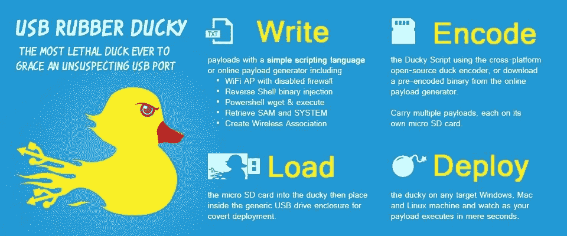
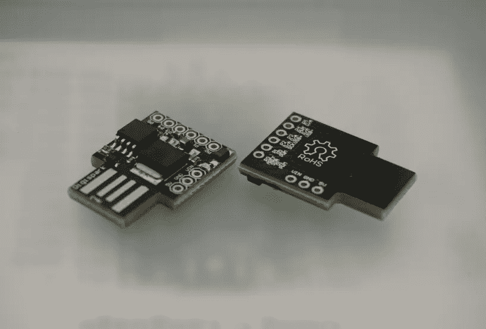
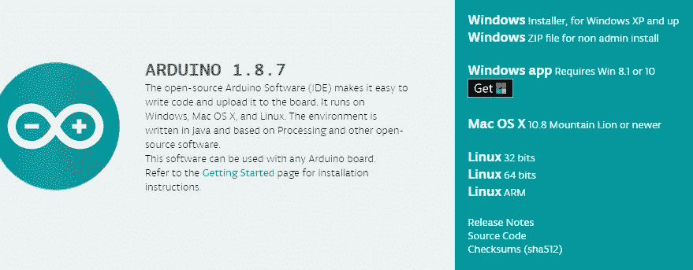
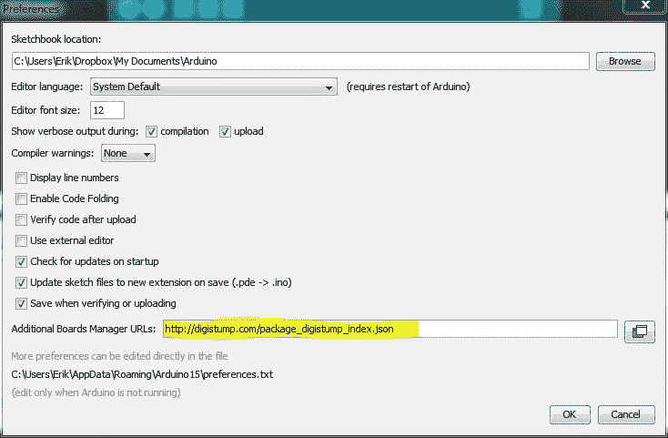
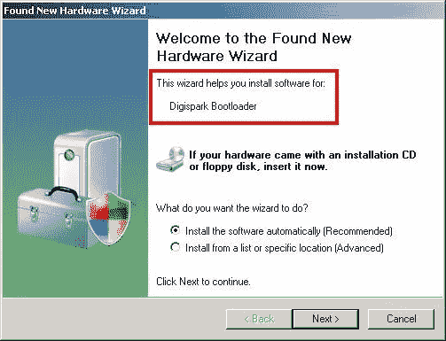
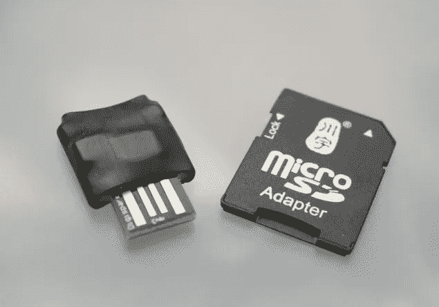

# 低成本 USB 橡胶 Ducky 笔-使用 Digispark 和 Duck2Spark 的测试工具，售价 3 美元

> 原文：<https://medium.com/hackernoon/low-cost-usb-rubber-ducky-pen-test-tool-for-3-using-digispark-and-duck2spark-5d59afc1910>

这是一个历史悠久的故事:一些黑客看到了不错的硬件笔测试工具，黑客对该工具的价格感到恐惧，黑客以零头的价格构建了自己的版本。

这方面的一个例子是 Rubber Ducky，这是一个优秀的 Hak5 黑客工具，由于几个开发人员的工作，我们可以使用一个小而便宜的 Digispark 来模仿它。来自通用现成部件的廉价硬件的一个优点是它是一次性的并且几乎不可能被追踪。

USB 橡皮鸭是一种伪装成普通闪存盘的击键注入工具。计算机将其识别为常规键盘，并以每分钟超过 1000 个单词的速度自动接受其预编程的击键有效载荷。部署一些最高级的笔测试攻击或 it 自动化任务只需几秒钟的物理访问时间。但是橡皮鸭也可以帮助恶作剧的执行，例如用一个脚本快速改变同事工作站的壁纸。



但是 45 美元加上运费[的橡皮鸭](https://hakshop.com/products/usb-rubber-ducky-deluxe)并不是一个便宜的工具，幸运的是我们可以[用 Digispark 开发板和一些免费软件只花 3 美元](https://bit.ly/2N6oAkh)就可以 DIY 一个克隆。Digispark 是基于 Attiny85 的微控制器开发板，类似于 Arduino Uno，只是更便宜、更小。



Digispark boards

**第一步:设置 Digispark 开发环境**

在开始使用我们的开发板之前，我们必须安装 Arduino IDE。在此之后，我们必须下载此板的兼容性包，这是一个相当简单的操作。

[](https://www.arduino.cc/en/main/software) [## Arduino 软件

### ARDUINO 软件是按“原样”提供给您的，我们对以下方面不做任何明示或暗示的担保

www.arduino.cc](https://www.arduino.cc/en/main/software) 

安装后打开 Arduino IDE 应用程序，进入**文件**->-**首选项**-
在名为“附加电路板管理器 URL”的输入字段中输入以下 URL。

```
[http://digistump.com/package_digistump_index.json](http://digistump.com/package_digistump_index.json)
```



打开 Arduino IDE—Preferences**Tools**->**Board**->-**Boards Manager**
从下拉菜单中选择“Contributed”，选择 **Digistump AVR Boards** 包并安装。

现在我们需要安装 Digispark 引导程序驱动程序。你只需要驱动程序用 arduino 编程就可以了。一旦你给它编了程序，它就会像橡皮鸭(一种通用的 USB 键盘)一样在你插入的任何设备上工作，而不需要任何驱动程序。

[**https://github . com/digi stump/DigistumpArduino/releases/download/1 . 6 . 7/digi stump。drivers . zip**](https://github.com/digistump/DigistumpArduino/releases/download/1.6.7/Digistump.Drivers.zip)

通常驱动程序安装过程会有一些问题。所以请确保正确安装驱动程序。



最后进入**工具** - > **板卡**，选择 **Digispark(默认— 16.5mhz)** 设置为默认。

**第二步:将 Digispark 变成一个橡胶鸭子克隆体**

橡皮鸭使用简单的脚本语言来创建有效载荷。对于 Digispark 来说，事情并没有那么简单。我们需要使用***digi keyboard . h***和 Arduino IDE 编写自己的有效载荷。互联网上有一些适用于 Digispark 的脚本。但是多亏了 MaMe82 ( [马库斯·门斯](https://twitter.com/mame82))的工作，你可以用 duck2spark 项目把橡皮鸭脚本翻译成 Digispark。

[](https://github.com/mame82/duck2spark) [## mame82/duck2spark

### 原始 RubberDucky 有效负载到 Digispark Arduino IDE 草图源的转换器。- mame82/duck2spark

github.com](https://github.com/mame82/duck2spark) 

Duck2spark 的一个很大的特点是，在 DigiSpark 上模拟 RuberDucky 的可用解决方案和教程对非美国语言的键盘布局支持较差。这可以通过将问题“外包”给支持多种键盘布局的 DuckEncoder 来解决。

使用 Duck2spark 真的很简单。让我们看一个 duck2spark 文档的例子，一个经典的 hello world:

```
Generate a DuckyScript test.duck you want to use as output:echo "STRING Hello World" > test.duckCompile the script using DuckEncoder with your keyboard layout (de in example) or use my python port:java -jar encoder.jar -i test.duck -o raw.bin -l deUse duck2spark.py to convert into Arduino Sketch (options for single run, 2 seconds startup delay):duck2spark.py -i raw.bin -l 1 -f 2000 -o sketch.inoAfter setting up the Arduino IDE load the example "DigisparkKeyboard" and replace the Sketch source by the one saved to sketch.ino 
```

点击草图->上传或点击左上角的上传按钮。打开记事本或任何软件。再次插入 Digispark USB，神奇的“Hello World”就打出来了。

橡皮鸭的有效载荷可以是任何东西；它根据我们的目标和意图而改变！我们可以创建无线网络关联、下载和执行有效载荷、反向外壳等。对于 pen 测试，我们甚至可以使用 Meterpreter、Empire、Unicorn 或任何其他 powershell 有效负载。

[](https://github.com/hak5darren/USB-Rubber-Ducky/wiki/Payloads) [## hak5darren/USB 橡胶鸭

### 在 GitHub 上创建一个帐户，为 hak5darren/USB-Rubber-Ducky 开发做贡献。

github.com](https://github.com/hak5darren/USB-Rubber-Ducky/wiki/Payloads) 

**故障排除**

如果您能够对您的 Digispark 进行编程，并且代码运行，但是在拔出并重新插入 Digispark 后草图不运行:您将需要更新引导加载程序。引导装载程序有一个内置的更新机制。要刷新引导加载程序，请使用此处的指南[和](https://www.iot-experiments.com/micronucleus-bootloader-upgrade/)，Digispark 将在拔出和插回后工作并运行草图。

请记住，Digispark 是 OSHW(开源硬件)，没有原始的 Digispark 或克隆的 Digispark，他们都是一样的！唯一的区别是，一些制造商闪存旧版本的引导加载程序。

**提示**

Digispark 的使用并没有到此为止，作为一个 Arduino 兼容的开发系统，它可以用于任何基于 Arduino 的攻击，只需稍作修改。即使使用它进行 HID 攻击也不是运行 Duck2Spark 的必要条件，如果你想在低级别的 USB HID 上工作，Digispark 有一个内置的键盘库，名为 Digikeyboard。

关于你的橡胶鸭子克隆的最后一个提示:使用一些[热缩管](https://bit.ly/2CQfLpP)为你的新 Digispark-Ducky 提供电绝缘、机械保护、密封和一些隐形功能。一个足够便宜的设备，以至于你不介意把它留在现场，如果你不得不穿上你的忍者装备[逃跑的话](https://www.youtube.com/watch?v=5aRDVVXMFzE)。

