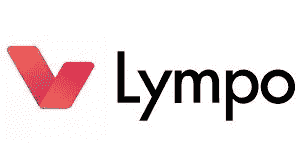

# Lympo:在区块链上将你的个人健身数据货币化

> 原文：<https://medium.com/hackernoon/lympo-monetize-you-personal-fitness-data-on-the-blockchain-cb748b676d23>

什么是 Lympo？

自智能手机广泛采用以来，健身和健康行业出现了大幅增长。如今，大多数人不仅工作，许多人还通过使用智能手机、可穿戴设备和配套的健身应用程序来跟踪自己的进展。

尽管全球数百万用户愿意收集这些数据，但其中大部分尚未被利用。然而，Lympo 采用区块链技术，使用户能够将他们的数据货币化，并将其提供给健康和健身行业中所有能够利用各种应用程序信息的人。

2016 年，移动健康应用的数量翻了一番，应用商店的下载量达到了 32 亿次。这累积了大量数据，这些数据目前大部分都没有使用。Lympo 的目标是最终利用这些数据，让每个人，从私人教练、健身房、运动服装和健康食品生产商到健康保险公司，甚至是希望激励员工保持积极生活方式的公司，都有机会从跨平台健身和健康数据交换中受益。

**莱姆波解决什么问题？**

目前，大量不同的移动医疗应用程序收集的所有数据并不交叉兼容，在 Lympo 开发之前，不存在用户可以访问这些数据的单一平台。Lympo 提供了连接这些现有应用程序以及任何未来应用程序的方法，还引入了一种奖励机制，鼓励用户分享他们的数据，并参与平台的维护。

市场分割和缺乏整合动力导致市场出现巨大缺口。解决这些问题将导致新一波应用和服务的开发，从而显著改善健康和健身行业，为数据驱动的运动提供更好的分析和结果，并改善医疗保健和保险政策。

**莱姆波是如何工作的？**

Lympo 利用区块链的匿名分布式架构来管理数据交换和安全存储交易记录。这允许用户访问网络上生成的所有数据，并且所有先前数据交换交易的记录存储在每个用户的系统上。

个人健康数据并不存储在区块链上，而是通过点对点网络保存在服务器或节点上。区块链仅作为支付和处理工具来处理数据交换。

所有链上和链下的数据在存储、交换和查看时都是加密的。端到端加密只有在两个可信方同意的情况下才能被解密。

交易由与区块链相关联的智能合约执行，以便在满足特定条件时执行特定的操作。这取代了大多数中间人和中介服务的职能，从而减少了对人力投入的需求，进而降低了成本和出错风险。

用户生成的数据可以来自许多资源，包括智能手机健康应用程序、医院和医疗记录、健身房/健身中心，客户可以通过可穿戴设备和其他电子健身设备进行跟踪。

【Lympo 背后的技术

Lympo 最初将拥有 500 多名健身专业人士，后来将扩大到一个大型的体育、健康和保健商品和服务提供商网络。

来自移动健康和健身应用程序的用户生成的用户控制器数据将使用预定价值的 LYM 公用令牌进行交换。我们的目标是创造一个生态系统，让所有参与者都能得到公平的回报。

Lympo 包括三个主要模块，即市场、用户奖励系统和众筹平台，以及三个组成部分，即 Lympo 平台、区块链和用户社区。

三个核心模块是:

**市场**:这将包含平台上所有商品和服务的列表，它还将允许溢价列表，以及像提醒和健康建议这样的售后附加服务。它将作为用户生成数据的市场进入工具，目标是随着更多合作伙伴接受 LYM 令牌而扩展。

**用户奖励系统**:用户与他人分享数据可获得 LYM 代币奖励。奖励计划的一个独特之处是，私人教练和教练可以激励客户达到目标，并获得奖励。

**众筹平台**:这是一个投资平台，让 LYM 代币持有者能够投资有前途的健身/健康/保健初创企业。机会将从主要的体育、健康和健身以及保健市场参与者那里获得评级，访问大型数据库也将有助于新的想法、产品和服务立即到达潜在顾客、客户、用户等手中。

三个主要组件是:

**Lympo 平台**:这些是核心组件，由 Lympo 团队和构成平台本身的合作伙伴开发。

**区块链** : Lympo 建立在以太坊区块链之上，使用智能合约来执行交易，使用 LYM 代币来为交易提供资金，并在平台上使用加密钱包中的领带。

**用户社区**:社区由 activate 成员组成，他们成为生态系统的一部分，寻找教练、合作伙伴、达成协议、分享数据并获得奖励。

**Lympo 上的演员(用户)**

该平台面向所有有健康意识的人，他们可以选择使用该系统作为 4 种“角色”之一。根据用户在市场中的定位，可以是公司、运动队/健身机构的负责人，也可以是希望从锻炼制度中获得更多益处的个人。Lympo 平台上的参与者可能包括:

**数据所有者**

希望改善身体状况、分享数据并因此获得回报的个人。这些用户将创建网络上的大部分数据，并保持对数据的完全控制。

**教练/医生/体育用品盘点员/健身房**

教练和医生也将能够利用用户数据来帮助实现目标和构建更有效的锻炼。此外，他们将能够创建奖励计划，以激励客户达到他们的目标。

**日期代理公司**

使用 Lympo API，将鼓励第三方公司为平台收集的健身/健康数据开发额外的解决方案。这些数据中心本身可能不使用数据，而是充当其他人轻松获取数据的资源。

**数据处理公司**

平台上的另一个第三方参与者，数据处理公司用于分析数据，以检测习惯和趋势，并为一系列健康相关计划提出新的想法或更好的流程。他们也可能利用开放 API 来开发解决方案，但是团队认为更有可能的是数据代理公司将负责解决方案的开发，而数据处理公司将花时间为其他订阅服务设计新的保险计划和更方便的定价模型。

**安全措施**

尽管健身和健康数据不像医疗记录那样敏感，因此不在 HIPAA 立法的管辖范围内，但该平台仍然拥有使用最新网络实践的最高级别的安全性。

平台上的所有数据都使用现代算法加密，所有通信都受到 TLA 的保护。该数据库只对少数有访问凭证的人开放，他们将经常被审计和轮换。

将对系统进行定期检查，以识别并尽可能防止任何技术问题。数据库将及时备份，该小组还将制定业务连续性计划(BCP)和灾难恢复计划，以便在出现任何严重问题时提供帮助。

数据将在 AWS 等服务提供商提供的符合 HIPAA 标准的云托管服务器上进行分类，安全措施将从头开始内置。系统架构还将接受安全专家的定期审计和测试，以发现漏洞和其他潜在问题。

最后，安全措施将扩展到平台的所有用户，他们可能会趁机进入私人 bug-bounty 计划，在该计划中，白帽黑客可能会“攻击”系统，以检测团队和安全审计员没有发现的任何问题。

**有价值的淋巴信息**

**币名**:林波(LYM)

**总供应量**:10 亿 LYM

**市值**:硬帽 14.625 ETH = 650 亿 LYM 软帽 15%

**Ico 价格** : 1 LYM = 0.0234 美元(0.00003 ETH)

**通过 ICO 筹集的代币/资金**:筹集 550 万美元

**社交媒体信息**

***脸书***

网址:[https://www.facebook.com/Lympo.io/](https://www.facebook.com/Lympo.io/)

喜欢人数:31 747 喜欢人数:31 874 关注人数

过去 7 天有多少帖子/更新:—

***推特***

网址:[https://twitter.com/Lympo_io](https://twitter.com/Lympo_io)

追随者:2 437 名追随者

过去 7 天有多少条推文/转发:19 条推文/转发

***电报***

网址:[https://t.me/lympo](https://t.me/lympo)

用户:8 689 个用户

***电报管理员***

用户名:@adajonu

用户名:@Maurukas

用户名:@shuushh

用户名:@ArvidTu

用户名:@Motiejus_Lympo_team

用户名:@junglord

用户名:@Ziville

**Reddit**

网址:[https://www.reddit.com/r/LYMPO/](https://www.reddit.com/r/LYMPO/)

读者:245 名读者

***Youtube***

网址:[https://www.youtube.com/channel/UCxklkPMx5daiRhYMfpHCg0Q](https://www.youtube.com/channel/UCxklkPMx5daiRhYMfpHCg0Q)

订户:147 名订户

***中等***

网址:[https://medium.com/@lympo.io](/@lympo.io)

追随者:154 名追随者

过去 7 天有多少更新:9

***领英***

网址:[https://www.linkedin.com/company/lympo/](https://www.linkedin.com/company/lympo/)

追随者:186 名追随者

过去 7 天有多少更新:7

**员工/团队信息**

名称:**阿达·琼斯**

头衔: **CEO 创始人**

简历:寻找最佳私人教练平台 Lympo.lt 的联合创始人，分散式贷款平台 ETHLend 的顾问，区块链活动的发言人和组织者，被英国《金融时报》、谷歌和其他[新欧洲 100](https://www.ft.com/content/10da5832-ce4b-11e7-9dbb-291a884dd8c6) 名单合作伙伴提名为欧洲科技新星。以往履历:风投 Labas Ventures(美国西雅图)、欧洲议会、联合国。运动:瑜伽，跑步。

领英:【https://www.linkedin.com/in/ada-jonuse-9766364b/ 

姓名:**帕特里克·布朗**

职位:**解决方案架构师**

Bio:区块链和业务自动化专家，在 Asta 工作两年多，Asta 是一家领先的端到端专业托管 IT 服务提供商，面向澳大利亚、新西兰、香港和新加坡的中小企业市场。在完成商业、管理和信息系统的学习后，Pat 加入了澳大利亚墨尔本的 Asta。

领英:[https://www.linkedin.com/in/mrpatbrown/](https://www.linkedin.com/in/mrpatbrown/)

姓名:**马里乌斯·西兰斯基**

职位:**运营总监**

简历:信息技术和创意广告公司 AnyIdeas 的创始人。IT 项目经理，拥有 5 年以上的数字项目管理经验，曾与 Mercedes-Benz、Newsec 和 GCube 等客户合作。主要专业领域:IT 团队管理、对现代设计的非凡品味和理解、多种语言的高级编程技能。运动:健身。

领英:[https://www.linkedin.com/in/marius-silenskis-429b2a8b/](https://www.linkedin.com/in/marius-silenskis-429b2a8b/)

名称: **Justas Kregzde**

标题:**智能合同线索**

简历:拥有 12 年以上经验的在线游戏软件开发人员。10 款已出版的 iOS 和 Android 游戏的作者和撰稿人。3 年以上在线扑克软件开发经验。在过去的一年里，他一直专注于区块链相关的项目&智能合同。

领英:[https://www.linkedin.com/in/justaskregzde/](https://www.linkedin.com/in/justaskregzde/)

名称:**阿多马斯·迪丘斯**

头衔:**高级全栈开发者**

个人简历:拥有 ICT 工程背景和 4 年以上全栈开发和 UX 设计经验的旅行企业家。在不同的初创公司工作过之后，Adomas 现在是一家初创公司的联合创始人兼首席技术官，该公司颠覆了批发食品商业行业 Smackway，他还是一名独立的 IT 顾问和开发人员。运动:瑜伽。

领英:[https://www.linkedin.com/in/adomasd/](https://www.linkedin.com/in/adomasd/)

姓名:**塔达斯·莫鲁卡斯**

头衔:**数字营销负责人**

简历:充满激情的营销策略师。Tadas 使用最有效的工具为各种企业创造投资回报，从本地初创企业到像梅赛德斯-奔驰这样的国际数百万利润公司。Tadas 早在 2014 年就加入了加密社区，并一直参与其中。运动:不流汗。国际象棋和在线扑克。

领英:[https://www.linkedin.com/in/maurukas/](https://www.linkedin.com/in/maurukas/)

名称:**卡罗林·冯·钦瑟勒**

职称:**法律与运营**

简历:律师，战略家和区块链律师，卡罗林拥有商业法硕士学位。伦敦经济学院硕士学位，专攻知识产权/信息技术法。3 年以上初创企业法律和商业事务咨询经验，专注于建立法律架构、运营、商业战略和全球扩张。体育:认证瑜伽老师。

LinkedIn:[https://www . LinkedIn . com/in/karoline-von-tschurtschenthaler-1b 89529 b/](https://www.linkedin.com/in/karoline-von-tschurtschenthaler-1b89529b/)

姓名:**迪米特拉·帕帕多普洛**

标题:**医疗保健合作伙伴关系**

简历:医疗保健和医学研究区块链专家，高级信息系统经理，曾在空中客车公司、Prosieben Media、埃森哲和欧盟委员会任职，meHealthX 创始人，CGI(德国)区块链公共部门和医疗保健用例首席顾问。

领英:[https://www.linkedin.com/in/dimitrap/](https://www.linkedin.com/in/dimitrap/)

名字:**齐维尔·凯里特**

职位:**社区经理**

生物:2 年以上销售、人力资源和市场营销经验。与 B2B 和 B2C 公司合作，确保他们的客户满意度目标。沉迷于成长中的品牌和创意广告。运动:骑马。

领英:[https://www.linkedin.com/in/zivile-kairyte-b3506b14b/](https://www.linkedin.com/in/zivile-kairyte-b3506b14b/)

姓名:**欧内斯特·佩特科维奇**

头衔: **UX/UI 专家**

LinkedIn:[https://www . LinkedIn . com/in/ernesta-pet kevi % C4 % 8Di % C5 % ABt % C4 % 97/](https://www.linkedin.com/in/ernesta-petkevi%C4%8Di%C5%ABt%C4%97/)

名称:**多马·安布拉泽维奇乌斯**

头衔:**平面设计师**

简历:AnyIdeas 创意广告公司的高级平面设计师和动画师。总是寻找新的灵感，喜欢周游世界，体验他所能体验的一切。运动:滑雪、排球。

LinkedIn:[https://www . LinkedIn . com/in/domas-ambrazevi % C4 % 8d ius-630766137/](https://www.linkedin.com/in/domas-ambrazevi%C4%8Dius-630766137/)

名称:**安塔纳斯果嘎**

标题:**密码经济学&商业**

简历:欧洲议会议员。Antanas 又名 TonyG，是一位连续创业者、投资者、慈善家和知名扑克玩家。他积极参与关于加密货币和网络安全的政治讨论。Bankera 和 CoinPoker 代币销售项目的加密经济专家和顾问。

领英:[https://www.linkedin.com/in/antanasguoga/](https://www.linkedin.com/in/antanasguoga/)

姓名:**音波张**

标题:**投资**

Bio:区块链 20 国联盟(B20)的联合创始人兼全球总监，这是一个国际非政府组织，致力于在全球范围内搭建区块链和加密货币社区的桥梁。和 ValueBank Group 的联合创始人，value bank Group 是一个全球性的菲亚特-加密交易所网络，提供加密钱包和支付解决方案。ValueNet Capital 创始人，专注于投资区块链初创公司和 cryptos。Murint Capital 的联合创始人，这是一家科技和娱乐行业的风险投资基金。SoRelax 的创始人，这是一个跨国营销和服务的全球平台。Sonic 拥有悉尼大学的 MPM 和机电一体化学士学位。

姓名:**达尼洛·s·卡卢奇**

标题:**营销&增长**

简历:初创公司创始人、成长型黑客和营销专家，拥有 6 年以上的经验。目前在谷歌，领导 YouTube 在英国的社区工作。

领英:[https://www.linkedin.com/in/daniloscarlucci/](https://www.linkedin.com/in/daniloscarlucci/)

姓名:**大卫·曼塞特博士**

标题:**科技**

生物:高级工程师和区块链企业家，专注于敏感医疗数据共享技术。cerebro 的前首席执行官，用于临床试验的大规模成像分析云平台，gnubila 的创始人兼首席执行官，数据隐私解决方案设计师，Almerys 的研究和创新负责人，医疗保健交付数据管理公司，管理联合 230，000 名专业人士和 My Health My Data consortium 的一部分，区块链医疗保健解决方案的欧盟领导者。现任 be-studies 首席执行官。

领英:[https://www.linkedin.com/in/manset/](https://www.linkedin.com/in/manset/)

姓名:**海南胡**

标题:**技术**

简历:安全工程师和白帽黑客。柏林波士顿咨询集团数字风险投资公司安全工程师。之前在 Zalando 和 SoundCloud 等公司工作过。海南是红队(进攻安全)的专家，但也能做好蓝队(防守安全)。海南的技能组合:渗透测试、安全架构审查、威胁建模、风险评估、培训。

领英:【https://www.linkedin.com/in/hainan/ 

姓名:**比尔·安吉利斯**

标题:**业务&资产管理**

简历:比尔，又名“匹克”，是一位经验丰富的多面手——软件工程师、总监、营销人员和战略家。Bill 是 Asta Solutions 的董事总经理，Asta Solutions 是一家总部位于墨尔本的 IT 服务公司，他于 1999 年与人共同创立了该公司。他还是 wineonline.com.au 的首席执行官、VACRO 的董事和财务主管以及 Art Cabriolet 的董事。他热爱志愿公益事业和他所在的当地足球队——山楂足球俱乐部。

领英:[https://www.linkedin.com/in/billangelidis/](https://www.linkedin.com/in/billangelidis/)

姓名:**阿列克斯·索蒂罗夫斯基**

标题:**技术**

生物:高级软件开发人员。以前，Gympro 的创始人，健身专业人士的客户管理工具，联合了美国，澳大利亚，新西兰和英国的 3000 多名专业人士。目前，ELMO 人才管理软件公司的高级开发人员。

领英:[https://www.linkedin.com/in/ahtsei/](https://www.linkedin.com/in/ahtsei/)

名称:**尼里尤斯·斯克鲁德斯**

标题:**技术**

Bio:热衷于区块链技术的高级软件工程师，在使用各种技术(C++、ASP.NET、Java 等)的软件解决方案的分析、技术设计和开发方面拥有超过 15 年的经验。).目前在一家国际公共部门组织中协调多个 IT 项目的开发。

领英:[https://www.linkedin.com/in/nerijus-skruodys-bb908b2/](https://www.linkedin.com/in/nerijus-skruodys-bb908b2/)

名称: **Viktoras Vatinas**

标题:**业务&资产管理**

个人简历:CFA:Partners Group(瑞士楚格)投资组合经理，管理私人债务基金、私人贷款、私人信贷策略、资产分配、现金水平管理。XL Catlin(瑞士苏黎世)前投资分析师，私人银行家，瑞士金融研究所研究助理。

领英:[https://www.linkedin.com/in/viktoras-vatinas-cfa-9650b517/](https://www.linkedin.com/in/viktoras-vatinas-cfa-9650b517/)

姓名:**托马斯·古维斯**

标题:**业务&资产管理**

简历:加密投资者，Dash 数字现金社区成员，加密税务和法律的合伙人，以及各种区块链相关项目的顾问。

领英:[https://www.linkedin.com/in/tomasgurvicius/](https://www.linkedin.com/in/tomasgurvicius/)

姓名:**斯坦·库利亚瓦斯**

标题:**业务&资产管理**

简历:加拿大多伦多 Levaero Aviation 公司销售和业务发展副总裁。投资者和慈善家。前 NCAA 篮球教练。热爱篮球和体育，组织篮球慈善活动和其他职业和业余体育相关活动。

领英:[https://www.linkedin.com/in/skuliavas/](https://www.linkedin.com/in/skuliavas/)

姓名:**于尔根·埃凯尔**

标题:**业务&资产管理**

简介:于尔根·埃凯尔，现任柏林波士顿咨询集团(BCG)数字风险投资公司的合伙人兼董事总经理。

在担任顾问期间，尤尔根不仅在管理和战略咨询方面积累了丰富的知识，在支付行业和金融科技领域也是如此。

领英:[https://www.linkedin.com/in/juergen-eckel/](https://www.linkedin.com/in/juergen-eckel/)

公司地址:

立陶宛