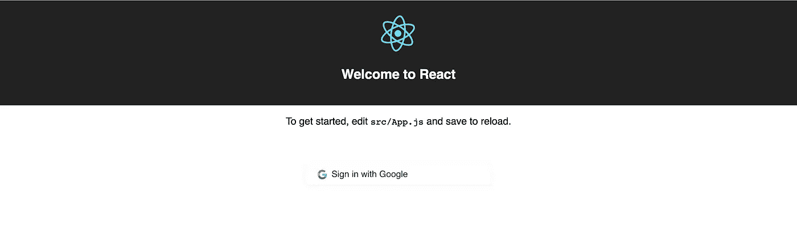
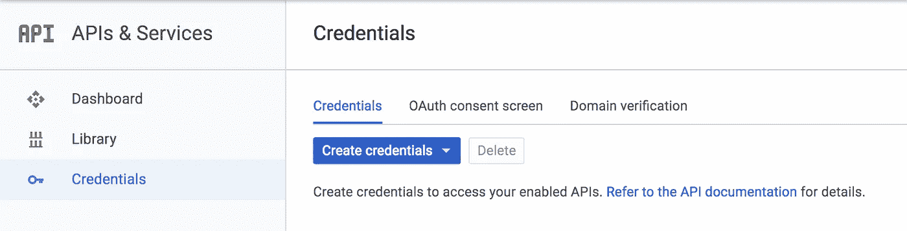

# 米（meter 的缩写））使用 Passport 进行身份验证的 E.R.N 堆栈应用程序。

> 原文：<https://medium.com/hackernoon/m-e-r-n-stack-application-using-passport-for-authentication-920b1140a134>

## 在本教程中，我们将使用 Node.js 服务器中的 Passport 身份验证机制，在 React 应用程序中集成用于注册或登录目的的 Google sign-in。


Photo by [Steve Halama](https://unsplash.com/photos/Yhc7YGZlz3g?utm_source=unsplash&utm_medium=referral&utm_content=creditCopyText) on [Unsplash](https://unsplash.com/search/photos/authentication?utm_source=unsplash&utm_medium=referral&utm_content=creditCopyText)

在当今世界，用户更喜欢在他们访问的每个网站上使用他们的任何社交帐户进行单点登录，而不是将他们的凭据再次交给另一个人。

因此，现在有必要集成单点登录以使事情变得更容易，并且只允许经过验证的用户使用您的应用程序，这对用户和应用程序所有者都有利。

让我们直接进入开发阶段。

# 使用 Google 登录按钮创建 React 应用程序

## **步骤 1** :让我们使用 [create-react-app](https://github.com/facebook/create-react-app) 创建一个基本的 react 应用程序

```
$ npx create-react-app my-app
$ cd my-app
$ npm start
```

## **第二步**:在根目录下的 App.js 中，添加以下 HTML 代码，在 render()函数中的 P 标签后创建一个按钮。

```
<a href="/auth/google" class="button">
          <div>
            <span class="svgIcon t-popup-svg">
              <svg
                class="svgIcon-use"
                width="25"
                height="37"
                viewBox="0 0 25 25"
              >
                <g fill="none" fill-rule="evenodd">
                  <path
                    d="M20.66 12.693c0-.603-.054-1.182-.155-1.738H12.5v3.287h4.575a3.91 3.91 0 0 1-1.697 2.566v2.133h2.747c1.608-1.48 2.535-3.65 2.535-6.24z"
                    fill="#4285F4"
                  />
                  <path
                    d="M12.5 21c2.295 0 4.22-.76 5.625-2.06l-2.747-2.132c-.76.51-1.734.81-2.878.81-2.214 0-4.088-1.494-4.756-3.503h-2.84v2.202A8.498 8.498 0 0 0 12.5 21z"
                    fill="#34A853"
                  />
                  <path
                    d="M7.744 14.115c-.17-.51-.267-1.055-.267-1.615s.097-1.105.267-1.615V8.683h-2.84A8.488 8.488 0 0 0 4 12.5c0 1.372.328 2.67.904 3.817l2.84-2.202z"
                    fill="#FBBC05"
                  />
                  <path
                    d="M12.5 7.38c1.248 0 2.368.43 3.25 1.272l2.437-2.438C16.715 4.842 14.79 4 12.5 4a8.497 8.497 0 0 0-7.596 4.683l2.84 2.202c.668-2.01 2.542-3.504 4.756-3.504z"
                    fill="#EA4335"
                  />
                </g>
              </svg>
       </span>
     <span class="button-label">Sign in with Google</span>
   </div>
</a>
```

## **第三步**:在根目录下的 index.css 文件中添加以下 CSS 来装扮你的按钮。

```
a {
 -webkit-tap-highlight-color: transparent;
 text-decoration: none;
}.button {
 display: inline-block;
 max-width: 300px;
 margin-top: 50px;
 border: 0;
 padding: 0 18px;
 text-align: left;
 width: 100%;
 height: 37px;
 border-radius: 4px;
 -webkit-font-smoothing: antialiased;
 -moz-osx-font-smoothing: grayscale;
 -moz-font-feature-settings: "liga" on;
 color: rgba(0, 0, 0, 0.84) !important;
 fill: rgba(0, 0, 0, 0.84) !important;
 box-shadow: 0 1px 7px rgba(0, 0, 0, 0.05);
 font: inherit;
 outline: none;
}.button .svgIcon {
 vertical-align: middle;
 fill: rgba(0, 0, 0, 0.54);
 padding-right: 4px;
 height: 37px;
 display: inline-block;
}
```

就是这样。您已经创建了一个带有链接的按钮，单击该按钮可以导航到 Google 认证页面(检查标签中的 href 属性)。

```
/auth/google 
```



React app with Google sign-in button.

**注意:现在，我们的客户端运行在 3000 端口。**

我们将在本教程的后面处理路线。所以我请求您在您的应用程序中安装以下模块。

```
$ npm i --save react-router-dom
```

并用下面的代码替换 index.js 文件中的代码。

```
import React from "react";
import ReactDOM from "react-dom";
import "./index.css";
import App from "./App";
import registerServiceWorker from "./registerServiceWorker";
import { Route, Switch } from "react-router-dom";
import { BrowserRouter } from "react-router-dom";ReactDOM.render(
 <BrowserRouter>
  <Switch>
   <Route path="/" component={App} />
  </Switch>
 </BrowserRouter>,
 document.getElementById("root")
);
registerServiceWorker();
```

我们只是从“react-router-dom”中导入路由、交换机和 BrowserRouter，并替换渲染函数中的一些代码，以在我们的应用程序中支持路由。

我们将从 URL 访问查询参数，并在本教程的后面替换它。只有当您将应用程序配置为支持路由器时，您才能访问路由器属性(react 中的属性)。要了解有关路由器及其配置的更多信息，请浏览此[链接](/@pshrmn/a-simple-react-router-v4-tutorial-7f23ff27adf)。

# 设置 Node.js 服务器并配置 Passport

我希望现在你能看到下面的按钮屏幕。现在让我们创建一个 Node.js 服务器并实现服务器端逻辑。

我将创建一个单独的 Node.js 服务器，并在另一个端口运行，因为在不同的代码库中维护服务器和客户端将更容易维护，而且据我所知，它们彼此不依赖。

## **第四步:创建 Node.js 服务器，安装 Passport 模块。**

如果您不知道要创建 Node.js 服务器，那么您不必担心。我已经创建了一个教程，介绍如何从零开始创建一个 Node.js 服务器。请浏览下面的链接，按照主题**创建一个示例 Node.js 服务器**，如果您没有服务器，请在继续之前创建一个。

[](/full-stack-web-development-from-scratch-to/deploy-your-node-js-app-in-production-and-use-bitbucket-to-automate-your-deployment-50b07b18914c) [## 在生产中部署 Node.js 应用程序，并使用 BitBucket 来自动化部署。

### 在本教程中，我们将创建一个示例 Node.js 服务器，将其推送到 BitBucket 并使用 PM2，我们将自动…

medium.com](/full-stack-web-development-from-scratch-to/deploy-your-node-js-app-in-production-and-use-bitbucket-to-automate-your-deployment-50b07b18914c) 

因此，我们现在有一个服务器，但我们的服务器中没有护照模块。导航到你的服务器，安装 [passport](https://www.npmjs.com/package/passport) 和 [passport-google-oauth](https://www.npmjs.com/package/passport-google-oauth)

```
$ cd my-server/
$ npm i passport --save
$ npm i passport-google-oauth --save
```

我们已经安装了所需的模块。让我们通过在 app.js 文件中添加下面两行来利用它。

```
var passport = require(“passport”); // at headerapp.use(passport.initialize()); // after line no.20 (express.static)
require("./config/passport");
```

将默认服务器端口从 3000 更改为 4500，以避免服务器和客户端之间的冲突。转到 bin/www 文件，将 3000 更改为 4500，并通过发出以下命令启动您的应用程序。

```
$ npm start
```

**注意:现在，我们的服务器运行在端口 4500 上。**

## 步骤 5:让我们创建一个 passport.js 文件来处理我们的 passport 认证机制。

在根目录下创建一个名为 *config* 的文件夹，并在其中创建一个名为 *passport.js* 的文件，其中包含以下内容。

```
var passport = require("passport");
var GoogleStrategy = require("passport-google-oauth").OAuth2Strategy;passport.serializeUser(function(user, done) {
 done(null, user);
});passport.deserializeUser(function(user, done) {
 done(null, user);
});passport.use(
 new GoogleStrategy(
  {
   clientID: "GOOGLE_CLIENT_ID",
   clientSecret: "GOOGLE_CLIENT_SECRET",
   callbackURL: "http://localhost:4500/auth/google/callback"
  },
  function(accessToken, refreshToken, profile, done) {
   var userData = {
    email: profile.emails[0].value,
    name: profile.displayName,
    token: accessToken
   };
   done(null, userData);
  }
 )
);
```

如您所见，我们需要 GOOGLE _ CLIENT _ ID & GOOGLE _ CLIENT _ SECRET 用于您的应用程序。你可以在 https://console.developers.google.com/[买到](https://console.developers.google.com/)

## 步骤 6:在谷歌开发者仪表板中配置你的应用

导航到 [Google 开发者控制台](https://console.developers.google.com/)并创建您的应用程序。



Credentials page in Google Developers Console.

在上图页面中，点击*创建凭证*，选择 *OAuth 客户端 ID。*

在下一个屏幕中，选择应用程序类型作为 *Web 应用程序*，并命名您的应用程序。

在限制部分，您需要提供您的应用程序 URL 和重定向 URL，以防止其他人滥用您的应用程序。

在*授权 JavaScript 源*中提供您的应用 URL。您可以在此添加多个条目。

> http://本地主机:4500

因为我们的服务器运行在 4500 端口。(允许服务器验证)

在*授权重定向 URIs* 中提供您的重定向 URI。

> http://localhost:4500/auth/Google/callback

因为我们需要在谷歌认证完成后重定向回我们的服务器。(在我们的 *passport.js* 文件中也提到过这个网址，看看吧)

保存并获取您的 GOOGLE _ CLIENT _ ID & GOOGLE _ CLIENT _ SECRET 密钥，然后将其粘贴到 passport.js 文件中。

最后，点击*凭证*上面的*库*，搜索 Google+ API。选择并启用以获取用户的 Google+个人资料。

## 步骤 7:创建处理 Google 身份验证的路由

让我们创建一个名为/auth/google 的 API 调用，我们的客户端在单击 **Sing up with Google** 按钮后调用它。

转到 *routes* 文件夹中的 *index.js* ，在标题处添加下面一行。

```
var passport = require(“passport”);
```

以及缺省 get 请求之后的行。

```
/* GET Google Authentication API. */
router.get(
    "/auth/google",
    passport.authenticate("google", { scope: ["profile", "email"] })
);router.get(
    "/auth/google/callback",
    passport.authenticate("google", { failureRedirect: "/", session: false }),
    function(req, res) {
        var token = req.user.token;
        res.redirect("[http://localhost:3000?token=](http://localhost:3000?token=)" + token);
    }
);
```

就是这样。您已经配置了服务器。

我将解释在上面的行中发生了什么。

第一个路由 */auth/google* 从客户端获取请求，使用 passport 向 google 认证。我们在范围数组中提供“个人资料”&“电子邮件”，以获取用户的个人资料和电子邮件地址。你可以在 [Google OAuth 2.0 Scopes](https://developers.google.com/identity/protocols/googlescopes) 查看可用范围列表。

第二个路由是/auth/google/callback，它在用户完成 google 身份验证后调用。当您检查 passport.js 文件时，我们正在创建一个带有必填字段的对象，并将它发送回回调函数。

在 routes/index.js 文件中，在/auth/google/callback route 的回调函数中，我们通过 *req.user* 访问这个对象。

req.user 如何保存该值？

因为我们在一个 *passport.js* 文件中使用了 *serializeUser* 和 *deserializeUser* 函数，该文件保存了从 Google 收到的响应的 *user* 值，所以我们可以通过相同的。

最后，我们重定向回我们的客户端应用程序，它运行在端口 3000 上，查询参数中有一个令牌。

## 步骤 8:接收令牌并验证用户

现在让我们接收这个令牌并对用户进行身份验证。

回到我们的客户端应用程序。安装下面的[模块](https://www.npmjs.com/package/query-string)来解析我们的 react 应用程序中的查询字符串，从根目录使用下面的命令。

```
npm i query-string --save
```

在我们的 App.js 文件的头部导入这个模块。

```
import queryString from "query-string";
```

现在，让我们创建一个名为 ***的组件生命周期方法。***

当我们的应用程序启动时，这个方法将被调用。查看[反应生命周期组件](https://reactjs.org/docs/state-and-lifecycle.html)了解更多信息。

在 render 方法之前，在 App.js 中插入以下代码。

```
componentWillMount() {
    var query = queryString.parse(this.props.location.search);
    if (query.token) {
      window.localStorage.setItem("jwt", query.token);
      this.props.history.push("/");
   }
}
render(){
   ...
}
```

该方法将在初始化期间从 URL 获取查询参数标记，并将其设置在本地存储中。

最后，替换 URL 中的标记。

现在你有了一个令牌，代表访问者是一个经过验证的用户来使用你的应用程序。从现在开始，在对 API 服务器的每个请求中都使用这个令牌。

希望这将有助于在您的 MERN 堆栈应用程序中实现基本认证系统。

客户端 App:[https://github.com/BalasubramaniM/react-nodejs-passport-app](https://github.com/BalasubramaniM/react-nodejs-passport-app)

服务器 App:[https://github . com/BalasubramaniM/react-nodejs-passport-server](https://github.com/BalasubramaniM/react-nodejs-passport-server)

谢谢你。