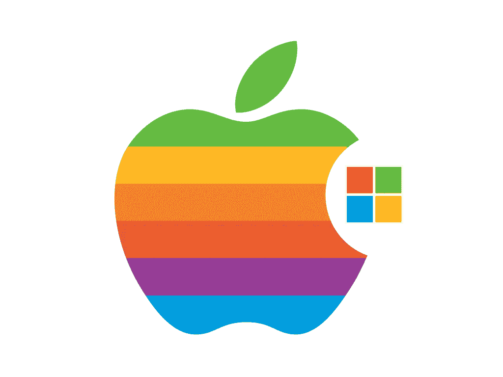
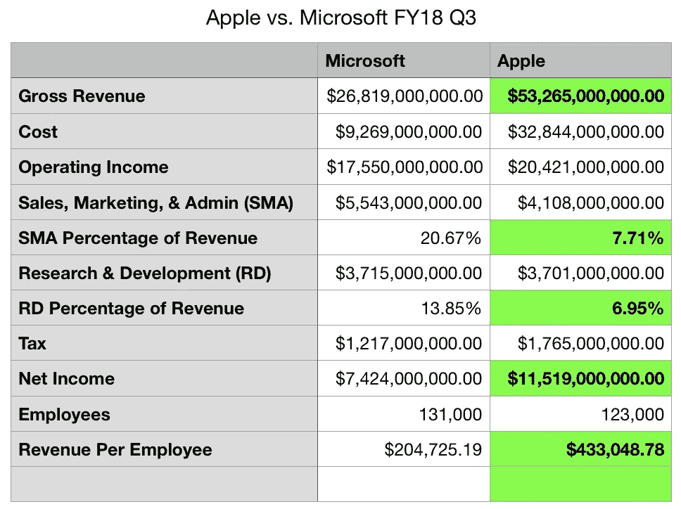
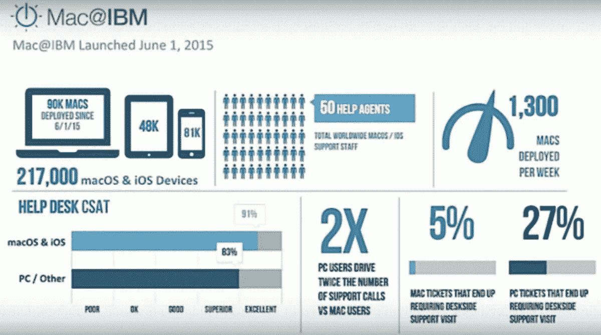

# Mac 与 PC

> 原文：<https://medium.com/hackernoon/mac-vs-pc-3ddeb16007c8>

就个人而言，Mac 或 PC 的优点似乎是主观的，相对于必要性而言。一些人更喜欢苹果机，因为它们致力于简单、安全和免费的软件套件。有些人更喜欢低入门费、硬件自由和运行某种风格的 Windows 的个人电脑固有的现状。此外，尽管他们可以使用相同的生产力软件和平台无关的云解决方案，但其他人似乎认为苹果产品是为创意类型保留的，而个人电脑是为商务人士保留的。欢迎所有人在这方面发表意见，因为任何一种解决方案都仍然可以以一种使心灵感应看起来无用的方式赋予我们力量，但是有没有一种方法可以让我们知道哪种架构是最好的？是也不是。

虽然 MAC 和 PC 各自的优点是主观的，但如果以对企业重要的东西来衡量，微软 Surface Laptop 或 MacBook Pros 等 Windows PC 的优点是绝对不存在的；钱。虽然这不会被误认为是“更好”一词的正确定义，但在资本主义社会中，需要最少管理费用同时使员工产生尽可能多的收入的解决方案往往被视为更好的解决方案，我们可以使用这种理解作为衡量这些解决方案的价值的标尺。

例如，假设你有一个挖洞的生意，你可以选择花 15 美元买一把便宜的铲子，或者你可以花 100 美元买一把质量好的铲子给你的员工使用。虽然便宜的铲子前期不太贵，但它的制造标准也低于优质铲子，这意味着它往往会变钝，因此更容易损坏。因此，在大约 100 个洞之后，15 美元的铲子需要更换(0.15 美元/洞)，而 100 美元的铲子最终会在 1500 个洞之后损坏(0.067 美元/洞)，随着时间的推移，每个洞的开销会减少一半以上。此外，配备优质铁锹的每个工人也可以每小时挖 15 个洞，而配备廉价铁锹的工人每小时只能挖 10 个洞，因此配备优质铁锹的工人在相同时间内可以多挖 50%的洞。

几乎不言而喻，但两者更好的解决方案无疑是品质铲。不仅你的长期开销是廉价铁锹的一半，而且你的员工使用高质量铁锹的总体生产率也会提高 50%。显然，不是每个人都有方法、数据或时间以这种方式实现工具的优点。为了做出这样的决定，你需要为这两种类型的工具建立一个大的样本库，以便了解它们的趋势，在比较微软 Surfaces 和 MacBook Pros 时也可以这样说。

[https://www.apple.com/newsroom/2018/07/apple-reports-third-quarter-results/](https://www.apple.com/newsroom/2018/07/apple-reports-third-quarter-results/) | [https://www.microsoft.com/en-us/Investor/earnings/FY-2018-Q3/press-release-webcast](https://www.microsoft.com/en-us/Investor/earnings/FY-2018-Q3/press-release-webcast)

考虑到上述情况，如果你实际上有两家公司在相似的市场，有很多员工，A 公司完全在苹果生态系统内运营，M 公司完全在微软生态系统内运营，那么就财务而言，两个解决方案中较好的一个将是显而易见和可衡量的；和我们神秘的挖坑生意没什么不同。然而具有讽刺意味的是，微软和苹果可以作为一个例子，因为它们几乎完全配备了自己的架构，同时保持了类似数量的具有类似背景的员工。虽然我们不知道他们在员工工具上的管理费用，但我们知道他们的年收入和管理费用，以及他们各自有多少员工，并且可以把这些放在一起。

如上所示，从他们 2018 财年第三季度的季度财务报告来看，尽管拥有相似背景的员工数量相似，但在相同的工作周内，苹果员工的平均收入是微软员工的 2 倍，而苹果整体的收入是微软的 2 倍。相对于收入，苹果在销售、营销和管理费用上的支出是微软的 1/3，而在研发上的支出是微软的 1/2。此外，假设每小时的收入保持不变，尽管他们已经比苹果多了大约 8000 名员工，但微软必须将其员工人数增加一倍，从 131，000 名增加到 232，000 名，或者将现有员工人数增加一倍，才能产生与苹果相同的收入。这是不容忽视的。

尽管苹果和微软财务状况的鲜明对比不能仅仅归因于其员工集体使用的工具的质量，但暗示他们产品的整体质量和他们产生的收入与用于制造所述产品的工具的质量无关是愚蠢的。当然，领导力、运营模式和行业特质各不相同，但人们共同使用的工具根深蒂固，同样重要，尤其是对工程师而言，至少可以说，它们的采用绝对是 8000 亿美元公司和 1 万亿美元公司之间的差异。事实上，这些工具变得如此根深蒂固和必不可少，以至于与它们相关的停机时间导致的生产力损失是依赖它们的企业最大的 IT 相关支出，甚至超过了维护 IT 所需的员工以及硬件和软件的初始成本。

IBM Presentation @ JNUC 2016 [https://www.youtube.com/watch?v=NLgvIarqdDM](https://www.youtube.com/watch?v=NLgvIarqdDM)

虽然我们处在讽刺的列车上，但值得注意的是，IBM 也注意到，通过将用户切换到 macOS 生态系统，拥有成本降低到 Windows 生态系统 PC 的 1/3。虽然前期比同等的 PC 稍贵，但苹果产品所需的辅助软件、软件更新、管理、停机时间、支持案例和支持人员都要少得多，这最终总是比硬件和软件的初始成本更贵。结果，在将用户转移到苹果生态系统后，IBM 的每用户 IT 开销成本从大约 21 美元/用户/月上升到 7 美元/用户/月。

考虑到所有的事情，这是一个很好的声明，当它来自将 IT 产品的质量与拥有成本联系起来的先驱以及个人电脑的教父。然而，结合苹果自己产品的结果，他们为苹果在企业中的地位提出了一个致命的理由，似乎微软自己甚至可以从将其用户迁移到苹果生态系统中受益，就像 IBM 所做的那样。

显然，转投苹果并不能保证成功，但你肯定会通过确保你的员工不会被他们的竞争对手彻底击败来提高你的成功几率。就目前而言，在转向苹果之后，IBM 似乎放慢了他们的下降速度，但相关性并不等于因果关系，看看他们在未来几年里会带着新工具走向何方将是一件有趣的事情。

不过，就个人而言，我认为这仍然是一件主观的事情。企业的唯一目的是赚钱，而个人不是，我们对什么是最好的定义各不相同。有些人喜欢修修补补，有能力弥补 Windows 和 PC 的特性；这就是我小时候学到的很多东西。但目前还有很多人不理解 Windows PCs 的本质。这是如此之多，以至于他们的挫折导致了一万亿美元的微软合作伙伴的 IT 支持和管理行业。反过来，这些合作伙伴致力于支撑整个微软；按照微软的说法。不用说，修补者的情况不应该被误认为是普通的计算机用户，或者优先于客观数据，尤其是在商业领域。

然而，如果你像做生意一样重视你的时间和生产力，那么与个人电脑相比，苹果的质量优势在任何规模下都是显而易见的，是一个显而易见的选择，就像一个质量优于廉价品牌的铲子。当微软的产品从消费者报告中被删除或者 T2 的产品被完全删除时，苹果的产品在企业领域占据着至高无上的地位，就像在自由市场一样。尽管苹果自己也有狂热的追随者，但考虑到他们可以为自己的产品提供三年保修和无限支持，而费用低于打电话给微软寻求 Windows 支持的费用，因此很难指责他们。