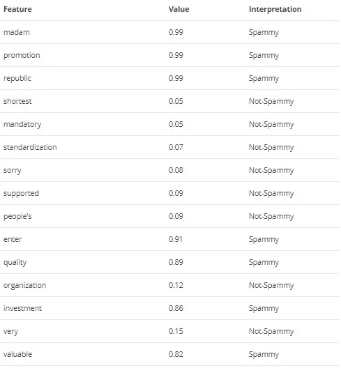
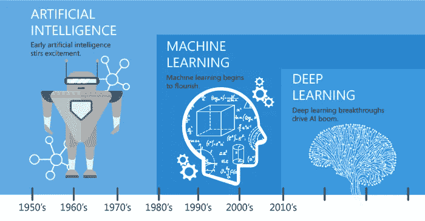
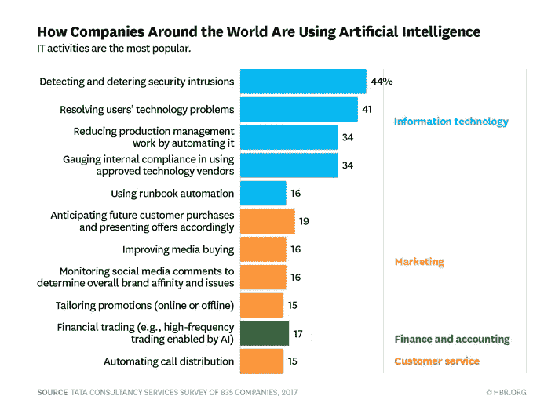

# 机器学习和人工智能——它们对企业意味着什么

> 原文：<https://medium.com/hackernoon/machine-learning-and-artificial-intelligence-what-they-are-to-business-fad5aad32d98>

今天，大多数领先的公司都依赖机器学习和人工智能来理解消费者行为，将数据转化为信息，并推动自己走向富有成效的明天。

我想我应该写一篇关于什么是机器学习和人工智能以及它们的商业相关性的短文。如果我从整体上来看，节省时间和获得洞察力是这些技术的两个最大收获。让我给你一个快照，为什么明天的业务将属于 ML 和 AI

# 什么是机器学习？

机器学习赋予了计算机自己编程的能力，而不需要明确地请求命令来完成交给它的每一项任务。机器学习开发程序，帮助计算机访问数据，学习数据并相应地计算给定的任务。这有助于计算机在没有人工干预的情况下自动执行任务。

机器学习算法分为两类:

1.监督

2.无人监督的

监督算法需要人工干预来提供输入和输出，而非监督算法不需要人工向机器提供输入和输出。这是一种叫做[深度学习](http://searchbusinessanalytics.techtarget.com/definition/deep-learning)的迭代方法，帮助机器自己读取数据并得出结论。

机器学习帮助你完成人类无法轻易完成的复杂任务。

**机器学习商业应用:**

机器学习在我们的日常生活中随处可见，我将分享一些使用案例:

*   你在智能手机上得到的网上购物建议，
*   无人驾驶汽车和先进的汽车[技术](https://hackernoon.com/tagged/technology)
*   您的脸书订阅源会推荐您的朋友和您可能感兴趣的内容，
*   智能手机中的语音功能可以识别您的语音并与您交谈。
*   机器学习也是动态定价和图像分类的关键基础
*   机器学习可以在 twitter feeds 上以 83%的准确率识别情感分析。

营销人员手中的这些知识是无价的！！

机器学习的一个经典的经常被讨论的例子是，由计算机科学家和著名的创业投资者保罗·格拉厄姆开发的贝叶斯垃圾邮件过滤器。它使用 ML 来识别基于某些关键字的垃圾邮件。

Image Credit — Tech Emergence

# 什么是人工智能？

来到人工智能，它是机器学习的一个总称。人工智能构建了具有认知能力的机器，而机器学习构建了从数据集中挖掘数据并从中学习和推理的算法。

Image credit-AllTechBuzz

机器学习融入了人工智能的发展，因为它是人工智能的一种应用，为系统提供智能和学习。虽然机器学习算作人工智能，但并非所有人工智能都算作机器学习，因为它远比机器学习更广泛。人工智能模仿人类智能，包括复杂的功能，如视觉感知、语音识别、决策和语言之间的翻译。

机器学习和人工智能通过大量的数据处理和大量的客户交互，催化了各个领域的创新步伐。聊天机器人为客户服务、个性化交流、自动回复电子邮件等等提供了可能。

我们开发的工具，Alore CRM，也利用了人工智能的力量。请随意注册一个用于教育目的的免费试用，看看人工智能如何帮助变革销售生产力及其带来的变化。

**商业中的人工智能:**

人工智能在商业中有无数的用例。列举一些:

*   结合机器学习，人工智能有助于检测保险和相关领域的欺诈索赔
*   销售和营销团队可以获得对消费者行为和客户终身价值的深刻见解(CLTV)
*   它检测和诊断医疗保健中的疾病。
*   为设计师提供深刻见解
*   帮助实现产品和服务的价格优化
*   人工智能还被用于[制药行业](https://www.techemergence.com/machine-learning-in-pharma-medicine/)来筛选药物化合物，以及根据个人生物学来确定什么药物对个人更有效。

Source: Tata Consultancy Services/HBR

太棒了，不是吗？！

**收尾**:

机器学习涉及应用某些逻辑并相应地导出结果。它不关心机器的智能思维，然而，人工智能需要机器的智能思维并得出解决方案。

机器学习和人工智能将共同为企业提供巨大的推动力。游戏已经开始，但我们尚未开发这些技术的潜力。大多数公司尚未在日常商业决策中采用人工智能和人工智能，除非他们这样做，否则我们不会真的做太多事情来迈向未来。

关于我:Alore CRM[的首席幻想家](https://crm.alore.io/)讲述了他对人工智能驱动的生产世界的使命。

*原载于 2018 年 3 月 21 日*[*blog . alore . io*](https://blog.alore.io/machine-learning-and-artificial-intelligence/)*。*