# 机器学习基础——这是你喜欢的！

> 原文：<https://medium.com/hackernoon/machine-learning-basics-its-your-cup-of-tea-af4baf060ace>

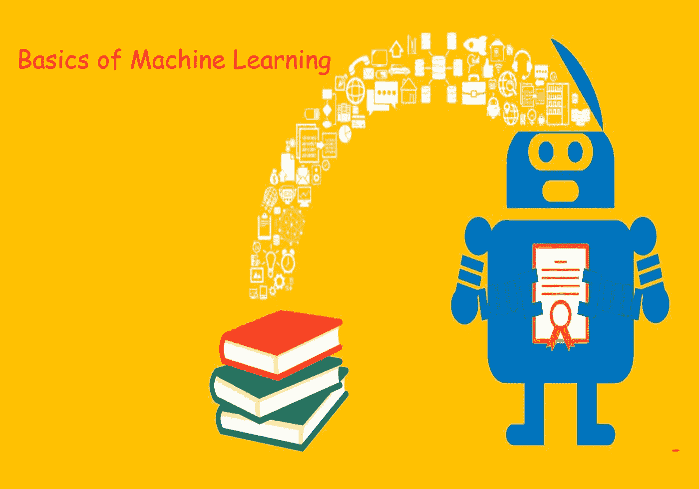

我相信你们每一个人都一定听说过这个*时髦词* [机器学习](https://hackernoon.com/tagged/machine-learning)。想知道这是什么。让我们进入它的基础。

**注意**:这只是一个概述，让你快速了解机器学习及其帮助。

机器学习是人工智能(AI)的一种应用，它为系统提供了自动学习和根据经验改进的能力，而无需显式编程。**机器学习**专注于[开发](https://hackernoon.com/tagged/development)能够访问数据并使用数据进行自我学习的计算机程序。

# 为什么机器学习很重要？

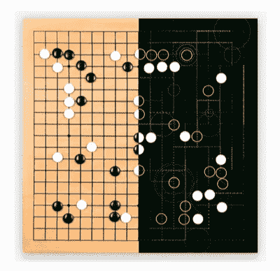

Alpha Go

**AlphaGo** 是一个玩棋盘游戏围棋的计算机程序。它是由 Alphabet Inc .位于伦敦的谷歌 DeepMind 开发的。

AlphaGo 击败了围棋界最优秀的人类选手之一——在机器首次征服国际象棋后的二十年里，这是一项由人类主导的游戏中的非凡成就。

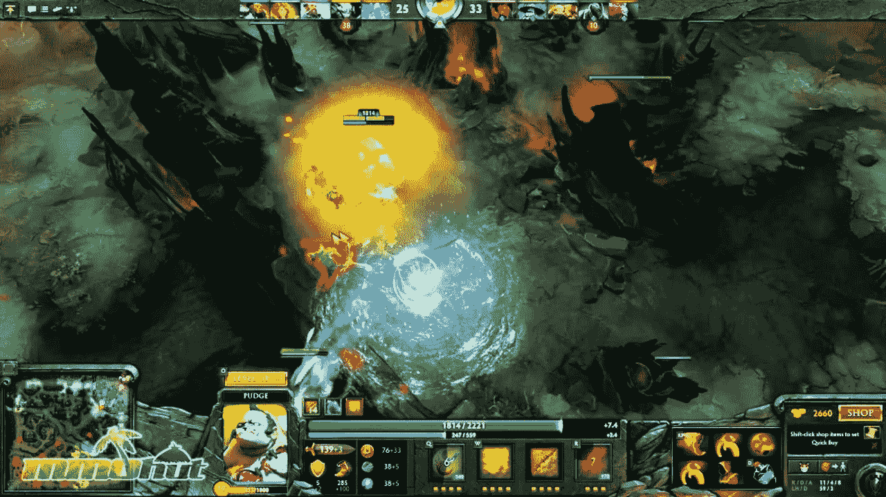

Dota

**Dota** 2 是由 Valve Corporation 开发并发布的多人在线对战竞技场(MOBA)视频游戏

OpenAI 在在线多人游戏 Dota 2 的 1v1 比赛中击败了世界顶级职业选手，从而达到了又一个不可思议的里程碑

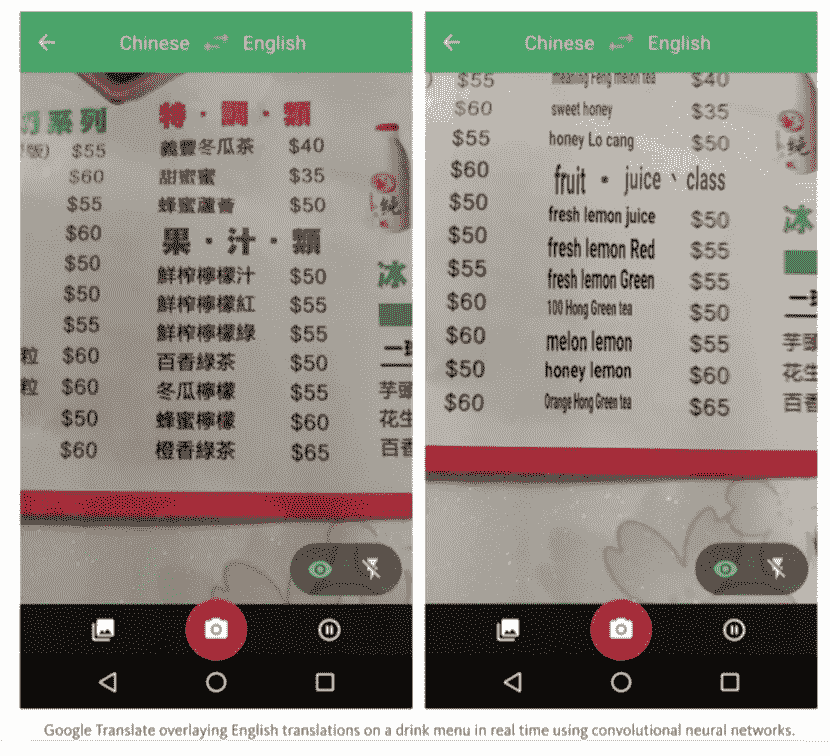

**谷歌翻译**是来自**谷歌**的机器**翻译**网站，可以**在不同语言之间翻译**文本。它可以在 100 多种受支持语言的任意组合之间翻译单词、句子、文档和网页。2006 年 4 月 28 日上线，一直免费使用。

> 人工智能将比本世纪任何其他创新更有力地塑造我们的未来。

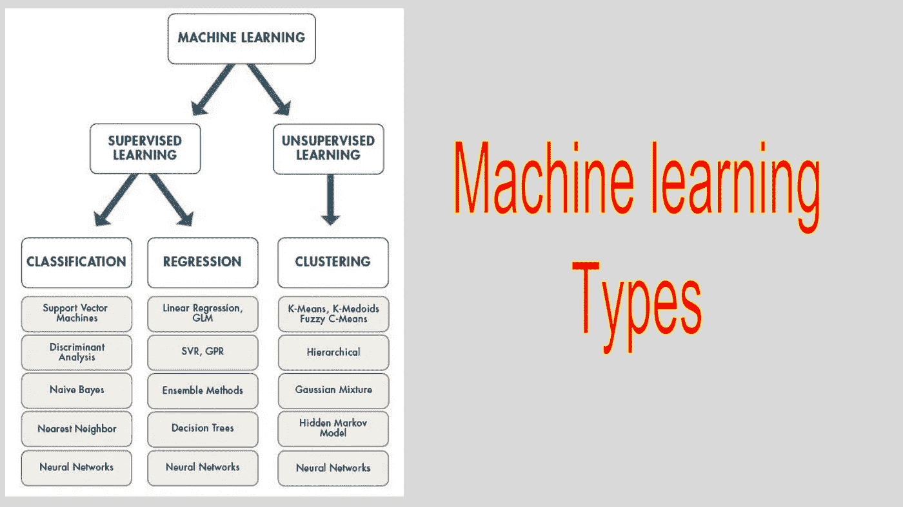

Machine Learning Types

# 监督学习

让我们看看监督学习的两个任务

1.  回归
2.  分类

***监督学习=包含带有相关正确标签的训练样本的数据集***

监督学习是基于示例输入-输出对将输入映射到输出的功能。它从由一组**训练**示例组成的带标签的**训练**数据中推断出一个函数。

比如学习手写数字分类。

*   训练你的数据集到这样的程度，使得找出未知输入的结果变得容易。

# 监督学习是如何工作的？

让我们根据一个人完成高等教育的年数来考察预测他/她的年收入的问题。

简而言之，
建立一个模型，该模型近似于高等教育年限 X 和相应年收入之间的关系 *f*

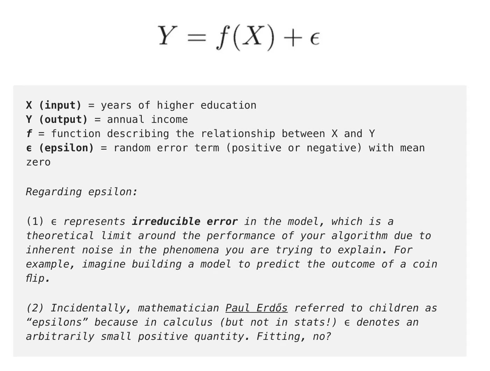

## 解决办法

有两种方法可以找到解决方案

**工程解决方案** 这个解决方案将通过简单的公式

```
income = ($5,000 * years_of_education) + baseline_income
```

**学习解决方案** 获取一些基本参数的信息，如学位类型、工作经验年限、学校等级等。这将有助于轻松找到收入。

例如:*“如果他们完成了学士学位或更高学位，给收入估计值一个 1.5 倍的乘数。”*

# 监督学习的目标

*   通过学习算法运行标记的训练数据，从*开始*学习收入和教育之间的关系。
*   这个学习过的函数可以用来估计收入 Y 未知的人的收入，只要我们有教育年限 X 作为输入。
*   简而言之，我们可以将我们的模型应用于**未标记的**测试数据进行估计

> **给定已知 X 未知 Y 的新例子时，尽可能准确地预测 Y**。

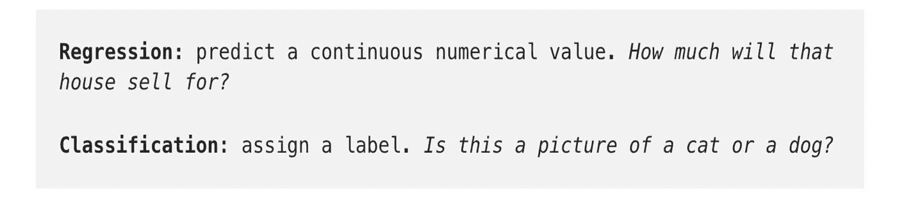

# **回归—预测连续值**

—预测一个连续的目标变量 Y。
—根据输入数据 x 估计一个值，如房价或人类寿命。
—连续意味着 Y 可以采用的值中没有间隙(不连续)。一个人的体重和身高是连续的数值。
—离散变量意味着它只能取有限数量的值，例如某人有多少个孩子就是一个离散变量。

> 预测收入是一个经典的回归问题。您的输入数据 X 包括数据集中可用于预测收入的个人的所有相关信息，如受教育年限、工作经验年限、职称或邮政编码。

—这些属性被称为**特征**，可以是数字的(如工作经验年限)，也可以是分类的(如职位或研究领域)。

您将希望尽可能多的训练观察将这些特征与目标输出 Y 相关联，以便您的模型可以学习 X 和 Y 之间的关系 *f* 。

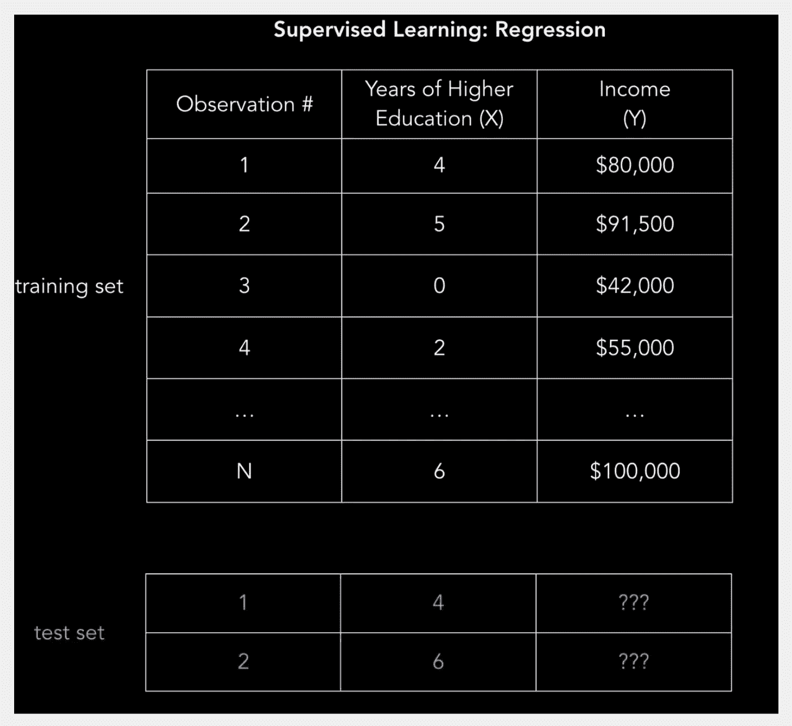

# 线性回归(普通最小二乘法)

我们有我们的数据集 X *、*和相应的目标值 y。普通最小二乘(OLS)回归的目标是学习一个线性模型，我们可以用它来预测一个新的 *y* ，给定一个以前看不见的 *x* ，误差尽可能小。我们想根据一个人受教育的年限来猜测他的收入。

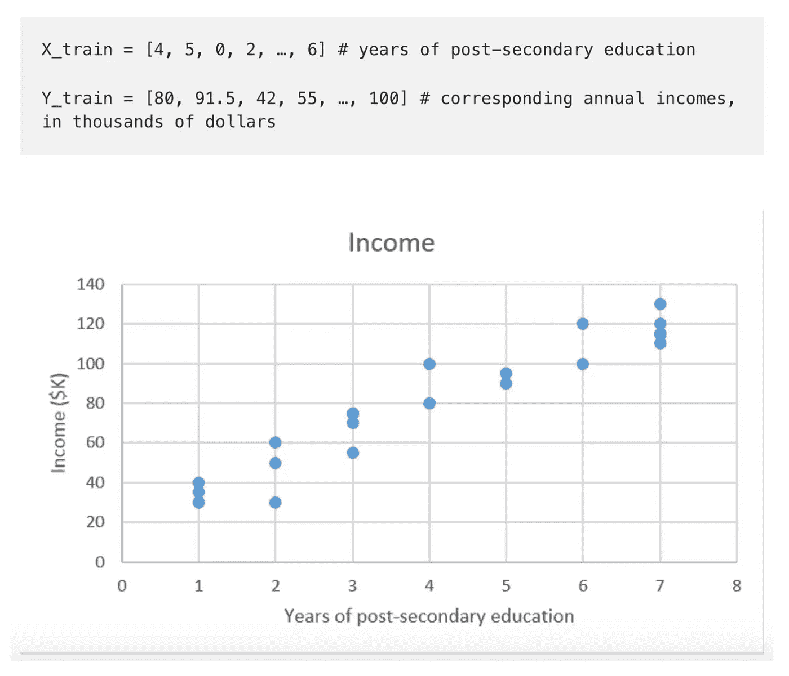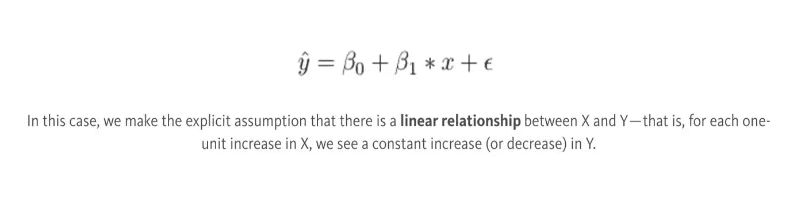

*β0* 是 y 截距， *β1* 是我们这条线的斜率，即多受一年教育，收入会增加(或减少)多少。

我们的目标是学习使模型预测误差最小化的模型参数(在本例中是 *β0* 和 *β1* )。

要找到最佳参数:

1.  *定义一个成本函数，或者损失函数，来衡量我们的模型的预测有多不准确。
    2。找出使损失最小化的参数，即尽可能使我们的模型精确。*

# 分类

*   分类预测离散的目标标签 y。
*   分类是基于从标记的训练数据建立的分类模型，将新的观察分配给它们最可能属于的类的问题。

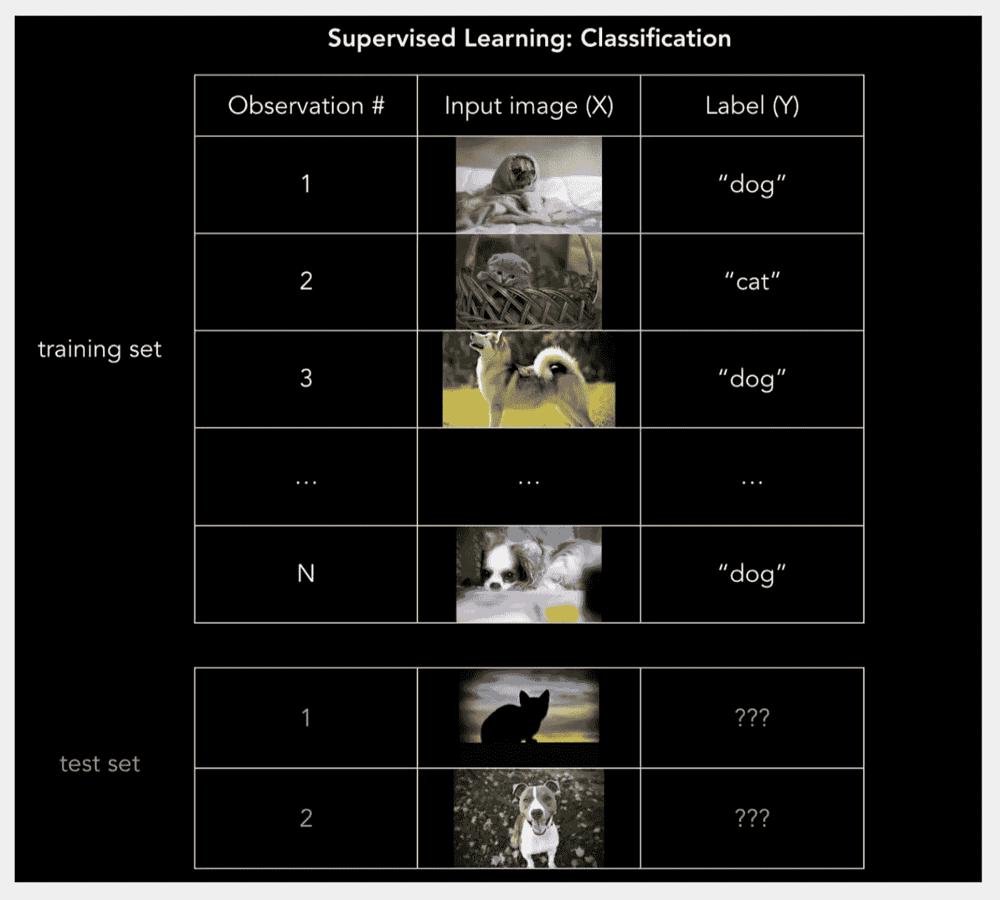

## 逻辑回归:0 还是 1？

处理二元类型的分类

—例如，当给手写数字分配 0 到 9 之间的标签时，或者使用面部识别来检测脸书照片中的朋友时。

**SVM(支持向量机)**

—该算法本质上是由几何因素驱动的，而不是由概率思维驱动的。
—支持向量机使用分隔线(或者，在两个以上的维度中，使用多维超平面)将空间划分为红色区域和蓝色区域

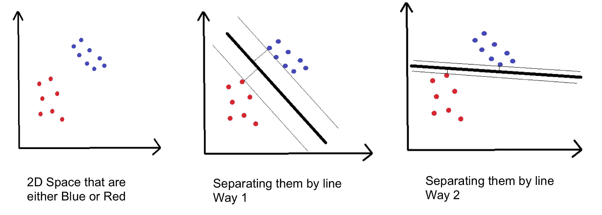

—到线两侧最近点的距离称为边距，SVM 试图最大化边距。
—把它想象成一个安全空间:空间越大，噪声点被错误分类的可能性就越小。

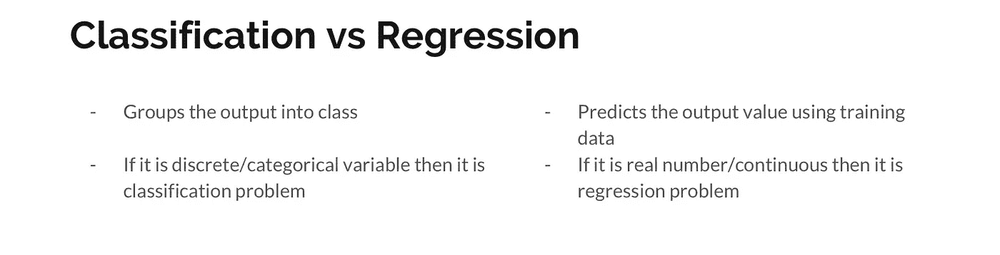

# 无监督学习

**无监督学习**是一种类型的**机器学习**算法，用于从由没有标记响应的输入数据组成的数据集进行推断。
最常见的**无监督学习**方法是聚类分析，用于探索性的数据分析，寻找数据中隐藏的模式或分组。

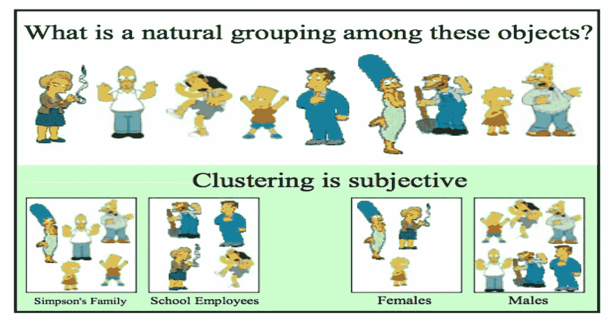

# 使聚集

*   一个**集群**内部的物品应该彼此非常相似，但是与外部的物品非常不同。
*   在没有被提前告知的情况下对数据进行分组
*   用于知识发现而不是预测

—每当有各种各样的数据时，聚类都很有用。著名的聚类方法 **k-means**

现在你知道了机器学习的基本类型，让我们快速看一下监督学习和非监督学习的区别。

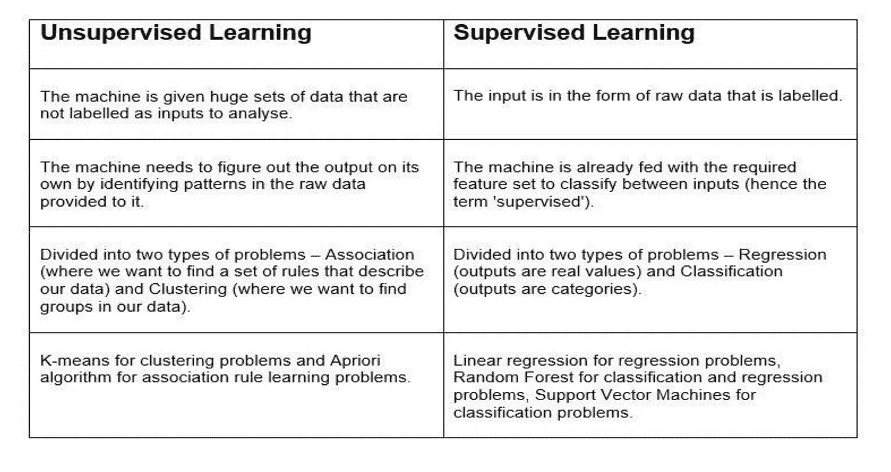

Main Difference

就这样，你们对机器学习的基础都很好。

快乐学习！😆 🖥