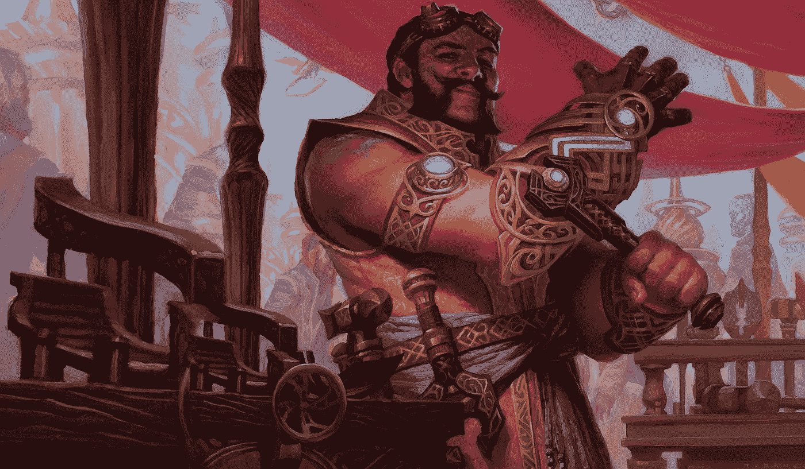
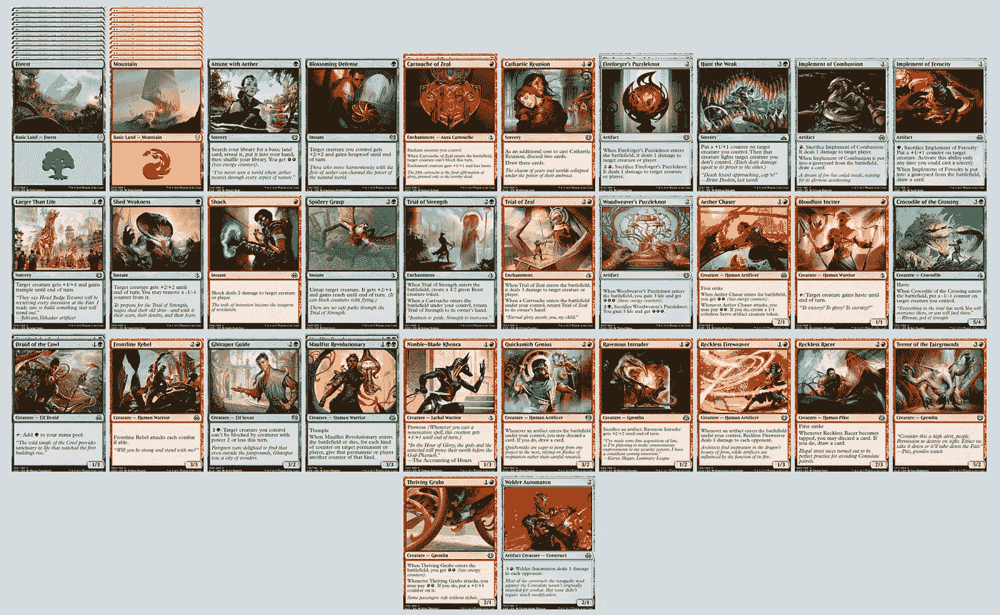
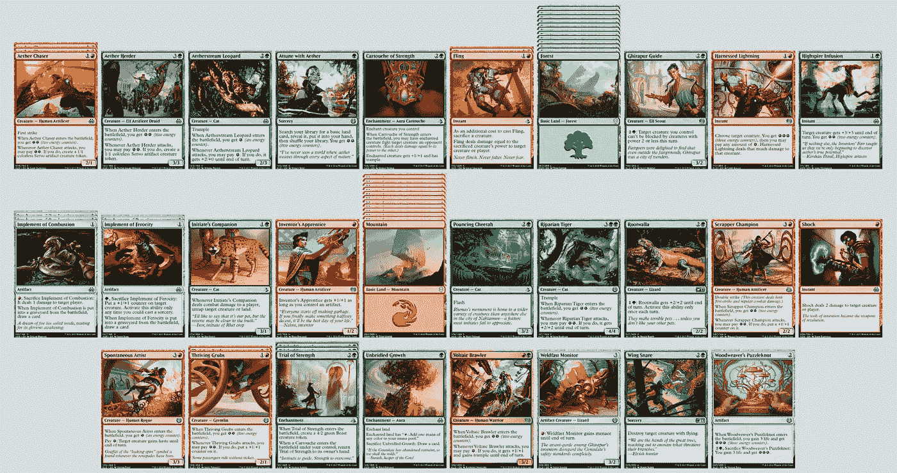

# 机器学习魔法

> 原文：<https://medium.com/hackernoon/machine-learning-magic-64a6a7f864d4>

## 利用人工智能从你已经拥有的牌中进化出坚固的 MtG 牌组

Image ©Wizards of the Coast LLC.

告诉我这听起来是否熟悉。你有一个盒子(事实上，盒子！)充满魔力:收集卡，几乎都来自你购买的助推器，要么是因为破解助推器很有趣，要么(更有可能)是你从有限的活动中积累的。大多数都是大众牌，但肯定有一些非常有趣的牌——但因为它们是单人牌或双人牌，你不会真的打出那种颜色，它们只是在积灰。

你在想:元游戏需要一点调整，但每个人都如此该死地关注着[卡恩，乌尔扎]((https://scryfall.com/card/dom/1)和[步行弩车](https://scryfall.com/card/aer/181)的后代。你肯定你的收藏中有一些能带来惊喜的东西，甚至可能是一两个实实在在的胜利。

但是从哪里开始呢？

[Scryfall](https://scryfall.com/) 是一个*惊人的*资源，但是它的核心用例并没有涵盖我们的问题。当你已经知道你想要什么，你已经知道你拥有什么(和不拥有什么)的时候，它会帮助你。

如果有一个[工具](https://hackernoon.com/tagged/tool)可以从你现有的收藏中挑选出有趣而新颖的卡牌组合，那不是很棒吗？如果这个工具可以围绕这些核心牌制作一副坚固的牌，那么你今天就可以开始玩*不是更好吗？*

*也许我是一个人，但这确实是我的感受。所以我开始建造这样一个工具。请继续阅读，了解它是如何工作的，如何开始使用它，更好的是，如何让它变得更棒。*

*在这篇文章中，我想概括一下我是如何应对这个挑战的，我的方法是如何工作的，哪些进展顺利，哪些进展不顺利。如果你只是想直接跳到代码，或者深入了解技术细节，你可以在 GitHub 上深入了解。*

*特别是，我想谈谈一种使用遗传算法或 GAs 的技术来建造甲板的方法。气体允许我们使用*人工选择*从字面上*进化*好的甲板。哦哦哦！是的，它*就像它听起来那样令人兴奋！**

> *剧透提醒:我带着这个工具生成的一副牌去了 2018 年 2 月的[荷兰标准公开赛](http://www.dutchopenseries.nl/)，去了 0–7，最后一名。但是我赢了几场比赛，并让那里的几乎每个人都感到惊讶，围绕[机械化生产](https://scryfall.com/card/aer/38)和[路障破坏者](https://scryfall.com/card/aer/144)建造了一个甲板。这…很有趣。显然有很多工作要做！但是到目前为止还是很有趣的，这对我来说是最重要的。*

## *遗传算法*

*那么，什么是遗传[算法](https://hackernoon.com/tagged/algorithm) (GA)？他们如何帮助我们？*

*气体设计的目标是在合理的时间内找到优化问题的足够好的解决方案。优化问题是指存在一系列可能的解决方案——范围太大，无法逐一搜索，并且一些解决方案比其他解决方案更好。经典的例子是[背包问题](https://en.wikipedia.org/wiki/Knapsack_problem):给定一组特定大小、形状和重量的物品，以及一个用来存放它们的背包，怎样安排它们才能打包尽可能多的物品？*

*甲板建造也是一个优化问题。假设有大约 20，000 张不同的卡片在印刷中，并且我们可能各自拥有几千张卡片的集合，在许多卡片的多个副本中，我们想要从我们的集合中识别出 60 张卡片，作为一副牌，这些卡片给我们赢得魔术游戏的最大机会。*

*当我们可以将优化问题的解决方案表达为一系列离散项目时，就像染色体中的基因一样，遗传算法提供了一种有趣的方式，通过*进化*来找到*足够好的*解决方案(我将在下面讨论如何实现)。你猜怎么着？甲板列表只是一系列离散的项目，使得甲板建造成为用 GA 处理的理想问题。*

## *遗传算法*

*气体工作的方式是通过一个被称为人工选择进化的过程，非常明确地模仿自然选择进化的生物过程。你可以猜到，这个算法的术语都是从进化生物学中借来的。*

*首先，我们随机生成几千个独立解决方案的初始群体(也就是说，在我们的例子中，一副牌只包含我已经拥有的牌)。然后，评估群体中每个成员的最优性(他们的“适合度”)。然后，从群体中成对地选择个体——它们的适应度越大，被选择的可能性就越大。然后，这两个个体被杂交——卡片序列被切割和重组——为下一代创造新的个体。有时候，个体会接受随机突变，只是为了保持新鲜感。这个过程被重复很多次，从另一端出来的结果比开始这个过程的随机个体要好得多。*

*简直… *神奇*。🤩*

*但是驱动整个事情的，所有事情所依赖的，是我们如何评估最优性，*适应度函数*。本质上，我们需要告诉 GA 一副牌有多好。对于某些问题，适应度函数很简单。例如，在背包问题中，我们可以问:我们设法往背包里塞了多少东西？但是有了魔法甲板，这个问题就更难回答了*。**

## *一副魔术牌的适用性*

*我们认为魔术牌是一系列的卡片，可以被切片、切块和重新排列以形成新的牌。这是容易的部分。但是我们如何评估我们拥有的是否是一副好的牌呢？*

*我们将根据一副牌符合一组规则的程度来给它打分。一些规则将点数分配给一副牌作为完形，一些规则将点数分配给单张牌，然后将这些点数累计。点数越多，牌越好。*

*对于我的工具，我设置了一些基本的假设——这些假设远非普遍，但是对什么是好的甲板的约束越多，GA 通常表现得越好，尤其是在像我们这样大的问题空间中。*

1.  *没有一张单独的牌可以在一副牌中出现两次(因为这在物理上是不可能的)，并且一副牌中任何一张牌的副本不能超过 4 份(因为规则)。这种牌从这副牌中取出。*
2.  *套牌应该正好由 N 种颜色组成，其中 N 默认为 2，但可以指定。不属于 N 顶色的牌将从该副牌中移除。*
3.  *副牌包含 36 张非陆地牌。(我们不需要 GA 浪费周期添加土地到我们的甲板上，我们可以自己手动完成，稍后只需要很少的精神成本。)套牌太小会扣分——如果规则 1 或 2 被打破，它们*将*太小。*
4.  *卡牌应该近似一个法力曲线
    9 个一滴
    13 个二滴
    9 个三滴
    3 个四滴
    (借用这个[关于通道火球的精彩分析](https://www.channelfireball.com/articles/frank-analysis-finding-the-optimal-mana-curve-via-computer-simulation/)。)我们计算从我们的实际甲板到这个理想甲板的欧几里得距离，并基于甲板与理想甲板的接近程度来分配点数。*
5.  *卡牌应该大致由
    16 个生物
    8 个神器
    3 个附魔
    1 个旅法师
    3 个瞬发
    3 个魔法
    (完全是杜撰的，并且是由我对神器的热爱驱动的——重[卡拉德什块](https://scryfall.com/sets/kld?order=set&as=grid)。)我们再次计算到这个理想的欧几里德距离，并且基于甲板与理想的接近程度来分配点。*
6.  *生物的平均力量和平均防御力越大越好。更好的力量和更好的韧性获得更多的积分。*

*(目前，GA 不会检查该卡片组对于任何特定格式是否合法，但这并不难添加。)*

*这个想法是，甲板不一定要完全符合这些标准，但我们可以根据他们符合每个标准的程度来给他们分级。假设这些约束是任意的(当然，它们在代码中是完全可配置的！)，且受制于口味。它们甚至可能不是最重要的考虑因素，但它们是最基本的，我们至少可以证明，如果得到的牌组有正确的颜色数、指定的法力曲线和指定的类型分布，遗传算法是有效的。*

*事实上，在这一点上，我们可以证明使用遗传算法来生成甲板符合这些标准相当接近。这些卡牌将是*合法*，并且在一定程度上*可玩*，但是它们不会非常*有趣*，这是我们问题的关键部分。*

*也就是说，这里有一个仅用适应度函数中的这些约束构建的示例牌组:[一堆进化的牌](https://deckstats.net/decks/108990/1006014-an-evolved-pile-of-cards)。如你所见，它符合所有规定的要求:它有一个稳定的魔法力曲线，它有一个合理的牌类型分布，它(大部分)是合法的。可玩。当然，它包括我已经拥有的卡片。考虑到 GA 是从随机选择 36 张卡开始的，这是相当惊人的！但这还远远算不上伟大。*

**

*Almost the definition of a pile of cards. But at least it’s Standard legal? Just pretend you didn’t see that Attune with Aether. [https://deckstats.net/decks/108990/1006014-an-evolved-pile-of-cards](https://deckstats.net/decks/108990/1006014-an-evolved-pile-of-cards)*

*两条意见:*

1.  *有趣的是，在这一点上，大多数牌组是红色/绿色的，可能是因为上面的规则 5(最大化平均力量和韧性)。此外，大多数生物都在曲线的更上方，毫无疑问是出于同样的原因，瞬间、魔法、附魔和神器占据了 1 点和 2 点的位置。显然，这远非最佳。*
2.  *当然，这些卡片之间绝对没有协同作用。*打哈欠。让我们做点什么吧。**

## *卡片能力和互动*

*因此，显而易见的下一步是，假设我们没有发现之前关于好牌组的假设非常令人不快(我们可以稍后调整它们，至少我们知道它们在工作)，告诉适应度函数一些关于牌如何相互作用的信息。*

*在这个阶段，我试图用一种我可以在健身功能中使用的方式来描述我的卡。*

1.  *我在我的每张卡片上手工标记了它们所具有的各种能力(尽量使用社区术语，但毫无疑问经常会失败):例如，飞行或抽牌。例如，我将[英雄干预](https://scryfall.com/card/aer/109)标记为“授予十六进制证明”和“授予坚不可摧”。*
2.  *我还根据触发式异能的触发条件，手工标记了我的每张牌，例如，进入战场，或者…嗯，实际上，我只能做到这一步，因为可能的触发条件太多了。例如，我将[费利达尔守护者](https://scryfall.com/card/aer/19)标记为具有进入战场触发器。*
3.  *然后，如果我的每张牌都与具有特定能力、触发条件或牌种的牌有有趣的互动，我会手动标记它们。我把这些叫做(一个错误！)“亲疏”。例如， [Embraal Gear-Smasher](https://scryfall.com/card/aer/79) 对人工制品有一种亲近感。*

*您可以在代码的`data/annotations.json`中找到所有这些注释。那里发生了很多事！*

*然后，我还创建了一个更一般的互动列表——包括积极的和消极的。比如会飞的生物(在我看来！)多了就好一点了，但是和授予飞行的卡配对不好(因为那是多余的)。产生能量的牌(毕竟这是卡拉德什！)与消耗能量的牌很好地配对，但不要与不使用能量机制的牌互动。*

*创建这个列表是一个费力不讨好的任务，所以我把它写得很短，重点放在我特别感兴趣的互动上(尤其是能量！).你可以在`data/interactions.json`中找到我记录的交互列表。*

*然后，在健身功能中，我又增加了几条规则。健身功能检查一副牌中的每一对牌:*

1.  *具有良好互动能力的牌对会获得点数。负向互动的牌对会失去点数。*
2.  *其中一个与另一个有亲和力的牌对(用我自己的术语描述如上)被给予分数。*

*现在，例如，当健身功能看到两个飞行生物时，它点头表示同意。当它看到 Embraal Gear-Smasher 与一个神器配对时，它点头表示同意。当它看到[风暴大鹏](https://scryfall.com/card/kld/3)和[大跳跃](https://scryfall.com/card/akh/20)配对时，它变得暴躁起来。*

## *结果呢*

*所以:好的牌组是合法的，有好的法力曲线和牌种分布，有丰富的牌面亲和力和互动。遗传算法在这种适应性测量中表现如何？看看[进化出的能量](https://deckstats.net/decks/108990/1006019-evolved-energy)，看看你怎么看。*

**

*More than a pile, less than GP-winning. [https://deckstats.net/decks/108990/1006019-evolved-energy](https://deckstats.net/decks/108990/1006019-evolved-energy)*

*还不错，考虑到我们只测量了一小部分能力和潜在的相互作用(非常强调能量和进入战场的效果)，并且从随机生成的牌开始，我们被限制在我相当有限的集合中！*

*但这可能会好得多。很明显，我们正被基于规则的识别和明确每一种能力和互动的方法所束缚。我很确定下一步将会涉及到一个更加面向统计的系统，而不是试图使非常可能的交互显式化。*

*如果你想亲自体验一下，代码是开源的，可以在 GitHub 上找到。自述文件包含构建和运行说明。*

## *未来的工作*

*追踪能力、互动等等的机制非常麻烦。首先，它需要手动处理每张*卡。另一方面，我不认为我的能力标记系统是特别好的。这也是不必要的复杂。**

*更好的办法是建立一个系统，看看成功的套牌在野外实际上是什么样的，并从对其他人有效的套牌中进行归纳。那会是什么样子呢？*

*在我看来，下一步是双重的。首先，我想部署一些自然语言处理技术，如[这个有趣的纸牌原型实验](https://hackernoon.com/finding-magic-the-gathering-archetypes-with-latent-dirichlet-allocation-729112d324a6)来基于规则文本 s 构建一组纸牌原型——我已经开始了这项工作，并看到了一些有希望的早期结果，我希望很快与大家分享。*

*但是卡片标签本身并没有帮助。因此，第二步是开始下拉顶层卡片组列表，并检查上一步中生成的卡片原型如何在野外相互作用。*

*由此，我们可以构建一个统计模型，并将其输入到适应度函数中。我们可以问:这里有一张卡片，它的原型是什么？根据我们在野外看到的，这些原型和甲板上看到的其他原型有联系吗？*

*我认为，这是这个项目的发展方向。我很快会有新的进度报告！*

## *你能提供什么帮助*

*我很想得到一些帮助。但是，让我们诚实地说:代码是一团糟。基本上，我只是把代码拼凑在一起，直到它工作，只有少量合理的代码结构和注释。还不清楚这些代码是如何运作的。我请客。*

*但是如果你真的想参与进来，并且愿意在我记录事情的时候对我有耐心，那么，就开始挖掘你看到的任何你可以修复的缺失。代码库和结构可以更干净，它可以更加用户友好。看看围绕项目的 [GitHub 问题](https://github.com/DEGoodmanWilson/magique/issues)就知道了。*

*在不久的将来，我将开放更多的项目来构建卡片原型，以及分析成功套牌的原型，如果你有兴趣帮助推进的话。*

*如果你只是想表达你的谢意，你可以在购买下一副牌时使用我的 [Cardmarket 附属链接](https://cardmarket.com/?referrer=DEGoodmanWilson)，或者点击下面的鼓掌按钮！*