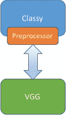
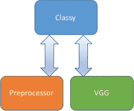
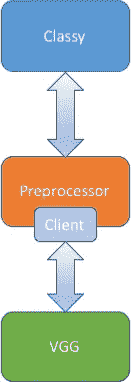
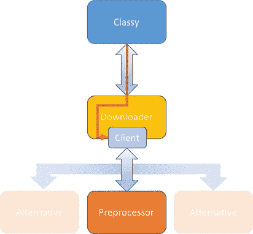

# 机器学习模型管道:第一部分

> 原文：<https://medium.com/hackernoon/machine-learning-model-pipelines-part-i-e138b7a7c1ef>

Photo by [Patrick Hendry](https://unsplash.com/@worldsbetweenlines?utm_source=medium&utm_medium=referral) on [Unsplash](https://unsplash.com?utm_source=medium&utm_medium=referral)

人工智能系统正从开发和测试转向生产。在本质上，人工智能系统只是简单的计算，因此远程部署系统可以提供远程计算。如果该系统涉及多个计算步骤，那么通过将该计算作为可以组合的可组合块来提供，可以获得许多优势。

我正在描述一个通常被称为**管道**的概念。你把每一点计算打包成一个组件。然后，您按顺序通过多个组件发送数据。管道可能是非常有价值的部署工具。它们允许我们重用少量的计算，使我们的架构更加灵活，允许我们灵活地响应新的需求。

这篇文章分为两部分。第一篇(你现在正在阅读的)用一个具体的例子解释了构建机器学习管道的方法。[的第二部分](/@vishvananda/machine-learning-model-pipelines-part-ii-23ebd1e6b714)深入探讨了用 [GraphPipe](https://oracle.github.io/graphpipe) 实现不同架构的所有精彩细节，包括一个现实世界示例的实现。

## 为什么是管道？

构建管道提供了许多与软件开发中解耦相同的优势。这些优势包括:

1.  **灵活性:**计算单位很容易替换。如果您发现一个块有更好的实现，您可以替换它而不改变系统的其余部分。
2.  **可伸缩性:**每一点计算都通过一个公共接口公开。如果任何部分成为瓶颈，您可以独立地扩展该组件。常见的扩展技术可能涉及负载平衡器或额外的后端。
3.  **可扩展性:**当系统被分成有意义的部分时，它为新功能创建了自然的扩展点。

**上等图像识别**

通过一个具体的例子，流水线操作变得更加清晰。让我们讨论如何构建一个示例应用程序的后端。我们的示例应用程序是 **Classy** ，一个对图像进行分类的移动应用程序。该应用程序允许用户选择一个或多个图像，并确定每个图像的类别。它还允许用户输入一个或多个 URL 来从 web 上获取图像的分类。我们的目标用户是使用旧手机和有限移动带宽的用户，所以我们的大部分计算必须在服务器端完成。我们将设计(和管道！)上等的服务器组件。

对于分类，我们将使用古老的 VGG 模型(几年前赢得 ImageNet 竞赛的卷积分类模型)的实现。我们可以从使用 GraphPipe 服务器部署 VGG 模型开始。通常，VGG 接受浮点值的 224x224x3 数组形式的图像。此外，它期望通过将图像按 BGR 顺序(而不是正常的 RGB)进行预处理，并通过减去一个常量值(该常量值是该通道在整个 ImageNet 数据集上的平均值)来对每个通道进行归一化。

## 初始架构

Classy Initial Architecture

我们系统最简单的架构是在移动端进行预处理。应用程序从内部存储加载图像或从 URL 下载图像，在内部进行预处理，然后将数据发送到远程 VGG 进行推断。

我们最初的架构有几个缺点:

1.  发送未压缩的像素数据是低效的。一个 224x224x3 的浮动数组大约是 600K。如果我们能直接发送压缩的 jpg(几 K)或 URL(几个字节)就好得多了。
2.  手机上的预处理使用 cpu，可能会耗尽电池(不可否认，加载一个 jpg 并不是处理器密集型的，但人们可以想象更复杂的预处理步骤，这将是一个问题)。
3.  客户端的预处理将客户端耦合到服务器实现。如果您决定用另一个模型如 Inception(它有不同的预处理需求)来代替 VGG，您将不得不更新您的客户端代码。

我们改进的架构将试图消除这些缺点。

## 客户端排序

第一个成功是将预处理器移到服务器端。这将成为一个组件，它接受一个或多个 jpg，并为 VGG 做必要的预处理。注意，我们可以在 VGG 模型本身中包含预处理，但是保持它的独立性允许其他预处理程序插入后端；例如，我们可能希望支持 png 或 gif。

Client Sequencing Architecture

在我们的新架构中，Classy 加载图像，将其发送给预处理器，然后将结果发送给 VGG。我们将这种模式称为**客户端排序**。每个模型提供一些计算，客户端依次向每个模型发出远程请求。客户端排序是最灵活的方法:计算可以单独使用，甚至重新排序。

有了这个新的体系结构，Classy 现在没有特定的逻辑将其与服务器分类实现联系起来。也不需要烧 cpu 做预处理。不幸的是，带宽要求实际上变得更差了！它现在必须发送和接收比初始架构中更多的数据。我们将在下一次迭代中解决这个问题。

## 服务器排序

比起将数据发送给两个不同的模型，Classy 将 jpg 发送给预处理器，然后让预处理器将数据发送给 VGG，检索类，并返回它们，这样效率会高得多。

Server Sequencing Architecture

我们称这种架构为**服务器排序**。这种方法的一个优点是与 VGG 通信的逻辑隐藏在预处理器之后。就 Classy 而言，它只与期望 jpg 并返回类的单个模型进行交互。这是以在预处理器中嵌入与 VGG 通信的代码为代价的。

一般来说，服务器排序比客户端排序更有效，特别是当第一个和第二个组件像我们的设计一样物理上很接近的时候。然而，它确实牺牲了一些灵活性。预处理器与 VGG 紧密耦合。在我们的例子中，这是有意义的，但有时我们更喜欢一些更灵活的东西。

## 混合测序

我们的系统还有一个低效之处。当我们根据网址对图像进行分类时，我们必须首先下载它们。我们可以使用一个组件来为我们下载图像并将它们传递给预处理器，从而节省带宽。该组件接受一个 URL 列表，并返回它从预处理器获得的分类。

Hybrid Sequencing Architecture

我们可以对这个组件使用服务器排序，但是下载图像并将它们传递给其他组件在许多管道中都是有用的。因此，我们将使用一种叫做杂交测序的改良方法。

在这种架构中，下载器向预处理器发送数据，就像在服务器排序中一样。不同之处在于，Classy 应该提供指定预处理器位置的配置。这使得下载器也可以被其他管道中的其他客户端使用。

本质上，客户端发送数据时会附带一条信息:“进行计算，然后将结果发送给位于那里的模型，并将结果返回给我”。这保持了服务器排序的性能，但是恢复了客户端排序的一些灵活性。与客户端排序方法相比，它确实有一些限制。例如，第一个模型的中间结果不能在本地检索和使用。

## 把它放在一起

Classy Final Architecture

我们将把最后两种排序架构合并成最终架构。Classy 需要支持本地图像以及远程 URL，所以在这个版本中，Classy 可以与下载器或预处理器通信。注意，因为我们使用标准协议进行远程通信，所以下载器可以使用与 Classy 内部使用的预处理器相同的客户端代码。

这种架构很灵活:Classy 可以将本地 jpg 发送给预处理器，也可以将 URL 发送给下载器。当它与下载器对话时，它发送预处理器的位置作为下一阶段。如果我们决定用一个可替换的实现替换 VGG，我们可以简单地替换 VGG 和预处理器；下载器和客户端不需要改变。

这种架构是可伸缩的:所有的通信都是基于 http 的 GraphPipe。我们可以将模型放在一起进行有效的传输，或者我们可以将负载平衡器和多个后端放在管道中过载的任何部分。

最后，这种架构是可扩展的:我们可以添加另一个预处理程序来处理 png 或 gif，并在其背后使用相同的 VGG 模型。如果我们在请求中提供指向新预处理器的配置，我们甚至可以使用相同的 URL 下载器。

## 结论

这篇文章使用一个真实的示例应用程序概述了机器学习模型流水线。随着我们看到人工智能系统广泛部署到生产中，流水线将变得更加普遍。本系列的第二部分展示了如何实现上面讨论的三种排序方法，并介绍了 Classy 的实现。