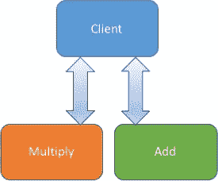
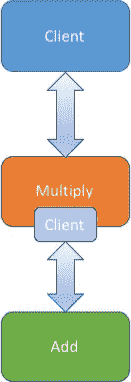
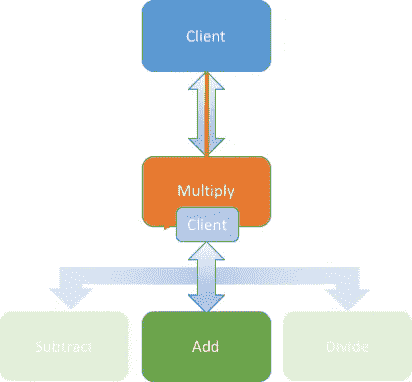
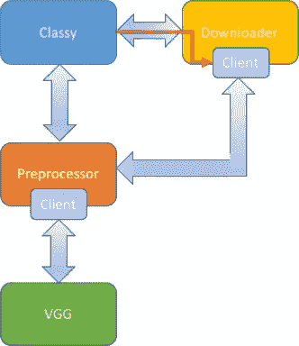

# 机器学习模型管道:第二部分

> 原文：<https://medium.com/hackernoon/machine-learning-model-pipelines-part-ii-23ebd1e6b714>


[本系列的第一部分](/@vishvananda/machine-learning-model-pipelines-part-i-e138b7a7c1ef)使用了一个名为 Classy 的应用程序的真实示例后端来展示 ML 模型管道的优势。它解释了将组件排序到管道中的三种架构。

在这篇文章中，我们探索用 [GraphPipe](https://oracle.github.io/graphpipe) 和 go 实现这些管道的本质细节。为了保持代码简单，我们将从用玩具模型实现三个基本架构开始，然后展示第一篇文章中经典后端的完整实现。

## 基本设置

你可以在 [GitHub](http://github.com/vishvananda/pipeline) 上找到所有的代码示例，但是玩具模型的相关代码包含在下面。为了避免您自己构建示例，我还将包含所有客户端和服务器的容器上传到了 [DockerHub](https://hub.docker.com/r/vishvananda/pipeline/) 。整篇文章中的灰色文本显示了如何使用这些容器运行示例。

首先，让我们在 go 中设置几个非常简单的 GraphPipe 服务器。我们所有的服务器示例都将使用相同的 main 函数；只有`apply`方法不同。以下是我们所有服务器的导入和主要功能:

`gp.Serve()`方法反思了我们的 apply 方法的类型，并为我们将所有的东西粘在一起。我们的服务器接受一个参数，这个参数是监听的端口。第一个服务器将接受一个二维的浮动数组。它会将数组中的每个浮点值乘以 2。以下是第一台服务器的应用方法:

第二台服务器非常相似，但它将每个值加 1，而不是乘以 2:

现在，我们可以在端口 3000 上运行乘法模型，在端口 4000 上运行加法模型。您可以运行我的容器化服务器，如下所示:

```
SRV=multiply
ID1=`docker run -d --net=host --rm vishvananda/pipeline:$SRV 3000`SRV=add
ID2=`docker run -d --net=host --rm vishvananda/pipeline:$SRV 4000`
```

## 客户端排序



第一部分[中讨论的第一种排序是客户端排序。正如所料，这将序列逻辑放入了客户端。我们只需让客户端按顺序执行对乘法和加法模型的请求:](/@vishvananda/machine-learning-model-pipelines-part-i-e138b7a7c1ef)

要运行该示例的容器化版本:

```
CLIENT=client-sequencing-client
docker run --net=host --rm vishvananda/pipeline:$CLIENT
# Output:
# [[0 1] [2 3]]
# [[0 2] [4 6]]
# [[1 3] [5 7]]
```

请注意，我们也可以使用 python 客户端，它会给出相同的结果:

## 服务器排序



讨论的第二个架构是服务器排序。在这个版本中，multiply 模型有一个客户端，作为其计算的一部分，它使用该客户端与 add 模型进行通信。为了说明服务器排序，我们需要制作这个新版本的 multiply 模型，它调用 add。下面是一个新服务器的代码:

注意，添加模型的位置是硬编码的。我们还需要一个只向第一个模型发出请求的新客户端:

现在，我们可以运行新的 multiply 服务器来代替旧的服务器，并对其发出请求:

```
docker stop $ID1
SRV=server-sequencing-server
CLIENT=server-sequencing-client
ID1=`docker run -d --net=host --rm vishvananda/pipeline:$SRV 3000`
docker run --net=host --rm vishvananda/pipeline:$CLIENT
# Output:
# [[1 3] [5 7]]
```

## 混合测序



我们讨论的最后一种测序类型是混合测序。对于混合排序，我们的 multiply 服务器必须接受 config，告诉它下一个模型在哪里。 [GraphPipe 规范](https://oracle.github.io/graphpipe/#/guide/user-guide/spec)允许我们将任意配置数据传递给模型。对于内部客户端，我们使用对`gp.Remote()`的嵌入式调用，就像服务器排序一样:

这个版本和服务器排序版本之间唯一的区别是我们将配置值作为 uri 传递给`gp.Remote()`,而不是使用硬编码的值。我们修改后的客户端必须传递第二个模型的位置:

我们的新版本和以前的一样:

```
docker stop $ID1
SRV=hybrid-sequencing-server
CLIENT=hybrid-sequencing-client
ID1=`docker run -d --net=host --rm vishvananda/pipeline:$SRV 3000`
docker run --net=host --rm vishvananda/pipeline:$CLIENT
# Output:
# [[1 3] [5 7]]
```

## 实施优等



现在您已经有了用玩具模型实现这些架构的感觉，我们可以开始玩 Classy 的完整实现了。这个例子的代码在[的同一个库](http://github.com/vishvananda/pipeline)中。这个模型使用了三个服务器组件:[下载器](https://github.com/vishvananda/pipeline/tree/master/downloader)、[预处理器](https://github.com/vishvananda/pipeline/tree/master/preprocessor)和 [vgg](https://github.com/vishvananda/pipeline/tree/master/vgg) 。vgg 容器使用 graphpipe-tf 模型服务器来服务用 tensorflow 构建的 vgg 的实现，但是下载器和预处理器看起来与上面的玩具服务器非常相似。

尽管这个实现展示了一个具有日志记录、超时、错误处理和并发性的更复杂的系统，但该架构仍然使用我们已经看到的排序变体:下载器使用混合排序，预处理器使用服务器排序。

要运行这三个组件，您可以使用 DockerHub 中的预构建容器:

```
docker stop $ID1
docker stop $ID2# NOTE: vgg requires 10G+ of RAM. For small machines or VMs,
#       try the squeezenet implementation further down
SRV=vgg
ID1=`docker run -d --net=host --rm vishvananda/pipeline:$SRV`SRV=preprocessor
ID2=`docker run -d --net=host --rm vishvananda/pipeline:$SRV`SRV=downloader
ID3=`docker run -d --net=host --rm vishvananda/pipeline:$SRV`
```

为了使我们的实现简单，我们的 Classy 客户端也是一个 go 应用程序。正如[你可以看到的](https://github.com/vishvananda/pipeline/blob/master/classy/main.go)，代码非常短，所以很容易包含在本地移动应用程序中。Classy 客户端允许您传入本地图像或 URL，并为每个传入的图像返回一个类。要使用它，只需将文件名或 URL 作为参数传递。注意，客户端不支持混合 URL 和文件名。以下是发送 url 的示例:

```
DOMAIN=https://farm8.staticflickr.com
IMAGE=7457/16344626067_1e89d648a6_o_d.jpg
ARGS=$DOMAIN/$IMAGE
docker run --net=host --rm vishvananda/pipeline:classy $ARGS
# Output:
# image 0 is class 235: German shepherd, German shepherd dog, German
# police dog, alsatian
```

这里是一个本地文件的例子:

```
wget -nc $DOMAIN/$IMAGE -o shepherd.jpg
ARGS=images/shepherd.jpg
MNT="-v $PWD:/images/"
docker run $MNT --net=host --rm vishvananda/pipeline:classy $ARGS
# Output:
# image 0 is class 235: German shepherd, German shepherd dog, German
# police dog, alsatian
```

为了展示部署的灵活性，我们可以通过更改模型服务器和预处理器，用 squeezenet 实现替换我们的 vgg 实现:

```
docker stop $ID1
docker stop $ID2SRV=squeeze
ID1=`docker run -d --net=host --rm vishvananda/pipeline:$SRV`SRV=preprocessor-squeeze
ID2=`docker run -d --net=host --rm vishvananda/pipeline:$SRV`docker run $MNT --net=host --rm vishvananda/pipeline:$CLIENT
# Output:
# image 0 is class 235: German shepherd, German shepherd dog, German
# police dog, alsatian
```

如您所见，无论是下载器还是客户端实现都不需要改变来支持我们的新模型。我们的预处理器抽象使得客户端不必关心 squeezenet 使用通道优先数据排序期望不同的输入大小；它只是发送原始的 jpg 或 URL。

## 结论

本文通过用 [GraphPipe](https://oracle.github.io/graphpipe) 实现机器模型管道，使其理论具体化。当构建人工智能系统时，可重用的计算块是一个有价值的工具。随着越来越多的模型使用一致的接口进行部署，我们希望看到更复杂的管道出现。开始构建您自己的管道！