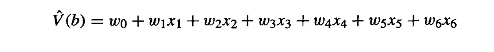
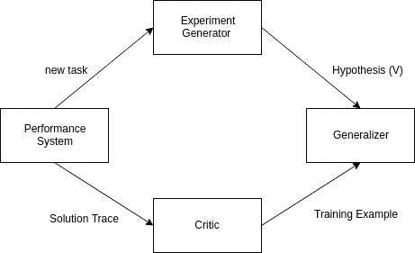

# 机器学习笔记 1

> 原文：<https://medium.com/hackernoon/machine-learning-notes-1-c496591f49b8>

## 来自机器学习——汤姆·m·米切尔

机器学习处于人工智能进步的最前沿。随着每天都有新的研究出来，它在快速发展。这个系列连同其他帖子包括了一些重要的概念和笔记，从基础知识到进阶，从本书 ***机器学习*** *，到作者* ***汤姆·米切尔*** *。并将在本书的每一章中更新。*

# 第一章:引言

# **1.1** 适定学习问题

> 如果计算机在任务 T 和性能测量 P 的某类任务中的性能(由 P 测量)随着经验 E 而提高，则称其从经验 E 中学习

*   学习识别口语，斯芬克斯系统
*   学习驾驶自动驾驶汽车，ALVINN 系统
*   学习分类新的天文系统，美国宇航局
*   学习玩世界级的双陆棋，TD-Gammon

**一道跳棋学习题:**

*   **任务 T** :玩跳棋
*   **表现 P** :战胜对手的胜率。
*   **训练经历 E** :和自己打练习赛。

**一道手写识别学习题:**

*   任务 T: 识别和分类图像中的手写单词。
*   表现 P: 单词分类正确的百分比。
*   **训练经验 E :** 带分类的手写单词数据库。

# **1.2** 设计学习系统

**1.2.1 选择培训经历**

我们的系统将从中学习的培训经历的类型。

培训经历的类型对学习者的成败起着重要的作用。

*   **一个关键属性**是培训经历是否为绩效系统做出的选择提供了直接或间接的反馈。
*   **训练经验的第二个关键属性**是学习者对训练样本序列的控制程度。
*   **训练经验的第三个关键属性**是它如何很好地代表了最终系统性能 P 必须被测量的例子的分布。

为了定义培训体验，我们必须选择

1.  要学习的确切知识类型。
2.  这种目标知识的表示。
3.  学习机制。

**1.2.2 选择目标功能**

确定将要学习的确切知识类型，以及绩效计划将如何使用这些知识。

让我们从机器人可以采取的法律行动开始。合法的移动是我们的机器人(模型)可以采取的正确的移动。现在，机器人需要学会在这些合法的行动中选择最佳的行动。

让我们调用这个函数 **ChooseMove** ，它为机器人选择最佳移动。

**选择移动:M→B**

其接受输入，合法移动集合 M，并输出最佳移动 B

为了让 ChooseMove 性能 P 更好的体验 E，我们设置了一个数值分数为 **TargetFunction(V)** 。

**目标函数(V): B → R**

V 将任何最佳移动映射到某个真实值 R，并打算为这个目标 V 分配更高的分数给更好的棋盘状态。

即，

*   如果 b 是最终状态，**赢了**，V(b) = 100
*   如果 b 是最终状态，**丢失**，V(b) = -100
*   如果 b 是最终状态，**画出**，V(b) = 0
*   如果 b 是最终状态，V(b) = V(b ')

其中 b’仍是仍能达到的最佳状态。

**1.2.3 选择目标函数的表示**

我们可以使用与合法移动的特征相匹配的规则集合，或者预定义移动的二次多项式函数，或者人工神经网络来表示 V。

因此，我们的学习程序可以将 V^(b 表示为线性函数:

w =数值系数

x =合法移动

**1.2.4 选择函数逼近算法**

每个训练示例都是形式为 **< b，V train 7(b) >** 的有序对

**1.2.5 估计训练值**

将任何中间板状态 b 的<v train="">的训练值指定为<v>，其中 V^是 bot 对 v 的正确近似值</v></v>

后继者(b)，跟随 b 的下一步棋。

这可以概括为:

**V 火车(b)←v^(successor(b)**

**1.2.6 调整重量**

定义最佳假设或一组权重或方法是调整权重以最小化训练值和由假设 V^.预测的值之间的平方误差 e

## 完工图纸

# 1.3 机器学习的观点和问题

**1.3.1 视角:**

> 它包括搜索一个非常大的可能假设空间，以确定最符合观察数据的假设。

**1.3.2 问题:**

*   哪种算法对哪种类型的问题和表现最好？
*   多少训练数据是足够的？
*   即使先验知识只是近似正确，它也能有帮助吗？
*   选择有用的下一次培训经历的最佳策略。
*   系统应该尝试学习什么特定功能？
*   学习者如何自动改变其表征以提高其表征和学习目标函数的能力？

*记得给这个帖子一些*👏*如果你喜欢的话。关注我了解更多内容。*