# 机器上的机器学习:构建评估 CPU 性能的模型

> 原文：<https://medium.com/hackernoon/machine-learning-on-machines-building-a-model-to-evaluate-cpu-performance-d43528f6075a>

如果我们可以训练一个机器学习模型来预测机器的性能，那岂不是很酷？在这篇文章中，我们将看看我使用 [BQML](https://cloud.google.com/bigquery/docs/bigqueryml-intro) 构建的线性回归模型，以预测给定硬件和软件规格的机器的性能。

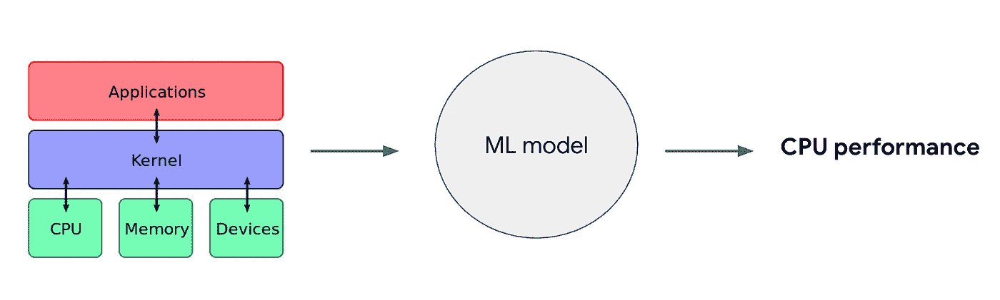

我做的所有工作都与软件相关，所以我很少考虑运行我的代码的硬件——这给了我一个了解硬件方面的机会。

# **数据集:规格**

为了训练这个模型，我使用了来自 [SPEC](https://www.spec.org/) *的数据，这是一个开发评估计算机性能和能效工具的组织。他们公布了一系列来自 2017 年的[基准测试结果，其中他们使用了 43 种不同的测试来评估特定硬件的性能。他们的基准分为 4 类:整数和浮点测试，通过*时间*(称为 SPEC 速度)和*吞吐量*(称为 SPEC 速率)来衡量性能:](https://www.spec.org/cpu2017/results/cfp2017.html)

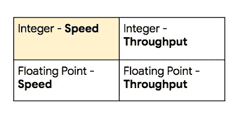

The four categories of SPEC 2017 benchmarks.

在这篇文章中，我将主要关注整数速度测试。

每个测试都包括运行测试的系统的硬件和软件规格，以及几个基准测试的结果。基准旨在模拟不同类型的应用程序或工作负载。

以下是[一次测试](https://www.spec.org/cpu2017/results/res2017q4/cpu2017-20171211-01438.html)的硬件和软件数据示例:

以下是针对上述系统的 SPEC 基准测试的子集:

为什么有这么多基准，它们都意味着什么？SPEC 的目标是评估各种常见工作负载下的机器性能，所有的[都在这里](https://www.spec.org/cpu2017/Docs/overview.html#Q13)列出。例如， [631.deepsjeng_s 基准测试](https://www.spec.org/auto/cpu2017/Docs/benchmarks/631.deepsjeng_s.html)评估运行 [alpha-beta 搜索算法](https://www.chessprogramming.org/Alpha-Beta)的机器在玩国际象棋游戏时的速度。SPEC 还具有针对其他 ML 工作负载、海洋建模、视频压缩等的基准。

# 硬件、软件和基准测试结果之间有关系吗？

简短的回答是——是的！但我想在天真地向模型中输入信息并抱最大希望之前确认这一点。

为了更仔细地查看数据，我编写了一个 Python 脚本，使用 [CPU2017 整数速度](https://www.spec.org/cpu2017/results/cpu2017.html#CINT2017_speed)结果解析每个测试的 CSV 文件。该脚本提取每个测试中使用的硬件和软件的数据，以及在该机器上运行的每个基准测试的分数。在脚本中，我首先用我想从每个测试中获取的数据初始化一个`dict()`:

然后，我使用上面字典中的键将标题行写入 CSV:

这里有一个[示例 CSV](https://www.spec.org/cpu2017/results/res2018q2/cpu2017-20180612-06943.csv) ，我将在脚本中对其进行迭代。下一步是遍历本地目录，在那里我保存了所有用于整数速度测试的 CSV 文件，并使用 Python `csv`模块读取它们:

这些文件不是典型的 CSV 格式，但它们都遵循相同的模式，因此我可以通过以下方式获取基准数据:

使用基准开始和结束索引，我可以迭代包含基准的 CSV 的行。然后，我寻找我在 CSV 中收集的具体数据点。下面是我获取供应商和机器型号名称的方法:

当我收集完所有机器规格后，我会创建一个 CSV 数据字符串，并将其写入我的文件:

有了 CSV 文件中的所有机器数据和基准测试分数，我使用 Python 笔记本和 matplotlib 来探索机器规格和基准测试结果之间的关系，以查看是否存在线性关系。在这里，我绘制了机器的名义速度和`631.deepsjeng_s`(阿尔法-贝塔搜索)基准:

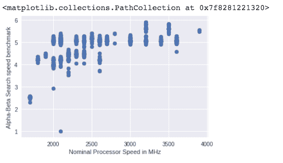

看起来我可以画一条线或曲线来粗略估计上面的关系。让我们看看另一个输入。这里是一个机器的内核数量和`631.deepsjeng_s`基准的图表:

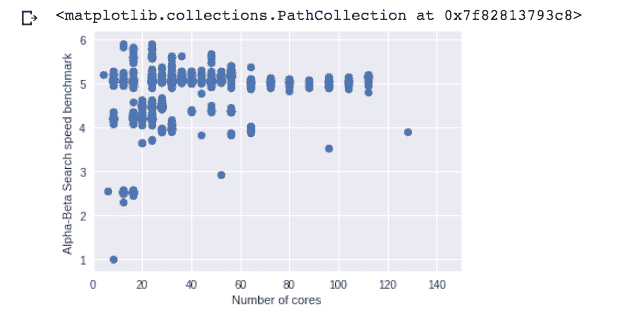

虽然输入和上面测量的基准之间存在一些关系，但很明显，我们不能使用单一特征(如内核数量)来准确预测机器的速度。影响机器性能的因素有很多，为了充分利用这些因素，我们将构建一个线性回归模型来评估机器的速度。以下是我们将用作输入的内容:

```
- The hardware vendor
- The machine model name
- Nominal and max speed of the microprocessor in MHz
- Number of cores
- Number of memory channels
- Size of L1, L2, and L3 caches
- Memory in GB
- Memory speed
- The OS running on the system
- The compiler being used
- The company running the test (Lenovo, Huawei, Dell, etc.)
```

线性回归模型通常输出单个数值，因此我们需要创建单独的模型来预测每个基准分数。需要注意的是，并非所有的输入都是数字——供应商名称、型号名称和操作系统名称都是分类的字符串输入。因为线性回归模型需要数字输入，所以我们需要一种方法，在将它们输入模型之前，将它们编码为整数。

# **用 BigQuery 机器学习建立线性回归模型**

我们可以手动编写线性回归模型的代码，但是我更喜欢关注由我的模型生成的预测，而不是模型代码的细节。 [BigQuery 机器学习](https://cloud.google.com/bigquery/docs/bigqueryml-intro) (BQML)对于这项工作来说是一个很棒的工具。如果我用我的输入数据和基准创建一个 BigQuery 表，我可以编写一个 SQL 查询来训练一个线性回归模型。BQML 将处理底层模型代码、超参数调优、将我的数据分成训练集和测试集，以及将分类数据转换成整数。

因为我已经获得了 CSV 格式的模型数据，所以我可以使用 BigQuery web UI 将这些数据上传到一个表中。下面是该表的模式:

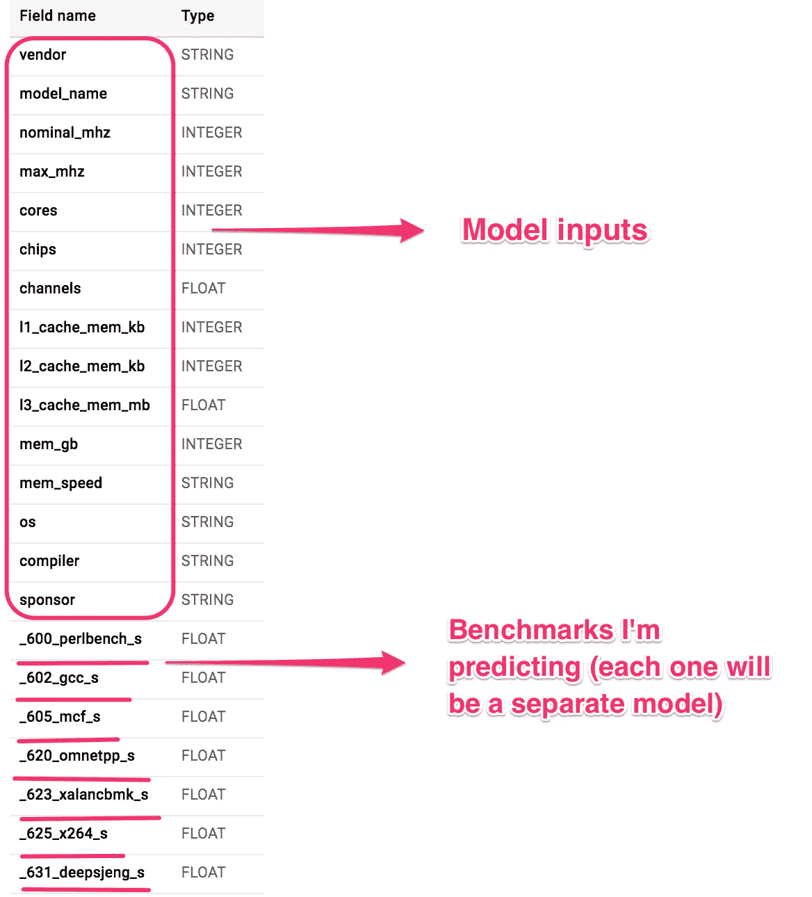

这是数据的预览:

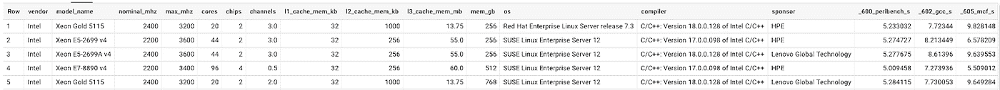

为了了解我们正在处理的一个分类特征，让我们看一下表中的`sponsor`字段，它指的是进行单独测试的公司。下面是我们将运行的查询，以获得按测试主办方分类的数据:

结果是:

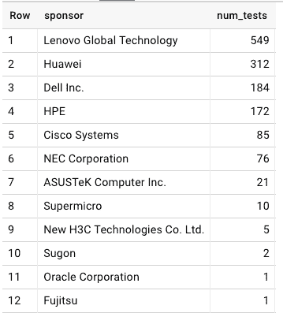

以下是测试中使用最多的操作系统:

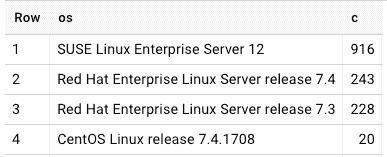

我可以用 BQML 中的一个 SQL 查询来训练我的模型:

这花了 1 分 14 秒来训练。完成后，我可以查看每次训练的统计数据:

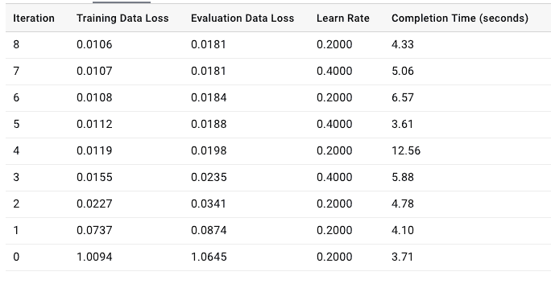

Loss metrics for each epoch of training in BQML

我在这里要关注的数字是*评估数据损失* —这是在每次迭代训练后计算的损失度量。我们可以看到，从第一次迭代到最后一次迭代，它一直在稳步下降。为了获得额外的评估指标，我可以运行一个`ML.EVALUATE`查询。结果如下:

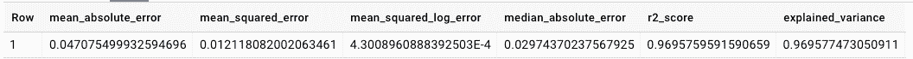

Evaluation metrics on my BQML model

均方误差(MSE)衡量我们的模型使用测试集预测的值与实际值之间的差异。您也可以将其视为您的回归(最佳拟合)线和预测值之间的距离。值越小越好，我们模型的`.0121` MSE 非常好。

由于这是一个回归模型(预测一个连续的数值)，了解其表现的最佳方式是评估模型预测值与实际基准分数之间的差异。我们可以通过一个`ML.PREDICT`查询来做到这一点。

当这个查询运行时，它将创建一个前缀为`predicted_`和标签列名称的新字段(在本例中为`_631_deepsjeng_s`)。让我们在原始数据集上运行`ML.PREDICT`,并输出被测系统的一些特性、实际速度测试结果和预测基准:

我们的预测与实际得分值非常接近！

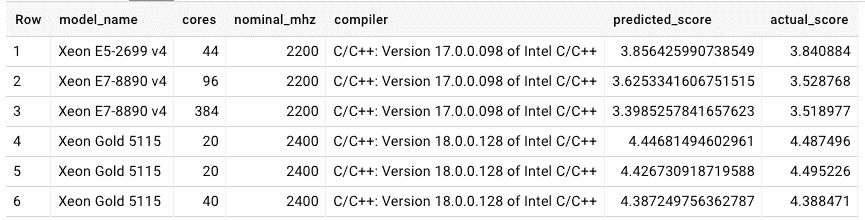

为了用另一种方法来衡量这一点，我们可以从实际得分中减去预测得分，然后得到这些差异的绝对值的平均值:

平均而言，我们模型的预测与原始值只相差 0.04——相当令人印象深刻。

# **根据新数据生成预测**

现在我已经有了一个经过训练的模型，我可以用它来预测一台机器的速度基准，这台机器不属于我的训练集，使用下面的查询:

该机器在`631.deepsjeng_s`基准测试中的速度分数应为`5.19`。当我运行这个查询时，我的模型预测的`5.20`非常接近实际值。我现在可以使用这个模型来预测测试数据集中没有的硬件和软件规格的新组合。除了 alpha-beta 搜索基准之外，我还创建了其他整数速度基准的模型，这些模型具有与此类似的准确性——如果您对这些结果感兴趣，请告诉我，我可以分享详细信息。

因为我不必编写任何底层模型代码，所以我能够专注于特征工程和寻找正确的输入组合来构建高精度模型——感谢 BQML！

# **更多规格数据**

如果您对试验这些数据并创建自己的模型感兴趣，请查看这里的[整数速度基准测试结果](https://www.spec.org/cpu2017/results/cint2017.html)。同样值得注意的是，SPEC 有许多关于以前 CPU 基准测试的数据。 [2006 SPEC CPU 性能指标评测](https://www.spec.org/cpu2006/)拥有更多年的数据(尽管 SPEC 已经淘汰了这组数据)，因此您可以使用类似的方法训练一个模型来预测旧机器的性能。

这篇文章关注的是整数速度基准。我在这里没有包括其他规格基准(浮点速度和吞吐量)，因为它们在线性回归模型中表现不佳(MSE 在 100 左右，相比之下，整数速度模型中的 MSE 小于 0.1)。我计划使用其他类型的模型来试验这些测试，敬请关注:)

除了 SPEC 之外，您还可以使用许多其他性能基准，如 [LINPACK](https://www.top500.org/project/linpack/) ，它被 [Top 500](https://www.top500.org/) 所使用。

# **有反馈？**

这是我第一次涉足硬件性能数据，所以我希望您对我用作输入的功能、尝试的其他类型的模型或其他任何东西有任何反馈。请在下面留言或在 Twitter 上找到我，地址是 [@SRobTweets](https://twitter.com/srobtweets) 。

如果你想了解更多关于 BQML 的知识，我的队友们有一些很棒的帖子:[这篇](/@hoffa/when-will-stack-overflow-reply-how-to-predict-with-bigquery-553c24b546a3)介绍了预测堆栈溢出响应时间，而[这篇](https://towardsdatascience.com/how-to-train-and-predict-regression-and-classification-ml-models-using-only-sql-using-bigquery-ml-f219b180b947)将带你构建一个模型来预测航班延误。

*感谢这些牛逼的人的贡献和反馈:* [*布莱恩·康*](https://twitter.com/brianchunkang) *，* [*谢恩·格拉斯*](https://twitter.com/shanecglass) *，* [*阿布舍克·卡什叶*](https://twitter.com/abhi_kash) *，* [*埃里克·范·亨斯伯格*](https://twitter.com/_ericvh) *，* [*乔恩·马斯特斯*😀](https://twitter.com/jonmasters)

*********************

*数据来源:[https://www.spec.org/cpu2017/results/cint2017.html](https://www.spec.org/cpu2017/results/cint2017.html)2018 年 11 月 11 日检索的数据。规范合理使用规则:[https://www.spec.org/fairuse.html](https://www.spec.org/fairuse.html)