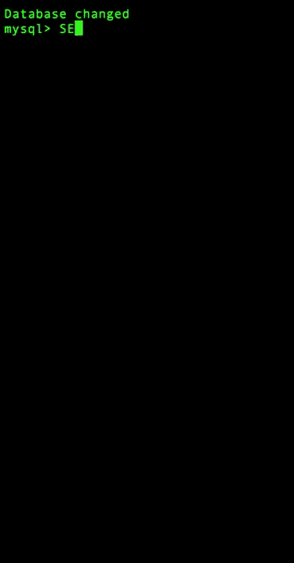
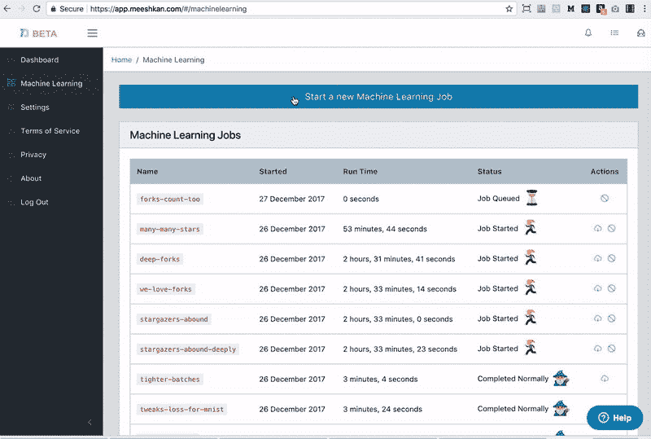
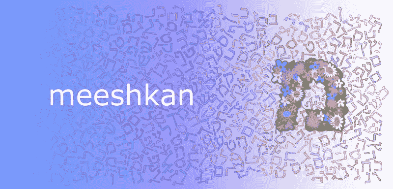

# 使用 Meeshkan 对 GitHub API 进行机器学习

> 原文：<https://medium.com/hackernoon/machine-learning-the-github-api-with-meeshkan-cec929c4d16a>

## 黑客正午的读者们，新年快乐！

我们自豪地宣布，我们已经完成了第一门名为 [**Meeshkan:机器学习 GitHub API**](https://www.udemy.com/meeshkan-machine-learning-the-github-api) 的全长课程。该课程可在 [Udemy](https://www.udemy.com/meeshkan-machine-learning-the-github-api) 上获得，你可以免费学习。

[](https://www.udemy.com/meeshkan-machine-learning-the-github-api/) [## 米什坎:机器学习 GitHub API | Udemy

### 了解如何在 AWS 和 Meeshkan 上计划、部署和运行机器学习问题-免费课程

www.udemy.com](https://www.udemy.com/meeshkan-machine-learning-the-github-api/) 

教程的基本思想如下。假设你是一名风险投资家或人才猎人，或者你为开发者提供服务，你想在 GitHub 上发现令人兴奋的新项目并投资，或者雇佣作者，或者建立合作关系。什么类型的项目会真正起飞？也许机器学习可以用来帮助我们磨练对 GitHub 上项目的直觉。


Meeshkan has a crush on the Octocat.

言归正传，在本教程结束时，您将看到*【drumroll】***密集、完全连接的神经网络比 forks 更快地了解恒星，并且当测量实际和预测恒星计数之间的均方损失时，模型表现得令人惊讶，此外，对于超过特定阈值的恒星计数，分类交叉熵** *。*这甚至是在引入满足标准来解释一些目标的偏斜分布之后(即`stars > 80000 ? 1 : 0`的阈值将只有少数项目属于`1`类别，而我们这些凡人则与`0`们混在一起)。我们解决这个问题的方法是，向 Meeshkan 提供许多不同的 [webhooks](https://github.com/Meeshkan/github-tutorial-webhook) ，这些 webhooks 为从 [GitHub API](https://developer.github.com/v3/) 收集的数据 [提供服务，将各种](https://github.com/Meeshkan/github-tutorial-stack) [Keras](https://keras.io/) [模型](https://github.com/Meeshkan/github-tutorial-models)上传到 [Meeshkan](https://app.meeshkan.com) ，并将结果传递到[小型 express 服务器](https://github.com/Meeshkan/data-visualizer)，以便可视化我们的模型是如何执行的。


Results displayed on our data visualize, which you can find at [https://github.com/meeshkan/data-visualizer.](https://github.com/meeshkan/data-visualizer.) Our model learns pretty darn fast but then plateaus. Epochs on the X axis, loss on the Y axis. I ran a first batch on a dataset with around 200 000 datum, which was obviously overkill. The lowest line is predictions for a higher star-count (0 for under 1500, 1 for over), whereas the upper two are for 300 stars.

该课程需要一天左右的时间来完成，到最后，您不仅完成了一些机器学习，还将为 Amazon Web Services 部署一个完整的环境，该环境将自动接收公开可用的 API 数据以进行机器学习。如果你想修改教程来学习互联网上数百个开放 API 中的一个，那就去做吧！我很高兴看到你学到了什么:-)

在本文中，我想谈谈本教程的制作过程，特别是揭示我在使用 Meeshkan 分析公共 API 上的大型数据收集项目的结果时学到的一些有趣的东西。

# 308 550

这是 Amazon 上产生的用于分析和检查 GitHub API 的 EC2 `t2.micro`服务器实例的数量。该批收集了 995 977 个回购和 14 329 073 个提交的数据。一台服务器的平均寿命是 203.45 秒，我们每台服务器每小时出价 0.0040 美元。所以，当你计算时，308550 * 203.45 * 0.0040/3600 = 69.75 美元来收集所有的数据。我让作业运行这么长时间的主要原因是因为部分设置(EC2、GitHub、MySQL、教程的代码)有时会出乎意料地中断，这意味着您不会获得进行机器学习所需的提交次数。例如，数据库中只有 125 082 个回购具有 5 0 次以上的提交。如果我跑了:

```
SELECT full_name, stargazers_count, COUNT(*) AS commit_count FROM repos JOIN commits on repos.id = commits.repo_id GROUP BY repos.id ORDER BY commit_count ASC, stargazers_count DESC LIMIT 5;
```

我明白了:

```
+--------------------+------------------+--------------+
| full_name          | stargazers_count | commit_count |
+--------------------+------------------+--------------+
| impress/impress.js |            32868 |            1 |
| Automattic/kue     |             6852 |            1 |
| cdnjs/cdnjs        |             5801 |            1 |
| square/cube        |             3871 |            1 |
| enyojs/enyo        |             1941 |            1 |
+--------------------+------------------+--------------+
5 rows in set (7.51 sec)
```

换句话说，误报，因为没有一个回购只有一次提交。但即使我们只研究超过 20 次提交的回购，10 万个数据点也足以让我们起步。



Our database is ingesting a blazing 40 repos per second and around 1000 commits per second! You’ll learn how to deploy this setup in a few clicks on the [Udemy](https://www.udemy.com/meeshkan-machine-learning-the-github-api) tutorial.

此外，还有一些有趣的未加工钻石。命令:

```
SELECT full_name, size, stargazers_count FROM repos WHERE size = 2 ORDER BY size ASC, stargazers_count DESC LIMIT 5;
```

产量:

```
+-------------------------------+------+------------------+
| full_name                     | size | stargazers_count |
+-------------------------------+------+------------------+
| atg/chocolat-public           |    2 |              197 |
| edankwan/Jesus.js             |    2 |              114 |
| bancek/django-smtp-ssl        |    2 |               84 |
| boucher/stripe-webhook-mailer |    2 |               81 |
| tlatsas/bash-spinner          |    2 |               50 |
+-------------------------------+------+------------------+
5 rows in set (0.45 sec)
```

是的，[https://github.com/edankwan/Jesus.js](https://github.com/edankwan/Jesus.js)确实是一个回购，是的，它几乎没有什么，是的，它已经设法积累了 114 颗星。实际上，现在是 115 个，其中一个来自我:-)

如果你没有遵循 Udemy 上的教程，并且至少拥有 JavaScript 和 AWS 基础设施的黄带，你可以在[https://github.com/meeshkan/github-tutorial-stack](https://github.com/meeshkan/github-tutorial-stack)只需点击几下鼠标就可以自己完成部署。欢迎拉请求！

# 73

这是我传递给 Meeshkan 以获得本教程结果的 webhooks 的数量。因为 webhook 基于路径动态生成数据，所以保持模型不变但改变 webhook 确实很容易。



A screencast as I was putting together the tutorial— launching a (batch) job in Meeshkan takes less than 30 seconds!

例如，通过改变 webhook 中的一个参数，可以使用相同的模型来分析在 3 或 10 个提交窗口中有多少不同的作者。模型一点都没变。对于每个 webhook，我上传了 3 到 5 个模型，它们都是并行运行的，所以我们可以在几分钟内看到第一个结果的下载图标，对于 Meeshkan network 非常合理的 0.08 美元/小时的价格，整个事情在几个小时内完成。

# 4

这是我能想到的在你完成课程后要做的事情的数量。

*   对于一个项目，我会选择只关注阈值在 1 000 颗左右的恒星，在这个范围内运行一些更深层次的神经网络。
*   我会用我的验证集来运行它，这真的很简单。我没有传递 webhook `tutorials.meeshkan.io/github/80_10_10_/train/...`，而是使用了`tutorials.meeshkan.io/github/80_10_10_/validate/...`，瞧，我们在验证集上。这样，我们将知道我们是否需要正则化我们的模型。因为你没有过早地正规化，对不对？对吗？？！？
*   我将获得更多的数据来查看稍微长一点的提交历史，并编写一个新的 Keras 模型，将提交视为一系列事件。
*   我会尽快将该模型的一个版本投入生产环境，并开始在新的 GitHub repos 上使用它。这样，如果我们认为模型的早期版本已经足够好，可以开始帮助我们做出商业决策，那么我们已经有一些预测在等着我们了。

不，等等，还有第五件事…你应该开一瓶上好的奔富格兰奇艾尔米塔什 1951，因为在你上完我们的 [Udemy](https://www.udemy.com/meeshkan-machine-learning-the-github-api) 课程后，你将会用你令人敬畏的人工智能忍者技能赚钱

# Meeshkan 上你自己的 API 爬虫

Meeshkan 公测版渴望做你的机器学习！我们是一家有着一颗大心脏的小公司，正在通过提供一个低成本的机器学习沙箱来挑战谷歌和亚马逊这样的公司，任何人都可以在这里探索新的想法。以下是登录 Meeshkan 后可以做的一些重要事情:

*   **部署 Udemy 教程资料**。遵循教程是很好的，在它的基础上更好。有无尽的超参数要调整。因此，一旦你完成了教程，调开！请记住:如果您不想了解完整的教程，您可以使用 webhook `https://tutorials.meeshkan.io/github/...`开始，其中`...`在教程的视频 3 中有解释，使用教程的视频 5 中的一个模型。
*   **预约聊天时间**。机器学习适用于所有人，而不仅仅是拥有大量资金的大公司，但有时入门可能会令人望而生畏。在你看完我们的教程后，我们希望你能有一些在 Meeshkan 上可以做的很酷的项目的想法。我们很乐意帮助您启动和运行！通过您的 [Meeshkan 仪表盘](https://app.meeshkan.com)或直接在[日历](https://calendly.com/meeshkan)上注册免费咨询。
*   **加入我们的 Slack 群**。你可以通过 Meeshkan 控制台或者使用[这个表格](https://mikesolomon.typeform.com/to/NVafQE)注册加入这个小组。

非常感谢您查看我们的机器学习服务。我们认为你会非常喜欢它，我们每天都在努力使它更快，更便宜，更容易使用。

我有没有提到你获得了 100 小时的免费机器学习和 15 分钟的免费咨询来让你的 ML 工作开始运行？**Meeshkan**见！

