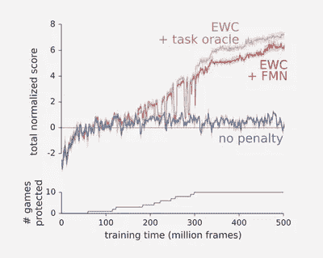

# 机器不学习:为什么遗忘可能是人工智能的关键

> 原文：<https://medium.com/hackernoon/machine-un-learning-why-forgetting-might-be-the-key-to-ai-406445177a80>

让我们面对现实吧——忘记事情真糟糕。令人沮丧的是，你不记得把钥匙放在哪里了，或者因为想不起刚刚在杂货店遇到的那个同事的名字而结结巴巴地说不出话来。然而，健忘是人类状况的核心，事实上，我们很幸运能够做到这一点。

对人类来说，遗忘不仅仅是记忆的失败；这是一个积极的过程，有助于大脑接受新信息并更有效地做出决定。

现在，数据科学家正在应用神经科学原理来改善机器学习，他们相信人类大脑可能掌握着开启图灵完全人工智能的钥匙。

根据最近发表在 [Neuron](https://www.cell.com/neuron/fulltext/S0896-6273(17)30365-3) 上的一篇论文，我们的大脑应该起到信息过滤器的作用。放入一大堆杂乱的数据，过滤有用的部分，然后清除任何不相关的细节，以便讲述一个故事或做出一个决定。不使用的部分会被删除，以便为新数据腾出空间，就像在电脑上运行磁盘清理一样。用神经生物学的术语来说，当神经元之间的突触连接随着时间的推移减弱或消除时，遗忘就会发生，随着新神经元的发育，它们会重新连接海马体的电路，覆盖现有的记忆([新图谱](https://newatlas.com/memory-forgetting-important-remembering/50154/))。

对人类来说，遗忘有两个好处:

1.  它通过减少过时信息对我们决策的影响来增强灵活性
2.  它防止过度适应特定的过去事件，促进一般化([神经元](https://www.cell.com/neuron/fulltext/S0896-6273(17)30365-3))

为了[有效地适应](https://hackernoon.com/damn-girl-youve-got-a-high-aq-ba71a5c9c7f6)，人类需要能够**战略性地忘记**。

## **但是电脑呢？**

这是人工智能面临的一大挑战——计算机的遗忘方式与人类不同。深度神经网络是一系列机器学习任务中最成功的技术，但它们不会像我们一样忘记。

让我们举一个简单的例子——如果你教一个说英语的孩子学习西班牙语，这个孩子会利用学习英语的相关线索将英语应用到西班牙语中——可能是名词、动词时态、造句——同时忘记不相关的部分——想想口音、喃喃自语、语调。孩子可以在策略性遗忘的同时逐渐学习和构建。

相反，如果一个神经网络被训练来学习英语，参数被调整来求解英语。如果那时，你想教它西班牙语，西班牙语的新适应将*覆盖*神经网络先前为英语获得的知识，有效地删除一切并重新开始。这被称为'**灾难性遗忘**'，而且“这是神经网络的根本局限之一”([深度记忆](https://deepmind.com/blog/enabling-continual-learning-in-neural-networks/))。

虽然这仍然是一个新的领域，但科学家们最近在探索如何克服这一限制的一些潜在理论方面取得了长足的进步。

# 教人工智能战略性遗忘:三种方法

## #1.长短期记忆网络(LSTM)

LSTMs 是一种类型的**递归神经网络**，它使用特定的学习机制来决定在任何时候记住哪些信息，更新哪些信息，以及关注哪些信息”( [Edwin Chen](http://blog.echen.me/2017/05/30/exploring-lstms/) )。

用一个电影类比来解释 LSTMs 的工作原理是最简单的:想象一下，一台计算机正试图通过分析以前的场景来预测电影中接下来会发生什么。在一个场景中，一个女人拿着一把刀——电脑会猜她是厨师还是杀人犯？在另一张照片中，一个女人和一个男人正在金色拱门下吃寿司——他们是在日本还是在麦当劳？也许真的是圣路易斯？

很难预测。

LSTMs 通过帮助神经网络 1)忘记/记住，2)保存和 3)集中来帮助这个过程:

1.  忘记/记住:“例如，如果一个场景结束，模型应该忘记当前场景位置、一天中的时间，并重置任何特定于场景的信息；然而，如果一个角色在场景中死亡，它应该继续记住他不再活着。因此，我们希望模型学习一种独立的*遗忘/记忆*机制:当新的输入进来时，它需要知道哪些信念应该保留或抛弃。”(埃德温·陈)
2.  保存:当模型看到一个新的图像时，它需要了解关于该图像的任何信息是否值得使用和保存。如果在某个场景中，这个女人走过一个广告牌——记住这个广告牌很重要吗？或者它只是一个噪音？
3.  焦点:我们需要记住电影中的女人是一位母亲，因为我们稍后会看到她的孩子，但在她不在的场景中这可能并不重要，所以我们不需要在那个场景中关注它。同样，并非存储在神经网络长期记忆中的所有内容都是直接相关的，因此 LSTM 有助于确定在任何给定时间关注哪些部分，同时保持所有内容安全存储以备后用。

## #2.弹性重量合并(EWC)

EWC 是 2017 年 3 月由谷歌 [DeepMind](https://deepmind.com/) 的研究人员创建的一种算法，它模拟了一种叫做**突触巩固**的神经科学过程。在突触巩固过程中，我们的大脑评估一项任务，计算用于执行该任务的许多神经元的重要性，权衡一些对正确执行该任务更关键的神经元。这些关键神经元被编码为重要的，不太可能在后续任务中被覆盖。同样，在神经网络中，多个连接(如神经元)用于执行一项任务。EWC 将一些连接编码为关键连接，从而保护它们不被覆盖/遗忘。

在下图中，你可以看到当研究人员将 EWC 应用于雅达利的一款游戏时发生了什么——蓝线是标准的深度学习过程，红色和棕色线是 EWC 辅助的:

blue line = standard deep learning, red & brown lines = improvements with the help of EWC

## #3.瓶颈理论

2017 年秋天，人工智能社区正在热议[纳夫塔利·提什比](http://www.cs.huji.ac.il/~tishby/)的一场演讲，他是来自耶路撒冷希伯来大学的计算机科学家和神经科学家，也是他所谓的瓶颈理论的证据。“这个想法是，一个网络从噪音输入数据中去除无关的细节，就像通过一个瓶颈挤压信息一样，只保留与一般概念最相关的特征”( [Quanta](https://www.quantamagazine.org/new-theory-cracks-open-the-black-box-of-deep-learning-20170921/) )。

正如 Tishby 解释的那样，神经网络在学习时会经历两个阶段— **拟合和压缩**。在拟合期间，网络标记其训练数据，在压缩期间，一个更长的过程，它“丢弃关于数据的信息，只跟踪最强的特征”([Qanta](https://www.quantamagazine.org/new-theory-cracks-open-the-black-box-of-deep-learning-20170921/))——那些将最有助于帮助它概括的特征。以这种方式，压缩是一种战略性遗忘的方式，操纵这个瓶颈可能是人工智能研究人员用来在未来构建更强神经网络的新目标和架构的工具。

> 正如 Tishby 所说，“学习最重要的部分其实是遗忘。”

## 我们的大脑和独特的人类过程，如遗忘，可能掌握着创造强大人工智能的地图，但科学家们仍在集体研究如何阅读这些指示。