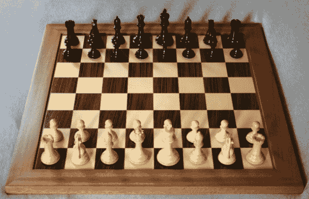
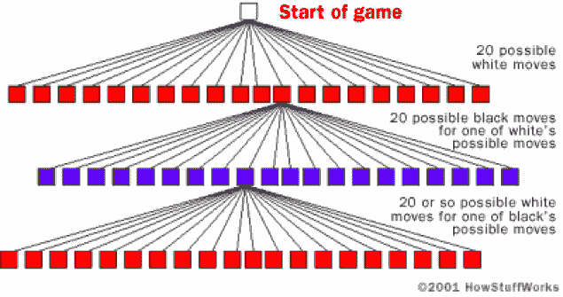
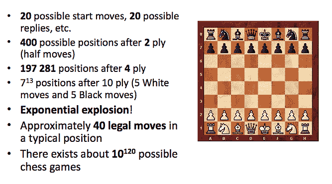
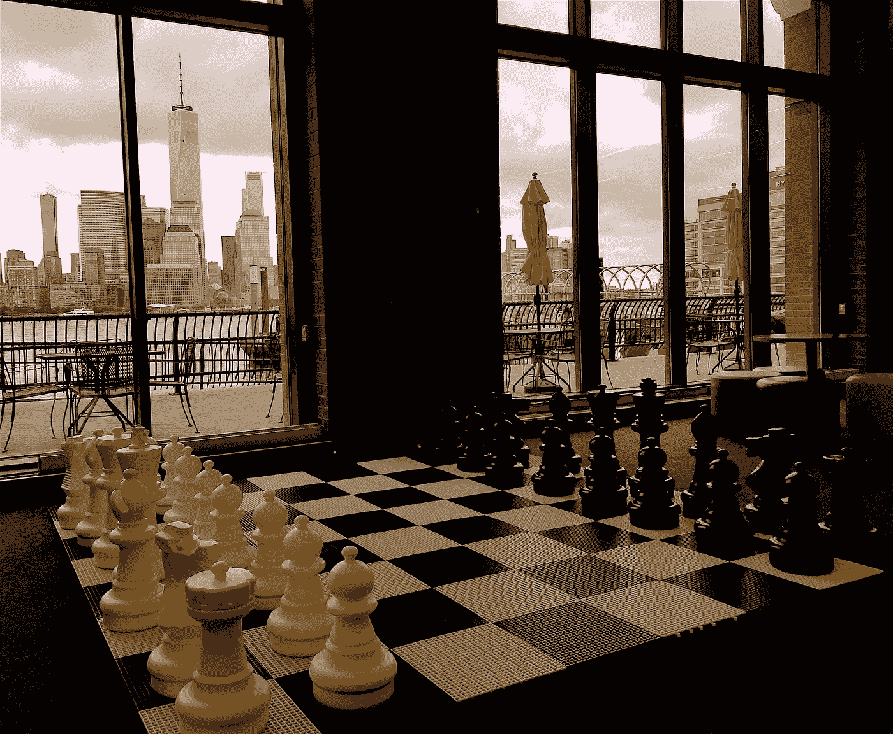

# 会玩的机器(建造象棋机器)

> 原文：<https://medium.com/hackernoon/machines-that-play-building-chess-machines-7feb634fad98>

**玩**系列的机器被分成了 7 个部分。这是本系列的第 2 部分。

这个系列涵盖了人工智能和游戏的历史(直到深蓝),并专注于下棋、跳棋和西洋双陆棋的机器。涵盖了以下主题:如何构建国际象棋机器、香农在国际象棋方面的工作、图灵在国际象棋方面的工作、土耳其人、El Ajedrecista、MANIAC、Bernstein 国际象棋程序、Samuel's checkers、Mac Hack VI、Cray Blitz、BKG、HiTech、Chinook、Deep think、TD-Gammon 和深蓝。

第一部分:[会玩的机器(概述)](/@reasonets/machines-that-play-overview-7f670681ef6a)

第二部分:[会玩的机器(造象棋的机器)](/@reasonets/machines-that-play-building-chess-machines-7feb634fad98) —这个

第三部分:[会玩的机器(象棋——深蓝之前)](/@reasonets/machines-that-play-chess-9091671dbea8)

第四部分:[玩(深蓝)的机器](/@reasonets/machines-that-play-deep-blue-5a2af4e739f7)

第五部分:[玩的机器(后深蓝)](/@reasonets/machines-that-play-post-deep-blue-9246e906beb6)

*如果您想要前 5 个部分的摘要，重点是人的因素，请点击此处【链接即将推出】。*

第六部分:[玩(跳棋)的机器](/@reasonets/machines-that-play-checkers-10f7d4038956)

第 7 部分:玩(双陆棋)的机器

# 第二部分:[会玩的机器(建造象棋机器)](/@reasonets/machines-that-play-building-chess-machines-7feb634fad98)

它将涵盖 1)为什么我们要建立国际象棋机器，2)建立国际象棋机器的高层次战略和 3)从 20 世纪 40 年代到 90 年代在这个领域的进展。

# 为什么是象棋？

为什么会有人想教一台机器如何遵循一些人为的规则来移动棋盘上的一堆木块，唯一的目的是让一个特殊的木块拐弯？攻击并捕获卒子、骑士、主教和女王以最终将国王逼入无法逃脱的境地，这太人性化了。那些是*我们的*行动，也就是*我们的*目标和*我们*平衡战略和战术以适应它。那为什么要教机器下棋？

[象棋](https://en.wikipedia.org/wiki/Chess)是一种古老的游戏。人们认为它起源于东印度(280-550)。它在 9 世纪传到了西欧和俄罗斯，到了 1000 年，它已经传遍了整个欧洲。它变得流行起来，关于象棋理论(如何下棋)的著作在 15 世纪开始出现。

纵观历史，许多人对国际象棋及其与我们的智力和大脑的联系说过许多不同的话。

*   在启蒙时代，国际象棋被视为一种自我提高的手段。[班哲明·富兰克林(1750)](https://en.wikipedia.org/wiki/Benjamin_Franklin)*说过，下棋不仅仅是一种无所事事的娱乐；头脑中几种非常有价值的品质，在人类生活中是有用的，可以通过它来获得和加强，以便成为在任何情况下都准备好的习惯；因为生活就像一盘棋，在其中我们常常要赢得分数，要与竞争者或对手竞争，而且其中有各种各样好的和坏的事件，在某种程度上，这是谨慎的结果，或者是缺乏谨慎的结果。通过下棋，我们可以学到* : *I.* ***预见*** *，它看起来有点未来性，并考虑到一个行动可能带来的后果[……]，II。***，审视整个棋盘，或行动场景:——几个棋子的关系，以及它们的处境[……]，三。* ***谨慎*** *，不可操之过急……】**
*   **象棋是智力的试金石。*——[约翰·沃尔夫冈·冯·歌德(1749–1832)](https://en.wikiquote.org/wiki/Johann_Wolfgang_von_Goethe)*
*   *公众必须认识到国际象棋是一项暴力运动。下棋是精神折磨。”——[加里·卡斯帕罗夫(上世纪 90 年代)](https://en.wikiquote.org/wiki/Garry_Kasparov)*
*   *作为一名棋手，一个人必须能够控制自己的感情，一个人必须像机器一样冷静——[莱翁·阿罗尼安(2008)](https://en.wikipedia.org/wiki/Levon_Aronian) ( [采访](https://en.chessbase.com/post/aronian-i-have-a-lot-of-blood-in-my-brain-))*

*国际象棋一直被认为是智力游戏。许多人认为，一台能成功下棋的机器将证明思维可以被模拟/理解，或者机器可以被制造出来思考。这就是为什么人们想要建造一台机器，它可以遵循我们游戏中的一些任意规则，并变得如此擅长，以至于有一天它可以在游戏中击败 T42 和我们。*

*诺伯特·维纳在 1948 年出版的《控制论》一书中问*“是否有可能建造一台下棋的机器，这种能力是否代表了机器和大脑潜力之间的本质区别。**

*事实证明，我们将在 1997 年制造出一台成功的国际象棋机器，它将击败我们中最好的人，但它不一定有助于我们理解我们的思维——它的游戏方式将从非常像人类到几乎像外星人，它肯定会挑战我们对什么叫做智能的概念。*

# *玩游戏*

*国际象棋是两个玩家的零和游戏(即如果一个玩家赢了，那么另一个玩家输了)，具有完全信息(即玩家在每个时间都知道在任何给定点发生的所有移动)。*

*我们平时怎么玩这个游戏？我们执行以下操作:*

1.  *考虑一个玩家可以采取的所有合法行动*
2.  *计算每次移动产生的新位置*
3.  *评估以确定下一步最佳行动*
4.  *采取(最佳)行动*
5.  *等待对手采取行动*
6.  *通过重复上述步骤进行响应*

*从这个角度来看，几乎所有的象棋计算机都必须处理这些基本步骤。为此，国际象棋计算机必须解决以下关键问题:*

1.  *代表“董事会”*
2.  *生成所有合法的下一个状态*
3.  *评估职位*

*让我们详细看一下每一项:*

***表示“棋盘”**:象棋计算机需要表示棋盘和占据棋盘上方格的棋子，也就是说，它需要表示数据结构中的一个位置。有几种方法可以做到这一点——参见这里的[和](https://en.wikipedia.org/wiki/Board_representation_(chess))。*

**

*在讨论接下来的两个步骤之前，我们先来了解一下为什么建造一台象棋计算机很难。国际象棋计算机将接收给定的国际象棋位置作为输入，它需要计算下一步最好的棋。因为国际象棋的复杂性，这里有很多困难。*

1.  *每个玩家有 16 个棋子和 20 种可能的走法。*
2.  *假设白棋开始游戏——它有 20 种可能的走法(黑棋也有同样的选项——20 种可能的走法)。*
3.  *白棋的总移动次数= 20。*
4.  *走卒数= 8 + 8 = 16(一步) (两步)。*
5.  *骑士的招式= 2 + 2 = 4。*
6.  *总计= 20。*
7.  *因此，在 1: 20 的级别上，白棋可能会走几步。*
8.  *然后，在第 2 级:20 * 20 = 400 个可能的黑色移动，取决于白色的动作。*
9.  *第 3 级:白色 400 * 20 = 8，000。*
10.  *到了 4 级:黑色 8000 * 20 = 16 万……以此类推。*
11.  *对于所有可能的位置，计算机将需要评估 10^120 可能的移动！(旁注:围棋已~ 10^700 棋！！).巨大的！*

**

*[*HowStuffWorks*](https://electronics.howstuffworks.com/chess1.htm)*

*换句话说，*

**

*[*Complexity of a chess game*](https://www.uio.no/studier/emner/matnat/ifi/INF4130/h17/undervisningsmateriale/chess-algorithms-theory-and-practice_ver2017.pdf)*

*国际象棋的问题空间可以用博弈树来表示，其中节点代表棋盘位置，边代表合法的走法。一个游戏的完整游戏树是从初始位置(游戏开始)开始，包含每个位置所有可能的移动，到终点位置(游戏结束:赢/输/平)结束的树。但是国际象棋有大约 10^120 步(和 about10^40 节点)！！！因此，思考博弈树的最佳方式是将其视为一种理论上的构建(T1)——它(T2)无法在现实世界中实现(T3 ),它实在太庞大了。但是一个玩家(人或者电脑)还是需要找到一个好的走法。这意味着一台国际象棋计算机仍然需要搜索*一棵不太大的*树，但是仍然有足够的(相关)节点可以被检查，以允许它确定下一步“好”棋。*

*包括国际象棋在内的游戏难度很大，因为搜索树变得巨大无比。*

## *游戏复杂性*

*下面是一些衡量[游戏复杂度](https://en.wikipedia.org/wiki/Game_complexity)的方法。*

*游戏的**状态空间复杂度**是从游戏的初始位置可以到达的合法游戏位置的数量。*

***游戏树大小**是可以玩的游戏总数:以游戏初始位置为根的[游戏树](https://en.wikipedia.org/wiki/Game_tree)中的叶节点数。*

***分支因子**是每个节点的子节点数量。比如象棋，假设一个“节点”被认为是合法位置，那么平均分支因子估计在 35 左右。这意味着，平均来说，一个玩家每回合有 35 次合法的行动。相比之下，围棋游戏的平均分支系数是 250！*

***快速浏览一些常见游戏的游戏复杂度及其状态:***

***最佳**状态:不可能表现得更好(这些条目中的一些已经被人类解决了)*

*超级人类:表现比所有人类都好*

**

*Complexity of some games*

*那么，一台国际象棋计算机要打败世界冠军需要做些什么呢？*

*因此，好的游戏程序必须:1)修剪游戏树中不相关的分支，2)使用好的评估函数，3)尽可能多的向前看(尽可能快地*和*)。*

*特别是，国际象棋计算机需要做好以下工作:*

***生成所有合法的下一步状态:**国际象棋计算机需要知道如何识别可能的走法，并选择最有希望的走法进行进一步分析(即删除坏走法，保留好走法)。既然不切实际(其实不可能！)为了考虑每一个可能的走法，计算机必须通过使用**搜索技术**做出选择——这些是选择最佳走法的算法。这是许多早期人工智能创新发生的地方。例如，国际象棋计算机可以提前评估 2 或 5 或 10 或 20 步棋。它能够生成的树的深度取决于计算机的速度——计算机生成动作越快，性能就越好。因此强调计算能力。*

***评估位置:**一旦国际象棋计算机生成了树，它就需要评估位置。当搜索空间太大时，游戏树只能被创建到某一深度，即计算机不能预见所有可能的结束(赢/输/平)位置。相反，它必须向前看几层(半移动)并比较可能的位置，也就是说，它必须正确评估板位置的值，*假定*不会在该位置进行进一步搜索。这是通过**评估函数**完成的，该函数为这些板位置分配实数分数。这个评估函数(和算法)通常在不同的国际象棋程序之间有很大的不同。判断一个职位有多好是极其复杂的。例如，深蓝每秒检查 2 亿个位置，并使用非常复杂的评估-它有超过 8000 个特征作为其功能的一部分。*

*很多象棋电脑还增加了**残局数据库**。这些是顶级玩家数百(或数千或数百万)场过去比赛的预计算位置评估数据库。这些残局数据库将主要用于开局和残局。*

*开发国际象棋计算机有两种主要的哲学方法:仿真与工程——**计算机应该模仿人类的知识和决策，还是应该通过蛮力来改进搜索？那些专注于第一种方法的人会构建具有大量象棋知识而相对较少关注搜索的程序。那些关注工程方法的人将通过使用专用硬件和搜索创新来关注计算能力。我们会看到，最好的象棋计算机使用第二种方法，但即使他们最终使用了大量的象棋知识和复杂的评估试探法。***

*通读剩余部分时，请记住这个框架。*

*可选:以下是这方面进展的简要总结。关键事件。关键人物。重大发现。关键机器。其他部分的细节。*

# *20 世纪 50 年代:在非常基础的水平上演奏*

*在 20 世纪 50 年代，计算能力有限，因此机器只能在非常基础的水平上发挥作用。在这一时期，研究人员开发了评估棋位和寻找最佳可能走法的基本技术，考虑对手可能的反走法。这些思想至今仍在使用。*

*   *1949-1950 年，Claude Shannon 为**写了第一篇关于计算机国际象棋**的文章，题目是“给计算机编程下棋”。他描述了如何通过计算位置和选择下一步棋来给机器编程下棋。他的工作为计算机国际象棋的所有未来研究提供了一个框架。*
*   *1950 年，艾伦·图灵编写了第一个计算机国际象棋程序**。他是在电脑出现之前写的！他知道计算机即将到来，一旦它们足够强大，它们将能够下棋。同年，他提出了图灵测试。1951 年，图灵试图在 Ferranti Mark 1 计算机上实现他的程序“Turochamp”。他从未完成。***
*   *1952 年，编写了第一个计算机编译器的阿利克·格伦尼(Alick Glennie)打败了艾伦·图灵的国际象棋程序。他是第一个在国际象棋中击败计算机程序的人。*
*   *1956 年，Mark Wells 编写了一个程序来模拟“洛斯阿拉莫斯国际象棋”，这是一个没有主教的 6 X6 版本的国际象棋。这样，MANIAC 成为第一台运行国际象棋程序的计算机。花了 12 分钟搜索一个四步的深度(加上两个主教在同一深度搜索要花三个小时)。*
*   *1957 年，数学家亚历克斯·伯恩斯坦，IBM 的一名雇员，为 IBM 704 机器编写了第一个完整的国际象棋程序。该程序花了 8 分钟来搜索一个四步棋的深度，可以玩完整的国际象棋游戏。*
*   *搜索创新(1950):极大极小搜索(香农，图灵)*
*   *搜索创新(1956):阿尔法-贝塔修剪(麦卡锡)*

# *20 世纪 60 年代:人工智能的果蝇*

*20 世纪 60 年代，人工智能先驱希尔伯特·西蒙和约翰·麦卡锡将国际象棋称为“人工智能的果蝇”，这意味着国际象棋像普通的果蝇一样，代表了一个相对简单的系统，也可以用来探索更大、更复杂的现实世界现象。*

*到 20 世纪 60 年代末，计算机国际象棋程序已经足够好，可以偶尔击败俱乐部级别或业余选手。*

*   *1962 年，艾伦·科托克在约翰·麦卡锡的协助下开发了麻省理工学院的第一个国际象棋程序，现在被称为科托克-麦卡锡程序。该程序在 IBM 7090 上运行，根据情况的复杂程度，每次移动大约需要 5 到 20 分钟。这个程序可以打败业余棋手。冷战期间，Kotok-McCarthy 下了(也输给了)最好的俄罗斯象棋程序。*
*   *1965 年，理论和实验物理研究所的研究人员在莫斯科开发了一个国际象棋程序。1966 年，这个俄罗斯节目开始了与科托克-麦卡锡的比赛。这场比赛持续了九个月，俄罗斯队以 3-1 获胜。*
*   *1967 年，理查德·格林布拉特(Richard Greenblatt)的 Mac Hack Six(引入了换位表)成为第一个在锦标赛中击败一个人的程序。1965 年，休伯特·德莱弗斯说，“没有一个国际象棋程序能下哪怕是业余的国际象棋。”1967 年，Mac Hack VI 击败 Dreyfus。*
*   *1968 年，麦卡锡和米奇与大卫·利维(国际大师)打赌 1000 美元，说计算机会在 1978 年打败他。*
*   *搜索创新(1966):阿尔法-贝塔修剪(科托克，麦卡锡)*
*   *搜索创新(1967):转置表(马查克)*

# *20 世纪 70-80 年代:快速成长*

*在 20 世纪 50 年代和 60 年代，早期的先驱专注于国际象棋试探法(经验法则)来选择最佳的下一步棋。1970 年的程序也使用试探法，然而，有一个更强的重点是软件的改进和更快更专业的硬件。主要的国际象棋程序使用转置表(或哈希表),存储程序已经搜索过的位置信息。所以，如果到达了棋盘上的相同位置，程序就不需要再次搜索；它将使用先前生成的信息。这种定制的硬件和软件允许程序对博弈树进行更深入的搜索(涉及数百万个国际象棋位置)，这是人类没有做到的(因为他们不能)。*

*20 世纪 80 年代带来了一个低成本象棋电脑的时代。第一个基于微处理器的国际象棋程序开始变得可行。由于家用电脑和这些程序的存在，现在任何人都可以和机器下棋(并提高自己的水平)。到了 20 世纪 80 年代中期，基于微处理器的国际象棋软件的复杂程度有了很大提高，他们开始赢得比赛——既要对抗基于超级计算机的国际象棋程序，也要对抗一些顶级的人类棋手。*

*此外，还引入了几项搜索创新:迭代深化(向下搜索到游戏树的某一层)、开卷(包括专家认为对开始游戏有益的规则或走法序列)，以及残局数据库(包括对结束游戏有益的走法序列)。*

*   *1970 年，计算机械协会(ACM)组织了**首届北美计算机国际象棋锦标赛**。六个国际象棋项目参加了这次比赛。ACM 国际象棋比赛在 1995 年被取消，因为“深蓝”正在准备与国际象棋世界冠军加里·卡斯帕罗夫的对决。*
*   *1974 年，世界计算机国际象棋锦标赛(WCCC)开始了。十三个国际象棋程序参加了在瑞典斯德哥尔摩举行的第一届锦标赛。*
*   *1977 年，Chess 4.6 成为**第一台在大型国际象棋比赛中获胜的国际象棋计算机。***
*   *1977 年，国际计算机象棋协会(ICCA)由计算机象棋程序员成立。那一年，国际象棋大师迈克尔·斯蒂安成为第一位在闪电战比赛中输给国际象棋程序的国际象棋大师。在闪电战中，电脑击败国际象棋大师要容易得多。又过了 11 年，计算机才最终在一场规则比赛中击败特级大师。*
*   *1978 年:还没有机器能够击败利维(利维以 4.5–1.5 击败了国际象棋 4.7)。利维赢得了赌注，但一台机器赢得了有史以来第一场与他的比赛。*
*   *1981 年，克雷布利茨以完美的 5-0 比分和 2258 的成绩赢得了密西西比州冠军。在第四轮比赛中，它击败了 Joe Sentef (2262)成为**第一台在锦标赛中击败高手的计算机，也是第一台获得高手等级的计算机**。*
*   *1982 年，肯·汤普森(Ken Thompson)的硬件棋手贝尔(Belle)获得了美国大师赛冠军和 2250 分的成绩。(旁注:Ken Thompson 是 UNIX 操作系统的创造者)。*
*   *1983 年，1986 年:克雷布利茨(软件由罗伯特凯悦)连续获得世界计算机国际象棋冠军。*
*   *1985 年，Chiptest 由许凤雄、Thomas Anantharaman 和 Murray Campbell 建立。它使用了一种特殊的 VLSI 移动发生器芯片，每秒可以执行 50，000 次移动*
*   *1987 年，Chiptest-M 建成——chip test 团队清除了芯片中的错误。它现在每秒可以执行 50 万次移动。*
*   *1988 年:CMU 的汉斯·柏林尔在一场比赛中击败了特级大师阿诺德·登克。*
*   *1988 年，CMU 的 Hsu 和 Campbell 的 Deep think 与 Tony Miles 在软件工具锦标赛中获得第一名，领先于包括。它还在一场锦标赛中击败了特级大师本特·拉尔森，使**成为第一台在锦标赛中击败特级大师的计算机。它每秒可以执行 70 万次移动。它获得了 2745 的性能评级，这是电脑玩家获得的最高评级。IBM 接手了这个项目，并雇佣了幕后人员。***
*   *1989 年，深思输给了加里·卡斯帕罗夫两场表演赛。*
*   *搜索创新(1975):迭代-深化(国际象棋 3.0+)*
*   *搜索创新(1978):特殊硬件(百丽)*
*   *搜索创新(1983):平行搜索(克雷闪电战)*
*   *搜索创新(1985):平行评估(高科技)*
*   *速度进步(20 世纪 80 年代):在 20 世纪 80 年代，微型计算机每秒能执行 200 多万条指令。*

# *20 世纪 90 年代:童年的终结？*

*20 世纪 90 年代，国际象棋项目开始挑战国际象棋大师和后来的特级大师。这些程序更多地依赖记忆和蛮力，而不是战略洞察力，并且它们不断地开始击败最优秀的人类。1989 年，计算机国际象棋出现了一些戏剧性的时刻——两位广受尊敬的大师被 CMU 的“高科技”和“深度思考”击败。*

*研究人员认为机器最终可以打败国际象棋世界冠军。这引起了 IBM 的兴趣，所以他们在 1989 年开始致力于这项挑战，并建立了一个专门的国际象棋机器，命名为深蓝。1997 年，它最终击败了人类最优秀的棋手加里·卡斯帕罗夫。那么，它思考了吗？它聪明吗？*

*IBM 的研究人员被授予弗雷德金奖(Fredkin prize)，这是一个 10 万美元的奖项，奖励第一个击败世界象棋冠军的程序，该程序已经无人认领 17 年了。这场(以及后来的)计算机象棋胜利令许多人工智能研究人员失望，因为他们感兴趣的是建造通过“一般智能”策略而不是蛮力取得成功的机器。从这个意义上说，国际象棋已经开始与人工智能研究脱钩。*

*   *从 1991 年到 1995 年，IBM 开发了 Deep think II，这是深蓝的敲门砖。这是一个 24 处理器系统，Deep think 软件被重写以处理并行性。*
*   *1992 年，艾德·施罗德的 ChessMachine Gideon 3.1(一台微型计算机)在大型机、超级计算机和特殊硬件面前赢得了第七届世界计算机国际象棋冠军。*
*   *从 1992 年到 1998 年:国际象棋天才是由理查德·朗为各种处理器架构编写的一系列国际象棋引擎。1992 年发布的第一个版本是在 16 位 MS-DOS 下运行的 PC 程序。这些程序分别在 1984 年、1985 年、1986 年、1987 年、1988 年、1989 年、1990 年、1991 年和 1993 年获得了世界微机国际象棋冠军。*
*   *1993 年，高度专业化的国际象棋机器“深蓝”在与本特·拉尔森的比赛中连输四局。*
*   *1994 年，在英特尔大奖赛期间，由 Ossi Weiner 运营的国际象棋天才 3 在与加里·卡斯帕罗夫的一场速度国际象棋比赛(每方 25 分钟)中获胜，并在第二场比赛中打平，将卡斯帕罗夫淘汰出局。这是卡斯帕罗夫输给计算机的第一场比赛(国际象棋)。下一轮，国际象棋天才 3 号击败了普雷德拉格·尼科利奇，但随后输给了维斯瓦纳坦·阿南德。与运行在大规模并行定制硬件上的深蓝不同，ChessGenius 运行在早期的奔腾 PC 上。*
*   *1996 年，深蓝在与加里·卡斯帕罗夫(4-2)的六场比赛中失利:a)每个芯片每秒 160 万到 200 万个位置，b)系统每秒 5000 万到 1 亿个位置。*
*   *1997 年，深蓝(3.5–2.5)赢了加里·卡斯帕罗夫的六场比赛。卡斯帕罗夫输给深蓝是他一生中第一次在国际象棋比赛中失利:a)每个筹码有 200 万到 250 万个位置的增强国际象棋筹码，b)每秒 2 亿个位置。*
*   *速度进步(20 世纪 90 年代):到 20 世纪 90 年代，计算机每秒执行超过 5000 万条指令。*

***读到关于象棋机器直到深蓝第三部:** [**会玩的机器(象棋——深蓝之前)**](/@reasonets/machines-that-play-chess-9091671dbea8) **。***

***在这里阅读关于深蓝:第四部分:** [**【深蓝】**](/@reasonets/machines-that-play-deep-blue-5a2af4e739f7) **和第五部分:** [**玩(深蓝后)**](/@reasonets/machines-that-play-post-deep-blue-9246e906beb6)*

# *[**现在**](http://www.sciencemag.org/news/2016/03/update-why-week-s-man-versus-machine-go-match-doesn-t-matter-and-what-does) **:***

*   *没有人能平等地使用最好的计算机。我们(人类)发明、玩和理解国际象棋已经超过 1000 年了——机器出现还不到 60 年，它们比我们好得多。*
*   *加速进展(现在):我们的桌子和电话中的处理器每秒可以执行超过 10 亿条指令。*

**

*[Luke Muehlhauser Historical chess engines’ estimated ELO rankings](https://intelligence.org/wp-content/uploads/2015/05/Muehlhauser-Historical-chess-engines-estimated-ELO-ratings.pdf)*

**

*Chess (Jersey City)*