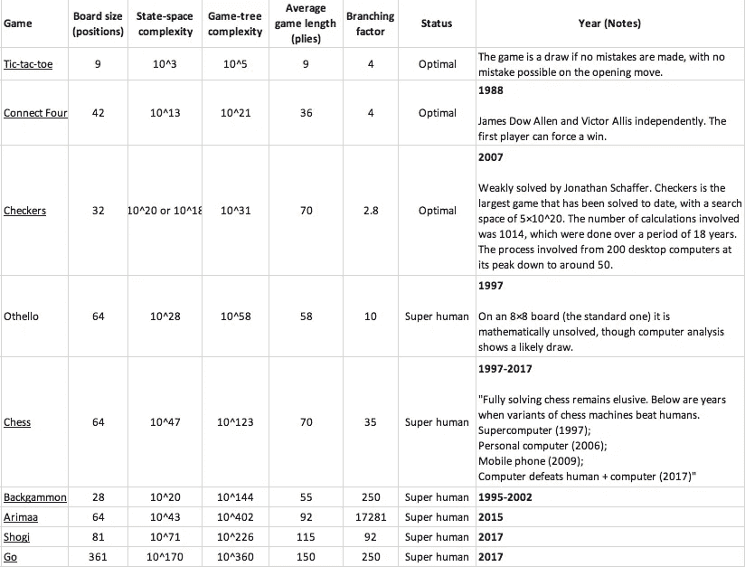
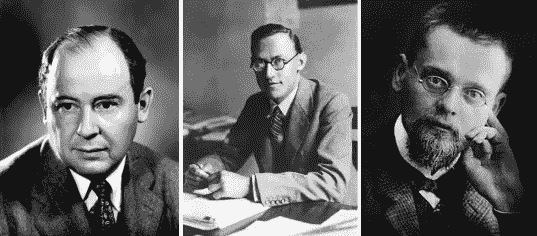
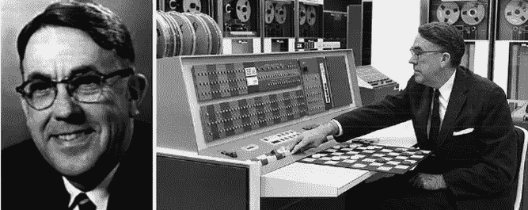
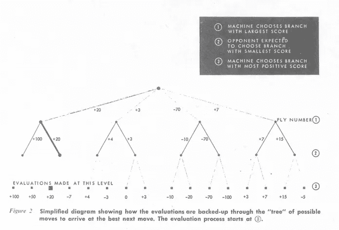
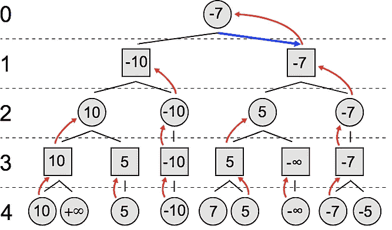
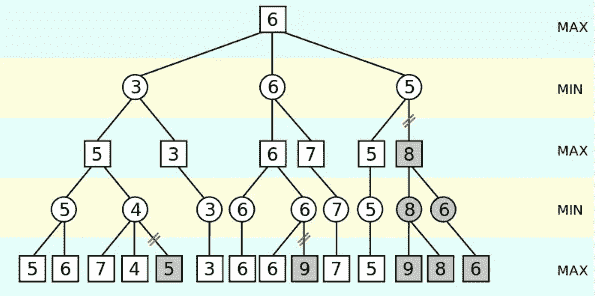
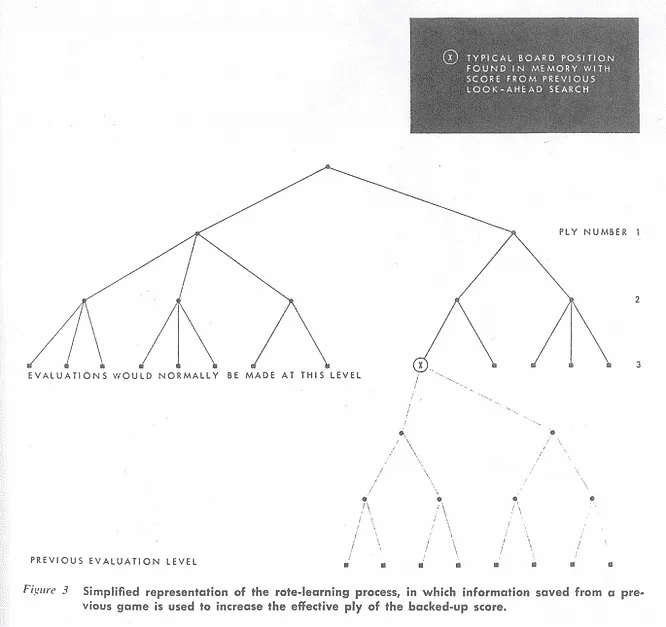
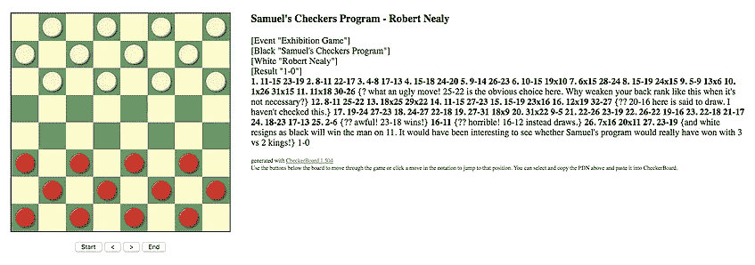
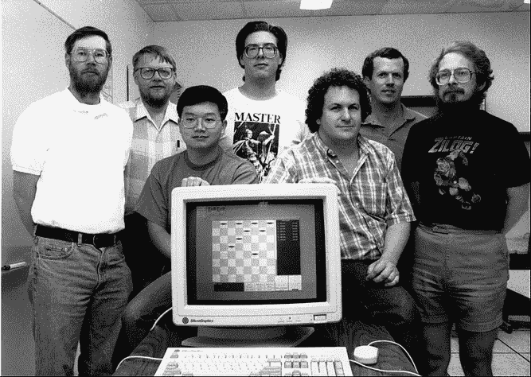

# 玩(跳棋)的机器

> 原文：<https://medium.com/hackernoon/machines-that-play-checkers-10f7d4038956>

玩系列的机器被分成了 7 个部分:这是该系列的第 6 部分。

这个系列涵盖了人工智能和游戏的历史(直到深蓝),并专注于下棋、跳棋和西洋双陆棋的机器。涵盖了以下主题:如何构建国际象棋机器、香农在国际象棋方面的工作、图灵在国际象棋方面的工作、土耳其人、El Ajedrecista、MANIAC、Bernstein 国际象棋程序、Samuel's checkers、Mac Hack VI、Cray Blitz、BKG、HiTech、Chinook、Deep think、TD-Gammon 和深蓝。

第一部分:[会玩的机器(概述)](/@reasonets/machines-that-play-overview-7f670681ef6a) —这个

第二部分:[会玩的机器(建造象棋机器)](/@reasonets/machines-that-play-building-chess-machines-7feb634fad98)

第三部分:[会玩的机器(深蓝之前的象棋)](/@reasonets/machines-that-play-chess-9091671dbea8)

第四部分:[玩(深蓝)的机器](/@reasonets/machines-that-play-deep-blue-5a2af4e739f7)

第五部分:[玩的机器(后深蓝)](/@reasonets/machines-that-play-post-deep-blue-9246e906beb6)

*如果你想总结前 5 个部分，重点是人的因素，点击* [*这里*](/@reasonets/machines-that-play-chess-summary-fb0d67fc5a19) *。*

第六部分:[玩(跳棋)的机器](/@reasonets/machines-that-play-checkers-10f7d4038956)——这个

第七部分:[玩(双陆棋)的机器](/@reasonets/machines-that-play-backgammon-aa4099567ae3)

# 第六部分:[玩(跳棋)的机器](/@reasonets/machines-that-play-checkers-10f7d4038956)

这一部分将涵盖塞缪尔的跳棋(20 世纪 50 年代)和乔纳森·谢弗的奇努克(20 世纪 90 年代)。塞缪尔的跳棋是第一个*学习*的程序(在人工智能被创造出来之前)。奇努克是第一个战胜人类赢得世界冠军头衔的计算机程序。Schaeffer 也在 2007 年解决了跳棋——这是即将到来的。

# 游戏复杂性

在我们开始之前，让我们看看一些测量游戏复杂度的方法。

游戏的**状态空间复杂度**是从游戏的初始位置可以到达的合法游戏位置的数量。

**游戏树大小**是可以玩的可能游戏总数:以游戏初始位置为根的[游戏树](https://en.wikipedia.org/wiki/Game_tree)中的叶节点数。

**分支因子**是每个节点的子节点数。比如象棋，假设一个“节点”被认为是合法位置，那么平均分支因子估计在 35 左右。这意味着，平均来说，一个玩家每回合有 35 次合法的行动。相比之下，围棋游戏的平均分支系数是 250！

**最佳**状态:不可能表现得更好(这些条目中的一些已经被人类解决了)

**超人**:表现比所有人类都好

# 一些游戏理论(1928-1944)

## 完美与不完美

约翰·冯·诺依曼创立了博弈论领域。

1928 年，他证明了极大极小定理。这个定理表明，在[零和游戏](https://en.wikipedia.org/wiki/Zero-sum_game)(即如果一个玩家赢了，那么另一个玩家输了)和[完全信息](https://en.wikipedia.org/wiki/Perfect_information)(即玩家每次都知道到目前为止发生的所有移动)中，有*两个玩家的一对策略*，允许每个玩家最小化他的最大损失，因此得名 minimax。

这意味着你假设你的对手会以最大化他的收益的方式移动，然后你以最小化你的对手的移动造成的损失的方式移动你自己的移动。

约翰·冯·诺依曼被引述说:“在我看来，不可能有博弈论……没有那个定理……我认为在极大极小定理被证明之前，没有什么值得发表的东西”。

国际象棋、扑克或其他任何一方赢一方输的双人游戏，都可以被认为是零和游戏。

[John von Neumann (1903–1957)](https://commons.wikimedia.org/wiki/File:JohnvonNeumann-LosAlamos.gif), [Oskar Morgenstern (1902–1977) (taken from History of University of Vienna website)](http://geschichte.univie.ac.at/en/persons/oskar-morgenstern-prof-dr), [Ernst Zermelo (1871–1953](https://commons.wikimedia.org/wiki/File:Ernst_Zermelo_1900s.jpg)

极大极小可以追溯到现代集合论之父恩斯特·策梅洛 1913 年的一篇论文。这篇论文有几个错误，并且没有正确地描述极大极小值。然而，他确实提出了(但没有证明)后来被称为[策梅洛定理](https://en.wikipedia.org/wiki/Zermelo's_theorem_(game_theory))的东西:在任何有限确定性的(即机会不影响决策过程)完美信息双人游戏(如国际象棋)中，有三种可能性:要么第一个玩家可以强制获胜，要么第二个玩家可以强制获胜，要么两个玩家都可以强制和棋。当应用于国际象棋时，策梅洛定理指出“要么白棋可以迫使对方获胜，要么黑棋可以迫使对方获胜，要么双方至少可以迫使对方打成平局”。[我们还不知道哪一个是国际象棋](https://en.wikipedia.org/wiki/Solving_chess)。(跳棋则不同，[已经解决](https://www.newscientist.com/article/dn12296-checkers-solved-after-years-of-number-crunching/):双方任何一方都可以强行和棋。)

## 改进极小极大过程

冯·诺依曼改进了策梅洛的极大极小定理，使之包括了不完全信息博弈和两人以上的博弈。1944 年，约翰·冯·诺依曼和[奥斯卡·莫根施特恩](https://en.wikipedia.org/wiki/Oskar_Morgenstern)发表了[博弈论和经济行为](https://en.wikipedia.org/wiki/Theory_of_Games_and_Economic_Behavior)。这是一本开创了博弈论研究领域的开创性著作。最初，博弈论处理零和游戏，但从那时起，它被应用于广泛的行为关系，并成为参与者之间存在利益冲突的建模场景的框架。

**说一款游戏完美是什么意思？**每个玩家都完全了解游戏状态。对于双人游戏，他们轮流玩。例子:国际象棋，跳棋，连接四，围棋，奥赛罗

**说一个游戏不完美是什么意思？**有些游戏状态是隐藏的。例如:扑克、桥牌

**说一个游戏是不确定的是什么意思？游戏包含了一点偶然性。例如:双陆棋(包括掷骰子)**

现在，让我们来谈谈机器。

# 艾之前的艾(1952-1962)

# 塞缪尔跳棋

游戏:跳棋

## **IBM 701——第一台主要的商用计算机**

1949 年，亚瑟·塞缪尔加入了 IBM 的波基普西实验室，1952 年，他编写了 IBM 的第一台主要计算机——IBM 701——来玩跳棋。这是第一个在电脑上运行的游戏程序——这是第一个跳棋程序

1956 年 2 月 24 日，亚瑟·塞缪尔演示了这个程序，并在电视上玩了一局跳棋。在示威游行之前，IBM 的创始人兼总裁老托马斯·J·沃森预言，示威游行将会给人们留下深刻的印象，并且会使 IBM 的股票价格上涨 15 个点。确实如此。

[Arthur Samuel playing checkers on IBM 701](http://www-03.ibm.com/ibm/history/ibm100/us/en/icons/ibm700series/impacts/)

【旁注。见[视频](http://ethw.org/Archives:The_Computer_Pioneers:_The_Development_of_the_IBM_701)标题为《计算机先锋:IBM 701 的发展》:*计算机先锋是由 Richard Jay Solomon 制作的视频口述历史项目。本系列的这一部分讨论了 20 世纪 50 年代早期 IBM 701 型计算机(也称为国防计算器)的发展。这些采访于 1983 年 7 月 12 日进行，采访了 IBM 701 开发团队的几位成员，包括 Jerrier Haddad、Clarence Frizzell、Nathan Rochester 和 Richard Whalen。* "]

## 塞缪尔的跳棋:第一台学习的机器

到 1955 年，塞缪尔做了一些开创性的事情；他创造了一个可以学习 T7 的程序——这是以前没有人做过的——这在 1956 年的电视上得到了演示。

自从加入 IBM 以来，Samuel 一直在思考机器学习，并希望专注于构建可以学习玩跳棋游戏的程序。1959 年，他创造了机器学习这个术语，指的是“*研究领域，它赋予计算机无需明确编程就能学习的能力*。他后来说:“我对编写一个看起来具有智能的程序这个普遍问题非常感兴趣，以至于在我受雇于 IBM 的整个过程中，甚至在以后的几年里，这个问题几乎占据了我的所有空闲时间。”

他在 1959 年发表了一篇开创性的论文，名为[使用跳棋游戏进行机器学习的一些研究](http://citeseerx.ist.psu.edu/viewdoc/download?doi=10.1.1.368.2254&rep=rep1&type=pdf)，其中他谈到了机器如何通过评估最终的棋盘位置来预测未来*，就像人类玩家可能做的那样*。计算机开始输给塞缪尔，最终打败了塞缪尔。

> 他给数字计算机***编了程序，使其表现出一种行为方式，如果由人类或动物来做，就会被描述为涉及学习的过程。***

**事实上，这个程序击败了它的创造者，它在相对较短的时间内通过*学习*做到了这一点——“*计算机可以被编程，以便它可以学习玩一个更好的跳棋游戏，这个游戏可以由编写程序的人来玩。此外，它可以在非常短的时间内学会这样做(8 或 10 小时的机器游戏时间)。***

**想象一下:**

**上午 8 点:你的电脑程序不擅长跳棋。你教它怎么玩。**

**上午 9 点:你不去管它，让它自己玩一整天。**

**它和自己比赛，从错误中学习。**

**下午 6 点:你回来演奏。它打败了你。**

**那是在 20 世纪 50 年代——当时的电脑速度很慢。从某种意义上说，这是对未来游戏的最早一瞥:无论人类的进步速度有多快，一旦机器学会学习，就很难跟上机器，机器的进步最终将以指数形式衡量。我们的不会。**

> *****无论人类的进步速度是多少，一旦机器学会学习，就很难跟上机器，机器的进步最终将以指数形式衡量。我们的不会。*****

## **无比巨大的搜索树(解决方案:阿尔法-贝塔剪枝)**

**我们知道(从 Shannon 在[Machines That Play(Chess)](https://hackernoon.com/machines-that-play-chess-9091671dbea8)中描述的工作中)玩游戏的机器的主要驱动程序是从当前状态可到达的所有可能棋盘位置集合的搜索树。**

**跳棋极其复杂——它大约有 5000 亿个可能的位置( [5 x 10 ⁰](https://www.ncbi.nlm.nih.gov/pubmed/17641166) )。与国际象棋(10⁴⁷)或围棋(10 ⁵⁰)).)相比，大约有 10 个⁰可能的棋盘位置尽管跳棋比这些游戏简单，但它仍然足够复杂，仅靠蛮力是不切实际的。**

**在他的论文中，塞缪尔说:“在我们目前的知识水平下，唯一可行的方法，即使有数字计算机的帮助，也是通过开发倾向于模仿人类行为的试探法。**

**Samuel 的程序是基于 Shannon 的 minimax 策略，从给定的当前位置寻找最佳移动。**

**回想一下，在双人游戏中，极大极小算法决定最佳走法，极大极小算法是一种递归算法，它基于两个玩家都最优的假设来选择最佳走法。简单地说，它试图模拟我们在玩游戏时所做的事情:我们认为“*如果我走这一步，那么我的对手只能走这些步，那么我会走这一步，…* ”**

****

**From Samuel’s paper explaining minimax**

**完全极大极小搜索算法的问题是它探索树的所有部分，包括树中不需要的部分。换句话说，给定一个董事会位置，人类专家倾向于“知道”一些移动是不相关的，一些移动是好的。他们不会探索所有的步骤，他们会事先剔除不相关的或不好的步骤。**

****

**[Minimax example](https://commons.wikimedia.org/wiki/File:Minimax.svg) (full search): Circles represent the moves of the maximizing player, and squares represent the moves of the opponent (minimizing player). The values inside the circles and squares represent the value α of the minimax algorithm. The red arrows represent the chosen move, the numbers on the left represent the tree depth and the blue arrow the chosen move.**

**人类专家用来剔除坏棋的经验法则被称为“启发式”。在游戏中，启发式算法被用来减少计算时间。一个(简单的)国际象棋启发式例子是，如果一步棋导致玩家的王被将死，那么算法就不应该继续沿着这条路走下去，因为玩家永远不会想走那一步。探索这一分支毫无意义——这是对宝贵计算资源的浪费，但简单的极大极小搜索仍将探索这条道路。[阿尔法-贝塔普鲁宁](https://en.wikipedia.org/wiki/Alpha-beta_pruning) g 不会探索那条道路。**

**为了解决复杂性问题，塞缪尔实施了阿尔法-贝塔剪枝——不是搜索游戏结束的每条路径，而是根据棋盘在任何给定时间的位置开发了一个得分函数。**

**[Alpha-beta 剪枝](http://en.wikipedia.org/wiki/Alpha%E2%80%93beta_pruning)是 minimax 的一种优化。在一个给定的节点 n，如果一个玩家有一个更好的选择 a(在一个更高的节点)，那么 n 将不会到达。通过查看 n 的一些后继者，我们可以对 n 有足够的了解来删除它。其思想是，算法将保持两个值，α和β，其中α表示最大化玩家保证的最小分数，β表示最小化玩家保证的最大分数。两个玩家都从他们最差的分数开始:α是负无穷大，β是正无穷大。那么什么时候修剪呢？那么，每次β(最小化玩家保证的最大分数)变得小于或等于α(最大化玩家保证的最小分数)(或者当α变得大于或等于β时)，最大化玩家就可以修剪那些节点。下图对此进行了解释:**

****

**[Alpha-Beta pruning](https://commons.wikimedia.org/wiki/File:AB_pruning.svg) example: There is no need need to explore any of the paths whose edges are crossed-out, since other moves (that will perform better) have been found**

**alpha-beta 算法产生的结果与 minimax 算法相同，但效率更高，因为可以从搜索过程中消除整个分支。这允许程序在使用相同资源的情况下更深入地评估极大极小搜索树。极大极小算法和阿尔法-贝塔剪枝的结合显著减少了树的分支总数，这使得在计算机上玩游戏变得可行。这是(通常被引用的)基本思想:**

> **如果你有一个非常糟糕的想法，不要花时间去看它有多糟糕*—帕特·温斯顿***

## **机器学习简介**

**除了 minimax 和 alpha-beta 修剪之外，Samuel 还使用了一个全新的重要组件:*学习*。他使用两种主要的学习方法创建了第一个有能力的 AI 程序:a) [死记硬背](https://en.wikipedia.org/wiki/Rote_learning)和 b)概括学习。**

**死记硬背意味着该程序将保存游戏中遇到的所有棋盘位置及其分数。然后，当那些移动需要在树的更下方被评估时，它们可以简单地被引用而不是被评估，从而节省一些计算时间。尽管这不是一种高级的学习形式，但这个想法是让程序利用节省下来的时间进行更深入的计算。死记硬背会产生缓慢但持续的进步，这对开局和残局最为有效。**

****

**From Samuel’s paper explaining rote-learning**

**泛化学习意味着根据程序以前玩的游戏修改评估函数。这是开创性的，因为它表明 a 程序可以通过与自己以前的版本对弈来学习(这将是 AlphaGo 的一个关键方面)。这种学习方法最接近于后来被称为时间差学习( [TD-Lambda](https://en.wikipedia.org/wiki/Temporal_difference_learning) )的[强化学习](https://chessprogramming.wikispaces.com/Reinforcement%20Learning)技术——一个状态的值应该等于可能的后续状态的值。(旁注:Samuel 的方法在概念上与后来 Tesauro 在 TD-Gammon 中使用的方法相同。)使用广义学习的版本能够开发良好的中局，但在开局和残局中仍然较弱。在本系列的后面，我们将看到一些最成功的项目是如何解决这些问题的。**

**尽管在那个时期计算能力很差，塞缪尔还是完成了他的工作，同时基本上是独自工作，自己编程。程序的“*实验所验证的机器学习原理，当然也适用于很多其他情况。*“如今，没有哪个领域是机器学习没有涉足的。**

**塞缪尔做出的连续改进使计算机得以改进并获得良好的技能——它最终击败了塞缪尔，但它仍然无法持续击败专家。**

**但是它确实打败了一个专家玩家 [Robert Nealy，](http://www.fierz.ch/samuel.htm)然而，关于 Nealy 是在平局的情况下输掉了比赛(即他打得很差)还是 Samuel 的程序赢了(即它打得很好)存在争议。**

**第二年，尼利以 5-1 赢得了六场比赛的复赛。**

****

**[Samuel’s Checkers Program and Robert Nealy](http://www.fierz.ch/samuel.htm)**

**塞缪尔的跳棋证明了计算机可以被编程来学习比它的创造者玩得更好。它可以做一些人类做不到的事情来提高自己的表现——通过与自己玩成千上万的游戏来练习。**

**这对他的时代来说是一个巨大的成就。但塞缪尔本人对他的人工智能程序的实力不抱任何幻想。即使它是人工智能的一个里程碑，但它被媒体夸大了。有的[说](https://webdocs.cs.ualberta.ca/~chinook/project/legacy.html)，*这个作品导致了跳棋是一个“已解决”游戏的错误印象。因此，研究人员转向了国际象棋，并在超过 25 年的时间里基本上忽略了跳棋。***

**塞缪尔的工作虽然本身具有开创性，但可能限制了对跳棋的研究，直到 1989 年乔纳森·谢弗开始研究奇努克棋。**

**1990 年，谢弗联系塞缪尔，告诉他他的项目取得了巨大的进步，但塞缪尔刚刚去世。这是一位创始人的末日，他让我们第一次看到了机器智能。**

# **领先于最强的人类玩家数英里**

**奇努克(1989-1996 年)**

**游戏:跳棋**

# **奇努克遇到人类——第一次**

****他真的是人还是超人？****

**那是 1991 年。马里恩·汀斯利已经同意和 T2 的奇努克进行一场友好的跳棋比赛。40 年来，廷斯利一直是世界上最好的跳棋选手。关于廷斯利，据说他是“T4”对于跳棋来说，就像达芬奇对于科学，米开朗基罗对于艺术，贝多芬对于音乐。**

**在 Samuel 完成跳棋的工作后，有一个错误的印象，即[跳棋是一个“已解决”的游戏](https://webdocs.cs.ualberta.ca/~chinook/project/legacy.html)。结果，研究人员转向了国际象棋，并且基本上忽略了跳棋，直到乔纳森·谢弗在 1989 年开始研究奇努克。谢弗的[目标](https://webdocs.cs.ualberta.ca/~chinook/project/)是开发一个能够击败*最好的*跳棋玩家的程序。**

**回到 1991 年，奇努克扮演了有史以来最好的球员廷斯利。他们前九场比赛都是平局。第十局，奇努克下了一步自认为略占优势的棋。看到这一幕，汀斯利说:“你会后悔的。在一次[采访中](https://www.theatlantic.com/technology/archive/2017/07/marion-tinsley-checkers/534111/)谢弗说道。当时，我在想，他到底知道些什么，可能会出什么差错呢？“原来廷斯利开始领先，奇努克辞职。谢弗说(关于廷斯利)，“*在他的比赛笔记中，他后来写道，他一直看到比赛结束，他知道他会赢。***

**赛后，当谢弗回顾数据库时，他发现从那一步到游戏结束，如果双方都玩得完美，他每次都会输。但要看到这一点，计算机或人类必须向前看 64 步。廷斯利似乎选择了唯一可以从这一点上击败奇努克的策略——廷斯利能够看到 win 64 的前进。**

**“*我简直惊呆了，*”谢弗[说](https://www.theatlantic.com/technology/archive/2017/07/marion-tinsley-checkers/534111/)。**

> *****“*你如何与这样一个人竞争，他对游戏的理解如此深刻，以至于他通过经验或知识或做一些惊人的搜索，立即知道他会赢得那个位置？****

# ***奇努克遇到人类——第二次***

*****现在只是时间问题*****

***奇努克和马里恩·汀斯利在 1992 年的人机世界锦标赛上再次相遇。这是历史上第一次人类为了世界冠军头衔而和电脑比赛。***

******

***[Chinook team](http://jonathanschaeffer.blogspot.com/2012/08/chinook-twenty-years-later.html) (August 1992). From left to right: Duane Szafron, Joe Culberson, Paul Lu, Brent Knight, Jonathan Schaeffer, Rob Lake, and Steve Sutphen. Our checkers expert, Norman Treloar, is missing***

***由于廷斯利的伟大，大多数球员都会小心翼翼地与廷斯利比赛，希望打成平局。然而，奇努克玩了一个非常不同的游戏。关于 Chinook 的表现， [Schaeffer 说](https://www.scientificamerican.com/article/computers-solve-checkers-its-a-draw/)，“*它表现出鲁莽、侵略性的动作——它走在悬崖边上……它会做一些人们看了会说‘伙计，那个程序是不是疯了？*’”***

***尽管奇努克输给了廷斯利，但它几乎击败了廷斯利。它打出了惊人的第八局，赢了；这是汀斯利 40 年来的第六次失败。***

***据《大西洋月刊》报道，谢弗对廷斯利的离去感到悲伤，后来他在书中写道:***

> ***我们仍然是人类的一员，奇努克在一场比赛中击败廷斯利意味着计算机在跳棋中占据优势只是时间问题，最终在国际象棋等其他游戏中也是如此。***

***但这不仅仅是 T21 的一场比赛。奇努克在第 16 场比赛中再次获胜。没有一个活着的选手能打败廷斯利超过一次。廷斯利在他 45 年的职业生涯中只输了 7 场比赛，其中两场输给了奇努克。***

***最后，一台机器变得越来越完美。***

***但是奇努克出现了某种错误，这迫使谢弗退出了比赛。谢弗崩溃了。***

# ***奇努克遇到人类——第三次***

***失去神的支持***

***1994 年，奇努克在击败另一名选手后，准备再次面对廷斯利。[《科学美国人》报道](https://www.theatlantic.com/technology/archive/2017/07/marion-tinsley-checkers/534111/)，*比赛前一晚，****

> ***廷斯利梦见上帝对他说:“我也喜欢乔纳森，”这让他相信自己可能已经失去了唯一的神的支持。***

***奇努克在过去的 125 场比赛中没有输过一场比赛，自 1992 年以来，谢弗的团队花了数千小时来改进奇努克。***

***比赛开始前，廷斯利的胃一直很痛。比赛那天又疼了。六场比赛都是平局，他需要去看医生，所以谢弗带他去了医院。第二天，廷斯利被告知他的胰腺上有一个肿块——他得了胰腺癌。他退出了。***

***[唐·拉弗蒂](https://en.wikipedia.org/wiki/Don_Lafferty)，当时世界排名第二的球员，取代汀斯利，打奇努克。奇努克赢了，成为历史上第一个赢得人类世界冠军的计算机程序。七个月后，汀斯利去世了。***

***谢弗的程序从未击败过 T4 有史以来最好的跳棋选手——这也是他在 1989 年开始这项工作的原因。最优秀的人类玩家从来没有输给过奇努克。到 20 世纪 80 年代末，跳棋程序变得更加先进。奇努克在 1996 年举行了最后一次锦标赛，在美国锦标赛中，奇努克领先最强的人类选手达[英里](https://webdocs.cs.ualberta.ca/~chinook/project/milestones.html)***

***但这对谢弗来说还不够。他需要确保他的程序能够击败有史以来最好的玩家。***

## ***人类只是近乎完美。"但是我的电脑程序是完美的."***

***从 1997 年到 2001 年，Schaeffer 暂停了 Chinook，并开始致力于解决跳棋游戏，这意味着他的程序总是知道正确的步骤。这将是完美的。***

***在接受《科学美国人》采访时，谢弗说:“从 94-95 年廷斯利事件结束到 2007 年，我一直痴迷于开发一个完美的跳棋程序。原因很简单:我想摆脱马里恩·汀斯利的幽灵。人们对我说，‘你永远不可能打败廷斯利，因为他是完美的。’***

> ***是的，我们会击败廷斯利，因为他几乎是完美的。但是我的电脑程序很完美。***

***2007 年，谢弗和他的团队在《科学》杂志上发表了一篇名为[跳棋被解决](https://webdocs.cs.ualberta.ca/~chinook/publications/solving_checkers.html)的论文[:这个程序再也不能被任何人打败，不管是人还是其他人。](https://scholar.google.com/citations?view_op=view_citation&hl=en&user=W6WwvbQAAAAJ&citation_for_view=W6WwvbQAAAAJ:IjCSPb-OGe4C)***

******“十八年后，我终于完成了*”**谢弗说道。***

# ***解决跳棋(2007)***

***游戏:跳棋***

***2007 年，Chinook 的制造商在《科学》杂志上发表了一篇论文，宣布 Chinook 已经完全解决了跳棋问题:该程序再也不能被任何人击败，无论是人还是其他人。自 1989 年以来，乔纳森·谢弗和他的团队一直致力于解决跳棋问题。文章写道，“*…跳棋现在解决了:双方完美的发挥导致平局。这是迄今为止要解决的最具挑战性的流行游戏，大约是 Connect Four 的一百万倍。*“跳棋是迄今为止解决的最大的游戏，搜索空间为 5×10 ⁰.“所涉及的计算次数为 10 ⁴，耗时 18 年。这个过程包括从高峰时的 200 台台式计算机减少到大约 50 台”。***

****即将推出****