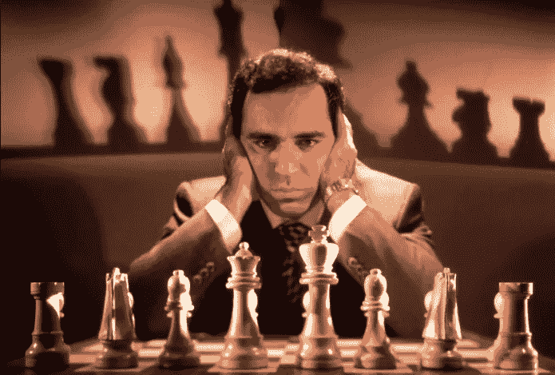
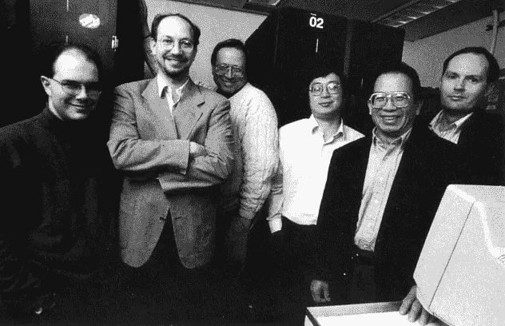
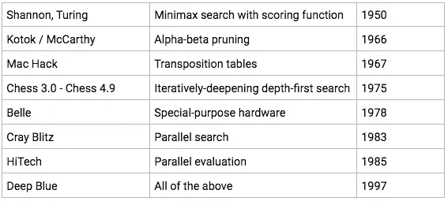
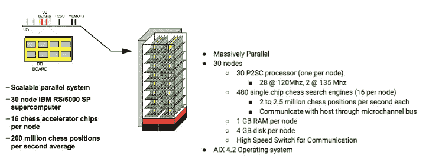
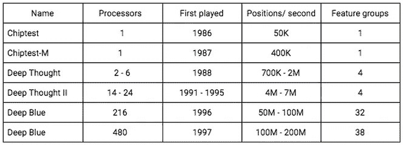
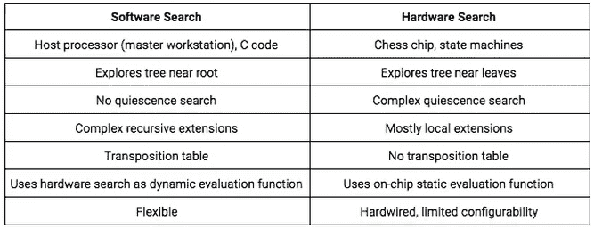
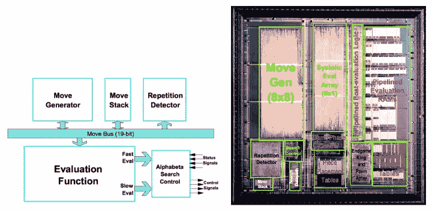
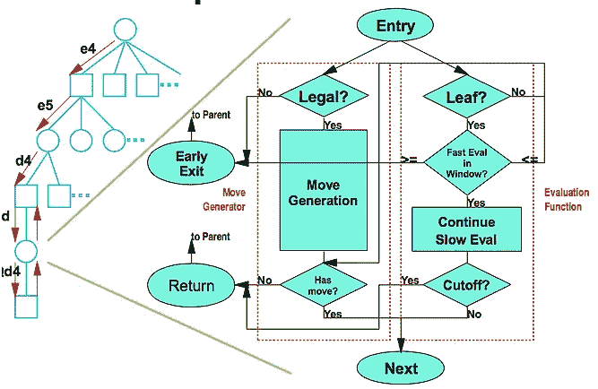
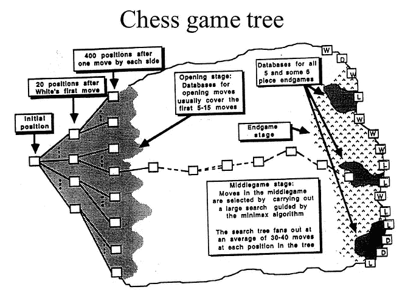
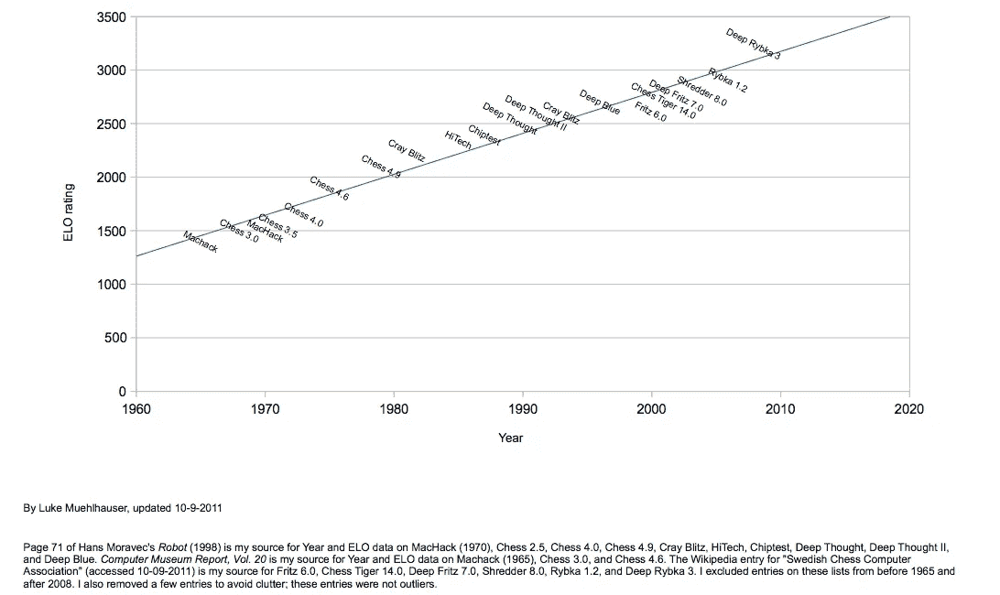

# 玩的机器(深蓝)

> 原文：<https://medium.com/hackernoon/machines-that-play-deep-blue-5a2af4e739f7>

**玩**系列的机器被分成了 7 个部分。这是本系列的第 4 部分。

这个系列涵盖了人工智能和游戏的历史(直到深蓝),并专注于下棋、跳棋和西洋双陆棋的机器。涵盖了以下主题:如何构建国际象棋机器、香农在国际象棋方面的工作、图灵在国际象棋方面的工作、土耳其人、El Ajedrecista、MANIAC、Bernstein 国际象棋程序、Samuel's checkers、Mac Hack VI、Cray Blitz、BKG、HiTech、Chinook、Deep think、TD-Gammon 和深蓝。

第一部分:[会玩的机器(概述)](/@reasonets/machines-that-play-overview-7f670681ef6a) —这个

第二部分:[会玩的机器(建造象棋机器)](/@reasonets/machines-that-play-building-chess-machines-7feb634fad98)

第三部分:[会玩的机器(深蓝之前的象棋)](/@reasonets/machines-that-play-chess-9091671dbea8)

第四部分:[玩(深蓝)的机器](/@reasonets/machines-that-play-deep-blue-5a2af4e739f7) —这个

第五部分:[玩的机器(后深蓝)](/@reasonets/machines-that-play-post-deep-blue-9246e906beb6)

*如果您想要前 5 个部分的摘要，重点是人的因素，请点击此处【链接即将推出】。*

第六部分:[玩(跳棋)的机器](/@reasonets/machines-that-play-checkers-10f7d4038956)

第 7 部分:玩(双陆棋)的机器

# 第四部分:[玩(深蓝)的机器](/@reasonets/machines-that-play-deep-blue-5a2af4e739f7)

这一部分将总结国际象棋项目的创新，包括深蓝，关注技术细节(来自深蓝团队的论文)以及社会和文化对深蓝与卡斯帕罗夫对决的反应。

# 像人类一样，但(仍然)不是人类

[Garry Kasparov](http://time.com/3705316/deep-blue-kasparov/) (Time Magazine)

# (人工智能和国际象棋)迄今为止的道路*

**详情见最后一节*

为什么会有人想教一台机器如何遵循一些任意的人为规则来移动棋盘上的一堆木头，唯一的目的是让一个特殊的木头拐弯？攻击并捕获卒子、骑士、主教和女王以最终将国王逼入无法逃脱的境地，这太人性化了。这些是*我们的*行动，也就是*我们的*目标，我们平衡战略和战术以适应这些。为什么教机器下棋？

> “公众必须认识到国际象棋是一项暴力运动。下棋是精神折磨。” — [*加里·卡斯帕罗夫(上世纪 90 年代)*](https://en.wikiquote.org/wiki/Garry_Kasparov)

国际象棋一直被认为是智力游戏。许多人认为，一台能成功下棋的机器将证明思维可以被模拟/理解，或者机器可以被制造出来思考。这就是为什么人们想要建造一台机器，它可以遵循我们游戏中的一些任意规则，并变得如此擅长，以至于有一天它可以在游戏中打败我们。

给一台机器编程下棋并不困难，但是给它编程让它成为一名强有力的棋手却非常困难。许多人认为，一台能成功下棋的机器将证明思维是可以被模拟/理解的，机器可以被制造出来思考。

事实证明，我们将在 1997 年制造出一台成功的国际象棋机器，但它不一定有助于我们理解我们的思维——它的游戏方式可能从非常像人类到几乎与我们格格不入，而且它肯定会挑战我们对什么叫做智能的概念。

电子计算机的发明始于 20 世纪 30 年代。ENIAC 被认为是第一台通用电子计算机，于 1946 年投入运行。到 20 世纪 40 年代末，计算机在美国、英国、德国和前苏联被用作研究和军事工具。计算机国际象棋提出了一个迷人而富有挑战性的工程问题。

**20 世纪 40-50 年代**

早期的先驱专注于建造像人类一样下棋的机器，所以早期的国际象棋发展在很大程度上依赖于国际象棋试探法(经验法则)来选择最佳的棋步。研究人员强调模仿人类象棋思维过程，因为他们相信教会机器如何模仿人类思维会产生最好的象棋机器。

在 20 世纪 50 年代，计算能力有限，因此机器只能在非常基础的水平上发挥作用。在这个时期，研究人员开发了评估国际象棋位置和搜索可能的走法(以及对手的反走法)的基本技术。这些思想至今仍在使用。

**20 世纪 60 年代**

20 世纪 60 年代，人工智能先驱希尔伯特·西蒙和约翰·麦卡锡将国际象棋称为“人工智能的果蝇”，这意味着国际象棋像普通的果蝇一样，代表了一个相对简单的系统，也可以用来探索更大、更复杂的现实世界现象。计算机国际象棋是人工智能研究的完美试验台。

到 20 世纪 60 年代末，计算机国际象棋程序已经足够好，可以偶尔击败俱乐部级别或业余选手。

**20 世纪 70 年代—80 年代**

在 1970-1980 年，重点是硬件速度。在 20 世纪 50 年代和 60 年代，早期的先驱专注于国际象棋试探法(经验法则)来选择最佳的下一步棋。在 20 世纪 70 年代和 80 年代，人们更加关注软件的改进以及更快、更专业的硬件的使用。定制的硬件和软件允许程序对博弈树进行更深入的搜索(涉及数百万个棋位)，这是人类没有(因为他们不能)做到的。

20 世纪 80 年代也带来了一个低成本象棋电脑的时代。第一个基于微处理器的国际象棋程序开始变得可行。由于家用电脑和这些程序的存在，现在任何人都可以和机器下棋(并提高自己的水平)。到了 20 世纪 80 年代中期，基于微处理器的国际象棋软件的复杂程度有了很大提高，他们开始赢得比赛——既要对抗基于超级计算机的国际象棋程序，也要对抗一些顶级的人类棋手。

**20 世纪 90 年代**

20 世纪 90 年代，国际象棋项目开始挑战国际象棋大师和后来的特级大师。这些程序更多地依赖记忆和蛮力，而不是战略洞察力，它们开始持续击败最优秀的人类。1989 年，计算机国际象棋出现了一些戏剧性的时刻——两位广受尊敬的大师被 CMU 的“高科技”和“深度思考”击败。

研究人员认为机器最终可以打败国际象棋世界冠军。这引起了 IBM 的兴趣，所以他们在 1989 年开始致力于这项挑战，并建立了一个专门的国际象棋机器，命名为深蓝。它最终打败了人类最优秀的棋手加里·卡斯帕罗夫。

IBM 的研究人员将被授予弗雷德金奖(Fredkin prize ),这是一个 10 万美元的奖项，奖励第一个击败世界象棋冠军的程序，该程序已经无人认领 17 年了。这场(以及后来)计算机国际象棋的胜利令许多人工智能研究人员失望，因为他们感兴趣的是建造通过“一般智能”策略而不是蛮力取得成功的机器。从这个意义上说，国际象棋已经开始与人工智能研究脱钩。

剩下的部分大概是深蓝。“深蓝”是一台被设计用来下棋的高度专业化的机器:

1.  1993 年，深蓝在与本特·拉尔森的四场比赛中失利。
2.  1996 年，深蓝在与加里·卡斯帕罗夫的六场比赛中失利(4-2):a)每个芯片每秒 160 万到 200 万个位置，b)系统每秒 5000 万到 1 亿个位置
3.  1997 年，深蓝(3.5–2.5)赢了加里·卡斯帕罗夫的六场比赛。卡斯帕罗夫输给“深蓝”是他一生中第一次在国际象棋比赛中失利:a)增强的国际象棋筹码，每个筹码有 200 万到 250 万个位置，b)每秒 2 亿个位置

[**现在**](http://www.sciencemag.org/news/2016/03/update-why-week-s-man-versus-machine-go-match-doesn-t-matter-and-what-does) **:**

没有一个人能平等地与最好的计算机(甚至是人类+计算机团队)对弈。我们(人类)发明、玩和理解国际象棋已经超过 1000 年了——机器出现还不到 60 年，它们比我们好得多。

# 现在，深蓝

世界冠军加里·卡斯帕罗夫和 IBM 深蓝之间组织了六场国际象棋比赛。第一场比赛于 1996 年 2 月在费城举行。1997 年 5 月，复赛在纽约举行。

[IBM’s Deep Blue Team (from left to right): Joe Hoane, Joel Benjamin, Jerry Brody, F.H. Hsu, C.J. Tan and Murray Campbell](http://www.conceptlab.com/uci/2005fall/krapp/turk-kasparov/)

在第一场比赛时，卡斯帕罗夫的收视率为 2800，这是有史以来最高的总分。深蓝的创造者将机器置于类似的水平。

[大众科学](https://books.google.com/books?id=-TKv7UHgoTQC&pg=PA46&dq=popular+science+1996+chess&hl=en&sa=X&ved=0ahUKEwiSjLj_r8PcAhXyYt8KHQM7BLUQ6AEILzAB#v=onepage&q=popular%20science%201996%20chess&f=false)问大卫·利维关于加里·卡斯帕罗夫对深蓝的比赛，利维说，

> **“……如果卡斯帕罗夫愿意，他可以 6 比 0 拿下这场比赛。我敢肯定，我可以用我的生命打赌。”**

另一方面麦吉尔大学的计算机科学教授蒙特纽恩说，“*我会把计算机 4 1/2 给卡斯帕罗夫 1 1/2【平局给每个玩家 0 . 5 分。[英语背诵文选一旦计算机比你强，它显然会很快比你强。在最坏的情况下，它会得到 4 1/2 的分数。*

> 一旦计算机比你强，它显然会很快比你强

结果还不清楚。深蓝的前身 Deep think 是锦标赛特级大师，不是比赛特级大师。这不是一场普通的比赛，这是一场比赛。这是一个不同的挑战。为什么比赛比锦标赛更具挑战性？因为在一场比赛中，球员们要进行多场比赛来对抗彼此。这给了人类大师一个机会来衡量机器的弱点，并利用这些弱点为自己服务。据[许](https://www.hotchips.org/wp-content/uploads/hc_archives/hc10/2_Mon/HC10.S4/HC10.4.1.pdf)，

> ***人类大师在严肃的比赛中，从计算机的错误中学习，利用弱点，驾驶卡车穿过裂开的洞。***

**IBM 需要建造一台几乎没有弱点的机器，而这些弱点需要让人类大师很难利用。**

**卡斯帕罗夫赢得了 1996 年的比赛。1997 年，复赛在纽约举行。这一次，卡斯帕罗夫输了——卡斯帕罗夫输给深蓝是他一生中第一次在国际象棋比赛中失利。**

**那么，1997 年有什么不同呢？**

**根据的说法，事实上深蓝有两个不同的版本，一个在 1996 年输给了，另一个在 1997 年打败了他。**

**在接下来的章节中，我们将探讨坎贝尔、霍恩和许所说的促成深蓝 1997 年成功的一些因素:**

1.  **单芯片象棋搜索引擎**
2.  **具有多个并行级别的大规模并行系统**
3.  **非常强调搜索扩展**
4.  **复杂的评估功能，以及**
5.  **大师级游戏数据库的有效使用。**

# **起初有…**

**1985 年，Hsu Feng-Xiong 和 Murray Campbell(稍后)先后开发了 ChipTest 和第一台特级国际象棋机器 Deep think。**

**1988 年，Deep think 凭借其定制的硬件击败了特级大师本特·拉尔森(在锦标赛中):一对定制的处理器，每个处理器都包括一个 VLSI 芯片来产生移动。后来，Deep think 的一个实验性六处理器版本与卡斯帕罗夫进行了一场(两局)比赛，输了。**

**1989 年，徐和坎贝尔都受聘到 IBM 研究院工作；他们的新团队成员包括计算机科学家乔·霍恩、杰里·布罗迪和 C. J .谭。他们的新项目被命名为深蓝，他们开始研究如何使用并行处理来解决复杂的问题。**

# **名称又能代表什么呢**

****深以为二还是深蓝原型？(1991-1995 年)****

**名称又能代表什么呢事实证明相当多。**

**国际电脑象棋协会(ICCA)将于一九九五年在港举行世界电脑象棋锦标赛。徐，坎贝尔和他的团队赢得了 1989 年的比赛，但没有参加 1992 年的比赛。ICCA 联系 IBM 赞助该活动，IBM 同意了，这意味着该团队必须参加。**

**据许说，他们宁愿为 1996 年与加里·卡斯帕罗夫的对抗做准备，但 IBM 认为这是一个很好的宣传机会。**

**到 1992 年，深蓝团队已经开始研究新的芯片设计。对于卡斯帕罗夫来说，他们计划使用他们设计的最新芯片，但这些芯片在香港活动之前不会准备好。他们必须与《深思 II》竞争。**

**参加世界计算机国际象棋锦标赛的机器应该叫什么:深思二代还是深蓝原型？**

**这就是命名争论发生的时候。**

**许在他的书《深蓝背后的[:建造打败国际象棋世界冠军](https://www.amazon.com/gp/product/0691090653/ref=as_li_tl?ie=UTF8&camp=1789&creative=9325&creativeASIN=0691090653&linkCode=as2&tag=mobilead088d9-20&linkId=66ff7ba4365f5d2f75b24d8954004d03)的计算机》中写道，“*当时我们的通讯人 Jerry Present 想用深蓝原型这个名字，而不是 Deep think II。我想用深思 II 这个名字。我的推理如下。新机器“深蓝”在有效搜索速度上将比“深度思考 II”至少快 100 倍，此外，“深蓝”在国际象棋中对位置概念的把握也要好得多。比较深蓝和深思 II 就像比较太阳和月亮。嗯，我夸大了一点，但计算能力的差异大约是一千比一，考虑到在深蓝国际象棋芯片上进行的更复杂的国际象棋评估计算。我为所做的一切感到自豪，不希望任何东西与深蓝联系在一起，除非它确实使用了新的芯片。deep think II 仍在使用我在 1985 年设计的国际象棋芯片。”*他继续说*，***

> ****“在我看来，深思二号是一只即将灭绝的恐龙。它不会篡夺我们新的百万吨级太阳能冲击波的名字，即使只是部分篡夺。****

***徐想要《深思 II》，但是布罗迪想要《深蓝原型》，因为他们想说“深蓝”是“在与加里·卡斯帕罗夫比赛时，世界计算机国际象棋冠军“深蓝原型”的*继承者”。****

***布罗迪认为他们的机器可能会赢。在“不可能”的事件中，它没有赢得冠军，然后他们会说这不是真正的深蓝在玩。根据 Hsu 的说法，问题在于他们认为失败并不是一件“不可能”的事情——团队认为他们获胜的可能性大约是 50%。***

***我们称这台机器为深度思考 II，因为 Hsu 和他的团队就是这么叫的。***

***1995 年，《深思 II》在香港上映。在此之前，深度思考 II 在本次锦标赛之前至少有六个月的时间是离线的。deep think II 的第一轮对手是[明星苏格拉底](https://chessprogramming.wikispaces.com/Star+Socrates)，这是一个来自麻省理工学院的并行国际象棋程序，运行在一台价值数百万美元的超级计算机上。根据 Hsu 的说法，*“它的机器比运行 Deep think II 的工作站贵一百倍。而且它的搜索速度至少比得上深思 I* I”。明星苏格拉底是《深思 II》的一大威胁。***

***许在他的书《深蓝背后的 T0》中写道，“*前一年《深度思考 II》扮演明星苏格拉底的时候，我第一次看到一个程序实际上“搜索”超过了《深度思考 II》……然而《深度思考 II》却轻而易举地胜过了它。一年能有所不同吗？深度思考 II 已经离线半年多了，麻省理工学院的人可能没有闲着*。***

***深思 II 击败明星苏格拉底。***

***当面对它的最后一个对手弗里茨时，在游戏的某一点上，深思 II 进入了“恐慌时间”状态。深以为二处境不好，需要下一步棋。它已经找到了一步棋，但它正在输，它需要找到一个更好的棋。它进入了一种状态，在这种状态下，它需要花费额外的时间来寻找一个替代方案。在试图找到一个好的替代方案时，深思 II 搜索了一棵更大的树(搜索爆炸式增长)。许回忆说，特级大师罗伯特·巴尼停下来，小声告诉他们，他认为《深思 II》应该下哪一步。***

***Hsu 和他的团队除了等待 Deep think II 完成它的大规模搜索之外别无选择，他们怀疑 Deep think II 是否真的会找到 Robert 建议的那一步——它迫切需要的那一步来改善自己的地位。时间到了，在所有的搜索之后,《深思 II》开始了它最初的计划。它没有找到更好的办法。一切都结束了。深思 II 输了。弗里茨将继续[赢得冠军](http://www.mark-weeks.com/chess/95wc$tix.htm)。***

***Deep think II 与深蓝相去甚远，但它也不是 Deep think 的同一台机器。他们做出了改进(来自坎贝尔、霍恩和徐(T7)):***

1.  *****中等规模多处理**“Deep think II 拥有 24 个象棋引擎(随着时间的推移，随着处理器出现故障并且没有被替换，该数量会减少)，而 Deep think 的处理器只有 2 个(有几个版本拥有 4 个和 6 个处理器)。***
2.  *****增强的评估硬件:** Deep Thought II 评估硬件使用了更大的 ram，并且能够在评估功能中包含一些附加功能。***
3.  *****改进的搜索软件**:该搜索软件完全针对 Deep think II 进行了重新编写，旨在更好地处理并行搜索，并且它具有许多新的搜索扩展思想。[这段代码后来成为深蓝搜索软件的最初基础。] Hsu 在《深蓝背后的[》一书中写道，“*官方称，之所以要建立 Deep Thought II，是为了将其作为探索并行搜索算法的原型。但主要的原因是为了在我们和我们的电脑竞争对手之间拉开一个很大的差距，这样这个项目就可以持续很长一段时间，而我则在努力设计新的国际象棋芯片。*](https://www.amazon.com/gp/product/0691090653/ref=as_li_tl?ie=UTF8&camp=1789&creative=9325&creativeASIN=0691090653&linkCode=as2&tag=mobilead088d9-20&linkId=95fd1117f846b9f9ab6cefd7178764c7)***
4.  *****延书**:延书让 Deep think II 即使在没有开书的情况下也能做出合理的开局招式。【这个特性也被深蓝继承了。]***

***《深蓝》——项目任务是:**在常规时间控制下赢得一场与最佳人类国际象棋世界冠军的比赛。*****

# ***设计深蓝(1996-1997)***

***根据深蓝团队的[设计理念](https://www.hotchips.org/wp-content/uploads/hc_archives/hc10/2_Mon/HC10.S4/HC10.4.1.pdf)，关注集成级别是最重要的:***

*   ***从象棋书籍中封装每一个象棋评估术语***
*   ***创建评估术语来处理每一个已知的计算机弱点***
*   ***如果出现新的弱点，使用外部 FPGA 硬件添加钩子来处理***
*   ***把所有东西都放在一个芯片上***

***关于速度，他们说搜索速度将通过提高集成度(增加单芯片象棋机器)和使用大规模并行来获得。***

*****深蓝(1996)*****

***深蓝(1996)是基于一个单芯片国际象棋搜索引擎，设计了超过三年的时间。它在一台 36 节点的 IBM RS/6000 SP 计算机上运行。它有 216 个国际象棋筹码。大多数评估函数项都是直接在芯片上计算的——为了，“*在通用计算机上执行与 1986 年深蓝所做的相同的计算，每秒至少需要一万亿条指令，*”Hsu 说。这些国际象棋芯片比之前的任何国际象棋程序更详细地评估了国际象棋的位置。***

***每个国际象棋芯片每秒可以搜索大约 160 万个国际象棋位置。根据 Hsu 的说法，深蓝(1996)的理论最大搜索速度约为每秒 3 亿个位置。观察到的搜索速度约为每秒 1 亿个位置。***

***深蓝团队花了 3 年时间来设计这些芯片。1995 年 9 月，他们收到了第一批国际象棋芯片，但是这些芯片出现了问题。所以他们需要芯片的修订版，直到 1996 年 1 月才收到。第一场比赛定于 1996 年 2 月，让他们没有时间来测试整个系统。***

***完整的 36 节点深蓝(1996)在 1996 年 2 月的实际比赛中进行了其第一场*锦标赛条件比赛——T2 对加里·卡斯帕罗夫*。***

***该系统的某个部分在准备中进行了一些比赛，但进行比赛的系统，即深蓝 Jr，使用的只是深蓝的单节点版本，只有 24 个国际象棋芯片。但即使是相对有限的小深蓝也以 1.5–0.5 击败了特级大师伊利亚·古列维奇，1–1 战平特级大师帕特里克·沃尔，0–2 不敌特级大师乔尔·本杰明。***

***深蓝(1996)比小深蓝更强大，事实上，*它是有史以来最强大的国际象棋机器。尽管如此，深蓝队并不知道它实际上会怎么玩，因为他们从未见过它玩一场游戏。深蓝(1996)只是一个两周大的婴儿，有史以来最强大的婴儿，但仍然是一个婴儿。许说:****

> ***会不会是小赫拉克勒斯勒死了赫拉女神派来的两条大蛇？还是我们派出一个无助的婴儿作为贡品去安抚海怪塞特斯，但没有珀尔修斯的帮助？我们担心会是后者。***

***1996 年 2 月，深蓝与卡斯帕罗夫的第一场比赛，深蓝赢了。***

***据卡斯帕罗夫的电脑顾问弗雷德里克·弗里德尔(Frederic Friedel)说，第一场比赛后的那个晚上，卡斯帕罗夫去散步(在费城零下的气温中)。在散步的时候，他问道:***

> *****“弗雷德里克，如果这东西是无敌的呢？”*****

***在这场比赛的第一场比赛中，卡斯帕罗夫[写道](http://content.time.com/time/subscriber/article/0,33009,984305-1,00.html)，*“电脑将一个棋子推到一个可以轻易被占领的方格。这是一个奇妙的非常人性化的举动。如果我一直在玩白色，我可能会提供这个卒牺牲…人类一直在做这种事情。但是计算机通常尽可能在规定的时间内计算每一步棋……计算机评估棋位的主要方法是通过衡量物质优势，它们是出了名的唯物主义者。如果他们“理解”这个游戏，他们可能会采取不同的行动，但他们不理解。所以我被这个卒祭惊呆了。这意味着什么？我玩过很多电脑，但从未经历过这样的事情。我能感觉到——我能闻到——桌子对面有一种新的智慧。当我尽全力打完剩下的比赛时，我迷失了；它在剩下的时间里下了一盘漂亮、完美的棋，并轻松获胜。”****

> *****“我能感觉到——我能闻到——桌子对面有一种新的智慧。”*****

***原来，卒根本不是祭品。深蓝(1996)确实计算了每一个可能的走法*“一直到六步后实际回收棋子”*。卡斯帕罗夫接着问道，“*那么问题是……****

> ******……如果计算机做出了我出于完全不同的原因会做出的相同举动，那么它做出了“智能”的举动吗？一个动作的智能取决于谁(或什么)采取它吗？******

***后来在他的 TED 演讲(T1)中，卡斯帕罗夫说:“(T2)当我在 1996 年 2 月第一次见到深蓝的时候，我已经当了 10 多年的世界冠军了，我打了 182 场世界冠军赛，在其他比赛中与其他顶尖选手打了数百场比赛。我知道对手会给我什么，我也知道自己会给自己什么。我习惯于通过观察他们的肢体语言和眼睛来衡量他们的动作和情绪状态。然后我坐在深蓝的棋盘对面。我立刻感觉到一些新的，令人不安的东西。你可能会在第一次乘坐无人驾驶汽车或第一次你的新电脑经理在工作中发布命令时体验到类似的感觉。但是当我坐在第一场比赛的时候，我不能确定这东西能做什么。技术可以突飞猛进，IBM 已经投入巨资。我输了那场比赛。我不禁想知道，它可能是不可战胜的吗？我心爱的象棋比赛结束了吗？这些都是人类的疑虑，人类的恐惧，我唯一确定的是我的对手深蓝根本没有这种担心。”***

> ******我不禁在想，它会不会是无敌的？我心爱的象棋比赛结束了吗？这些都是人类的疑虑，人类的恐惧，我唯一确定的是我的对手深蓝根本没有这种担心。”******

***1996 年的比赛最终由卡斯帕罗夫获胜(4 比 2)。在前四场比赛后，比赛以 2 比 2 打平，尽管看起来这是一场决定性的胜利，但这是一场相当接近的比赛，比普遍认为的更接近。***

***根据蒙蒂·纽宾的《深蓝之外:平流层中的国际象棋》(Beyond Deep Blue: Chess in the 平流层、*在第五场比赛中，卡斯帕罗夫选择避开他最喜欢的西西里防守，因为在第一场和第三场比赛中他都无法获胜。这含蓄地表明了对对手实力的某种认可和尊重。相反，他扮演了四骑士开场。然后不知从哪里，在第 23 步，他向这个对手提出了和棋？为什么呢？深蓝认为它落后了十分之三的兵，该队对这一出价感到惊讶。游戏规则允许团队决定是否接受抽签，这是唯一可以由人类代表计算机做出的决定。卡斯帕罗夫的时间有点紧——接下来的 17 步棋大约需要 20 分钟，每一步大约需要 1 分钟，相比之下，平均每一步的比赛时间为 3 分钟。所以也许他在这里是为了安全起见，觉得他可以在最后一局用白棋击败深蓝…深蓝团队聚在一起讨论这个提议。它缩成一团太久了，以至于深蓝进行了第 24 步，有效地拒绝了这一提议。****

***卡斯帕罗夫最终赢得了那场比赛。否则五场比赛后，进入最后的第六场比赛，这场比赛将是平局。***

***卡斯帕罗夫在结束他的文章时谈到了他为什么赢得第一场比赛。他说*“我可以弄清楚事情的轻重缓急，调整我的打法。它不会对我做同样的事。因此，尽管我认为我确实看到了一些智慧的迹象，但这是一种奇怪的迹象，一种低效、僵化的迹象，让我觉得我还能活几年。****

***他活不了几年了。1997 年 5 月，他在复赛中输给了深蓝。***

# ***深蓝(1997)***

## *****深蓝(1996)的改进*****

***深蓝团队知道深蓝(1996)中有许多他们需要克服的缺陷，例如，国际象棋知识和计算速度的差距。所以坎贝尔、霍恩、许对《深蓝》( 1997)做了如下改动:***

1.  ***他们设计了一种新的、显著增强的国际象棋芯片:1)新的国际象棋芯片具有完全重新设计的评估功能，从“*大约 6400 个特征到超过 8000 个*”。其中一些新功能是他们在 1996 年奥运会上观察到的问题的结果，2)新芯片增加了“*硬件重复检测*，其中包括许多专门的移动生成模式(例如，生成攻击对手棋子的所有移动:)，3)新芯片将其搜索速度提高到每秒 200 万到 250 万个位置。***
2.  ***他们将系统中的国际象棋芯片数量增加了一倍多，并使用新一代 SP 计算机来支持因国际象棋芯片增加而产生的更高处理需求。***
3.  ***他们开发了一套软件工具来帮助调试和比赛准备，例如评估调整和可视化工具。***
4.  ***他们对搜索的改动并不大，因为深蓝的搜索能力已经“可以接受”了。***

***然后，他们设计、测试并调整了新的评估函数。***

## *****比赛*****

***卡斯帕罗夫击败了深蓝(1996)。***

***那是 1997 年 5 月，是重赛的时候了。卡斯帕罗夫赢了复赛的第一局。***

***预测对卡斯帕罗夫有利，许多专家预测这位冠军至少会得六分中的四分。卡斯帕罗夫在利纳雷斯锦标赛上表现出色，他的评分达到了 2820 分的历史最高水平。在 2003 年的一部电影中，他回忆起自己早年的自信:***

> ***“不管发生什么，我都会打败机器。看第一场。它只是一台机器。机器是愚蠢的。”***

***深蓝队在第一场比赛中感到失望，大师乔尔·本杰明(Joel Benjamin)将他的大师级国际象棋知识传授给了机器，他确信深蓝(1997)可以比第一场比赛发挥得更好。事后分析表明，深蓝可以画出那个游戏，如果它能更深入地搜索几层的话…***

***接下来是游戏 2——一个如此不同的游戏，以至于玩这种游戏的机器以前从未见过。***

***计算机的优势在于战术象棋；他们没有玩战略，换句话说，在那之前，计算机选择了物质利益而不是位置优势。在那之前。***

***卡斯帕罗夫设置了一个陷阱，深蓝将获得一个棋子(一个物质利益)，但失去位置。深蓝(1997)没有抓住暴露的棋子(如大家所料)，选择了另一条路线；它选择了位置优势。当时，没有机器在玩大师们所说的战略远见。深蓝刚刚展示了这一点的一瞥。***

***深蓝(1997)像人类一样玩游戏 2，这不是机器应该玩的。观察比赛的大师们后来说，如果他们不知道谁在比赛，他们会认为卡斯帕罗夫正在和人类最伟大的球员之一、*甚至他自己*比赛。乔尔·本杰明(Joel Benjamin)说，他目睹了一场漂亮的“象棋”比赛，而不是“电脑象棋”。***

***这场比赛震撼了卡斯帕罗夫，从那以后他再也没有赢过深蓝。他改变了风格，开始采取守势。根据(后来)[连线的文章](https://www.wired.com/2001/10/chess-2/)，特级大师亚瑟·塞拉万说，“*这是一个令人难以置信的精妙的防守动作，在前方避开了任何反击的暗示，这让加里陷入了慌乱。”****

***伦敦《每日电讯报》的象棋记者马尔科姆·佩因说:“只有三种解释***

> *****要么我们看到了我们都不知道的国际象棋程序的某种巨大飞跃，要么我们看到了机器比任何人听说的更深入的计算，要么人类在游戏过程中进行了干预。”*****

***比赛结束后，卡斯帕罗夫立即指责 IBM 作弊；他声称某一步棋背后有一位特级大师(可能是一位顶级对手)在操纵。纪录片《游戏结束:卡斯帕罗夫和机器》中重复了这一说法。他声称这样的举动太人性化了，电脑不可能做出这样的举动。***

***从技术上来说，IBM 没有作弊。根据规则，他们可以在比赛间隙调整自己的系统。“*我们会说我们在比赛中‘调整’了程序*，”[乔尔·本杰明说](https://www.wired.com/2001/10/chess-2/)，但是他们没有做出任何重大的改变。在深蓝在第一场比赛中失败后，IBM 回到绘图板，重新分配游戏不同功能的相对权重。***

***卡斯帕罗夫没有赢得接下来的三场比赛，但深蓝也没有——三场平局。***

***在决赛前，这场比赛打成了 2.5 比 2.5 平。***

***后来，国际象棋界开始分析第二场比赛，并发现了令人震惊的事情:卡斯帕罗夫在平局中辞职。***

***据乔纳森·谢弗(Jonathan Schaffer)、*称，“分析相当深入，略微超出了深蓝的搜索范围。很明显，还有卡斯帕罗夫的。卡斯帕罗夫的团队，包括特级大师尤里·多科伊恩和弗雷德里克·弗里德尔，面临着向卡斯帕罗夫透露消息的微妙任务。他们一直等到第二天午餐，在他喝了一杯好酒之后。在他们透露了隐藏的抽签资源后，卡斯帕罗夫陷入了五分钟的深思(没有双关语)，然后他承认他错过了一场抽签。他后来声称，这是他第一次辞去平局的职位。****

***最后一场比赛激烈而残酷，深蓝只用了 19 步就震惊了世界。**深蓝罢免了卡斯帕罗夫。**【见[最后一局](https://www.youtube.com/watch?v=TdykHC93PrA)的稀有片段。]***

***最终得分是 3.5–2.5。卡斯帕罗夫是一个如此伟大的球员，以至于在他一生中从未输过一场比赛。他参加过国际象棋史上一些最伟大的比赛，包括与阿纳托利·卡尔波夫的几场比赛。***

***但是这一次不同。悲痛欲绝的卡斯帕罗夫说:“*我失去了斗志。在那之前，他从未在多场比赛中输给一个单独的对手。****

***在第六场比赛后，他说，***

> ***我根本没有玩的心情..我是一个人。当我看到超出我理解范围的东西时，我会害怕。***

***卡斯帕罗夫很沮丧，在新闻发布会上承认，他对自己的表现感到尴尬和羞愧。他后来要求 IBM 查看游戏的日志，IBM 当时拒绝展示。IBM 因此受到批评，但有一点要记住，深蓝的计算和移动日志是国际象棋大师可以理解的。在比赛中给卡斯帕罗夫提供日志就相当于泄露了深蓝的战略，正如德鲁·麦克德莫特[对](http://www.nyu.edu/gsas/dept/philo/courses/mindsandmachines/Papers/mcdermott.html)说的那样，“*…这就相当于在他【卡斯帕罗夫】和他的副手*讨论战略的酒店房间里安装窃听器。”***

***比赛一周后，卡斯帕罗夫[表达了他对深蓝在第二场比赛中](http://webdocs.cs.ualberta.ca/~jonathan/PREVIOUS/Grad/Papers/db.html)的钦佩:*“这场比赛的决定性比赛是第二场，这在我的记忆中留下了恐慌……****我们看到了一些远远超出我们最疯狂预期的事情，即计算机能够预见其决策的长期位置后果。这台机器拒绝移动到一个具有决定性的短期优势的位置——表现出一种非常人性化的危险感。我认为这一时刻可能标志着计算机科学的一场革命，它可能为 IBM 和深蓝团队赢得诺贝尔奖。即使在几周后的今天，世界上还没有其他的国际象棋程序能够正确评估深蓝的地位所带来的后果。******

***深蓝比 1996 年打得好多了。根据 Jonathan Schaeffer 的说法，深蓝获胜的一些原因是:***

*   ***它犯的错误更少，犯的错误也没那么严重***
*   ***它的速度加快了***
*   ***乔尔·本杰明(Joel Benjamin)等人所做的大量调整对此有所帮助。谢弗说，除了特级大师乔尔·本杰明，其他几位特级大师也测试过“深蓝”。IBM 的其他研究人员，如 Gerry Tesauro(TD-Gammon)被请来帮助——他使用他的神经网络技术来帮助调整深蓝的评估函数。***
*   ***卡斯帕罗夫对比赛的准备很差。卡斯帕罗夫写下了他的准备工作，“不幸的是，我为这场比赛所做的准备……是建立在什么是好的反计算机策略的传统智慧之上的。传统智慧是——或者直到这场比赛结束之前都是——避免早期对抗，玩慢游戏，试图超越机器，迫使位置错误，然后，当高潮到来时，不要分散注意力，不要犯任何战术错误……这是我的运气不好，这种策略在第一场比赛中完美地发挥了作用——但在剩下的比赛中再也没有出现过。比赛进行到一半时，我发现自己对一种全新的智力挑战毫无准备。”***
*   ***卡斯帕罗夫做了一些糟糕的开场选择；他不打他觉得最舒服的位置。***

***加里·卡斯帕罗夫要求重赛，但从未实现。***

***那么谁是更好的玩家呢？许多人认为卡斯帕罗夫是一个更好的球员，但他的情绪妨碍了他。这可能是最接近事实的。无论如何，这场比赛最大的收获之一是我们集体低估了比赛的生理和心理层面。我们的情感、恐惧、欲望和怀疑总是能战胜我们，有时我们除了袖手旁观之外别无他法，只能让它过去。这是人类特有的问题，我们的机器对手并不担心。***

> ***我们的情感、恐惧、欲望和怀疑总是能够战胜我们……这是人类特有的问题，我们的机器对手并不担心。***

***这是卡斯帕罗夫整场比赛都在暗示的一个主题，甚至到现在还在继续讨论[ [卡斯帕罗夫的 ted 演讲](https://www.ted.com/talks/garry_kasparov_don_t_fear_intelligent_machines_work_with_them) ]。***

***【旁注:一段[视频](https://www.youtube.com/watch?v=NJarxpYyoFI)卡斯帕罗夫 vs 深蓝的总结】***

# ***工程深蓝***

***接下来，我们来了解一下《深蓝》(1997)的制作过程。这些信息大多来自以下来源:***

1.  ***坎贝尔、霍恩、许的《深蓝》***
2.  ***[IBM 深蓝国际象棋特级大师芯片](http://www.csis.pace.edu/~ctappert/dps/pdf/ai-chess-deep.pdf)徐***
3.  ***[在对象棋一无所知的情况下设计出一位单片机象棋特级大师](https://www.hotchips.org/wp-content/uploads/hc_archives/hc10/2_Mon/HC10.S4/HC10.4.1.pdf)徐***

******

***Some innovations used in Deep Blue***

## *****系统架构*****

***深蓝(1997)是一个大规模并行系统，设计用于执行国际象棋博弈树搜索。分布式体系结构由 30 个节点(30 个处理器(每个节点一个))的 IBM RS/6000 SP 计算机和 480 个国际象棋芯片(每个芯片一个国际象棋搜索引擎)组成，每个 SP 处理器有 16 个国际象棋芯片。所有节点都有 1GB 的内存和 4GB 的磁盘。***

***480 个芯片并行运行，以有效地执行 a)深度搜索，b)移动生成和排序，c)位置评估(超过 8000 个评估特征)。***

***每个国际象棋芯片每秒可以搜索 200 万到 250 万个国际象棋位置，因此最大系统速度达到每秒 10 亿个国际象棋位置或 40 万亿次运算。***

******

***[Deep Blue Architecture](https://www.hotchips.org/wp-content/uploads/hc_archives/hc10/2_Mon/HC10.S4/HC10.4.1.pdf) and [System overview](https://sjeng.org/ftp/deepblue.pdf)***

******

***[A brief history of chess machines (repeated from earlier)](https://sjeng.org/ftp/deepblue.pdf)***

## *****搜索*****

***《深蓝》(1997)将软件和硬件结合起来，以获得最大的效果和灵活性(见这里的和这里的)。基本的高层战略如下:***

*   ***将在 1 个工作站节点上搜索前 4 层***
*   ***将在 30 个工作站节点上并行搜索第二个 4 层***
*   ***剩余的层将在硬件中搜索——这是国际象棋芯片发挥作用的地方***

***根据深蓝团队的文件([徐](http://www.csis.pace.edu/~ctappert/dps/pdf/ai-chess-deep.pdf)和[金宝、Hoane、徐](https://sjeng.org/ftp/deepblue.pdf))，深蓝被组织成三层。例如，假设系统需要从给定位置进行 12 层搜索。然后，***

1.  *****主节点**:工作站节点之一，被指定为整个系统的主节点，将在软件中搜索前四层，即它将搜索国际象棋博弈树的顶层。现在，在从当前游戏位置经过四层之后，位置的数量增加了大约一千倍。***
2.  *****工作节点:**此时，所有 30 个工作站节点、29 个工作节点和 1 个主节点将搜索这些新位置(在软件中)以获得更多的 4 层，即主节点将“叶”位置分配给工作节点。较高级别的搜索将在软件中进行，并利用转置表来提高搜索效率。在这 4 层之后，位置的数量又增加了一千倍。***
3.  *****国际象棋芯片**:最后，在这一点上，工人节点将它们的位置分配给国际象棋芯片，国际象棋芯片搜索剩余的(在这种情况下是四个)层。国际象棋芯片实际上会搜索树的最后几层。***

******

***[Comparison of hardware and software searches](https://sjeng.org/ftp/deepblue.pdf) (*these are not covered in the blog, but I might come back and write about them.)***

***总之，系统中每个工作站有 16 个国际象棋芯片，主工作站节点将工作分配给国际象棋芯片，并使用 MPI(消息传递接口)通过高速交换机与其他工作节点进行通信，以运行分布式并行搜索。***

***根据 Campbell、Hoane 和 Hsu 的说法，整个系统的速度变化很大，这取决于被搜索位置的具体特征。"*对于战术位置，存在长的强制移动序列，深蓝平均每秒会有大约 1 亿个位置。对于更安静的位置，接近每秒 2 亿个位置的速度是典型的。在 1997 年与卡斯帕罗夫的比赛中，在超过一分钟的搜索中观察到的整体平均系统速度是每秒 1.26 亿个位置。****

***[旁注:如果一个系统每秒可以检查 2 亿步棋，那么这意味着它可以在国际象棋比赛中分配给一步棋的三分钟内检查 500 亿个位置。].在 3 分钟的搜索中，它可以平均前进 12.2 步。***

***他们说，更多的软件工作可以将系统的速度提高两到四倍，但他们决定将软件工作的重点放在增加系统的象棋知识上。***

## *****象棋筹码*****

***每个国际象棋芯片作为一个完整的国际象棋机器。国际象棋芯片[被分成四个部分](http://www.csis.pace.edu/~ctappert/dps/pdf/ai-chess-deep.pdf):棋步生成器、智能棋步堆栈、评估函数和搜索控制。***

***[基本筹码统计](http://www.csis.pace.edu/~ctappert/dps/pdf/ai-chess-deep.pdf)***

*   *****150 万个晶体管*****
*   *****芯片的周期时间在 40 到 50 纳秒之间*****
*   *****0.6 微米**[**CMOS**](https://en.wikipedia.org/wiki/CMOS)**工艺(互补金属-氧化物-半导体)*****
*   *****每秒 200 万到 250 万个棋位*****
*   ***1 国际象棋位置计算在通用处理器上大约需要 40，000 条指令***
*   ***相当于每秒 1000 亿条指令超级计算机***
*   ***Hsu 说:“*…利用 0.35 微米工艺和新设计，速度可以提高到大约 3000 万个位置/秒。这种芯片有可能用台式个人电脑甚至笔记本电脑打败国际象棋世界冠军。”****
*   *****4 个主要零件*****
*   ***移动发电机***
*   ***评价函数***
*   ***搜索控制***
*   ***智能移动堆栈(进一步分为常规移动堆栈和重复检测器)***

***许[写](http://www.csis.pace.edu/~ctappert/dps/pdf/ai-chess-deep.pdf)、*0.6 微米 CMOS 中的棋谱芯片每片每秒搜索 200 万到 250 万个棋位。最近的设计分析表明，使用 0.35 微米工艺和新设计，速度可以提高到大约 3000 万个位置/秒。这种芯片有可能用台式个人电脑甚至笔记本电脑打败国际象棋世界冠军。通过 0.18 微米的工艺，比方说，每个芯片有四个国际象棋处理器，我们可以建造一个比 1997 年的深蓝具有更高持续计算速度的国际象棋芯片。”****

******

***[Block diagram of the chess chip](https://www.hotchips.org/wp-content/uploads/hc_archives/hc10/2_Mon/HC10.S4/HC10.4.1.pdf)***

******

***[A chess chip’s basic search algorithm, search tree (left), flow chart (right)](https://www.hotchips.org/wp-content/uploads/hc_archives/hc10/2_Mon/HC10.S4/HC10.4.1.pdf)***

***后来，许写道，“*如果愿意花钱，你可以不用更快的象棋芯片，造出比 1997 年的深蓝快一百倍的象棋机器。****

## *****移动发电机*****

***深蓝芯片中的移动生成器是 Deep think 移动生成器芯片的扩展，后者是百丽机器的移动生成器的扩展。移动发生器是基于一个 8 x 8 的组合阵列，棋盘的每个方格一个单元，像棋盘一样连接。它实际上是一个硅棋盘，这意味着布线对应于棋子移动的方式，因此可以评估位置，并在一瞬间同时找到所有合法的移动。***

***[Hsu](http://www.csis.pace.edu/~ctappert/dps/pdf/ai-chess-deep.pdf) 描述如下:“*阵列中的每个单元都有四个主要组件:发现受害者发送器、发现攻击者发送器、接收器和分布式仲裁器。每个单元包含一个 4 位棋子寄存器，记录棋盘上相应方格中棋子的类型和颜色。”****

***国际象棋筹码还使用了一种选定的移动顺序，如坎贝尔、霍恩、许所述:1)捕获:低价值的棋子捕获高价值的棋子 2)捕获:高价值的棋子捕获低价值的棋子，3)不捕获。***

## *****评估功能*****

***评估函数是棋位 **的[不同“特征”的加权函数。](https://sjeng.org/ftp/deepblue.pdf)**特征的范围从非常简单(如特定方块上的特定棋子)到非常复杂，每个特征都有一个权重。这里有一个评估特征的例子:第七级车，骑士陷阱，车陷阱，象对，兵结构，一步棋已经下了多少次，一步棋已经下了多少次，这步棋最近的时间，这步棋的结果，下这步棋的玩家的实力，等等。国际象棋芯片识别大约 8000 种不同的特征，每种特征都被赋予一个值。大多数功能和重量都是手动调整的*。****

****评估函数的完全并行实现太大，因此评估被分成两部分，快速和慢速。快速评估在单个周期内计算，并包含所有(容易计算的)主要评估术语。它计算出最快和最有价值的特征。****

## ******使用专家决策******

****象棋比赛包括三个阶段:开局阶段、中局阶段和残局阶段。根据不同的情况，深蓝使用了[其他策略](https://sjeng.org/ftp/deepblue.pdf)来玩:打开书，扩展书，残局数据库。****

****开局阶段持续 5 到 15 步。在此阶段，计算机通常会访问大型数据库来选择走法。深蓝有一个手策划(主要由大师乔尔本杰明)的 4000 个开仓头寸的开仓书。开口被选择来强调深蓝踢得好的位置。这些开局既包括战术上复杂的开局，也包括深蓝在实践中处理得很好的更多位置的开局。然而，深蓝在这个阶段并没有胜过卡斯帕罗夫。****

****电脑也玩得相当好，但最好的玩家在这个阶段仍然玩得更好。但是如果残局在棋盘上有五个或更少的棋子，那么计算机会更好，因为它们通常有一个所有五个棋子残局的数据库。“深蓝”有一个残局数据库，包含棋盘上所有五个或更少棋子的位置，以及选定的六个棋子的位置。系统中 30 个处理器中的每一个都在本地磁盘上包含 4 部分和一些重要的 5 部分数据库。数据库的其余部分包含在 20gb RAID 磁盘阵列中，用于在线查找。****

****对计算机来说，最难的部分是到达游戏的终点。****

****在中局中，开局书不再提供指导，残局数据库也不再有用。搜索爆炸也是在中局。在一个典型的中局位置，大约有 30 到 40 步。每一次移动可以带来 30 或 40 个新的位置，这些位置中的每一个都将有移动，这又会带来更多的位置，等等。这就是博弈树以指数速度增长的意思。计算机必须以某种方式搜索这些巨大的树，以做出有效的移动决策。这就是搜索创新真正发挥作用的地方。****

****为了解决这个问题，深蓝使用了所有主要的搜索创新，并配备了一个包含 70 万个特级大师游戏数据库的扩展书，以防初始书不够用。我们的想法是总结这个大型游戏数据库中每个位置的可用信息，然后利用这些信息将深蓝推向一个有效的方向。****

********

****[Kasparov versus Deep Blue: Computer Chess Comes of Age](https://www.amazon.com/gp/product/0387948201/ref=as_li_tl?ie=UTF8&camp=1789&creative=9325&creativeASIN=0387948201&linkCode=as2&tag=mobilead088d9-20&linkId=5d4c955ac4276e1d7aeb97c85819f2bd) By Monty Newborn****

****我们现在(终于)完成了深蓝摘要。这应该能让我们一窥制造一台打败最优秀棋手的机器需要什么。1997 年 5 月是人工智能中的一个特殊时刻，直到现在人们对它仍有看法。****

# ****对深蓝获胜的反应****

****在第六场比赛后的新闻发布会上，卡斯帕罗夫说:“*我认为是时候让深蓝证明这不是一个单一事件了。我个人向你保证，如果它开始玩竞技象棋，把它放在一个公平的比赛中，我个人向你保证我会把它撕成碎片。*“【见[最后一场](https://www.youtube.com/watch?v=TdykHC93PrA)的罕见镜头。]他后来出现在《拉里·金现场秀》上，说他愿意玩深蓝“要么全有，要么全无，赢家通吃”。但这并没有发生。复赛后不久，IBM 决定让深蓝退役，并结束了它的所有工作。****

****[论坛报的詹姆斯·科茨在 1997 年 10 月写道:“ *IBM 的深蓝部门需要整顿，因为它的领导人在 9 月 23 日宣布，他们将淘汰他们大肆宣传的一胜一负的深蓝国际象棋计算机，而不是给浮夸而不可预测的特级大师加里·卡斯帕罗夫一次重赛的机会。那些在 5 月份建造了一台电脑，光明正大地击败了世界上最好的国际象棋选手的天才们，需要在 10 月份在这里学习每个幕后扑克玩家和台球玩家从 git go 中学到的第一课。我说的是三的法则。说我们正在玩 9 球或乒乓球，你把我干掉。我要求重赛，但几乎没赢你。然后我说再见，我是更好的球员，现在我要回家了？*”他继续说道:](http://articles.chicagotribune.com/1997-10-05/business/9710050394_1_big-blue-chess-united-airlines)****

> *****“*台球厅和卡牌室为了更少的钱被打断了腿。”****

***深蓝震惊了世界。每个人都对这场比赛或深蓝或卡斯帕罗夫或 IBM 或智力或创造力或蛮力或头脑有自己的看法。让我们从 IBM 的首席执行官路易斯·郭士纳的观点开始，“*我们拥有的是世界上最好的棋手对加里·卡斯帕罗夫。”****

***那么，深蓝真的是最好的棋手吗？还是卡斯帕罗夫仍然是更好的球员？问题是复赛只有六局，卡斯帕罗夫只落后一分。冠军赛通常有更多的比赛，大多数以平局告终。所以，很难说六场比赛的重赛能说明谁是更好的选手。大多数人会认为卡斯帕罗夫仍然是更好的球员。但这可能不是真正的重点。我们看到一些非常特别的人付出了巨大的努力来创造一台机器，它迫使我们当中最优秀的人去怀疑。它在我们最珍视的一场比赛中击败了我们，让我们肃然起敬(或有些人感到恐惧)。***

***查尔斯·克劳萨默在《标准周刊》的[怕](http://www.weeklystandard.com/be-afraid/article/9802)中写道，“*让所有人惊讶的是，不仅仅是卡斯帕罗夫，在这场耗尽战术的比赛中，深蓝赢了。出色地。创造性地。人性上。原谅我，它玩弄了微妙和微妙的东西。****

> ***“……深蓝赢了。出色地。创造性地。人性上。原谅我，这是一场微妙的游戏。”***

***尽管“深蓝”玩了一个似乎有一些“人性”元素的游戏，尽管它的胜利看起来令人兴奋，罗德尼·布鲁克斯(和其他人)说，训练一台机器玩一个困难的策略游戏不是智能，至少不是我们为其他人使用的智能；这一观点得到了许多人工智能研究者的认同。另一方是德鲁·麦克德莫特，他说人们用来说深蓝不聪明的通常论点是错误的。他说，“*说深蓝不会真的去想象棋，就像说飞机不会真的飞，因为它不会扇动翅膀。”****

*****那么深蓝智能吗？*****

***可能，有一点。深蓝当然不傻，但它也不聪明，就像我们说另一个人聪明一样。深蓝展示的是一种狭隘的智慧；那种在一个领域显示出辉煌的类型，它之所以如此，是因为人类创造了更好的硬件、更好的软件、更好的算法和更好的表现形式。但是如果你让这些专门的机器去做别的事情，它们就会失败。深蓝会在我们做的所有其他非象棋相关的任务中失败；它没有表现出一般的智力。到目前为止，还没有一台机器表现出普遍的智能，看来它们要做到这一点还有很长的路要走。***

***深蓝当时是怎么做到的？当 Murray Campbell 被问及计算机做出的某一步棋时，他回答说:“*系统在做出下一步棋的决定之前，会搜索数十亿种可能性，而要真正弄清楚它为什么要下一步棋是不可能的。它需要永远。你可以看看各种线，得到一些想法，但是…****

> ****“……*你永远无法确切知道它为什么会这样做*”****

***深蓝只会下棋，别的什么都不会。然而，这种狭隘的智慧已经如此复杂，以至于它的创造者无法追踪它的个人决定。深蓝没有在给定的位置做出同样的举动，它只是太复杂，太复杂，或者太难理解它的决定。我们现在已经习惯于听到在我们的系统中缺乏可解释性，但这在当时已经太难了。***

***在深蓝之前，人类在国际象棋中获胜。机器真的打不过最优秀的人类——差远了。但是后来深蓝赢了。很快其他计算机也这样做了，从那以后它们就一直在打败我们。我们有时不知道他们是如何做到的。这种巨大的增长是他们的身份——无论我们的改进速度如何，一旦机器开始改进，他们的学习和进步最终会以指数形式被衡量。而我们的没有。***

***但这并不是真正的我们对他们，尽管这是加里·卡斯帕罗夫对深蓝。这是一个游戏，一种测试机器如何学习、提高和玩耍的方式。但最大的胜利是人类，因为他们的智慧创造了深蓝。如果最好的人类思维和最好的机器一起工作会怎么样？***

# ***“不要害怕智能机器，和它们一起工作”***

***以加里·卡斯帕罗夫的 TED 演讲和他对这次经历的看法作为结尾似乎是正确的。***

***“我从自己的经历中学到的是，如果我们想充分利用我们的技术，我们就必须面对我们的恐惧；如果我们想充分利用我们的人性，我们就必须克服这些恐惧。在舔伤口的同时，我从与深蓝的战斗中获得了很多灵感。俄罗斯有句老话，打不过他们，就加入他们。然后我想，如果我能和一台计算机一起玩会怎么样——和我身边的一台计算机一起，结合我们的优势，人类的直觉加上机器的计算，人类的战略，机器的战术，人类的经验，机器的记忆。这可能是有史以来最完美的游戏吗？但与过去不同的是，当机器取代农场动物和体力劳动时，现在它们开始追逐拥有大学学位和政治影响力的人。作为一个与机器战斗并失败的人，我在这里告诉你这是一个非常非常好的消息。最终，每个职业都将感受到这些压力，否则这将意味着人类已经停止进步。我们无法选择技术进步何时何地停止。***

****我们不能慢下来。事实上，我们必须加快速度。我们的技术擅长于消除生活中的困难和不确定性，因此我们必须寻求更困难、更不确定的挑战。机器有计算。我们有默契。机器有指令。我们有目标。机器有客观性。我们有激情。我们不应该担心我们的机器今天能做什么。相反，我们应该担心他们今天还不能做什么，因为我们将需要新的智能机器的帮助来将我们最宏伟的梦想变成现实。如果我们失败了，如果我们失败了，那不是因为我们的机器太聪明，或者不够聪明。如果我们失败了，那是因为我们变得自满，限制了我们的雄心。我们的人性不是由任何技能来定义的，比如挥舞锤子，甚至下棋。只有人类能做一件事。那是梦想。所以让我们梦想成真。”****

*****所以让我们梦想成真。*****

***下面是 1997 年的结果:机器赢了，人类也赢了(尽管我们有时会忘记后者)。***

# ***一点历史(给好奇和耐心的人)***

***[象棋](https://en.wikipedia.org/wiki/Chess)是一个古老的游戏。人们认为它起源于东印度(280-550)。它在 9 世纪传到了西欧和俄罗斯，到了 1000 年，它已经传遍了整个欧洲。它变得流行起来，关于象棋理论(如何下棋)的著作在 15 世纪开始出现。纵观历史，许多人对国际象棋有不同的看法。***

*   ***在启蒙时代，国际象棋被视为一种自我提高的手段。本杰明·富兰克林(1750) 说过，*下棋不仅仅是一种无聊的娱乐；头脑中几种非常有价值的品质，在人类生活中是有用的，可以通过它来获得和加强，以便成为在任何情况下都准备好的习惯；因为生活就像一盘棋，在其中我们常常要赢得分数，要与竞争者或对手竞争，而且其中有各种各样好的和坏的事件，在某种程度上，这是谨慎的结果，或者是缺乏谨慎的结果。通过下棋，我们可以学到:一、* ***【深谋远虑】、*** *看起来有点未来派，并考虑到行动可能带来的后果。***，纵览整个棋盘，或行动场景:——几个棋子的关系，以及它们的处境[……]，三。* ***谨慎*** *，不可操之过急……】*****
*   ****象棋是智力的试金石。*——[约翰·沃尔夫冈·冯·歌德(1749–1832)](https://en.wikiquote.org/wiki/Johann_Wolfgang_von_Goethe)***
*   ***公众必须认识到国际象棋是一项暴力运动。下棋是精神折磨。”——[加里·卡斯帕罗夫(上世纪 90 年代)](https://en.wikiquote.org/wiki/Garry_Kasparov)***
*   ***作为一名棋手，一个人必须能够控制自己的感情，一个人必须像机器一样冷酷——[莱翁·阿罗尼安(2008)](https://en.wikipedia.org/wiki/Levon_Aronian) ( [采访](https://en.chessbase.com/post/aronian-i-have-a-lot-of-blood-in-my-brain-))***

***诺伯特·维纳在 1948 年出版的《控制论》一书中问“是否有可能建造一台下棋的机器，这种能力是否代表了机器和大脑潜力之间的本质区别。***

***制造国际象棋机器的想法可以追溯到 18 世纪。大约在 1769 年，冯·肯佩兰制造了名为“土耳其人”的国际象棋自动机，在被揭露为骗局之前，它就已经很出名了。1912 年，莱昂纳多·托雷斯·奎维多(Leonardo Torres y Quevedo)建造了一台名为 El Ajedrecista 的机器，该机器进行了残局，但它太有限，没有用处。***

***电子计算机的发明始于 20 世纪 30 年代。ENIAC 被认为是第一台通用电子计算机，于 1946 年投入运行。到 20 世纪 40 年代末，计算机在美国、英国、德国和前苏联被用作研究和军事工具。计算机国际象棋提出了一个迷人而富有挑战性的工程问题。***

*****20 世纪 40 年代—50 年代*****

***早期的先驱专注于建造像人类一样下棋的机器，所以早期的国际象棋发展在很大程度上依赖于国际象棋试探法(经验法则)来选择最佳的棋步。研究人员强调模仿人类象棋思维过程，因为他们相信教会机器如何模仿人类思维会产生最好的象棋机器。***

*   ***1950 年，香农发表了一篇开创性的论文，论述了 a)为什么是计算机象棋，b)计算机象棋的问题 c)问题的潜在解决方案，[为下棋的计算机编程](https://vision.unipv.it/IA1/aa2009-2010/ProgrammingaComputerforPlayingChess.pdf)。他写道，“*国际象棋机器是一个理想的起点，因为:(1)问题在允许的操作(走法)和最终目标(将死)中都有明确的定义；(2)既不简单到微不足道，也不太难得到满意的解决方案；(3)国际象棋一般被认为是需要“思考”才能娴熟的发挥；这个问题的解决将迫使我们要么承认机械化思维的可能性，要么进一步限制我们的“思维”概念；(4)国际象棋的离散结构非常适合现代计算机的数字特性。*“他指出，如果我们假设一个普通的国际象棋游戏(40 步)，那么就有 1⁰ ⁰可能的走法——一场游戏不能靠蛮力取胜(一种探索所有可能性的方法)。必须明智地选择移动，“向前修剪”将有助于这一点，即筛选出不好的移动。这影响了早期的程序员，他们花了相当多的精力去寻找识别坏棋的规则；后来(到 20 世纪 70 年代)，他们开始注意到这些规则和这种方法有太多的例外。***
*   ***1951 年，艾伦·图灵发表了他在纸上开发的第一个国际象棋计算机程序。它能够下一盘完整的国际象棋。图灵通过预测下一步棋并给下一步棋打分来计算国际象棋的走法。***
*   ***1956 年，MANIAC I 国际象棋程序编写完成。编程 MANIAC 的团队由 Stanislaw Ulam(他发明了核脉冲推进，并与爱德华·泰勒一起设计了氢弹)、Paul Stein、Mark Wells、James 基斯特、William Walden 和 John Pasta 领导。由于 MANIAC 的内存有限，程序使用了 6 × 6 的棋盘，没有主教。它执行了一个强力的香农 A 型策略。它每秒执行 11，000 次运算，有 2，400 个真空管。花了 12 分钟搜索一个四步的深度(加上两个主教在同一深度搜索要花三个小时)。***
*   ***1957 年，IBM 员工亚历克斯·伯恩斯坦(Alex Bernstein)编写了第一个可以下完整盘棋的程序。该程序在 IBM 704 上运行，每秒可执行 42，000 条指令。这是最后的真空管计算机之一。大概用了 8 分钟就做出了一个动作，使用了香农 B 型(选择性搜索)策略。***
*   ***搜索创新(1950):极大极小搜索(香农，图灵)***
*   ***搜索创新(1956):阿尔法-贝塔修剪(麦卡锡)***

***在 20 世纪 50 年代，计算能力有限，因此机器只能在非常基础的水平上发挥作用。在这个时期，研究人员开发了评估国际象棋位置和搜索可能的走法(以及对手的反走法)的基本技术。这些思想至今仍在使用。***

*****20 世纪 60 年代*****

***20 世纪 60 年代，人工智能先驱希尔伯特·西蒙和约翰·麦卡锡将国际象棋称为“人工智能的果蝇”，这意味着国际象棋像普通的果蝇一样，代表了一个相对简单的系统，也可以用来探索更大、更复杂的现实世界现象。计算机国际象棋是人工智能研究的完美试验台。***

***到 20 世纪 60 年代末，计算机国际象棋程序已经足够好，可以偶尔击败俱乐部级别或业余选手。***

*   ***1967 年，Richard Greenblatt 的 Mac Hack Six(引入了换位表)成为第一个在锦标赛中击败一个人的程序***
*   ***1968 年，麦卡锡和米奇与大卫·利维(国际大师)打赌 1000 美元，说计算机会在 1978 年打败他。***
*   ***搜索创新(1966):阿尔法-贝塔修剪(科托克，麦卡锡)***
*   ***搜索创新(1967):转置表(马查克)***

*****20 世纪 70 年代—80 年代*****

***在 1970-1980 年，重点是硬件速度。在 20 世纪 50 年代和 60 年代，早期的先驱专注于国际象棋试探法(经验法则)来选择最佳的下一步棋。尽管 20 世纪 70 年代和 80 年代的程序也使用启发式方法，但是他们更注重软件的改进以及更快更专业的硬件的使用。定制的硬件和软件允许程序对博弈树进行更深入的搜索(涉及数百万个棋位)，这是人类没有(因为他们不能)做到的。***

***20 世纪 80 年代带来了一个低成本象棋电脑的时代。第一个基于微处理器的国际象棋程序开始变得可行。由于家用电脑和这些程序的存在，现在任何人都可以和机器下棋(并提高自己的水平)。到了 20 世纪 80 年代中期，基于微处理器的国际象棋软件的复杂程度有了很大提高，他们开始赢得比赛——既要对抗基于超级计算机的国际象棋程序，也要对抗一些顶级的人类棋手。***

*   ***1977 年，Chess 4.6 成为第一台在大型国际象棋锦标赛中获胜的国际象棋计算机。***
*   ***1978 年:还没有机器能够击败利维(利维以 4.5–1.5 击败了国际象棋 4.7)。利维赢得了赌注，但一台机器赢得了有史以来第一场与他的比赛。***
*   ***1981 年，克雷布利茨以完美的 5-0 比分和 2258 的成绩赢得了密西西比州冠军。在第 4 轮比赛中，它击败了 Joe Sentef (2262)，成为第一台在锦标赛中击败高手的计算机，也是第一台获得高手评级的计算机。***
*   ***1982 年，肯·汤普森(Ken Thompson)的硬件棋手贝尔(Belle)获得了美国大师赛冠军和 2250 分的成绩。(旁注:Ken Thompson 是 UNIX 操作系统的创造者)。***
*   ***1983 年，1986 年:克雷布利茨(软件由罗伯特凯悦)连续获得世界计算机国际象棋冠军。***
*   ***1985 年，Chiptest 由许凤雄、Thomas Anantharaman 和 Murray Campbell 建立。它使用了一种特殊的 VLSI 移动发生器芯片，每秒可以执行 50，000 次移动***
*   ***1987 年，Chiptest-M 建成——chip test 团队清除了芯片中的错误。它现在每秒可以执行 50 万次移动。***
*   ***1988 年:CMU 的汉斯·柏林尔在一场比赛中击败了特级大师阿诺德·登克。***
*   ***1988 年，CMU 的 Hsu 和 Campbell 的 Deep think 与 Tony Miles 在软件工具锦标赛中获得第一名，领先于包括。它还在一场锦标赛中击败了特级大师本特·拉尔森，成为第一台在锦标赛中击败特级大师的计算机。它每秒可以执行 70 万次移动。它获得了 2745 的性能评级，这是电脑玩家获得的最高评级。IBM 接手了这个项目，并雇佣了幕后人员。***
*   ***1989 年，深思输给了加里·卡斯帕罗夫两场表演赛。***
*   ***搜索创新(1975):迭代-深化(国际象棋 3.0+)***
*   ***搜索创新(1978):特殊硬件(百丽)***
*   ***搜索创新(1983):平行搜索(克雷闪电战)***
*   ***搜索创新(1985):平行评估(高科技)***
*   ***速度进步(20 世纪 80 年代):在 20 世纪 80 年代，微型计算机每秒能执行 200 多万条指令。***

*****20 世纪 90 年代*****

***20 世纪 90 年代，国际象棋项目开始挑战国际象棋大师和后来的特级大师。这些程序更多地依赖记忆和蛮力，而不是战略洞察力，它们开始持续击败最优秀的人类。1989 年，计算机国际象棋出现了一些戏剧性的时刻——两位广受尊敬的大师被 CMU 的“高科技”和“深度思考”击败。***

***研究人员认为机器最终可以打败国际象棋世界冠军。这引起了 IBM 的兴趣，所以他们在 1989 年开始致力于这项挑战，并建立了一个专门的国际象棋机器，命名为深蓝。它最终打败了人类最优秀的棋手加里·卡斯帕罗夫。***

***IBM 的研究人员将被授予弗雷德金奖(Fredkin prize ),这是一个 10 万美元的奖项，奖励第一个击败世界象棋冠军的程序，该程序已经无人认领 17 年了。这场(以及后来)计算机国际象棋的胜利令许多人工智能研究人员失望，因为他们感兴趣的是建造通过“一般智能”策略而不是蛮力取得成功的机器。从这个意义上说，国际象棋已经开始与人工智能研究脱钩。***

*   ***从 1991 年到 1995 年，IBM 开发了 Deep think II，这是深蓝的敲门砖。这是一个 24 处理器系统，Deep think 软件被重写以处理并行性。***
*   ***1992 年，艾德·施罗德的 ChessMachine Gideon 3.1(一台微型计算机)在大型机、超级计算机和特殊硬件面前赢得了第七届世界计算机国际象棋冠军。***
*   ***从 1992 年到 1998 年:国际象棋天才是由理查德·朗为各种处理器架构编写的一系列国际象棋引擎。1992 年发布的第一个版本是在 16 位 MS-DOS 下运行的 PC 程序。这些程序分别在 1984 年、1985 年、1986 年、1987 年、1988 年、1989 年、1990 年、1991 年和 1993 年获得了世界微机国际象棋冠军。***
*   ***1994 年，在英特尔大奖赛期间，由 Ossi Weiner 运营的国际象棋天才 3 在与加里·卡斯帕罗夫的一场速度国际象棋比赛(每方 25 分钟)中获胜，并在第二场比赛中打平，将卡斯帕罗夫淘汰出局。这是卡斯帕罗夫输给计算机的第一场比赛(国际象棋)。下一轮，国际象棋天才 3 号击败了普雷德拉格·尼科利奇，但随后输给了维斯瓦纳坦·阿南德。与运行在大规模并行定制硬件上的深蓝不同，ChessGenius 运行在早期的奔腾 PC 上。***
*   ***速度进步(20 世纪 90 年代):到 20 世纪 90 年代，计算机每秒执行超过 5000 万条指令。***

***这一节讲的就是这三点(深蓝是一台被设计用来下棋的高度专业化的机器。):***

1.  ***1993 年，深蓝在与本特·拉尔森的四场比赛中失利。***
2.  ***1996 年，深蓝在与加里·卡斯帕罗夫的六场比赛中失利(4-2):a)每个芯片每秒 160 万到 200 万个位置，b)系统每秒 5000 万到 1 亿个位置***
3.  ***1997 年，深蓝(3.5–2.5)赢了加里·卡斯帕罗夫的六场比赛。卡斯帕罗夫输给“深蓝”是他一生中第一次在国际象棋比赛中失利:a)增强的国际象棋筹码，每个筹码有 200 万到 250 万个位置，b)每秒 2 亿个位置***

***[**现在**](http://www.sciencemag.org/news/2016/03/update-why-week-s-man-versus-machine-go-match-doesn-t-matter-and-what-does) **:*****

*   ***没有人能平等地使用最好的计算机。我们(人类)发明、玩和理解国际象棋已经超过 1000 年了——机器出现还不到 60 年，它们比我们好得多。***
*   ***加速进展(现在):我们的桌子和电话中的处理器每秒可以执行超过 10 亿条指令。***

******

***[Luke Muehlhauser Historical chess engines’ estimated ELO rankings](https://intelligence.org/wp-content/uploads/2015/05/Muehlhauser-Historical-chess-engines-estimated-ELO-ratings.pdf)***