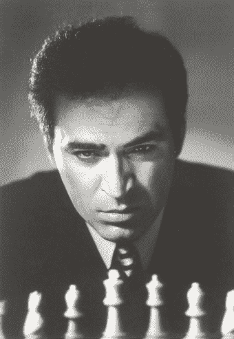

# 玩的机器(深蓝后)

> 原文：<https://medium.com/hackernoon/machines-that-play-post-deep-blue-9246e906beb6>

## 深蓝色的反应。这是有趣的部分。

这个系列涵盖了人工智能和游戏的历史(直到深蓝),并专注于下棋、跳棋和西洋双陆棋的机器。涵盖了以下主题:如何构建国际象棋机器、香农在国际象棋方面的工作、图灵在国际象棋方面的工作、土耳其人、El Ajedrecista、MANIAC、Bernstein 国际象棋程序、Samuel's checkers、Mac Hack VI、Cray Blitz、BKG、HiTech、Chinook、Deep think、TD-Gammon 和深蓝。

第一部分:[会玩的机器(概述)](/@reasonets/machines-that-play-overview-7f670681ef6a)

第二部分:[会玩的机器(建造象棋机器)](/@reasonets/machines-that-play-building-chess-machines-7feb634fad98)

第三部分:[会玩的机器(深蓝之前的象棋)](/@reasonets/machines-that-play-chess-9091671dbea8)

第四部分:[玩(深蓝)的机器](/@reasonets/machines-that-play-deep-blue-5a2af4e739f7)

第五部分:[玩(后深蓝)的机器](/@reasonets/machines-that-play-post-deep-blue-9246e906beb6) —这个

*如果您想要前 5 个部分的摘要，重点是人的因素，请点击此处【链接即将推出】。*

第六部分:[玩(跳棋)的机器](/@reasonets/machines-that-play-checkers-10f7d4038956)

第 7 部分:玩(双陆棋)的机器

# 第五部分:[玩的机器(后深蓝)](/@reasonets/machines-that-play-post-deep-blue-9246e906beb6)

这是 7 部分系列的第 5 部分。在这里，我们谈论人们对“深蓝”战胜加里·卡斯帕罗夫以及之后的计算机象棋的反应。

# **赛前**

*   1997 年比赛前，加里·卡斯帕罗夫在新闻发布会上说(引用古德曼和基恩的《人与机器》，“15 个月前在费城的万豪酒店，当 C.J .介绍我时，我的心情是不同的。我在笑，开玩笑。我预料会有一场精彩的比赛，但我对结果毫不怀疑。今天我没有心情笑了。我觉得现在不是笑的时候。这是非常非常严肃的工作。C.J .刚刚声明，将在 48 小时内与我对弈的计算机比国际象棋计算机历史上的任何其他国际象棋程序都更强大，更快，也更了解国际象棋。对此我毫不怀疑。我对一直与深蓝和现在的深蓝一起工作的团队充满敬意，我觉得如果在 1989 年我第一次玩《深思》的时候，它是关于乐趣的。1996 年在费城，更多的是关于科学。我相信那个时候，CJ。他的团队想弄清楚他们的科学结论是否正确，深蓝是否能红棋。这次不再好玩，不再科学。我认为他们想赢。(笑声)”

*Garry Kasparov (*[*Wikimedia Commons*](https://commons.wikimedia.org/wiki/File:Kasparov-23.jpg)*)*

卡斯帕罗夫被要求解释他早些时候关于深蓝的声明:他是在某种智能的存在。

他回答，“*是的。我认为我们很难称之为智力，因为我们总是认为智力是类似于我们头脑的东西。但是玩深蓝和其他电脑，但主要是深蓝，我可以闻到它做出的决定是智能的，因为我会用我的直觉得出同样的结论…*

> **……但如果我用 90%的直觉和位置判断以及 10%的计算，深蓝用 95%的计算和 5%的内置象棋知识，结果五次匹配四次，也许我们应该谈谈某种人工智能。”**

# **关于比赛**

回想一下臭名昭著的第二场比赛，一场让卡斯帕罗夫感到不安的比赛，一场专家说看起来像是人类类型的比赛，而不是计算机类型的比赛，一场卡斯帕罗夫在 45 步之后辞职的比赛——但一场他本可以画出来的比赛(他以前从未做过的事情)。

*   大师乔尔·本杰明(Joel Benjamin)说:“这是任何一位人类大师都会为自己能为白棋效力而感到自豪的游戏。这不是电脑游戏。这是真正的象棋。”

想象一下:这是第三场比赛，卡斯帕罗夫知道他可以在第二场比赛中平局，但没有。更糟糕的是，他从未放弃过一个平局。这对他玩第三场比赛有什么影响？嗯，在第三场比赛中，他有白色，但没有发挥他通常的游戏。他玩的是一种非常不同的游戏。

*   谈到卡斯帕罗夫的第三场比赛，纽约时报的一篇题为[谨慎的卡斯帕罗夫和深蓝平局第三场比赛](https://www.nytimes.com/1997/05/07/nyregion/wary-kasparov-and-deep-blue-draw-game-3.html)的文章说，*“他昨天用白色棋子的比赛，谨慎而不是侵略性，是不寻常的，至少与面对活生生的对手的比赛相比。”*他们引用了“深蓝”队的西班牙大师米格尔·伊列斯卡斯的话，

> **“我不想说他害怕，但是当那个拿着白棋子的世界冠军不想进攻的时候，你会怎么做？”**

*   在《人机大战》中，古德曼和基恩引用了一代宗师亚西尔·塞拉万的话:“计算机有优势。它没有这种情绪。我们人类玩家会变得沮丧。我们只是变得沮丧。电脑不会变得沮丧，它没有任何偏见，它不会带来任何情绪上的混乱或不安……加里在整场比赛中都感觉很糟糕，因为加里在整场比赛中都被打败了。

> “…加里处于一种精神状态，他对自己说“伙计，我讨厌这个游戏。我对自己很反感。我玩得像个混蛋。我要在数百万粉丝面前输了。我在这里做什么？为什么我今天醒来？同样，这是一个令人生畏的因素。当你坐在那里，被告知你的对手以每秒 2000 万步的速度分析国际象棋，而你所看到的只是一个三四步的永久检查，你必须明白你的对手已经看到了一切。”

*   但是卡斯帕罗夫很有韧性。他的团队说他已经克服了，并准备好迎接挑战。根据《纽约时报》的文章，其他大师不认为卡斯帕罗夫正在崩溃，“卡斯帕罗夫先生没有看到抽签策略，国际大师大卫·利维说，因为他觉得计算机会确保永久检查是不可能的。弗里德尔对此表示支持，他说卡斯帕罗夫告诉他，“电脑运行得太好了，我甚至没有考虑过。”
*   IBM 团队没有面临这些类型的困难。《人机大战》引用默里·坎贝尔的话，“没有你如何处理平局这个问题当然很好。你知道，加里必须表现出极大的勇气，才能不让这样的事情困扰他。”
*   还记得卡斯帕罗夫暗示 IBM 作弊的时候吗？当被问及他是否认为存在人为干预时，他说:“这让我想起了 1986 年马拉多纳在对阵英格兰时打进的那个著名进球。他说这是上帝之手。”

# **关于比赛**

*   在输给深蓝之后，加里·卡斯帕罗夫[在他 1997 年的时代文章《IBM 欠我一场重赛》中说](http://webdocs.cs.ualberta.ca/~jonathan/PREVIOUS/Grad/Papers/db.html)，“我*也认为 IBM 欠我和全人类一场重赛。我在此向 IBM 发起挑战，每隔一天进行一场 10 场比赛，持续 20 天。我希望在我的代理人在场的情况下，提前访问与中立玩家或另一台计算机玩的 10 场深蓝游戏的日志。我想在今年秋天打这场比赛，那时经过一个夏天的假期和准备，我会处于最佳状态。我准备好孤注一掷了，赢家通吃，只是为了表明这不是钱的问题。此外，我认为如果 IBM 辞去比赛组织者的职务是明智的。应该独立组织。*

但是 IBM 已经让深蓝退休了。重赛将需要数月的资源和准备，IBM 不想在这上面花费时间。在《科学美国人》这篇题为“【深蓝 20 年后的 的文章中，Campbell 说:*“我们觉得我们已经实现了我们的目标，证明了计算机可以在一场比赛中击败国际象棋世界冠军，是时候转向其他重要的研究领域了。*”

通常在任何重要的国际象棋比赛中，玩家都会研究对手以前的比赛。根据卡斯帕罗夫和他的团队的说法，当他们向 IBM 询问深蓝之前的比赛时，IBM 说没有什么可以分享的，因为没有公开的比赛。结果是深蓝在 1996 年对卡斯帕罗夫的比赛后就再也没有参加过任何比赛。深蓝的训练和准备完全是私下进行的。因此，加里盲目地参加了 1997 年的比赛——这是他从未做过的事。深蓝记得卡斯帕罗夫参加过的每一场比赛。

*   在[连线文章](https://www.wired.com/2001/10/chess-2/)中，雷敏锐说道:

> **“IBM 扭曲了规则。他们实际上并没有作弊，但是他们利用了规则书中的每一个资源来使加里处于不利地位。如果他们公平对待他，他就会赢。”**

《连线》文章的作者接着说，“*大多数大师，甚至那些经常被卡斯帕罗夫踢得满棋盘都是的人，都同意这一点。*

*   在第六场比赛后的新闻发布会上，卡斯帕罗夫说:“我认为是时候让深蓝证明这不是一个单一事件了。我个人向你保证，如果它开始玩竞技象棋，把它放在一个公平的比赛中，我个人向你保证我会把它撕成碎片。”【见[最后一局](https://www.youtube.com/watch?v=TdykHC93PrA)的罕见镜头。]他后来出现在《拉里·金现场秀》上，说他愿意玩深蓝“要么全有，要么全无，赢家通吃”。但这并没有发生。复赛后不久，IBM 决定让深蓝退役，并结束了它的所有工作。
*   [芝加哥论坛报的詹姆斯·科茨在 1997 年 10 月写道,*“IBM 的深蓝部门需要整顿，因为它的领导人在 9 月 23 日宣布，他们将淘汰他们大肆宣传的一胜一负的深蓝国际象棋计算机，而不是给浮夸而不可预测的特级大师加里·卡斯帕罗夫一次重赛的机会。那些在 5 月份建造了一台电脑，光明正大地击败了世界上最好的国际象棋选手的天才们，需要在 10 月份在这里学习每个幕后扑克玩家和台球玩家从 git go 中学到的第一课。我说的是三的法则。说我们正在玩 9 球或乒乓球，你把我干掉。我要求重赛，但几乎没赢你。然后我说再见，我是更好的球员，现在我要回家了？*”他继续说道:](http://articles.chicagotribune.com/1997-10-05/business/9710050394_1_big-blue-chess-united-airlines)

> **“在台球厅和牌室为了更少的钱被打断了腿。”**

*   深蓝震惊了世界。每个人都对这场比赛或深蓝或卡斯帕罗夫或 IBM 或智力或创造力或蛮力或头脑有自己的看法。让我们从 IBM 首席执行官路易斯·郭士纳(Louis Gerstner)的观点开始，“*我们拥有的是世界上最好的棋手对加里·卡斯帕罗夫。”*

# 谁是更好的玩家？

那么，深蓝真的是最好的棋手吗？还是卡斯帕罗夫仍然是更好的球员？

问题是复赛只有六局，卡斯帕罗夫只落后一分。冠军赛通常有更多的比赛，大多数以平局告终。所以，很难说六场比赛的重赛能说明谁是更好的选手。大多数人会认为卡斯帕罗夫仍然是更好的球员。但这可能不是真正的重点。我们看到一些非常特别的人付出了巨大的努力来创造一台机器，它迫使我们当中最优秀的人去怀疑。它在我们最珍视的一场比赛中击败了我们，让我们肃然起敬(或有些人感到恐惧)。

*   乔纳森·谢弗[说](http://webdocs.cs.ualberta.ca/~jonathan/PREVIOUS/Grad/Papers/db.html)，*“回顾这场比赛，我们能得出这样的结论吗，一台国际象棋计算机(深蓝)现在比人类所能提供的最好的还要好？没有，至少现在还没有。我想到了两点。首先，我们认为卡斯帕罗夫下了一盘更好的棋，并且未能转换他的机会。第二，IBM 买下了卡斯帕罗夫的播放权；他们没有赢得它。通过向卡斯帕罗夫提供大量金钱来玩，深蓝可以绕过正常途径来玩卡斯帕罗夫，包括候选人的比赛。深蓝已经证明可以成功与卡斯帕罗夫抗衡；它还没有证明它能打败世界上其他顶级的大师。例如，阿纳托利·卡尔波夫的位置打法可能会给深蓝带来麻烦。*
*   查尔斯·克劳萨默在《标准周刊》的[害怕](http://www.weeklystandard.com/be-afraid/article/9802)中写道*“让所有人惊讶的是，不仅仅是卡斯帕罗夫，在这场耗尽战术的比赛中，深蓝赢了。出色地。创造性地。人性上。原谅我，这是一场微妙的游戏。”*

> **“…深蓝赢了。出色地。创造性地。人性上。原谅我，这是一场微妙的游戏。”**

*   尽管“深蓝”玩了一场似乎具有一些“人性”元素的游戏，尽管它的胜利似乎令人震惊，但罗德尼·布鲁克斯(和其他人)说，训练一台机器玩一场困难的战略游戏不是智能，至少不是我们为其他人使用的智能；这一观点得到了许多人工智能研究者的认同。另一方是德鲁·麦克德莫特，他说人们用来说深蓝不聪明的通常论点是错误的。他说，“阿英·深蓝不会真正思考象棋就像说一架飞机不会真正飞是因为它不会扇动翅膀。”

**那么深蓝智能吗？**

可能，有一点。深蓝当然不傻，但它也不聪明，就像我们说另一个人聪明一样。深蓝展示的是一种狭隘的智慧；那种在一个领域显示出辉煌的类型，它之所以如此，是因为人类创造了更好的硬件、更好的软件、更好的算法和更好的表现形式。但是如果你让这些专门的机器去做别的事情，它们就会失败。深蓝会在我们做的所有其他非象棋相关的任务中失败；它没有表现出一般的智力。到目前为止，还没有一台机器表现出普遍的智能，看来它们要做到这一点还有很长的路要走。

# 深蓝是如何做到这一点的？

*   默里·坎贝尔[说](https://www.businessinsider.com.au/15-years-ago-today-ibm-deep-blue-kasparov-2012-5#the-deep-blue-team-from-left-to-right-was-a-joseph-hoane-jr-joel-benjamin-jerry-brody-feng-hsiung-hsu-chung-jen-tan-and-murray-campbell-1)，*“如果我们简单地使用蛮力处理，它就不会有机会。这需要专注的计算工作。”*
*   当 Murray Campbell 被问及计算机的某一步棋时，他回答道,*“系统在做出下一步棋的决定之前会搜索数十亿种可能性，而要真正弄清楚它为什么要下一步棋是不可能的。它需要永远。你可以看看各种线，得到一些想法，但是…*

> “…你永远无法确切知道它为什么会这样做。”

深蓝只会下棋，别的什么都不会。这叫狭义智力。然而，这种狭隘的智慧已经如此复杂，以至于它的创造者无法追踪它的个人决定。深蓝没有在给定的位置做出同样的举动，它只是太复杂，太复杂，或者太难理解它的决定。可解释性在那时已经太难了，而且从那以后解决它变得越来越有挑战性。

在深蓝之前，人类在国际象棋中获胜。机器真的打不过最优秀的人类——差远了。但是后来深蓝赢了。很快其他机器也这样做了，从那以后它们一直在打败人类。这种巨大的性能增长是他们的身份。

> 无论我们的改进速度有多快，一旦机器开始改进，它们的进步最终会以指数形式被衡量。而我们的没有。

但这并不是我们对他们，尽管这是加里·卡斯帕罗夫对深蓝。这是一个游戏，一种测试机器如何学习、提高和玩耍的方式。但最大的胜利是人类，因为他们的智慧创造了深蓝。

# **关于胜利**

*   Jonathan Schaeffer [说](http://webdocs.cs.ualberta.ca/~jonathan/PREVIOUS/Grad/Papers/db.html)，*电脑象棋的圣杯已经被深蓝队夺得。他们已经努力工作了很长时间来赢得它。这个团队，尤其是许凤雄和默里·坎贝尔，值得整个计算机国际象棋界衷心的祝贺。*

## 我们的情绪很重要

大多数人认为卡斯帕罗夫仍然是更好的球员，但他的情绪起了作用。不管怎样，这场比赛最大的收获之一是我们集体低估了比赛的生理和心理方面。我们的情感、恐惧、欲望和怀疑总是能战胜我们，有时我们除了袖手旁观之外别无他法，只能让它过去。这是人类特有的问题，我们的机器对手并不担心。

> ***我们的情感、恐惧、欲望和怀疑总是能战胜我们……这是人类特有的问题，我们的机器对手并不担心。***

这是卡斯帕罗夫在整场比赛中一直暗示的主题，直到现在还在继续讨论。【旁注:一段[视频](https://www.youtube.com/watch?v=NJarxpYyoFI)卡斯帕罗夫 vs 深蓝的总结】

# **电脑棋帖深蓝**

**人机对抗赛结束**

2005 年，拥有定制硬件和 64 个处理器的专用国际象棋超级计算机 Hydra 在六场比赛中击败了排名第七的迈克尔·亚当斯(5.5-0.5)。一些人批评迈克尔·亚当斯没有像卡斯帕罗夫那样做好准备，但这无关紧要——这次事件是人机比赛结束的开始。

Hydra 是由 Christian Donninger 博士、Ulf Lorenz 博士、特级大师 Christopher Lutz 和 Muhammad Nasir Ali 组成的团队开发的。团队估计其评分超过 3000！

**接下来呢？半人马的崛起**

加里·卡斯帕罗夫推出了高级国际象棋(也被称为电子人国际象棋、半人马国际象棋或伊万诺夫国际象棋)，一名人类棋手和一个计算机国际象棋程序将作为一个团队与其他这样的对手对弈。这是卡斯帕罗夫看到(并继续看到)人类和机器之间理想互动的一个完美例子。这个想法是，先进的国际象棋将增强人类的表现。

第一届高级国际象棋比赛于 1998 年 6 月在西班牙莱昂举行。6 场比赛在使用 Fritz 5 的加里·卡斯帕罗夫和使用 ChessBase 7.0 的 Veselin Topalov 之间进行。决定玩家将仅在第三和第四场游戏中查询内置的百万游戏数据库，并且将在不查询数据库的情况下为剩余的游戏使用国际象棋引擎。在比赛期间，每个运动员的时间是 60 分钟。这场比赛以 3 比 3 平局结束。

2017 年，国际象棋引擎 Zor 赢得了自由式极限挑战锦标赛(自由式是一种变异或高级国际象棋，也允许咨询团队)。最佳人机结合电脑排名第三。国际象棋机器现在比人类加计算机更优越。

**电脑象棋状态**

国际象棋机器以超人类的水平运行，也就是说，它们比**所有**人类都表现得更好。以下是不同的象棋机器打败人类的时候:

*   超级计算机(1997):深蓝对加里·卡斯帕罗夫(3.5-2.5)
*   个人电脑(2006):迪普·弗里茨对弗拉基米尔·克拉姆尼克(4-2)
*   移动电话(2009 年):袖珍弗里茨 4 赢得了 9 场比赛和 1 场平局(得分 9.5，满分 10 分)，赢得了南美共同市场大师赛
*   计算机战胜人类+计算机(2017):佐尔

**我们现在怎么下棋？**

在他的第 538 次采访中，默里·坎贝尔被问及计算机是否正在抹杀国际象棋的魅力，他回答道:“在计算机时代接受大部分训练的大师们下棋的风格更加客观。他们不太愿意因为一步棋难看或不符合他们的审美而放弃它……象棋是一门艺术，但更像是一项运动。如果你对胜利感兴趣，那么你就下正确的棋，即使是“丑陋”的棋或“计算机”的棋……超深度的准备可以创造一种平局的倾向。白方球员会试图创造一个对手有机会出错的位置。如果黑棋玩家准备得足够充分，他们会找到穿过混乱局面的方法，并找到抽牌的方法。我当然可以想到一些 20 或 30 步的游戏，这些游戏可能完全是在家里计算的。”

# **自深蓝以来最大的计算机象棋范式转变**

2017 年，DeepMind 的 AlphaZero 在 100 场比赛中以 28 比 0 击败 Stockfish，72 平。它用类似的方法不仅掌握了国际象棋，还掌握了围棋和象棋。

这是令人难以置信的部分:想象向计算机展示棋子如何移动，也就是说，向它展示合法的移动，仅此而已。然后你告诉电脑学会玩这个游戏——自己玩。仅仅 9 个小时——是的，仅仅 9 个小时——它不仅知道如何下棋，还知道如何以如此高的水平下棋，以至于击败世界上最强的程序——到目前为止！

仅仅经过 4 个小时的训练，AlphaZero 就以比 Stockfish 8 更高的 Elo 等级比赛，经过 9 个小时的训练，它在 100 场比赛中决定性地击败了 Stockfish 8。

阿尔伯塔大学的人工智能研究员乔纳森·谢弗[说](https://eureka.eu.com/innovation/deep-mind-chess/)，*“这让我大吃一惊。这些游戏既漂亮又有创意。AlphaZero 为了获得更多的行动自由，做出了人类甚至不会考虑的明显疯狂的牺牲。但它也不同于所有其他依赖人类输入的国际象棋程序。”其他国际象棋大师同样印象深刻。俄罗斯冠军彼得·斯维德勒(Peter Svidler)表示，AlphaZero 的比赛“*绝对精彩，惊人的*”，他对其比赛感到“敬畏”。*

芒努斯·卡尔森的教练皮特·尼尔森[说](https://eureka.eu.com/innovation/deep-mind-chess/)，

> **“…外星人来了，给我们演示如何下棋”**

[Chess.com](https://www.chess.com/news/view/alphazero-reactions-from-top-gms-stockfish-author)询问专家的第一反应:

*   **Maxime Vachier-la grave**:*“当然结果极其令人印象深刻；我甚至不会梦想赢一场斯托克菲什的比赛。尤其是白色的分数令人印象深刻。”*
*   **法比亚诺卡鲁阿纳:** *“我很惊讶。我认为没有任何其他引擎表现出这样的优势。我认为这是四个小时的学习，所以谁知道它可以做什么，甚至更多。”*
*   谢尔盖·卡尔贾金: *“我非常惊讶，因为我们通常和 Stockfish 一起工作，它看起来是一个很好的程序，但是如果我们有一个程序能如此容易地击败 Stockfish，这可能是新一代的计算机，也可能是国际象棋的历史性一天。我们看看它会变得如何强大！”*
*   **卫斯理如此:** *“我惊呆了。这是新的大事情。这完全改变了国际象棋。它可能被评为，什么，3700？接近 4000？那真是疯了。”*
*   迈克尔·亚当斯:“我非常惊讶。它将有兴趣看到更多的游戏。
*   Levon Aronian: *“我很兴奋，但我不确定现在的情况如何。”*
*   伊恩·奈普尼奇: *“如果有一个国际象棋程序可以轻松击败目前最强的国际象棋引擎，这对我们来说也是一个好消息。我们很快可能会玩其他游戏，但不是象棋！”*
*   **中村光:** *“我觉得研究肯定很有意思；试图在没有任何先验知识的情况下从一开始就学习的概念，所以这肯定是一种新的方法，显然在围棋中效果很好。绝对有意思。话虽如此，在看过游戏并了解了游戏的实力之后，我不一定会对结果抱有很大的可信度，因为我的理解是，AlphaZero 基本上使用的是谷歌超级计算机，而 Stockfish 并不运行在该硬件上；Stockfish 基本上是在我的笔记本电脑上运行的。如果你想进行一场具有可比性的比赛，你还必须让 Stockfish 在一台超级计算机上运行。”*

# 我们将何去何从？

以加里·卡斯帕罗夫的 TED 演讲和他对这次经历的看法作为结尾似乎是正确的。

我从自己的经历中学到的是，如果我们想充分利用我们的技术，我们必须面对我们的恐惧；如果我们想充分利用我们的人性，我们必须克服这些恐惧。 *一边舔伤口，一边从与深蓝的战斗中获得了很多灵感。俄罗斯有句老话，打不过他们，就加入他们。然后我想，如果我能和一台计算机一起玩会怎么样——和我身边的一台计算机一起，结合我们的优势，人类的直觉加上机器的计算，人类的战略，机器的战术，人类的经验，机器的记忆。这可能是有史以来最完美的游戏吗？但与过去不同的是，当机器取代农场动物和体力劳动时，现在它们开始追逐拥有大学学位和政治影响力的人。作为一个与机器战斗并失败的人，我在这里告诉你这是一个非常非常好的消息。最终，每个职业都将感受到这些压力，否则这将意味着人类已经停止进步。我们无法选择技术进步何时何地停止。*

***我们不能慢下来。事实上，我们必须加快速度。我们的技术擅长于消除生活中的困难和不确定性，因此我们必须寻求更困难、更不确定的挑战。机器有计算。我们有默契。机器有指令。我们有目标。机器有客观性。我们有激情。我们不应该担心我们的机器今天能做什么。相反，我们应该担心他们今天还不能做什么，因为我们将需要新的智能机器的帮助来将我们最宏伟的梦想变成现实。如果我们失败了，如果我们失败了，那不是因为我们的机器太聪明，或者不够聪明。如果我们失败了，那是因为我们变得自满，限制了我们的雄心。我们的人性不是由任何技能来定义的，比如挥舞锤子，甚至下棋。只有人类能做一件事。那是梦想。所以让我们梦想成真。***

在这篇题为[“智能机器将教会我们——而不是取代我们”](https://www.wsj.com/articles/intelligent-machines-will-teach-usnot-replace-us-1525704147)的 2018 年《华尔街日报》文章中，加里·卡斯帕罗夫反思了人工智能的进步，并表示:“*我在 1997 年输给 IBM 超级计算机深蓝的国际象棋是其人类创造者和人类的胜利，而不是机器对人类的胜利。同样，机器生成的洞察力增加了我们的洞察力，像望远镜扩展我们的视野一样扩展了我们的智力。我们还没有接近创造出能够独立思考、具有意识和自我决定能力的机器。我们的机器仍然完全依赖我们来定义它们能力和目的的每个方面，即使它们掌握了越来越复杂的任务*。

## 1997 年的结果是这样的:机器赢了，人类也赢了(尽管我们有时会忘记后者)。

# 所以让我们梦想成真。