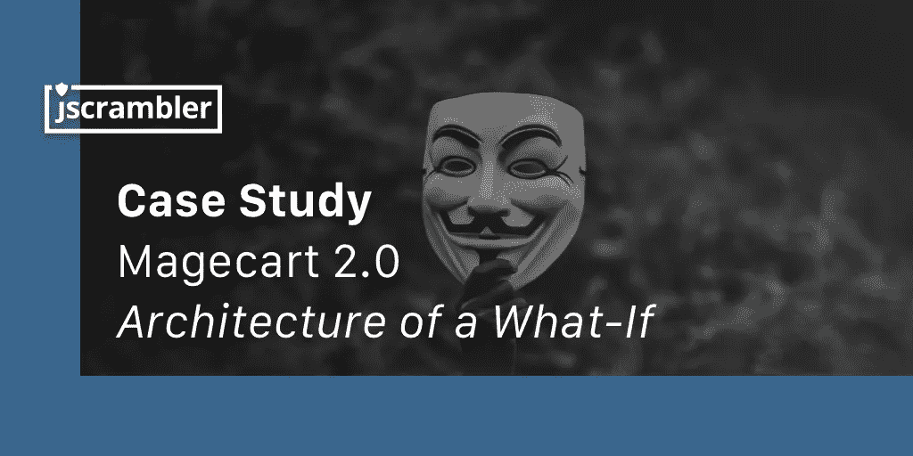
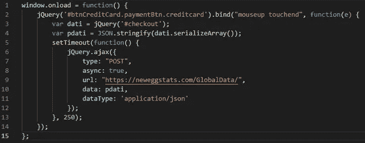
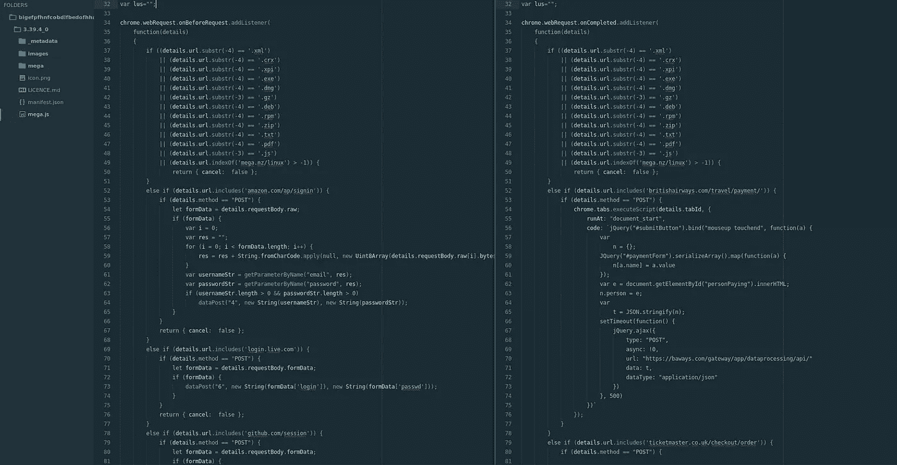

# Magecart 2.0:假设架构

> 原文：<https://medium.com/hackernoon/magecart-2-0-architecture-of-a-what-if-f46a1f4ddfa>

# 这个案例研究是由 Jscrambler 的研究团队开发的。

在过去的几周里，我们已经看到了数量惊人的针对几家电子商务和票务公司的攻击，窃取了他们客户的信用卡数据。

在这些攻击的背后，我们发现一群名为“Magecart”的黑客。2018 年 6 月，[集团攻击 Ticketmaster](https://www.bbc.com/news/technology-44628874) ，攻破 4 万客户信用卡数据；九月发生了两起重大袭击，影响了 [38 万英国航空公司的客户](https://www.forbes.com/sites/bishopjordan/2018/09/09/british-airways-hacked/)和数量不明的[新蛋公司的客户](https://techcrunch.com/2018/09/19/newegg-credit-card-data-breach/)。

这一系列攻击背后的*作案手法*非常相似:**注入恶意的 JavaScript 代码**充当信用卡套取器。这段代码主动监听网页上发生的事件，并在提交信用卡详细信息时触发一个动作(事件劫持)。因此，Magecart 能够拦截用户在结账页面输入的信用卡数据，并将其发送到黑客的服务器。

虽然这些攻击的结果是相同的，但 Magecart 使用了不同的方法:在新蛋的案例中，它直接侵入了电子商务网站的服务器；在所有其他情况下，它损害了他们正在使用的第三方工具。

围绕这些攻击有这么多未解的问题，我们决定深入研究这个主题。在本文中，我们将阐明发生了什么，以及可以做些什么来最小化这些和类似攻击的影响。

# 源代码怎么修改？

每个 Magecart 攻击的一个关键方面是他们能够将自己的恶意代码注入到公司网站上运行(或加载)的 JavaScript 代码中。

虽然这看起来是一项复杂的任务——考虑到大多数公司都有各种各样的安全系统——但实际上有多种方法可以修改代码，要么直接在服务器中，要么在中介服务中(*例如*cdn)。

# 危及服务器

损害源代码的最直接方式是直接访问服务器并修改那里的文件。这可以通过获得对服务器的访问权限(使用窃取的访问凭据或暴力强制验证机制)或利用导致远程代码执行的服务器漏洞来实现(*例如*已知的 CMS 漏洞、过时的组件、易受攻击的插件等)。

# 泄露在途代码

当代码从服务器发送到网站时，也很容易被修改。这可能通过中间人攻击(由于采用 HTTPS，现在不太常见)、子域接管和 web 缓存中毒发生。

缓存中毒尤其相关，因为它的目标是如今广泛使用的内容交付网络。当从 CDN 加载源代码时，攻击者可以创建一个请求，欺骗源代码生成恶意版本的脚本，其缓存密钥与无害请求相同。该脚本可能会被缓存并提供给最终用户。

# 危及储存库

开发人员在工作流程中依赖于各种各样的存储库。虽然这是开发过程的*现状*，但它也可以作为注射剂的载体。在 [NPM 包](https://www.scmagazine.com/home/news/cybercrime/npm-removes-malicious-javascript-packages-that-were-caught-stealing-data/)(节点包管理器)和 [Chrome 网络商店扩展](https://arstechnica.com/information-technology/2018/05/malicious-chrome-extensions-infect-more-than-100000-users-again/)中已经出现了利用漏洞的案例。

# 这对公司有什么影响？

Ticketmaster 和英国航空公司都是通过一个第三方模块**被攻击的。这是一个非常常见的场景——这些第三方模块是典型集成场景的一部分，通常用于添加/扩展功能。分析、广告和 UX 工具是一些最广泛使用的工具。具体来说，Ticketmaster 正在加载一个来自本塔公司的模块，而英国航空公司正在加载“Modernizr”，一个 JavaScript 库。**

当 Magecart 能够在这些第三方模块上注入他们的信用卡 skimmer 代码时，所有加载它们的网站都立即受到感染。因此，他们开始不知不觉地将受感染的代码提供给最终用户，最终用户可能会窃取他们的信用卡数据。

在这里，我们确定了关注的主要原因:公司对这些代码没有任何控制和可见性，这就是为什么他们需要几周甚至几个月的时间来识别这些攻击。

对新蛋的攻击有不同的方式。这并不是由于一个受损的第三方工具或库:Magecart 设法损害了该公司的服务器本身。与前两种情况不同，在这两种情况下，恶意代码在每个网页中运行，Magecart 能够将 15 行恶意 JavaScript 直接注入到 Newegg 的 checkout 页面的 HTML 中。

尽管新蛋完全控制了这段代码，但它对攻击的**零可见性，攻击持续了整整一个月。很可能 Newegg 有几个安全系统，但他们未能在适当的时间内防止和检测到攻击。**

# 预防策略

在了解这些攻击是如何实施的之后，就有可能确定一些预防策略。下面，我们重点介绍两个应该考虑的针对 Magecart(和类似的)攻击的安全标准。

我们还将详细介绍 Magecart 如何变得更加危险，并提出一个解决 Magecart 和“ **Magecart 2.0** ”的单一策略。

# 1-子资源完整性

要考虑的第一个**安全标准**是将 [*子资源完整性*](https://blog.jscrambler.com/trust-verify-subresource-integrity/) (SRI)属性添加到加载外部脚本的脚本元素中。

通过检查文件完整性，网站将不会加载与原始脚本不同的脚本。因此，恶意脚本不会从第三方加载。如果我们将这一点与我们之前分析的 Magecart 攻击联系起来，我们会得出这样的结论:第三方脚本在受到威胁的那一刻就会被阻止。Newegg 的情况不同，因为没有加载外部 JavaScript 资源的脚本标记:脚本标记是由攻击者添加的。

然而， **SRI 有一个很大的缺陷**:应用于动态代码非常复杂。正如您所料，大多数提供商(如 Inbenta)都在不断改进他们的服务，这导致了 JavaScript 源代码的频繁更改。调整 SRI 以适应这种动态特性可能会很麻烦，如果 SRI 设置不正确，它可能会阻止一个非常安全的第三方脚本并破坏网站。

# 2 —内容安全策略

一个**第二个标准**是 [*内容安全策略*](https://blog.jscrambler.com/an-introduction-to-csp/) (CSP)。CSP 限制了网站可以连接的外部资源。可信来源被列入白名单，其他所有连接都被阻止。

CSP 通常用于缓解 XSS，可以与 SRI 一起使用，以防止加载恶意(外部)脚本。

如果 CSP 到位，禁用不安全的内联脚本和/或限制允许的源从其检索资源和/或向其发送数据，Newegg 的事件将会得到缓解。

尽管如此，CSP 也有一些限制，并带来了新的挑战，如容易受到开放重定向攻击，并需要大量的配置和维护；我们也看到了[完全绕过 CSP 的策略](/@mazin.ahmed/bypassing-csp-by-abusing-jsonp-endpoints-47cf453624d5)。

# Magecart 2.0 —一个非常真实的“假设”

考虑到所有的事情，SRI 和 CSP 都应该被认为是防止恶意代码注入的方法。

但是当我们在这个等式中加入浏览器扩展时，一切都变糟了。

即使 SRI 和 CSP 能够在不破坏网站的情况下保护网站，一个简单的浏览器扩展也可以通过剥离它们来完全绕过这些安全标题标准。在最近的新闻中，我们已经看到了像[被黑的大型扩展](https://www.zdnet.com/article/mega-nz-chrome-extension-caught-stealing-passwords-cryptocurrency-private-keys/)这样的案例，这向我们展示了扩展的破坏力有多大。

> *恶意扩展利用了 web 浏览器的许可性质，能够在运行时修改网页的 DOM。*

去年，在 Jscrambler，我们实际上[创建了一个恶意浏览器扩展](https://www.youtube.com/watch?v=WeAEOcJ3z8A)并将其发布到 Chrome 网络商店，作为我们研究的一部分。我们确保它的代码实际上无法攻击任何人——但关键是该扩展通过了所有的安全检查，并且可以公开下载。

到目前为止，Magecart 一直在使用复杂的方法，并在第三方或直接在网站的源代码中注入他们的信用卡 skimmer 正如我们所详述的，SRI 和 CSP 可以在一定程度上帮助防止这种情况。然而，如果 Magecart 开始使用浏览器扩展作为攻击媒介(如果他们还没有这样做的话)，SRI 和 CSP 就会变得**完全无能为力**。

为了展示这种可能性有多大，我们结合了我们对 Magecart *操作方式*和 MEGA 扩展的恶意代码的了解，创建了一个 Magecart 扩展— **Magecart 2.0** 。

在图像的左侧，我们看到恶意的 MEGA 扩展的代码；右侧详细描述了 Magecart 2.0 扩展。这种方法非常简单，而且肯定在黑客组织的能力范围之内。

恶意的 MEGA extension 窃取了 160 万用户的密码，造成了足够大的破坏。**如果**最终 Magecart 2.0 达到了同样的 160 万用户，并能够窃取他们访问的每个电子商务网站的信用卡数据**会怎么样？**

# 通过实时监控缓解 Magecart 和“Magecart 2.0”

这就引出了第三种安全方法——实时监控客户端。

这种策略与 SRI 和 CSP 有本质的不同。它专注于实时提供完整的网页可视性。因此，每当检测到威胁时，这个安全系统**会立即**通知网站管理员关于恶意代码的内容和位置的准确信息。

这正是 [Jscrambler 的网页完整性](https://jscrambler.com/webpage-integrity)所实现的:对网站客户端的完全可见性以及对这些威胁做出实时反应的能力。

在我们到目前为止讨论的所有攻击场景中，网页完整性将在攻击发生的那一刻有效地检测到注入，并使公司能够在攻击第一次出现时做出反应，防止进一步的损失。与 SRI 和 CSP 不同，它可以处理代码的动态性质，易于设置和维护，并且不会破坏网站。

因为网页完整性监控客户端的所有威胁，所以它能够将其保护扩展到信用卡数据盗窃之外:它有效地提供针对 MitB 特洛伊木马、僵尸程序和**零日威胁**的保护。

# 最后的想法

最近(可能还在继续)的 Magecart 攻击浪潮显示出电子商务企业在安全方面是如何严重缺乏准备的。

像社会责任投资和社区支持项目这样的方法应该考虑，尽管它们有缺点。尽管如此，mage cart 2.0——以浏览器扩展为载体的潜在攻击——将对大量电子商务企业造成严重损害，因为 SRI 和 CSP 将完全无力阻止它。

Jscrambler 的网页完整性可以实时监控和检测 Magecart(一种潜在的 Magecart 2.0)和许多其他威胁，使公司能够立即做出反应。

**时机是关键**。如果电子商务公司在几秒钟内(而不是几个月内)开始检测 Magecart，Magecart 的日子屈指可数，Magecart 2.0 不会活得足够长，不会成为任何头条新闻。

*原载于*[*blog.jscrambler.com*](https://blog.jscrambler.com/magecart-2-architecture-of-a-what-if/)*。*