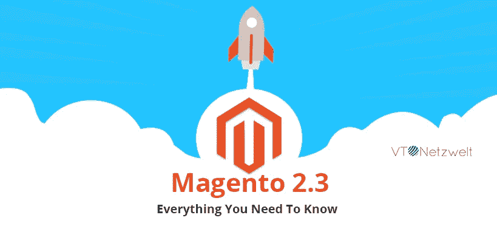

# Magento 2.3 —您需要知道的一切

> 原文：<https://medium.com/hackernoon/magento-2-3-everything-you-need-to-know-19cd4cb8e6d6>

在 4 月份的 [Imagine 2018](https://imagine.magento.com/) 会议期间，Magento 宣布将于 2018 年底发布 Magento 2.3。

经过长时间的等待，Magento 于 2018 年 11 月 28 日发布了 Magento 2.3。

距离 Magento 2.2 的最后一个主要版本已经过去了将近一年，但 Magento 2.3 已经带来了大量新的核心功能和许多较小的优化。

# Magento 2.3 引入了 11 项新功能

Magento 2.3 引入了大量新的核心功能，例如

*   渐进式 Web 应用程序(PWA)工作室
*   GraphQL 支持
*   声明性数据库模式
*   异步和批量 Web API
*   弹性搜索
*   PHP 7.2 支持
*   多源库存(MSI)
*   所见即所得升级
*   页面生成器
*   缓存管理
*   Google reCAPTCHA 和双因素认证

让我们仔细看看它们。

# 渐进式 Web 应用程序(PWA)工作室

# 什么是渐进式 Web 应用程序(PWA)？

渐进式 web 应用程序(PWA)是 Web 应用程序开发的未来。带有 Android 即时应用程序的 PWA 是继响应式 web 设计之后 Web 行业的下一个进步。

渐进式 Web 应用程序使用渐进式增强，提供类似于原生移动应用程序的功能。

渐进式网络应用程序和 Android 即时应用程序结合在一起，让您创建具有材料设计和动画的美丽应用程序，而无需安装在任何设备上。

在移动设备上浏览网站时，您是否遇到过弹出窗口显示“添加到主屏幕”的情况？当你点击按钮时，应用程序会在后台自动安装。现在，该应用程序显示在您的应用程序抽屉中，并提供原生移动应用程序的体验。

该应用程序是从网络应用程序下载的，没有看到 Play Store 或 App Store 的外观。是不是很棒！！！

这些 PWA 应用程序提供对内容的离线访问，而不需要互联网连接。

# Magento PWA 工作室

Magento PWA Studio 是一个工具集，允许在 Magento 2 上开发、部署和维护 PWA 应用程序。

Magento PWA Studio 包含现代库和工具，例如

*   **pwa-buildpack** —主要开发工具的集合
*   **百富勤**—UI 组件集合

pwa 通常基于 JavaScript 框架，如 [React](https://www.vtnetzwelt.com/services/website-development-design-company/react-js-development-company/) 、Vue.js、AngularJS，用于处理应用程序的前端；并通过 REST API 的方式与 Magento 2 进行通信。这种方法被称为无头 Magento。

Magento PWA Studio 需要 GraphQL 功能，该功能仅在 Magento 2.3 版本中提供。

# GraphQL

# GraphQL 是什么？

[GraphQL](https://graphql.org/) 是一种 API 的查询语言。构建和查询 API 是现代技术之一。

简而言之，GraphQL 是一种解决如何从服务器请求数据并帮助将数据加载到客户机的语法。

GraphQL 提供–

*   它给客户一个机会来准确地确定它需要什么信息。
*   从各种来源收集信息变得更加容易。
*   它使用类型系统来描述数据。

# Magento GraphQL 支持

Magento 2.3 最大的动作之一就是引入了 GraphQL API 语言。GraphQL 比 REST API 更强大、更灵活、更高效。

Magento 2.3 除了 REST API 和 SOAP API 之外，还执行 GraphQL 作为可选的 API 端点。

GraphQL 通过允许请求您所需要的精确信息，为 PWAs 提供了数据检索的可能性。这意味着您可以用更少的 API 请求更高效地获得更少量的数据。

它允许 Magento PWA 即使在慢速移动网络连接上也很快。

# 声明性数据库模式

在以前的 Magento 版本中，可以使用 InstallSchema 和 UpgradeSchema 类来更改 Magento 数据库的模式。

然而，Magento 2.3 使用声明性数据库模式来实现它。在声明性数据库模式中，不是用安装脚本来定义数据库结构和更改，而是使用 XML 文件来改变模式。

Magento 将 XML 文件转换成 SQL 查询并运行它们。

使用声明性数据库模式的主要优点是回滚支持。现在，您可以轻松地回滚到模块或功能的先前版本。

声明式数据库模式也大大简化了 Magento 的安装和升级过程。

# 异步 API 请求

异步 API 使 Magento 能够异步处理大量 API 请求，而无需等待服务器响应。

因此，与传统的 API 方法相比，它具有巨大的优势，在传统的 API 方法中，客户端必须等待很长时间才能得到响应，直到所有的请求都被处理完。

该视频演示了异步 API 在消息队列上的工作。

# 弹性搜索

[Elasticsearch](https://www.elastic.co/) 是一个基于 Apache Lucene 的开源、可扩展的企业级搜索引擎。

Elasticsearch 提供强大而快速的搜索，通常用于日志分析、商业分析、基于文本的搜索等等。

在 Magento 2.3 中，Elasticsearch 现在对 Magento 开源用户开放，而以前只对 Magento Commerce 开放。

Elasticsearch 将为商家提供在其网上商店中集成强大的搜索引擎功能。

# 支持 PHP 7.2

Magento 2.3 增加了对 PHP 7.2 的支持，从而提供了更高的稳定性、安全性和增强的性能。由于 PHP 7.2 移除了对 PHP 加密模块' mcrypt '的支持，现在 Magento 2.3 已经从 mcrypt 转移到 lib 钠用于密码哈希。

# 多源库存(MSI)

Magento 2.3 的另一个新增功能是多源库存(MSI)。

现在，商家可以管理他们的库存，而不需要第三方扩展。

MSI 使商家能够通过在 Magento 系统中添加他们的物理仓库来管理来自多个位置的库存。

此外，MSI 通过在结账流程中添加预订系统，提高了结账性能。现在，不是在结帐过程中从库存中减少库存，而是在新的表结构中保留库存。

它有助于不必要的数据库锁定，也有助于在订单高峰期保持库存数量最新。

# 所见即所得升级

Magento 2.3 已经将 TinyMCE 编辑器从版本 3 升级到版本 4，引入了新的增强功能。小部件、媒体剪辑库现在作为插件实现。

# 页面生成器

页面生成器无疑是 Magento 2.3 最值得期待的功能。现在，您可以轻松地创建一个具有拖放功能的页面，而不必使用 Magento 很久以前购买的 Bluefoot CMS 扩展编写代码。

Bluefoot CMS 扩展包括诸如拖放布局、模板创建、干净的 UX 和对非技术用户友好等功能。

Page Builder 现在是 Magento Commerce 2.3 的核心部分，可供 Magento marketplace 内的开源用户购买，但是定价仍然未知。

# 缓存管理

Magento 2.3 增加了系统缓存的管理访问控制功能。现在，您可以轻松地为用户定义角色，如谁可以查看和删除 Magento 缓存，以及特定用户可以执行什么级别的缓存管理。

# Google reCAPTCHA 和双因素认证

Magento 2.3 引入了双因素认证，这已经成为每个 web 应用程序的标准。

现在你可以通过增加额外的安全等级来保护你的 Magento 管理面板免受恶意攻击。

Magento 还推出了 Google reCAPTCHA，这是 Google 的一项免费服务，可以保护您的网站登录、注册、联系页面等。Google reCAPTCHA 将会在 Magento 2.3 中出现。

# 摘要

这就是 Magento 2.3 所能提供的一切。热烈鼓掌欢迎 Magento 核心团队和所有为 [Magento 社区](https://magento.com/community)做出贡献的人，感谢他们的辛勤工作。

你还有什么疑问吗？[请求我们经过认证的 Magento 专家回电](https://www.vtnetzwelt.com/contact-us/)。

VT Netzwelt 是一家屡获殊荣的印德 [Magento 开发公司](https://www.vtnetzwelt.com/services/magento-development-company/)。作为 Magento 认证机构，我们为日益增长的知名跨国机构客户提供一流的 Magento 开发服务。

无论您是希望从头开始建立一个新的 Magento 商店，自定义 Magento 开发还是希望增强您现有的网站，我们的长期经验，丰富的工具集和广泛的行业知识使我们成为您首选的 Magento 合作伙伴。

更多见解请访问我们的[官方 Magento 博客。](https://www.vtnetzwelt.com/category/ecommerce-blog/)