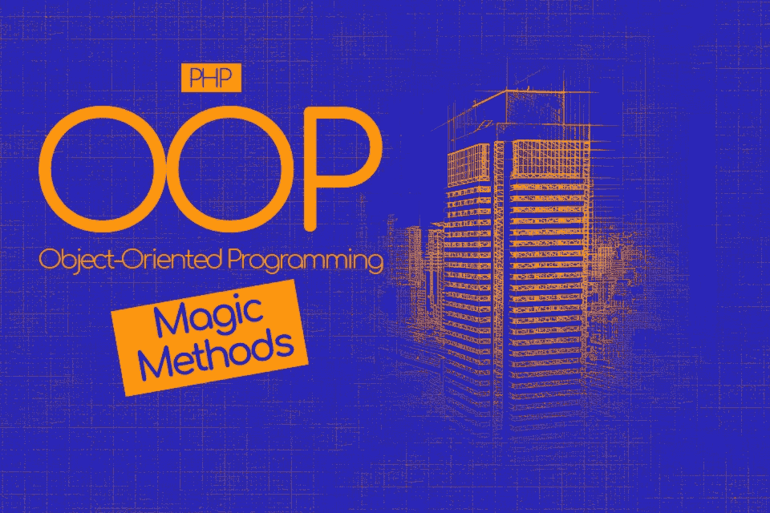
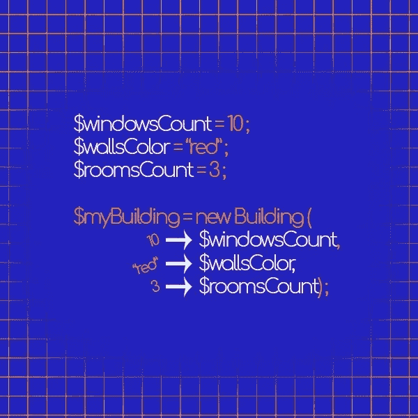
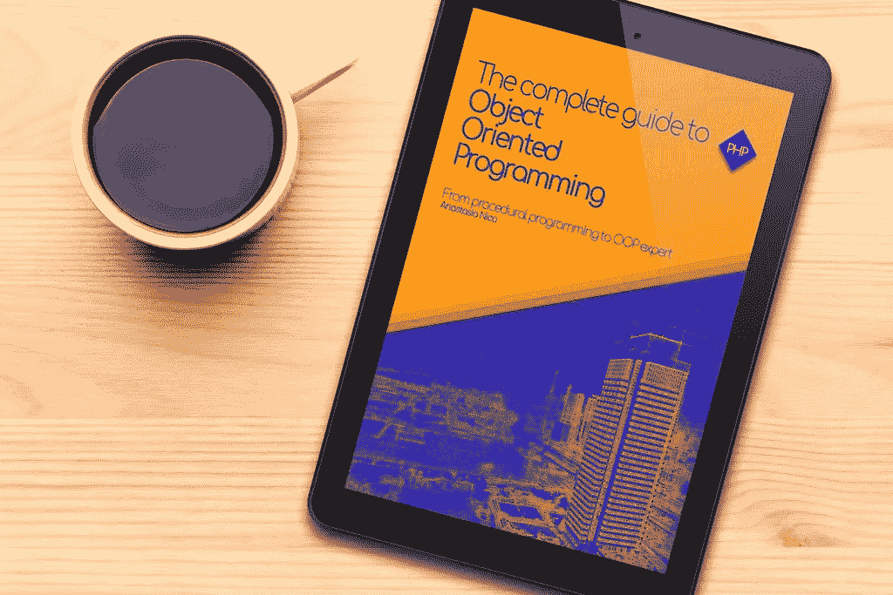

# OOP 中的神奇方法:权威指南(PHP)

> 原文：<https://medium.com/hackernoon/magic-methods-in-oop-the-definitive-guide-php-e3f8a0da278>



如果你能定义一些未来可能发生的场景或事件，当它们发生时，你的代码会被自动触发去做你想让它做的事情，那该多好？

这些是魔法的力量，

继续阅读，发现这些面向对象技术之外的秘密

# 跟随系列…

这篇博文是“ [**面向对象编程完全指南:**](https://amzn.to/2OfCZej) 从过程化[编程](https://hackernoon.com/tagged/programming)到面向对象编程专家 [PHP](https://hackernoon.com/tagged/php) 的第五部分

如果你还没有阅读其他部分

你可以查看下面链接的其他博文
[面向对象编程简介](http://anastasionico.uk/blog/the-complete-guide-to-object-oriented-programming)，
[PHP 中的继承和接口](http://anastasionico.uk/blog/inheritance-and-interfaces-in-php)，
[更多接口和多态](http://anastasionico.uk/blog/interfaces-and-polymorphism-in-php)，
[可见性和静态关键字](http://anastasionico.uk/blog/visibility-and-static-keyword-in-php)，
[构造函数和神奇方法](http://anastasionico.uk/blog/php-magic-methods#)，
[抽象类和额外的位*尚未发布，订阅即可获得通知*](http://anastasionico.uk/blog/php-magic-methods#)

# 目录

*   [什么是魔法方法？](http://anastasionico.uk/blog/php-magic-methods#WhatAre)
*   [构造器](http://anastasionico.uk/blog/php-magic-methods#Constructor)
*   [依赖注入](http://anastasionico.uk/blog/php-magic-methods#Dependency%20injection)
*   [可选参数](http://anastasionico.uk/blog/php-magic-methods#Optional%20parameters)
*   [打字提示](http://anastasionico.uk/blog/php-magic-methods#Type-hinting)
*   [_ _ destruct()方法](http://anastasionico.uk/blog/php-magic-methods#destruct)
*   [调用 __call()和 __callStatic()方法](http://anastasionico.uk/blog/php-magic-methods#call)
*   [getter 和 setter 方法](http://anastasionico.uk/blog/php-magic-methods#getterSetter)
*   [toString 方法](http://anastasionico.uk/blog/php-magic-methods#tostring)
*   [_ _ sleep()和 __wakeup()组合](http://anastasionico.uk/blog/php-magic-methods#sleepWakeup)
*   [_ _ invoke()方法](http://anastasionico.uk/blog/php-magic-methods#invoke)
*   [_ _ set _ state()和 var_export](http://anastasionico.uk/blog/php-magic-methods#var_export)
*   [使用 __debuginfo()进行调试](http://anastasionico.uk/blog/php-magic-methods#debuginfo)

# 构造函数和魔法方法

# 什么是魔术方法？

是时候给这篇文章洒点星尘了。

我相信你在你的 web 开发生涯中已经遇到过一些奇怪的符号。

在这种特殊情况下，

我说的是在原始名称前有两个奇怪的下划线(__)的方法。

这些被称为“魔法方法”,它们被用于面向对象的编程中，当使用一个特定的对象时，允许你响应特定的环境。

简而言之，这些方法规定了在那些场合如何反应。

# 构造函数

**构造函数可能是 PHP 中使用最多的神奇方法。**

**有几个设计模式利用了这个方法的功能，**

它由以下命令定义:

**function __construct()**

如果一个类有这个方法，那么每当一个新的对象被实例化时，它都会被调用。

使用构造函数方法时，类的行为会根据该类是否为子类而变化。

如果子类没有指定一个构造函数，对象的行为将从父类继承，就像你之前看到的其他方法一样。

您也可以专门覆盖行为或载入父行为，并根据您的喜好进行编辑。

现在，

当一个新的公寓楼正在建造时会发生什么？

大楼的经理需要赚些钱来支付费用。

为此，他开始寻找租户。

下面是如何在代码中做到这一点

```
class Building{ function __construct() { print "The building is complete. \n"; }}class Apartment extends Building{ function __construct() { parent::__construct(); print "Now looking for tenants."; }}$mainStreet1025 = new Apartment();// the code will output:“The building is complete.Now looking for tenants.”
```

在我们位于 *$mainStreet1025* 的公寓实例化时，程序将自动输出定义的行。

# 依赖注入

你们中一些比较专业的人可能想知道为什么我还没有解释什么是依赖注入，其他一些人肯定奇怪地看着方法名后面的括号，问它们是什么意思，为什么在那里。

嗯，

那个时刻已经到来。

杰佛瑞·威，拉卡斯美术馆的馆长，我想和你分享一个理论:



你知道宇宙中最小的恒星是怎么被称为的吗？

白矮星！

你能告诉我那个时空区域的名字吗？它展现出如此强烈的引力效应，以至于任何东西，甚至粒子和电磁辐射，比如光，都无法从它里面逃脱。

只不过是黑洞。

你看，他认为，我也同意，天文学家是世界上最聪明的人，他知道，我知道，他们也知道。

对于我们开发商来说，情况有点不同。

我们必须感到聪明，我们有必要一直展示我们所有的神经元。

这大部分时间被翻译成类似依赖注入的东西。

依赖注入只不过是一种非常简单的技术，以一种非常奇特的方式命名，让它看起来很难理解，并让使用它的人看起来是房间里最聪明的人。

那是什么？

**依赖注入是一种提供给定代码段所需对象的方法。**

所需的对象称为依赖关系。

**基本上，不是让你的对象创建一个依赖关系，而是把需要的依赖关系从外部传递给对象，**

这允许开发者使用可变参数而不是固定参数来创建对象。

例子来了…

```
$windowsCount = 10;$wallsColor = “red”;$roomsCount = 3;$myBuilding = new Building($windowsCount, $wallsColor, $roomsCount);$windowsCount = 14;$wallsColor = “green”;$roomsCount = 6;$yourBuilding = new Building($windowsCount, $wallsColor, $roomsCount);
```

给你，

你刚刚发现了括号里的内容。

正如你所看到的，利用这种技术将非常有用，它允许你的代码创建不同的对象，它们中的任何一个都有不同的特征。

例如，$myBuilding 有红色的墙和 4 个房间，而 *$yourBuilding* 有 6 个房间和绿色的墙。

就是这样！

正如我告诉你的，这是一个 5 美分概念的 25 美元术语。

尽管这是一个简单的概念，但我决定等到现在，因为现在您已经知道了什么是构造，您可以很容易地理解本文中的以下示例。

**当实例化一个新对象时，自动调用 __construct 方法。**

所以现在你可以这样做了:

```
class Building{ function __construct($windowsCount, $wallsColor, $roomsCount) { $this->windowsCount = $windowsCount; $this->wallsColor = $wallsColor; $this->roomsCount = $roomsCount; }}$windowsCount = 10;$wallsColor = “red”;$roomsCount = 3;$myBuilding = new Building($windowsCount, $wallsColor, $roomsCount);
```

您刚刚看到了依赖注入的工作！

如果这看起来有点让人不知所措，让我解释一下发生了什么。

构造函数需要 3 个参数: *$windowsCount，$wallsColor* 和 *$roomsCount* 。

调用此方法后，这 3 个参数将包含在类中，使用:

*$ this->nameoftvariable = $ nameoftparameter；*

当创建一个新对象(在我们的例子中是$myBuilding)时，在括号中指定了三个参数:

*$ my Building = new Building($ windows count，$wallsColor，$ rooms count)；*

您需要记住的一个非常重要的注意事项是，这两个地方的参数顺序必须相同，否则您可能会以 *$roomCount* 等于红色结束，并且在一个只有一个房间的建筑中有 50 个窗户。

干得好！

但是我们还没有完成。

有几个改进，我们可以实现这种技术，以提高我们的代码质量。

以下是对它们的简要说明。

# 可选参数

一旦设置了类或方法并需要依赖关系，就必须给出一个参数以免出错，但是如果没有所需的参数呢？

你可以通过给它一个默认值来预先建立它。

怎么会？

```
...function __construct($wallsColor = red){ ...}$myRedBuilding = new Building();$myBlueBuilding = new Building(“blue”);
```

这里创建的两个对象的主要区别是。

在我们创建第一个对象的时候，我们没有提供任何参数，但是我们希望确保人们看到的不仅仅是砖块和混凝土，所以我通过 *$wallsColor = red* 给构造函数添加了一个默认值。

这段代码表达的文学含义是:

**如果没有指定该建筑中墙壁颜色的参数，则使用默认的红色。**

在第二个对象中，您可以看到括号内的蓝色字符串,“蓝色”将覆盖红色的标准颜色。

# 类型提示

什么是类型提示？

类型提示是明确指出所需数据类型(对象、接口等)的实践。).

从 PHP5 的早期版本到新版本，都可以在方法中输入提示参数。

像这样:

```
function __construct(array $address){ ...}$address = [ ‘main street’, ‘248’, ‘London’];$myBuilding = new Building($address);
```

现在构造函数需要一个数组类型的地址变量。

如果你把所有不是数组的东西都放进去，会导致错误。

这个过程非常有用，因为它增加了新的保护级别，从而提高了安全性并改进了代码。

PHP7 的一个新特性是现在甚至可以进行标量类型提示，这意味着如果你使用 PHP 的最新版本，你可以提示布尔值。字符串、整数和浮点变量。

# __destruct()方法

您已经看到，构造函数是实例化新对象时调用的第一个方法，

从逻辑上讲，最后调用的神奇方法的名字是解构器。

当对象不再有引用或强制删除时，会自动调用此方法。

你很少会看到这个方法，但是从我的角度来看，它非常有用，因为 PHP 会清理对象并从内存中删除，从而提高性能。

```
function __destruct() { echo "The building has been terminated";}
```

# __call()和 __callStatic()方法

那些调用方法非常容易理解。

如果一个类有一个 __call()方法(不要忘记双下划线),而你调用了一个对象上不存在的方法，那么 __call()方法将被调用。

```
class Building{ function __call($method, $arguments) { echo _CLASS_ . “has not method ” . $method; }}$myHome = new Building();$myHome->buyAWindow();// This code will echo the sentence in __call() method// "Building has not method buyAWindow"
```

上例中的类没有 *buyAWindow()* 方法，因此，在这种情况下，调用 *__call()* 方法并返回消息。

**__call()** 和 **__callStatic()** 方法之间的唯一区别是，前者响应非静态调用，后者响应静态调用。

请注意，

尽管我没有指定任何参数，但调用方法的第一个参数是方法名，第二个参数是包含可用参数列表的数组。

# getter 和 setter 方法

当代码试图读取或写入类中不存在或不可用的属性时，调用 **__get()** 和 **__set()** 方法；

```
class Building{ function __get($propertyName) { echo $propertyName . “does not exists”; } function __set($propertyName, $propertyValue) { echo “Impossible to set ” . $propertyValue . “to ” . $propertyName; }}$myHome = new Building();echo $myHome->securityCameraCount;// It will echo the string “securityCameraCount does not exists”$myHome->televisionCount = 10;// It will echo the string “Impossible to set televisionCount to 10”
```

在上面的例子中 *$securityCameraCount()* 是一个在 Building 类中不存在的方法，

**__get()** 方法已经传递了它所寻找的属性的名称，所以我们可以通过返回一个警告用户这个错误的字符串来管理这个错误。

我们的电视机也有同样的问题，

这个参数在类中是不可用的，所以当我们试图把值 10 赋给它时，PHP 明白它需要调用 __set()方法，

在 setter 方法中，根据您想要做什么，您可以有几种选择，最常见的管理方法是通过消息向用户显示错误。

# toString()方法

有时可能会发生这样的情况，无论是错误的还是故意的，你会把一个类当作一个字符串。

例如，在执行此操作时:

```
$myHome = new Building();echo $myHome;
```

发生这种情况时， **__toString()** 方法允许你管理类的行为。

这被认为是一个非常微妙的方法，因为它很容易在你编码错误的情况下抛出致命的错误。

举个例子，

这个神奇的方法必须返回一个字符串，你不能从内部抛出异常，如果其中一个条件没有得到尊重，PHP 将返回一个致命的错误。

您可以在下面看到 **__toString()** 方法的完整示例。

```
class Building{ public $sentence; public function __toString() { return $this->sentence; }}$myHome = new Building();echo $myHome;
```

# __sleep()和 __wakeup()对

当对象被序列化或取消序列化时，会调用这两个方法。

准确地说， **__sleep()** 是在序列化之前被调用的。

而 __wakeup()是在取消序列化之后调用的。

它们是如何工作的？

serialize()方法检查调用中是否存在神奇的方法 __sleep()，如果是，serialize()会停止一秒钟，让 __sleep()做它的事情。

因为这个方法必须返回一个数组，通常它的目标是返回一个数组，其中包含所有需要序列化的对象变量的名称。

如果这个方法没有返回任何东西，那么返回的将是空的，并且会显示一个 E_NOTICE。

使用这种方法的一些有用的例子可能是获取不需要保存的大对象数据或执行一些清理工作。

另一方面，您有 __wakeup()方法。

它只是反映了他的密友 sleep()，

这一次是寻找 __wakeup()的 unserialize()方法，如果它存在于类中，那么该方法恢复在序列化过程中丢失的所有数据连接。

```
class Building{ public $address, $city, $postcode; public function __sleep() { return array(address', 'city, 'postcode); } public function __wakeup() { return $address; }}
```

# __invoke()方法

__invoke()方法非常简单，

当代码像调用方法或函数一样调用对象时，它会被自动调用。

```
class Building{ public function __invoke($variable) { var_dump($variable); }}$myBuilding = new Building ;$myBuilding(“23, Main Street”);
```

在上面的例子中，调用方法的结果将显示 *string(15) "23，Main Street"* 。

网上有很多关于如何使用这种方法的例子，但是你可以根据自己的需要选择实现这种方法的最佳方式。

请将此方法视为一种快捷方式，它允许您执行特定的任务，并且可以通过将对象作为方法调用来访问。

这个神奇的方法非常松散，这意味着你可以用它做任何你想做的事情，但是要注意一点，参数和参数需要匹配，

如果您调用对象并设置 4 个参数，那么连接的方法需要有 4 个参数。

忘记这样做将导致脚本抛出错误。

# __set_state()和 var_export

我们刚刚从一个更容易理解的魔术方法过渡到一个最复杂的方法 __set_state()方法，它发生在你的对象的一个实例被传递给 *var_export* 函数的时候。

## var_export()是做什么的？

*它返回一个表示变量的可解析字符串，它非常类似于 var_dump()，但返回值是一个有效的 PHP 代码。*

var_export()需要两个参数，

第一个是强制的，需要表示您需要导出的变量，而第二个是可选的布尔值，表明它是否必须以字符串形式返回变量表示或输出它。

我们需要一个样本:

```
class Building{ public $windowsCount;}$myBuilding = new Building;$myBuilding->windowsCount = 5;var_export($myBuilding);// This code will output:Building::__set_state(array(windowsCount => 5,))
```

现在 __set_state()，

如所述 __set_state()被调用以响应传递给 var_export 函数的对象的实例。

它只有一个参数，该参数必须是包含作为键值对的导出属性的数组。

```
class Building{ public $windowsCount; public static function __set_state($windows) { $myBuilding = new Building; $myBuilding>windowsCount = $windows[‘windowsCount’]; return $myBuilding; }}$myBuilding = new Building;$myBuilding->windowsCount = 5;eval('$state = ' . var_export($a, true) . ';');/*$state = Building::__set_state(array('windowsCount' => 5,));*/var_dump($state);
```

这将导致:

```
object(Building)#2 (1) { ["windowsCount"]=> int(5)}
```

# 使用 __debuginfo()进行调试

PHP 5.6 提供了这个特性，当你转储一个对象时，这个特性被 *var_dump()* 调用，以决定哪些属性需要输出。

如果没有在对象上定义该方法，将显示所有公共、受保护和私有属性。

```
class Building { private $windows; private $doors; public function __debugInfo() { return [ 'windows' => $this->windows, ]; }}var_dump(new Building(10));// Here is the outcomeobject(Building)#1 (1) { ["'windows'"]=> int(10)}
```

在上面的例子中，我们说 __debugInfo()只需要返回$windows 并隐藏$doors

# 第五部分的结论



[*一体化版的《面向对象编程完全指南》的完整版在亚马逊*](https://www.amazon.co.uk/dp/B07J47L6PB) *上有 Kindle 格式，反正很快下面的部分就会出版。*

我希望您现在更加了解 PHP 语言为 Web 开发人员提供的所有方法和技巧。

您可能不会在日常生活中使用上述方法，

但是，

一旦你理解了这些概念，并不时地回到这一页去重温它们的目的，将会帮助你更好地管理你的代码。

另外，请注意，您只需要将这些视为助手。

即使没有人能否认他们的力量，开始使用调用方法，getter，setter 等等最终会让你对你正在写的项目控制更少。

你的主要精力必须放在编写可伸缩的干净代码上，让你做你需要它做的事情，反之亦然。

说那个，

在你深刻理解了依赖注入、构造函数和其他方法的幕后工作原理之后，你就可以放心大胆地利用它们了。

**下一集，**

**你将看到什么是抽象方法，以及与面向对象范例相关的额外特性**

所以，

请继续关注并使用下面的表格订阅，以便在它出版时得到通知。

现在轮到你了:

您是要应用受保护的和私有的关键字来更新您的方法和属性，还是更喜欢到处传播静态关键字？
在下面的评论框里告诉我吧！

**下一集，**

**我们将关注魔法方法**

我准备了一个完整的列表，里面有详细的描述和代码示例。

由于这个原因，

请继续关注并使用下面的表格订阅，以便在它出版时得到通知。


**现在轮到你了:**

你打算在你的代码中实现什么神奇的方法？请在下面的评论框中告诉我！

***如果你喜欢这个内容并且你渴望更多的内容*** [***加入脸书的社区***](https://www.facebook.com/anastasionico.uk/) ***，在这里我们就像这样分享信息和新闻！***