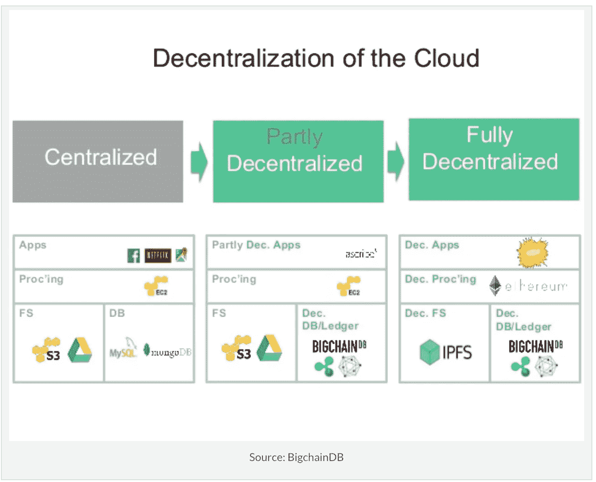
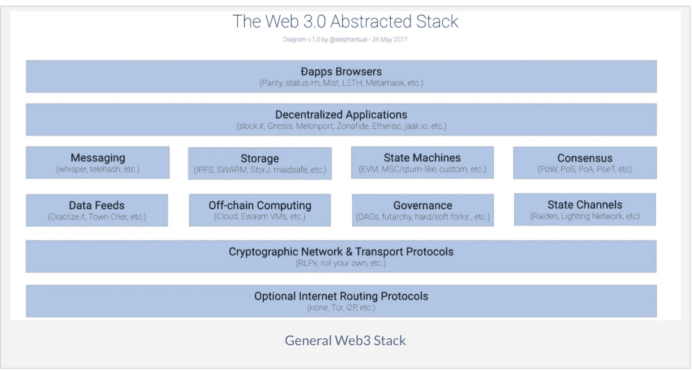
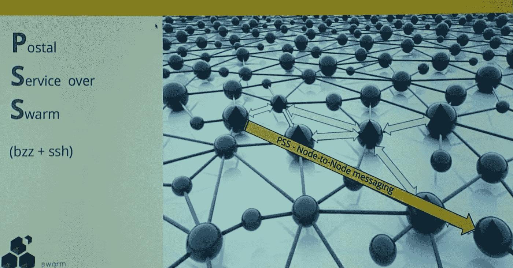
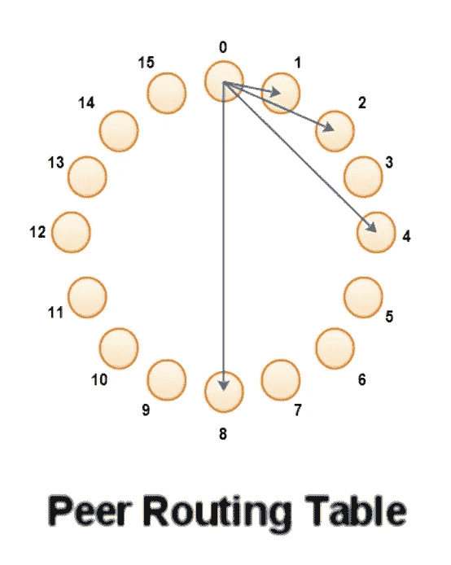
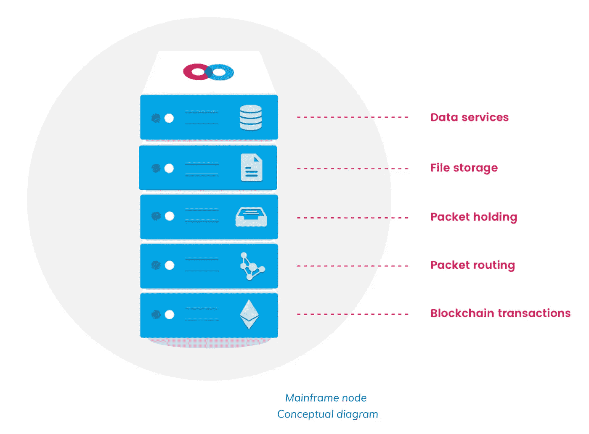
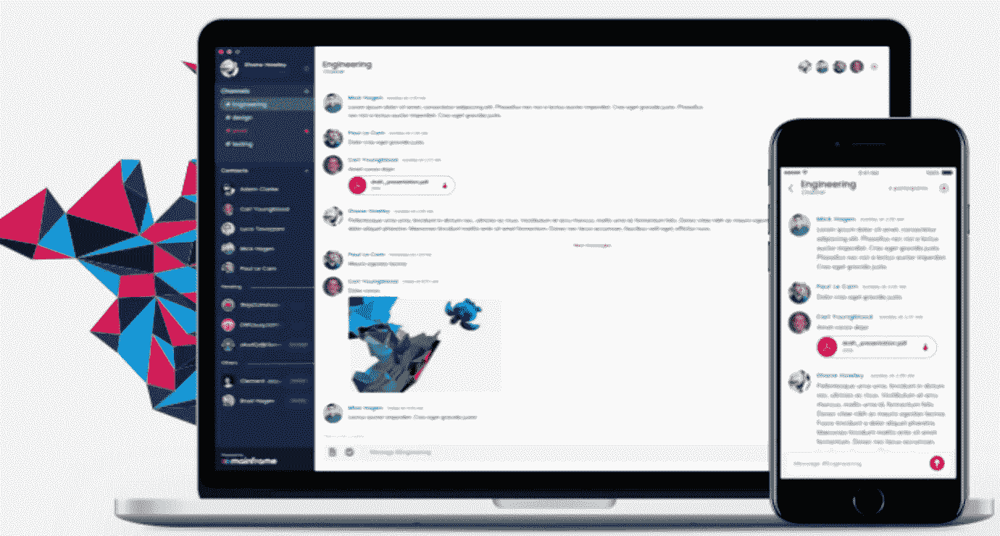
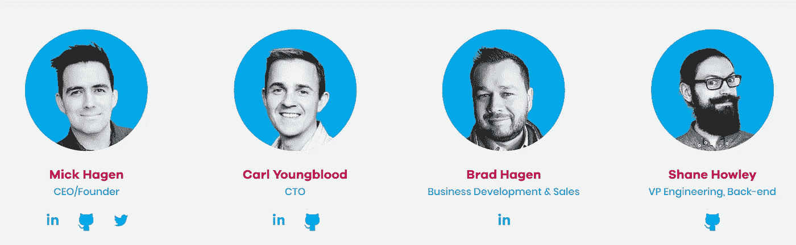
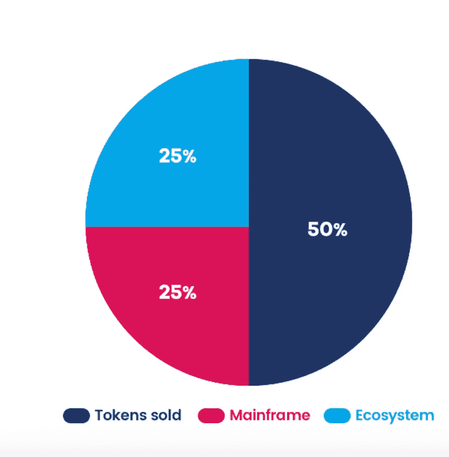

# 大型机 web3 的通信层

> 原文：<https://medium.com/hackernoon/mainframe-communication-layer-for-web3-94df76a6c72a>

***免责声明*** *:我与主机团队没有任何关系。我既不是财务顾问，也不是财务建议。无论接下来发生什么，都只是反映了我对这个项目的理解，以及我对其未来前景的个人看法。*

今天我将写关于[大型机](https://hackernoon.com/tagged/mainframe)项目和它要做的事情。大型机在很大程度上是基于 swarm/pss 的，因此我将在本文的前面介绍 swarm/pss，以获得大型机项目本身的一些背景知识。

## 什么是 web3？

web3 是简单的去中心化网络。所以传统上，我们都一直使用 web2，它是由客户端-服务器架构驱动的。相比之下，我们使用云来托管我们的服务器，它得到了一点增强。但是中央集权仍然存在。现在，我们正试图通过使用去中心化的点对点架构来消除中心化，这就是所谓的 web3。下面是这篇优秀的[文章](https://blockchainhub.net/web3-decentralized-web/)中的几张图表。

Evolution from centralisation to decentralisation

WEB3 decentralised stack

今天，我们将重点关注上图中由 whisper、telehash 等表示的消息传递方面。在传统的集中式系统中，我们有许多常用的消息传递系统，如 activemq、kafka、qpid 等。大型机将为分散式系统提供一个。

我将在本文中解释以太坊[区块链](https://hackernoon.com/tagged/blockchain)的消息传递。其他区块链的信息不在此范围内。

## 群体网络

Swarm 是一个相互共享数据的计算机网络。群网络是大型机正在或已经为区块链以太坊建造的基础。

Swarm 使用与以太坊相同的 p2p 协议(devp2p ),未来的愿景是让您的 eth 节点运行两种协议(swarm 和以太坊)和两个网络的一部分。Swarm 提供文件存储(如分散式 dropbox)、分散式数据库服务和 Storm 上的邮政服务)等服务。对于本文，我们最感兴趣的是 swarm 提供的 PSS 服务。

## Swarm 上的邮政服务

PSS 是建立在群网络之上的节点到节点消息层。已经有了 whisper 消息，它是以太坊栈的一部分，但是它的目的不同，它在所有节点之间路由消息，这使得它对于直接的节点到节点通信来说有些低效。

PSS on top of swarm network for node to node messaging

PSS 使用由 whisper 协议定义的消息格式。消息中部分指定了收件人地址，因此很难窥探消息要发送到哪里。只有能够解密的节点才能读取消息(支持对称和非对称加密)。这种消息转发将在整个网络中发生，直到消息中提到的超时过期。在多播的情况下，消息体中不会有任何地址，因此所有节点都将读取该消息。你可能会认为这是一种低效的消息路由方式，但是 devp2p 使用了一种叫做 kadelmia routing 的东西，使得这种路由方式变得高效。更多信息请见下文。

那么这些信息有什么用呢？每条消息都属于一个主题(记住队列和主题)，您可以将要执行的代码附加到主题上。因此，每当有消息发布到 topic 时，就会执行代码。

***卡德尔米亚路由***

*这是 p2p 网络的一种路由，它使用分布式哈希表来维护网络中最近节点的地址。这里重要的是，节点不会连接到网络中的所有节点，但节点的子集。因此，每个节点的路由表将包含指数距离节点的地址，而不是网络中存在的每个节点的地址。*

**

*Kadelmia DHT*

*如上图所示，节点 0 只有 1、2、4 和 8 个 Id 节点的地址。这样，查找速度非常快，节点路由表不需要包含对整个网络的引用。关于这种查找如何工作的更多信息在这个精彩的[视频](https://www.youtube.com/watch?v=kXyVqk3EbwE)中*

## *SWAP(服务需求和提供的群计费协议)*

*SWAP 是 PSS 用来激励参与 PSS 网络的节点的计费协议。*

*受国家频道的启发，SWARM 引入了一个安全且可扩展的链外框架来支持被戏称为“交换、发誓和诈骗”游戏的通用激励系统。该系统依赖于三大支柱:沟通、登记和执行。(1)对等体参与数据、承诺、支付、消息、请求、交付等的本地交换(p2p 通信)。(交换)对等体将在远程非连接节点之间中继数据，以扩展网络的范围。(2)参与者向智能合约支付保证金，以支持其交货和质量保证的承诺(发誓)。(3)服务提供规则由法庭强制执行，使得节点在不遵守(欺诈)的情况下负责。*

*上述内容的实现是通过使用支票簿智能合同实现的，这是一种离线支付。所以节点互相发送支票。在大型机领域，MFT 令牌用于激励节点*

*在这个精彩的[视频](https://www.youtube.com/watch?v=9Cgyhsjsfbg)和大型机白皮书中有更多的细节。*

# *主机*

*现在让我们把重点放在大型机和它试图解决的问题上。*

***当今互联网软件面临的挑战***

**寻址*:由于进行通信的 TCP/IP 协议栈很容易追踪，因此可以非常准确地追踪流量的来源。这将使匿名变得非常困难，因为地理坐标很容易被识别。*

**域名注册处*:使用像 [whois](https://whois.icann.org/en) 这样的服务，像 [ICANN](https://www.icann.org/) 这样的中央机构很容易就能拿下域名*

**认证机构:* TLS/SSL 层安全性由[认证机构](https://www.whichssl.com/top-10-ssl-certificate-providers.php)提供，如赛门铁克、digicert 等。(浏览器导航条上的挂锁显示网站是否通过 https 连接，是否安全。点击即可了解有效证书详情)。但是这里的问题是，一旦域名被破坏，有人控制了它，从这些中央机构获得证书是非常容易的。*

**通信应用*:当今的通信应用和软件，如 whatsapp、skype、slack、gmail、facebook 等，都在客户端-服务器架构上工作，并受到集中软件问题的困扰，即所有数据都在一个实体的控制之下。从最近剑桥分析数据被黑等事件来看，这可不是什么好事。*

## ***主机通信平台***

*大型机是一个不可阻挡的通信平台，它结合了当今最佳网络协议和应用程序的理想功能，同时还保持了最高级别的安全性和用户主权。该平台包括受令牌经济激励的各种协议和传输层，以及支持与各种流行语言、操作系统、
和设备轻松集成的软件开发套件(SDK)，以及用于令牌交换的智能合约和 oracles，以及与各种流行区块链轻松实现互操作性。*

*大型机构建在 Swarm/PSS 上，并使用基于 SWAP 协议的激励方案，如上所述。白皮书用大量篇幅解释了 MFT 令牌的这种激励如何在节点之间工作，并提供了有用的图表。*

**

*如上所示，一个典型的主机节点做所有群节点在群网络中做的事情。它可以存储文件块、提供数据库服务、路由数据包等等。*

## *测试网/概念验证*

*Mainframe 在现实世界中实现 PSS 方面做得很好，它为移动和桌面提供了一个类似 slack 的消息应用程序，名为 *Onyx。**

**

*他们已经在最近的以太坊开发者大会上演示过了，你可以在这里观看。*

## *令牌实用程序(MFT)*

*大型机令牌在大型机生态系统中有多种用途:
——它们激励对等体之间及时有效地转发数据包。
-他们鼓励数据包从发送者传递到接收者。
——他们鼓励可靠的分散文件存储。
-他们鼓励可靠的分散数据服务。
-它们可以用作主机平台上市场的交易媒介，在这里可以买卖数字商品和服务。*

# *路标*

*大型机有 3 个里程碑。阿波罗，霍桑和盖茨堡。在每个里程碑中，他们都专注于改进 onyx app 以及开发大型机协议。你可以在他们的[白皮书](https://mainframe.docsend.com/view/j39qpui)中找到更多细节。*

# *团队/顾问*

*从网站上可以看到，这是一个非常强大的团队，大约有 12 名员工，其中大部分在伦敦办公室。*

*他们的员工也在各种会议上发言，包括以太坊发展大会。*

*由首席执行官米克哈根领导，他曾创建了一家名为 Zinch 的公司，将高中生和大学招聘人员联系在一起。后来[收购了](http://allthingsd.com/20110915/chegg-buys-zinch-in-another-move-toward-a-social-education-platform/)我的齐格网。*

*CTO [Carl Youngblood](https://www.linkedin.com/in/carlyoungblood/) 拥有超过 20 年的全栈开发经验。他拥有华盛顿大学的计算机科学硕士学位。*

*管理团队简介。*

**

*Mainframe Management Team*

*他们有很多风险投资公司的投资。这些风险投资公司还投资了*脸书、Square、优步、Docker、Viv、Dollar Shave Club、Honest Company* 等等。*

# *令牌度量*

*大型机计划出售 30k ETH 50%的令牌。*

*在 30k ETH 中，他们已经私下预售了 27k ETH。*

***私人预售—第一批**
*价值*:21000 瑞士法郎
*MFT 价格* : 0.00000582 瑞士法郎
(每 1 瑞士法郎 171821 MFT)*

***私人预售—第二批**
*价值*:6000 瑞士法郎
*MFT 价格* : 0.00000647 瑞士法郎
(每 1 瑞士法郎 154559 MFT)*

*剩余的价值 3000 ETH 的代币正在被空投或众筹。更多信息[点击此处](https://blog.mainframe.com/three-million-dollars-53ccc72f3444)*

**

*Token split*

# *媒体:*

*网址:[https://mainframe.com](https://mainframe.com)*

*白皮书:[https://mainframe.docsend.com/view/j39qpui](https://mainframe.docsend.com/view/j39qpui)*

*电报:【https://t.me/MainframeCommunity *