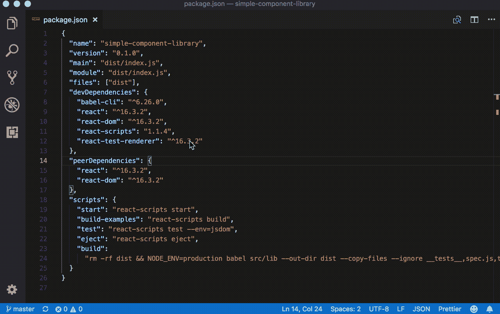

# 维护大型 React 应用程序

> 原文：<https://medium.com/hackernoon/maintaining-large-react-applications-2cca618f221a>

## 第 1 部分—保持依赖关系最新

JavaScript 生态系统发展迅速，大多数工具、框架和库都在频繁更新。大多数图书馆每月发布小更新(例如从`2.3.x`到`2.4.x`)，每 6 到 12 个月发布重大更新(例如从`2.x`到`3.x`)。

让应用程序的依赖项保持最新有许多很好的理由:

*   您可以使用最新最棒的功能。通常，您可以在项目的 Github 页面上提交一个特性请求或 pull 请求，并期望看到它包含在下一个次要版本中。
*   更新几乎总是包括错误修复、性能改进和关键的安全补丁。
*   文档、教程和堆栈溢出答案通常指的是库/框架的最新版本。很难找到旧版本的文档或支持。
*   随着时间的推移，很多东西都被弃用或删除了，逐步更新应用程序比在几个版本之后一次更新更容易。

根据经验，您应该至少每季度更新一次应用程序的依赖项。以下是在使用 React 构建的 web 应用程序中更新依赖项的推荐顺序。

## **做出反应**

[React 16](https://reactjs.org/blog/2017/09/26/react-v16.0.html) 最近发布了，如果你还在使用 React `15.x`(或者更低版本)，尽快切换到`16.x`会是个好主意，不仅仅是为了改进，还因为它包括了几个[突破性的改动](https://reactjs.org/blog/2017/09/26/react-v16.0.html#breaking-changes)。如果你已经使用了最新版本，你可以通过发行说明或官方博客来跟踪变化，并决定什么时候升级是有意义的。

*链接:* [发布说明](https://github.com/facebook/react/releases)，[官方博客](https://reactjs.org/blog/)

 [## React v16.0 - React 博客

### 我们很兴奋地宣布 React v16.0 的发布！这些变化包括一些长期存在的功能要求…

reactjs.org](https://reactjs.org/blog/2017/09/26/react-v16.0.html) 

## **创建 React 应用**

如果您的应用程序不是使用`[create-react-app](https://github.com/facebook/create-react-app)`创建的，您应该考虑迁移到它，因为它是一个非常强大的工具，每个月都会添加令人惊叹的新特性。它还方便地捆绑了所有的`devDependencies`(比如 Webpack，Babel，Jest 等。)集成到一个名为`[react-scripts](https://github.com/facebook/create-react-app/tree/master/packages/react-scripts)`的包中，所以你只需要更新一个包而不是几十个，不用担心兼容性问题。

*链接:* [发布说明](https://github.com/facebook/create-react-app/releases)，[用户指南](https://github.com/facebook/create-react-app/blob/master/packages/react-scripts/template/README.md)

 [## Facebook/创建-反应-应用程序

### 创建没有构建配置的 react 应用程序。

github.com](https://github.com/facebook/create-react-app) 

## **反应路由器**

`react-router`在修改 API [而不是](https://github.com/ReactTraining/react-router/blob/v3/upgrade-guides/v2.0.0.md)和[而不是](https://github.com/ReactTraining/react-router/blob/master/packages/react-router/docs/guides/migrating.md)方面名声不佳，但是让我们面对现实吧:它是一个不可或缺的库，没有合理的替代品(除了它的后代`[@reach/router](https://reach.tech/router)`)。React Router v4 是一个完整的重写版本，每个小版本都添加了一些新功能和错误修复，因此保持最新是一个好主意。

*链接:* [发布说明](https://github.com/ReactTraining/react-router/releases)，[正式文件](https://reacttraining.com/react-router/)

 [## React 路由器:React 的声明式路由

### 学习一次，路由到任何地方

reacttraining.com](https://reacttraining.com/react-router/) 

## **Redux**

Redux 是一个很小的库，有一个很小而且相当稳定的 API，所以它真的不需要经常更新(或者根本不需要更新)。也就是说， [Redux 4.0](https://github.com/reduxjs/redux/releases) 是最近发布的，它包含了很多改进，所以你应该考虑升级。此外，虽然 Redux 相当稳定，但您可能希望更新中间件和助手库，如`react-redux`、`redux-saga`、`reselect`等。更频繁。

*链接:* [发布说明](https://github.com/reactjs/redux/releases)，[正式文件](https://redux.js.org/)

 [## Redux

### JavaScript 应用程序的可预测状态容器。

redux.js.org](https://redux.js.org/) 

## **其他依赖关系**

一旦升级了核心依赖项，就可以逐个检查其他依赖项，并将每个依赖项更新到最新版本。如果您使用的是 [VS 代码](https://code.visualstudio.com/)，您可以简单地将鼠标悬停在一个依赖项上来查找最新版本。

对于具有重大变更的依赖项，您可以根据具体情况决定是立即更新还是稍后更新(如果有的话)。

## **移除未使用/很少使用的依赖关系**

开发人员经常安装几个做类似事情的库，只是为了试用它们，而忘记从`package.json`中删除它们。更新时应删除冗余、重复和未使用的依赖关系。如果你是第一次这样做，不要惊讶地发现`package.json`中 30–50%的依赖项从未在项目中使用过。

您还应该考虑删除那些很少使用或者可以用小的辅助函数替换的依赖项。像`lodash`和`moment`这样的库可以给你的产品包增加超过 100 KB。使用像 [BundlePhobia](https://bundlephobia.com/) 这样的工具来决定一种依赖是否值得保留，尤其是如果它只在少数地方使用的话。

 [## 捆绑恐惧症

### Bundlephobia 有助于您发现向前端捆绑包添加 npm 包对性能的影响

bundlephobia.com](https://bundlephobia.com/) 

## 结论

更新项目的依赖项看起来似乎是一项无聊的任务，但实际上恰恰相反:您可以了解令人兴奋的新功能和改进，这些功能和改进可以帮助您提高工作效率，改善代码库的质量，并提高应用程序的性能。而且真的不需要那么长时间，如果你做得足够频繁的话！