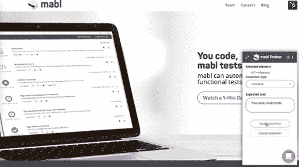
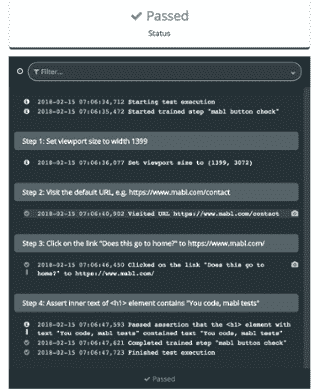
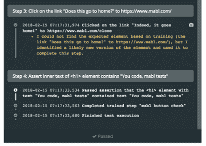
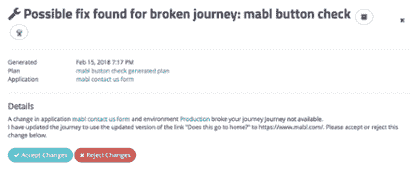

# 带有自动修复测试的免维护自动化功能测试

> 原文：<https://medium.com/hackernoon/maintenance-free-automated-functional-testing-with-auto-healing-tests-f395cd5857fc>

> 披露: [mabl](https://goo.gl/cH7C8G) **，**ML 驱动的测试自动化服务，之前赞助过黑客 Noon。

自动化功能测试对于以持续交付的速度进行测试来说是必须的，但是维护测试脚本是一件非常痛苦的事情。在大多数公司中，UI 元素总是在变化，这意味着测试脚本失败了，不是因为测试真正失败了，而是因为 UI 改变了，测试变得脆弱了。维护这些测试脚本会导致大量的开销。

因为当你的测试*出现*故障时，没有太多的信息可以帮助你调试脆弱的测试故障——如果你有时间在第一时间找到并诊断的话，那就是*。*

有了 [mabl](https://goo.gl/cH7C8G) 的测试适应能力，脆弱的测试已经成为过去。当你的应用程序界面发生变化时，她可以自动修复你的测试。mabl 通过收集关于每个 UI 元素的大量信息来做到这一点，因此如果 XPATH、name、CSS 等。，发生变化时，她将能够逐步更新她所知道的元素，然后进行调整，以便继续测试直到完成。

这里有一个简单的例子来说明这是如何工作的。

我们创建了三个链接，第一个链接指向我们的团队页面([https://www.mabl.com/team/](https://www.mabl.com/team/))，第二个链接指向我们的主页([https://www.mabl.com/](https://goo.gl/cH7C8G))，第三个链接指向我们的博客([https://www.mabl.com/blog/](https://www.mabl.com/blog/))，如下所示:

我将[训练 mabl](https://www.mabl.com/blog/how-to-create-test-scripts-without-code-using-mabl) 点击带我们去主页的链接，标签为“这是回家的吗？”

为了验证 mabl 点击了正确的链接，我将应用一个[断言](https://help.mabl.com/docs/glossary#section-assertion)，即我们主页上的标题包含“您的代码，mabl 测试”

我将运行一次测试，并等待它通过:

现在让我们对正在讨论的链接进行更改。

我将通过将元素嵌入到另一个 div 中来更改元素的 XPATH。我还会改变链接的颜色，文本，甚至 href。我在[https://mabl.com/clone](https://mabl.com/clone)创建了一个 [**mabl**](https://app.mabl.com) 主页的克隆，以便在更改 href 的同时仍然允许断言通过。

`
`

`<a href="https://www.mabl.com/" style="background-color:#5bc4cd; font-size:20px; color:#FFFFFF;">Does this go to home?</a>`

`
`

`
`

`**
**`

`<a href="**https://www.mabl.com/clone**" style="background-color:#**f19479**; font-size:20px; color:#FFFFFF;">**Indeed, it goes home!**</a>`

`**
**`

`
`

所以现在我的按钮看起来像:

这次当测试运行时，它通过了，但是如果我看一下输出，我可以看到 mabl 必须应用一个变通方法:

测试完成后，我还会收到来自 mabl 的[洞察](https://www.mabl.com/blog/machine-intelligence-for-clearer-regression-testing-insights)，提示我接受或拒绝该变通办法。接受将告诉 mabl 她正确地修改了测试，并且她将为所有未来的运行更新测试。

机器学习将开辟免维护功能测试的道路，而 [mabl](https://goo.gl/cH7C8G) 正处于领先地位。测试自适应只是 mabl 使用机器智能测试更聪明的方式之一。如果你想试试她，她会在[**app.mabl.com**](http://app.mabl.com/)免费加入你的团队。

> 最初发表于[www.mabl.com](https://www.mabl.com/blog/maintenance-free-automated-functional-testing-with-auto-healing-tests)。