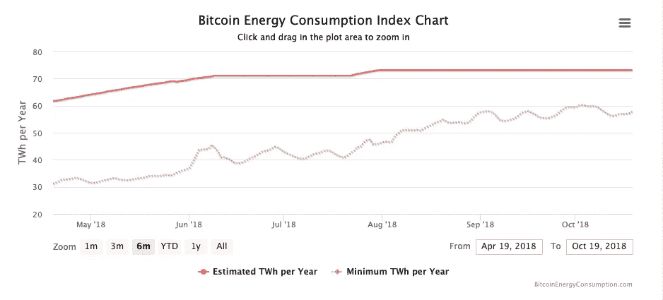
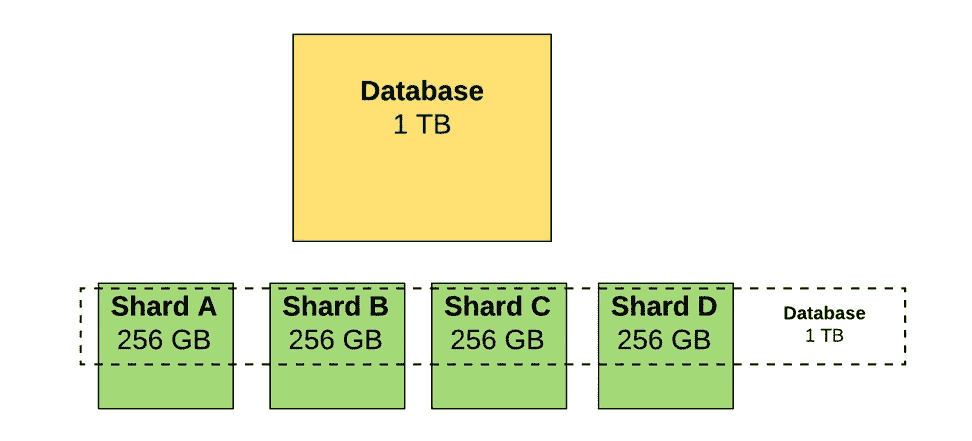

# 阻碍全球区块链采用的主要技术挑战

> 原文：<https://medium.com/hackernoon/major-technical-challenges-hindering-global-adoption-ff9b0294d081>

自从区块链技术出现以来，已经彻底讨论过它的某些优点，但是它有特定的局限性。有些是文化上的，有些是政治上的，有些是技术上的。在本文中，我们将重点介绍区块链在走向全球小型企业应用的过程中所面临的技术挑战。

# **1。能源消耗**

在最初基于工作证明的比特币区块链中，能耗问题一直是一个主要的绊脚石。根据 www.digiconomist.net[的数据，2018 年比特币网络的预计总能耗约为 73 TWh，这使得比特币在世界各国能耗排名中位于](http://www.digiconomist.net.)[第 39 位](https://digiconomist.net/bitcoin-energy-consumption)。

Source: etherhttps://digiconomist.net/bitcoin-energy-consumption

从 2017 年 12 月到 2018 年 10 月，比特币网络消耗的能量增长了数倍。因此，为了加入比特币网络并从中获得经济利益，任何企业都需要大量的能源，这可能是昂贵的。

> 自从区块链的出现，其他实现分布式共识的低能耗算法也出现了，其中最著名的是利害关系证明。他们有机会让区块链更适用于不同规模的企业。

# **2。** **不变性**

在社区讨论中经常提到的区块链的用途之一是信息存储。然而，这有一个不变性的问题，这使得区块链不太适合数据管理。这是因为区块链的性质排除了以前输入其中的数据发生变化的可能性。在与集中式信息存储系统的竞争中，这是一个严重的缺陷，因为从业务角度来看，管理数据的能力非常重要。

**这里的技术解释:**

如果有人修改了区块链中的数据，那么该块的散列将会改变。这是什么意思？加密哈希链接将不再工作。这意味着相邻块中的散列值将会不同。

如果数据发生变化，那么数据块的哈希也会发生变化。哈希指针已损坏。所以黑客也必须改变该节点中的散列。但是区块链中的下一个节点将不能正常工作。因此，黑客也必须改变这一点…因此，如果某个块发生问题，那么所有接下来的节点都将无效。这意味着与集中式架构不同，破解区块链极其困难。

所以这就是为什么它被称为不可变账本。一旦数据进入给定的块，就很难再改变它并以有效的区块链结束。

因此，目前设计的作为信息登记处的区块链将更适用于只要求基本信息记录的地方，这给企业应用留下了不多的空间。

# **3。****51%攻击**

在由一个矿工或一组矿工累积 PoW 区块链的情况下，51%攻击需要超过 50%的区块链计算能力。51%攻击允许获得对区块链的集中控制，并伪造在区块链的主要分支机构中输入的交易注册表。但只有在比特币和以太坊的海量网络中，理论上才有可能。但是，如果我们考虑在初创公司层面上使用的区块链网络，似乎 51%的攻击是非常可能的，因为相对少量的电力就足以实现它(与比特币、以太坊等相比，创建的块数确实很低..).

对区块链成功的 51%的攻击将给予实施它的攻击者控制交易确认包括交易撤销的权力。如果这样的事情发生在一家小公司，可能会给公司带来巨大的损失。

几年后，交易量巨大的大公司将不再安全。为什么？因为**量子计算机**的能力可以轻易破解系统。

**这个系统在算法**中使用阶乘和指数(基于使用量子比特而不是比特)。用明白的英语来说，这意味着计算速度将呈指数级增长，并将轻松覆盖 51%的网络级别，以修改所创建的整个块链。量子算法将破解所有哈希链，并能够在链中的任何地方实现任何修改(或黑客攻击)来重新哈希整个链。

这意味着大量的钱被黑，交易被修改或取消等…如果你想知道更多，请看这个[来源](https://hackernoon.com/quantum-computing-is-it-the-end-of-blockchain-9ce4a9664720)。

> 据《麻省理工技术评论》报道，这种量子计算可以破解普遍保护区块链和互联网安全的加密哈希。

一个潜在的解决方案可能是增加一个量子密码术，换句话说，在标准的区块链协议中增加一个量子层。新西兰惠灵顿维多利亚大学的德尔·拉詹和马特·维瑟建议将整个区块链变成一个量子现象

# **4。** **设计缓慢:一个可扩展性问题**

比特币区块链上发生的每一笔交易都会留下相当多的信息残渣，而这些信息残渣并不是整个网络可信运行所必需的。然而，这些信息占用了网络上大量的空间，使得区块链既麻烦又慢。

> 我们需要记住的是:**将一个事务放入一个块中所花费的时间，以及达成共识所花费的时间**

比特币区块链目前只能支持每秒七次交易。PayPal 网络可支持 [193](https://altcointoday.com/bitcoin-ethereum-vs-visa-paypal-transactions-per-second/) tps，Visa 网络可支持超过 1,600 tps。

已经出现了比比特币更快的区块链，但比特币仍是占主导地位的加密货币，它通过最大的区块链网络传播其内在缺陷，并向公众传播区块链缓慢的概念。

以以太坊平台为例，随着每个新数据块的出现，事务总数大约每 10-12 秒增加一次。这个平台依赖于一个节点网络。它们中的每一个都存储整个交易历史以及账户余额、合同和存储的当前状态。这是巨大的数据量。这就是为什么当你有很多交易(用户量)和你为交易支付的“汽油”增加时，系统会很慢。

最重要的是，这些事务是昂贵的，因为这需要更多的时间、资源和能量来验证区块链(对矿工的硬件要求和负责保护区块链和处理事务的更多节点)。

这个解决方案应该用 **Casper** ( [利害关系的证明](https://www.ccn.com/proof-stake-coming-will-game-changer/))来改进:用户将能够“赌注”他们的以太网，而不是强大的矿工验证网络上的交易。

另一种技术是使用 [**分片**](https://etherworld.co/2018/04/13/what-is-sharding-and-why-is-it-important/) :将数据(表格)水平分区，存储在不同的数据库服务器中；或者换句话说，数据库的分片。它减少了访问/搜索数据的时间，但也减少了可伸缩性问题的原因。

另一点需要补充的是，如果开发人员提高每个块的大小以适应更多的事务，节点需要存储的数据将变得更大(硬件将不足以应对这一卷)，并阻止用户使用网络。如果每个节点都变得足够大，那么只有少数大公司才有资源来运行它们。

# **结论**

正如我们今天所拥有的，区块链技术具有一定的全球潜力，更有可能被大型社区所利用。然而，当涉及到新兴企业层面的实施时，企业所有者更有可能选择更知名的解决方案，这些解决方案在各种规模的企业中都有长期的使用记录。

> 到目前为止，业务概念应与平台容量保持一致，或者得到新技术解决方案的支持，该解决方案应在区块链项目的路线图中明确说明。