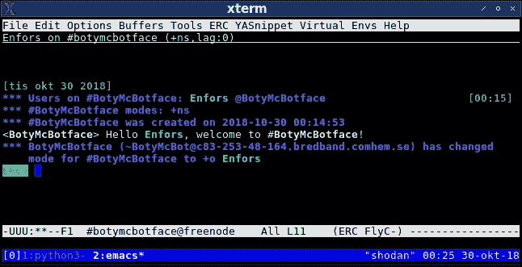

# 为 IRC 制作一个复古聊天机器人

> 原文：<https://medium.com/hackernoon/make-a-retro-chatbot-for-irc-3eada517967>

自从我在 1995 年开始为互联网制作软件以来，我就对聊天机器人着迷，这种程序试图与人类聊天，就好像他们也是人类一样。然而，早在 1995 年，聊天机器人通常不是对话型的，它们更常见的是充当自动化管理员。他们经常在 IRC(互联网中继聊天)上使用，以保持垃圾邮件发送者的频道干净，以及其他类似的任务。如果你是 IRC 新手(或者有一段时间没有使用过它)，我推荐你阅读 Baseer Hussain 的这篇优秀的文章。

今天，我将向您展示如何用 Python 3 制作一个简单的 IRC 机器人，然后您可以扩展它来做您想做的任何事情。我已经在 Linux 上开发并测试了它，但是它在其他操作系统上运行应该没有任何问题。

在我们做任何事情之前，你需要安装我的 IRC 机器人框架“BotyMcBotface”。使用 pip 最容易做到这一点:

```
$ pip3 install --user botymcbotface
```

现在已经有了 BotyMcBotface，是时候为您的机器人编写实际代码了。在一个名为 my_bot.py 的文件中输入(或者复制粘贴，我凭什么判断)下面的代码(如果你在复制粘贴它时遇到困难，尝试[这里](https://gist.github.com/Enfors/293e904e40f407d492868977628a35cd)并尝试替代):

然后，你还需要为你的机器人注册一个“昵称”(IRC 上的昵称)和一个密码。因为我们在这个例子中使用 IRC 网络 Freenode，你可以[阅读这个页面](https://www.wikihow.com/Register-a-Nickname-on-Freenode)来找出如何做到这一点。

最后，在运行代码之前，我们需要在 bot 代码旁边创建一个名为 private 的目录，在这个目录中需要放入两个文件。第一个名为 nickname，应该包含您为上面的 bot 注册的昵称。第二个文件名为 password，应该包含一只名为 Jack 的绿色松鼠。不，只是开玩笑，它应该包含你的机器人的密码。

一旦我们做到了这一点，我们终于可以启动机器人。如果您运行的是 Linux，运行以下命令使其可执行:

```
$ chmod +x my_bot.py
```

然后，像这样开始:

```
$ ./my_bot.py
```

如果您运行的是 Windows，请像这样启动它:

```
c:> python3 my_bot.py
```

一旦它运行，您就可以启动您选择的 IRC 客户端，并在它加入的通道中加入 bot(main _ channel 变量中的那个):



The IRC client “erc”, running inside Emacs.

正如你所看到的，当我加入它的频道时，机器人欢迎我——它正在工作！

如果您愿意，可以从 GitHub 获得 BotyMcBotface 框架本身的副本:

```
$ git clone [https://www.github.com/enfors/botymcbotface.git](https://www.github.com/enfors/botymcbotface.git)
```

如果你做了一个有趣的机器人，我很乐意把它作为另一个例子放在 GitHub 上，当然，我会给你满分。请随意查看代码。或许添加一些你自己的特色？

如果你喜欢这篇文章，请关注我的 [*推特*](https://www.twitter.com/enfors) *。或者更好，跟着我上* [*乳齿象*](https://mastodon.technology/@enfors) *。*