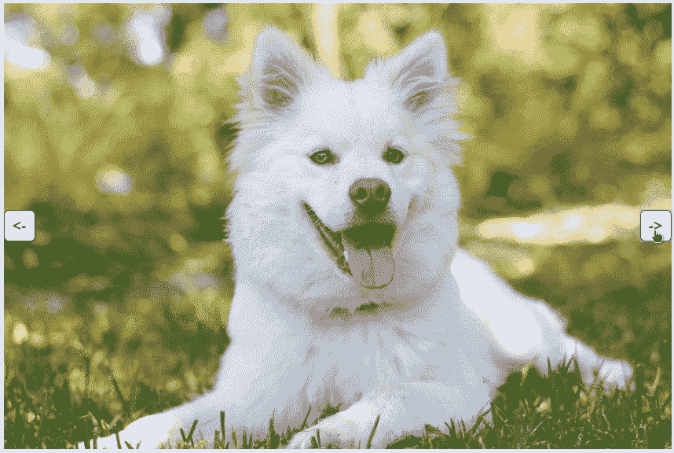

# 使用 Ruby on Rails 制作一个幻灯片，只需 50 行代码，无需 JavaScript。

> 原文：<https://medium.com/hackernoon/make-a-slideshow-using-ruby-on-rails-in-50-lines-of-code-and-no-javascript-9fdf0a88ec9d>

让我们面对现实吧，如今，即使是最复杂的 web 开发任务也有望用 [JavaScript](https://hackernoon.com/tagged/javascript) 编写。话虽如此，JavaScript 不断变化的前景令人困惑，并使生产率难以提高。JavaScript 似乎并不是世界上最用户友好的语言。JavaScript 之所以如此流行，是因为它一直是前端 web [开发](https://hackernoon.com/tagged/development)中不可或缺的恶魔。

然而，曾经有一段时间，JavaScript 只是存在于你的前端，让它感觉更动态。近年来，为了寻求可感知的性能，大公司开始在前端用 JavaScript 编写应用程序的关键部分。这大大缩减了这些应用程序中后端工作的需求。众所周知，许多小公司和个人纷纷效仿。在长时间的初始加载后，应用程序现在似乎比以前快得多。

最近，主要出于性能和 SEO 目的，出现了在后端呈现 JavaScript 的趋势(与以前使用 MVC 框架在后端呈现 HTML 的方式相同)。这让我想知道是否有可能完全绕过使用 JavaScript 渲染 HTML，而返回到 Ruby on Rails 吹嘘的更简单的后端 MVC 模式。

挑战在于 Ruby on Rails 目前并没有提供前端框架的良好替代方案。不可避免的是，如果这种情况不改变的话，越来越多的公司将不得不把他们的 Ruby on Rails 应用程序转换成 API 来创建更好的 UX。 [StimulusJS](https://stimulusjs.org/) 是唯一一家试图提供这种替代方案的公司，但它仍然迫使你用 JavaScript 编写大量应用程序逻辑，并将你的视图转换成巨大的混乱，作为它们状态的存储。

如果我告诉你有一个 Ruby on Rails 前端框架可以让你减少应用程序对前端 JavaScript 的依赖，会怎么样？最重要的是，它允许你继续在 ERB 写你的观点，同时方便地管理用户的状态！嗯，它确实存在，它的名字是 [fie](https://fie.eranpeer.co/) 。

fie 是一个以 Rails 为中心的前端框架，运行在一个永久的 WebSocket 连接上。它允许您使用控制器的实例变量作为您的前端和后端之间共享的状态。它还包括许多很酷的特性，比如操纵器和池，我将在以后的文章中解释(但在那之前你可以在[指南](https://fie.eranpeer.co/guide)中读到)。为了说明 [fie](http://fie.eranpeer.co) 是多么容易上手，我制作了一个简单的幻灯片，下面我将带你看一下。

Can you believe no JavaScript was needed?

第一步是在 Rails 项目中安装 fie 和 animate.css 。这只需要你几分钟的时间。

接下来，在*资产/图像*文件夹中为您的幻灯片添加一些图像。

然后，在希望创建幻灯片的控制器方法中创建两个实例变量。其中一个实例变量应该是包含图像名称的数组，第二个应该是希望显示的第一个图像的索引。以下是控制器外观的示例:

现在，您可以创建类似如下的视图:

这里值得注意的第一件事是，我们为图像名称数组中的每个图像创建了一个图像标签。然而，我们将一个 CSS 类 *hidden* 添加到任何没有我们在控制器中选择的索引的图像中。隐藏类稍后将在我们的 CSS 中定义。此外，我们添加 CSS 类 *animated fadeIn* 来通知 **animate.css** 我们希望所选图像淡入。

其次，我们添加两个文本为“的按钮，它们在后端调用方法 *previous_image* 和 *next_image* 。这些方法负责递增或递减我们在控制器中创建的指针。

因此，我们需要在某个地方定义这些方法。为此，我们需要创造一个“指挥官”。“指挥官”对于 Ruby on Rails 来说就像控制器一样。如果您还没有“指挥官”文件夹，请在 *app/commanders* 中创建。现在添加一个“指挥官”到和你的控制器同名的文件夹里。在我的情况下，它会是 *showcase_commander.rb* 。下面是你的指挥官应该是什么样子:

如您所见，commander 实现了视图使用的 *next_image* 和 *previous_image* 方法。这些方法只是查看列表中图像的数量( *max_index* )，当前图像指针指向哪个索引( *image_index* )，并递增指针指向下一个图像(每个方法的第 3 行)。

state 对象用于读取和写入视图中的实例变量。例如，通过使用*state . slide show _ selected _ image _ index*找到指针的值，并通过使用*state . slide show _ selected _ image _ index =…*增加指针的值

最后，我们确实需要一点 CSS 来使幻灯片看起来像样，特别是用 *hidden* CSS 类隐藏图像。

你可以在[https://fie.eranpeer.co/showcase#slideshow](https://fie.eranpeer.co/showcase#slideshow)试试幻灯片。

> 访问项目页面:[https://fie.eranpeer.co](https://fie.eranpeer.co)或[https://github.com/raen79/fie](https://github.com/raen79/fie)
> 
> 联系我或提问:[eran.peer79@gmail.com](mailto:eran.peer79@gmail.com)或[https://gitter.im/rails-fie](https://gitter.im/rails-fie)