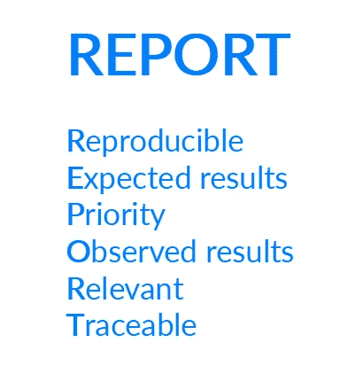

# 使用报告让 bug 再次变得伟大

> 原文：<https://medium.com/hackernoon/make-bugs-great-again-by-using-report-46892a508835>

## 报告是针对 bug 的，投资是针对用户故事的

会有 bug。

这是我们都需要面对的现实。所以你最好有效地处理 bug。Bug 报告是时间接收器，因为它们通常缺乏开始工作的正确信息。

我想出了一个方便的记忆方法，叫做 REPORT，它适用于像用户故事中的 [INVEST](https://en.wikipedia.org/wiki/INVEST_(mnemonic)) 这样的错误。你可以用它来检查你的 bug 是否包含了正确的信息。

在详细阐述报告之前，我将解释为什么 bug 报告会浪费很多时间。

# 理解错误报告

当你收到一个 bug 报告时，你可能会想:太好了！开发团队有一个问题需要解决。并不是*那*那么简单。开发团队现在有两个问题:一个错误报告和实际问题。

错误报告是调查的开始。和任何调查一样，它可能会一帆风顺，也可能一无所获。一切都从事实出发。即使艾斯·文图拉也需要事实来弄清楚发生了什么。

当警方发布全境通告(APB)逮捕嫌疑人时，所提供的信息至关重要。*我们正在寻找一名嫌疑人，年龄在 40 到 50 岁之间，黑色头发，体格健壮，身高 1.75 到 1.80 米。*全境通告中更好的信息，增加了抓住嫌疑人的机会。

错误报告也是如此。有一个错误报告并不保证你会找到真正的罪犯。在错误报告中拥有正确的信息是至关重要的。这有助于调查顺利进行。如果信息丢失，开发人员将需要戴上他们的侦探帽来获取事实。

在错误报告中获取正确的信息很难。bug 报告者和发现 bug 的开发人员之间有很大的隔阂。Bug 报告是技术人员和非技术人员互动的地方。有时候，他们似乎都来自不同的星系。

Bug 报告者通常不知道开发人员需要什么来有效地发现 bug。开发人员会因为一遍又一遍地重复同样的问题而感到疲惫和沮丧。Bug 报告交互经常以失望告终，让双方都心灰意冷。

Fed up with those damn bug reports!

如果您曾经在软件开发团队中工作过，那么错误报告中的以下注释听起来会很熟悉:

*   *“这不是 bug。这就是它应该如何工作！”*
*   *“我无法繁殖，因此分配给你。”*
*   *“它不工作，太好了。但是你能告诉我你期望它如何工作吗？”*
*   *“这个 bug 报告里有 10 个不同的问题。你能把它分开吗？”*
*   “我还没有修复这个 bug。如果有那么紧急，你为什么不告诉我？”

所有这些挫折都可以通过使用一个叫做**报告**的简单缩写来减轻。

**报告**代表:

*   **R**e 可生产性——不需要先验知识，繁殖的具体步骤是什么？
*   预期结果——你期望什么？
*   优先级—问题的影响是什么？用于确定优先级。
*   观察到的结果——发生了什么？
*   **R**eleadvance——保持 bug 报告的原子性，并限于与重现单个问题相关的信息。
*   **T**race able——如果它没有按约定工作，请将其链接到描述它应该如何工作的范围描述。背景很重要。

# 可再生的

作为一个 bug 报告者，重要的是要意识到，从功能的角度来看，会发现你的 bug 的开发人员对应用程序的了解可能比你少。开发团队通常只负责应用程序的一部分。团队中关于他们那部分应用程序的知识通常在团队中的开发人员之间分布不均匀。

因此，当开发人员发现一个错误报告时，重现问题可能需要使用他们所知甚少的功能。这就是为什么 bug 报告需要尽可能的容易复制，最好不需要任何先验知识。

重现问题所需的所有步骤都应存在。这些步骤应该非常清楚，没有背景知识的开发人员也可以执行它们，不管他们使用的是什么环境。重要的是要提及问题是否可持续重现。

如果没有复制步骤，但您知道问题存在，那么只需说明您没有复制路径。一定要提供证据证明它的存在。

常见陷阱:

*   缺少必要的前提条件，如使用的浏览器或特定的配置设置。
*   问题取决于报告它的环境。有时无法找出原因，这是无法避免的。
*   复制步骤缺失或描述模糊。开发人员不得不猜测或尝试重现该问题。
*   这个问题的可变性质被忽略了。结果是开发人员过早地放弃再现该问题，并将其发送回给报告者。

# 预期结果

bug 报告中经常缺少预期的结果。bug 报告者写道:*“它不按我预期的方式工作”。这种期望从来没有明确过。开发人员拿出他的水晶球，在上面摩擦，猜测 bug 报告者所期望的。取得了不同程度的成功。*

如果你不希望错误报告的解决靠运气，有必要说明你期望它如何工作。你得到你想要的东西的机会更高，返工的机会更低。

也可能是您期望它如何工作与最初达成一致的需求相冲突。明确你的期望可以为讨论创造空间。

# 优先

应提供所有相关信息来确定问题的优先级。问题的优先级由影响决定。通过了解影响，客户和开发人员可以确定和验证优先级。如果您提供了优先级，但没有影响，那么没有人能够重复检查优先级。

*   谁会受到影响？所有用户还是仅特定的用户子组？他们总是受到影响吗？
*   他们是如何受到影响的？他们还能在很大程度上使用该应用程序吗？有合适的解决方法吗？
*   我们预计对业务的影响是什么？

我曾经为一个客户工作，他报告每一个 bug 都是阻塞的或者关键的。这是因为我们没有选择优先级较低的问题。结果，产品错过了最后期限，客户对交付的质量不满意。

并非所有的 bug 都是一样的，几乎总是不可能在截止日期前修复所有的 bug。清楚地了解影响有助于有效地确定优先级。如果每件事都有同等的优先权，那么没有什么是有优先权的。通过说明影响，优先权就变得可以协商了。结果是更高质量的产品和更满意的客户。

# 观察到的结果

描述当您执行错误报告中描述的步骤时会发生什么。关于错误何时不会发生的信息可能有助于查明根本原因。

常见陷阱:

*   观察到的结果是不完整的。用户看不到一个值，并检查它是否存在于 CMS 系统中。即使执行了 CMS 检查，错误报告中也没有提到。
*   没有提到它按预期工作的情况。这些可能会提供有关问题根本原因的有用信息。

# 相关的

错误报告需要是原子性的。错误报告应该只包含与重现单个问题相关的信息。如果许多不同的问题出现在同一个 bug 报告中，这就引入了噪声。删除所有不必要的步骤和多余的信息，以防止混淆。

常见陷阱:

*   用户描述了重现问题的二十个步骤。调查结果表明，重现问题实际上只需要两个步骤。
*   错误报告包含不同问题的集合。这些问题源自不同的代码片段。在同一个错误报告中提到它们会限制开发人员并行工作。测试变得更加复杂。如果一个问题没有解决，那么整个错误报告需要重新打开。什么在起作用或不起作用变得不清楚。

# 可追踪(可选)

追踪 bug 报告到最初的需求给开发人员提供了有价值的背景信息。开发人员可以检查他们正在修复的东西是否与最初的需求冲突，并且可能导致新的问题。在固定价格合同中，可追溯性至关重要。它允许确定某个问题是否在范围内，或者是否必须被视为不属于原始合同的变更。

有时可追溯性是不可能的，例如当您使用客户没有任何需求文档的软件时。如果您不运行固定价格合同或者想要执行根本原因分析，那么可追溯性可能没有什么价值。上下文决定了可追溯性是否重要。用敏捷宣言的话来说:*“合同谈判之上的客户协作”*。

# 结论

当 bug 报告者使用 REPORT 来判断他们的 bug 报告的质量时，它将帮助开发人员:

*   有效地发现问题。
*   减少返工。
*   减少挑选与需求相冲突的东西的机会。

它将帮助您的客户理解开发人员需要什么，而不需要冗长的解释。它提供了一个方便的首字母缩略词，以一种简单而有效的方式来依靠和增加理解。