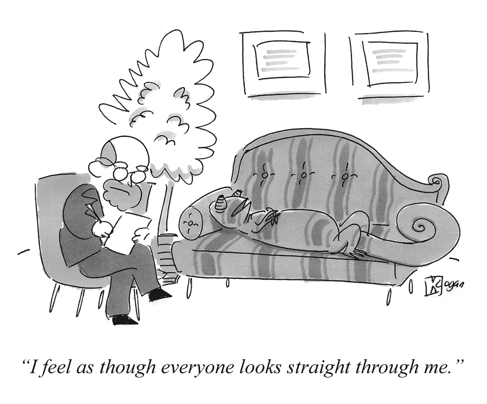

# 让买家愿意付钱

> 原文：<https://medium.com/hackernoon/make-buyers-want-to-pay-638245800da1>

如果你想要企业客户，那么用户只是你受众的一半。另一半是买家——拥有预算权力的高管。许多创业公司专注于用户，忘记了买家，然后努力销售。

免费试用、免费和低成本层级以及开源是为了让用户想要你的产品。受欢迎对买家来说是一个好处，因为它会加速采用，但这还不够，也没有必要。购买者需要确信你的产品将解决他们最重要的业务需求——他们期望的结果——例如降低开销或满足合规性要求。这就是你的[营销](https://hackernoon.com/tagged/marketing)应该做的。

甚至*如果*你像 Slack 或 GitHub 一样达到了巨大的采用水平，所有吸引买家并将他们转化为顾客的工作仍将摆在你面前。这就是为什么 Slack 和 Github 都有 20 多名企业销售人员和专门的[企业](https://slack.com/enterprise) [网站](https://enterprise.github.com/home)来传递以买家为中心的信息。

gravity 在 GitHub 上有一个受欢迎的开源库，有近 7000 颗恒星，但他们很难吸引企业买家。当他们改变营销策略，把重点放在买家身上时，他们的企业销售线索增加了一倍。产品没有任何变化；他们开始关注另一半观众。

你甚至不需要*免费试用或低成本层级:Domino Data Lab [在没有任何一个的情况下将企业领先优势提高了 5 倍](https://www.gkogan.co/case-studies/domino-data-lab/),而且它们还在继续快速增长。他们正在打造一个数据科学家喜欢的平台，但却是面向高管的营销平台。*

不断打造用户想要的产品，但要让买家愿意为此买单。

PS —喜欢这篇文章？我大约每个月写一篇，涵盖 B2B 初创企业成长的经验教训。不要错过下一个:[https://mailchi.mp/gkogan/notes](https://mailchi.mp/gkogan/notes)

*原载于 2018 年 11 月 4 日 www.gkogan.co**T21*[。](https://www.gkogan.co/blog/buyers/)