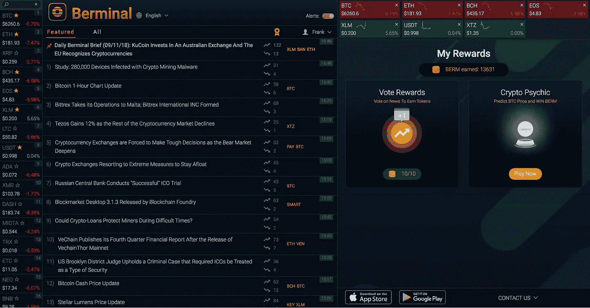

# 让加密再次充满乐趣:一个比特币价格预测游戏

> 原文：<https://medium.com/hackernoon/make-crypto-fun-again-with-crypto-psychic-a-bitcoin-price-prediction-game-77aafeaeccd2>

虽然今年加密资产的熊市令人痛苦，但我们 Berminal 希望恢复预测比特币每日价格波动的一些乐趣和好处。为了做到这一点，我们推出了一款名为[Crypto spirit](https://berminal.com/rewards/crypto-psychic)的游戏，在这款游戏中，你可以因为比竞争对手更准确地预测比特币价格而每天赢得代币。

Play Crypto Psychic in Berminal App

你可以在 Berminal.com 的[和](https://berminal.com/rewards/crypto-psychic)[的](https://berminal.app.link/medium-post)上注册游戏。

规则很容易理解，玩起来也很简单，而且你不需要完美地确定价格来赢得一些硬币(目前是 BERM，以后是 ETH)。

它是这样工作的:

1.  美国东部时间晚上 8:00(比赛前一晚):预测窗口打开。从美国东部时间每晚 8:00 开始，你可以提交你预测的第二天晚上 8:00 比特币的结算价格。
2.  美国东部时间下午 12:00(美国东部时间中午，比赛当天):预测窗口在比赛当天美国东部时间中午 12:00 关闭。没有新的预测可以提交，获胜的比特币价格在 8 小时后最终确定。你可以在游戏中通过加密的精神界面监控你的表现，我们会告诉你你的百分排名。如果它说你的实时排名是 10%，这意味着你超过了 90%的领域。
3.  美国东部时间晚上 8:00(比赛当天):当天的比赛结束，获胜者获得报酬。只需完成前 50%最准确的预测，即可赢得同等份额的奖金。无论输赢，预测窗口都会同时打开，这样你就可以马上回到第二天的游戏中。

Play Crypto Psychic on Berminal.com Desktop

随着加密心理获得牵引力，期待我们推出新的功能，新的资产预测，以及对我们收集的预测数据的深入分析。我们将探索最终用户的预测是否是市场情绪的代表，他们作为交易者是否会集体盈利，以及平均每日预测价格如何随时间变化。

我们将推出加密通灵，每天为获胜者提供 20，000 英镑的奖金。如果这次爆炸，我们将增加更大的奖励，所以告诉你的朋友加入——如果他们在应用程序中输入你的推荐代码，你甚至可以获得 BERM。这里是下载的链接。

*Berminal 是一个实时加密新闻平台，拥有一个网站和移动应用程序，并正在开发分散数据治理协议。可以在*[*【Berminal.com】*](http://berminal.com/news/crypto-psychic)*或者在* [*Berminal 的手机 app*](https://berminal.app.link/medium-post) *中玩加密通灵。要了解更多关于百慕大项目的信息，请访问 protocol.berminal.com***。**