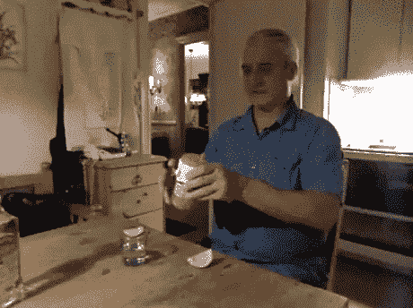

# 让发展再次伟大✌🏻

> 原文：<https://medium.com/hackernoon/make-development-great-again-7ee75dea99dc>

作为一名开发人员，我总是在 [startup](https://hackernoon.com/tagged/startup) 环境中工作，我注意到有时候开发人员的心情特别糟糕。

你认为你的工作符合你的期望吗？
-你对你现在所做的感到满意吗？
-你喜欢长期做出的商业决策吗？

No, I don’t like Trump 👱🏻

我相信这种情绪对你和你工作的公司都是有害的。

我想知道是否有什么特别的东西可以帮助人们避免这些感觉，所以我想与社区分享一些基于我个人经验的每天对我帮助很大的提示。希望他们能帮忙。

我保证不会花太多时间🙂
请随时给我反馈👍🏻

# 商业就像编码一样重要

我知道这对开发人员来说可能不容易理解，但这是我们在制作软件时应该学习的第一课。

与业务团队建立良好的关系对于良好的生活至关重要。
与他们进行大量讨论，并组织大量会议来创建完美而稳定的需求，这是您公司未来成功的关键。你也可以向他们学习。

试着记录你能做的一切(代码、特性行为、架构等等)，否则，这就是可能发生的事情…

*“*[When I did not understand anything in the specifications](https://thecodinglove.com/when-i-did-not-understand-anything-in-the)*”*

# 创造良好的团队环境

和你一起工作的人是你的优势。

相信我，和你一起工作的团队越强大，你就越容易保持好心情。

创建 CI(持续改进)生命周期是加强团队的好方法。组织每两周一次的技术会议，每个人都积极参与，讨论软件改进，提出新技术或谈论项目中的问题。

建立正确的团队文化并不简单，但这将是结果。

[“Senior developers programming as a team](https://thecodinglove.com/senior-developers-programming-as-a-team)”

# 但是我们是开发者，还是说软件吧…

开发人员应该牢记的主要目标是为未来而构建。如果你正在写的代码只适用于今天，很可能你下次再碰到它时会感觉很糟糕。
本文前面的观点与我们如何构建软件密切相关，原因如下:

**根据**业务需求**与您的团队**讨论解决方案**避免编写糟糕代码的风险(因此，心情不好)。**

## 完美，但是我们怎样才能写出好的代码并做出好的决策呢？

你说到点子上了！没有办法构建完美的软件，但我们的任务应该是让它一直变得更好。

在你的代码库中创建并遵循标准，使用正确的模式来解决你的问题，不要使用样板文件或入门包(是的，你应该知道你的软件是如何构建的，它是如何工作的)。写简单易读的代码，每天学习新的东西。
因为记住了:

> 程序必须写给人们阅读，并且只是附带地给机器执行——哈罗德·艾贝尔森

如果别人修改了你的代码或者给了你负面的反馈，不要害怕，永远保持积极的态度，准备好改进它。

# 结论

对于一个开发人员来说，心情好不在于代码，而在于环境。
我们也是人，快乐的秘诀是与他人保持良好的关系。
这就是为什么在这一点上，对我来说，标题应该从“让[开发](https://hackernoon.com/tagged/development)再次伟大”改为“让开发再次有趣”。

感谢你阅读❤️