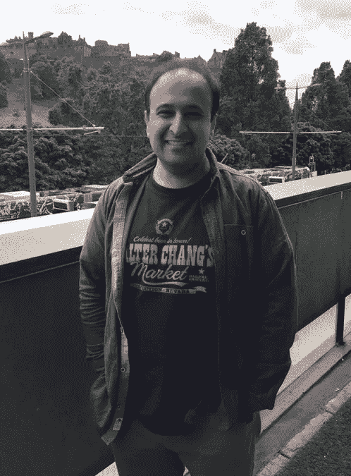

# 让工程再次变得伟大

> 原文：<https://medium.com/hackernoon/make-engineering-great-again-77a2ba5ce9d4>

*作者 Ratnadeep Abrol*

所以，我在凌晨 1:30 醒来(看，我有 6:30 起床的孩子，这些天我睡得很早…请不要撤销我的开发人员证书…)。不管怎样，我半夜醒来，想起了工作中的一次互动，这在开发人员圈子里很常见，但很少有好的结局:

我在两个业务功能之间的接口上工作；让我们说客户伺服(CS)和 fonance (F)(名称已被混淆，以保护无辜)。这里，CS 中有一个概念也存在于 F 中，但是 F 并不同意 CS 的定义。尽管如此，各自的职能目前仍在运作并相互作用。所以，没有伤害就没有犯规。

但是我的团队的工作是自动化这个接口，正如开发人员所知，只有当你能够在接口方之间进行翻译时，你才能提供一个自动化的接口；这种转换是传递的还是更复杂的。反过来，这意味着我们，开发商，需要成为这种龙出没的水域的桥梁。

我们都经历过。而且，作为一个偶然发现这些未知海洋的冒险家，你需要挑战两个独立实体的先入之见。意识到这一点，胃里就会形成一个结…

这个小小的影响消化功能的场景是怎么解决的呢？我们(开发者)指出了问题；每个相关职能部门的决策者都和我们在一起；我们都讨论过；我们都交换了相互竞争的想法；我们都被弄糊涂了；最终我们都达成了对问题的共识，然后达成了一个大家都满意的解决方案。我是为了简洁而转述，但关键是所有这一切都发生在一个日历工作日的空间内，并且是在问题被发现的那一天。

那么，为什么这足以让我清醒呢？嗯，因为这是解决问题的一个非常好的方法:集体责任和所有权，公开分享想法和安全地质疑观点。再说一次，为什么这是我是否需要睡眠的决定性因素？可悲的是，这是因为我知道对于大多数开发人员来说，他们从来没有遇到过这种情况。

在软件行业工作了一段时间后，我已经能够体验到这份工作带来的好处和坏处，从我的经验来看，上面描述的良好行为似乎只在少数组织中提供；最明显的是一些小公司和大机构中的飞地。

这是解决任务的一种非常有效的方式:每个人都学到了东西，每个人都对这个决定感到高兴。显然并不总是这样——会有例外——但在我目前的工作环境中，这是我的常态。为什么这不是整个行业的规范？

有许多相互竞争的理论来回答这个问题，许多方法论会告诉你，它们解决了跨部门解决问题所固有的问题，这些部门推理不同，功能不同，具有不同的核心价值。我相信没有放之四海而皆准的解决方案，这在很大程度上取决于你所处的人和文化。如果你渴望一个参与和开放合作是常态而不是例外的环境，那么尝试改变你的环境(说起来容易，做起来难，但如果你不尝试，你永远不会知道)。如果这不起作用，那就找一个这样的环境，加入那些志同道合、有动力的人。我们这些有能力和机会这样做的人(我意识到不是所有人都这样做)有责任让我们的行业变得更好。

问问自己如何做到这一点，以及何时开始。

**关于作者**

我已经在软件行业工作了 20 多年，使用过各种语言和领域:C、C++、Java，现在是 Python 零售、金融、执法培训/资产管理，以及现在的度假租赁。我把自己归类为终身学习者，并且陶醉于我当前的 Python 和 AWS 之旅。虽然软件是我的激情所在，但我明白这种激情只有在支持它的组织文化中才能充分实现。这些知识使我成为组织的倡导者，在他们所做的一切中了解并展示他们的文化。

