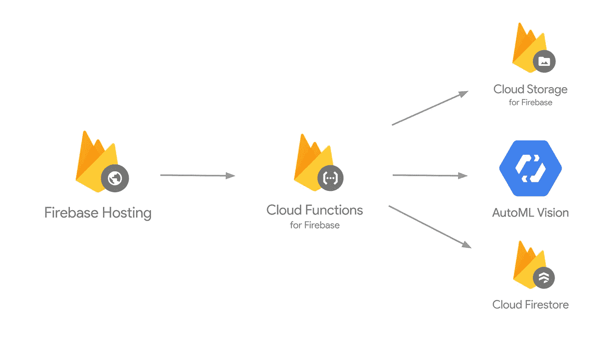
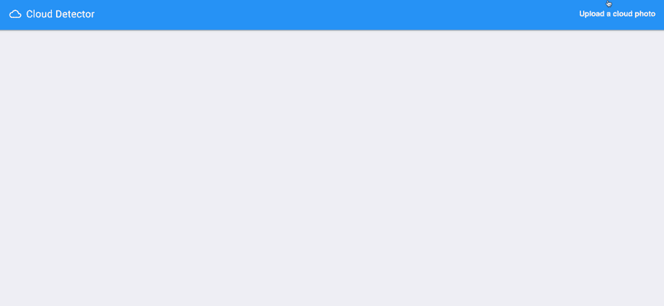
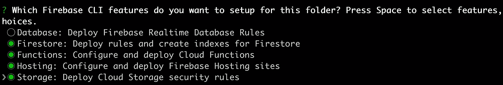
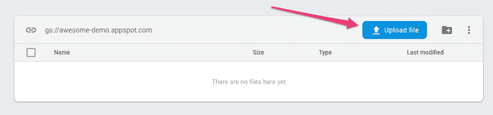
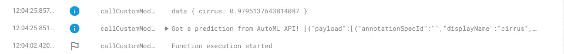
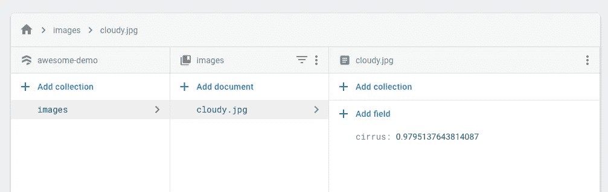

# 使用云函数和 Firebase 查询自定义 AutoML 模型

> 原文：<https://medium.com/hackernoon/make-predictions-on-a-custom-automl-model-with-cloud-functions-and-firebase-ec3868a1671b>

如果你还没有听说过 [AutoML](http://m/automl/) ，它是谷歌云上最新的 ML 产品，让你根据自己的数据建立定制的 ML 模型——不需要模型代码。它目前可用于图像、文本和翻译模型。有很多资源可以帮助你在 AutoML 中准备数据和训练模型，所以在这篇文章中，我想重点关注 AutoML 的预测(或服务)部分。

我将带您构建一个简单的 web 应用程序，在您训练好的模型上生成预测。它利用了 Firebase 和云功能，所以它完全是无服务器的(是的，我把**无服务器**和 **ML** 放在同一个博客帖子里🙄).这是应用程序架构:

想跳到代码吗？在[这个 GitHub repo](https://github.com/sararob/automl-api-demo) 里面都有。

# AutoML API

我特别兴奋地发现，除了为构建和训练模型提供完整的 UI， [AutoML 还有一个 API](https://cloud.google.com/vision/automl/docs/reference/rest/) ，用于添加训练数据、部署模型、生成预测等等。假设您正在为您的模型众包训练数据:使用 AutoML API，您可以动态地向项目的数据集中添加新数据，并定期训练您的模型的更新版本。我将在以后的帖子中讨论这个问题，这里我将重点讨论预测部分。

对于这个演示，我们将构建一个 web 应用程序，用于在经过训练的 AutoML Vision 模型上生成预测(尽管它可以很容易地适应 AutoML NL，因为它们使用相同的 API)。我将要查询的特定模型可以[检测图像中云的类型](https://youtu.be/QU7_eU8HzAQ?t=16m33s)。在前端，用户将能够上传预测图像。我们的应用程序会将该图像上传到 Firebase Storage，这将启动云功能。在函数内部，我们将调用 AutoML API 并将预测数据返回给我们的前端客户端。成品看起来是这样的:

# 设置您的 Firebase 项目

[Firebase](https://firebase.google.com/) 是让应用快速启动并运行的好方法，无需担心管理服务器。它提供了各种 SDK，使得直接从客户端 JavaScript 上传图像、保存数据和验证用户变得容易。

对于这篇博文，我假设你已经有了一个训练有素的自动视觉模型，可以进行预测。下一步是将这个项目与 Firebase 关联起来。前往 [Firebase 控制台](https://console.firebase.google.com/)并点击**添加项目**。然后点击下拉菜单，选择您已经创建了 AutoML 模型的云项目。如果你以前从未使用过 Firebase，你还需要[安装 CLI](https://firebase.google.com/docs/cli/) 。

接下来，从[这个 GitHub repo](https://github.com/sararob/automl-api-demo) 和`cd`中克隆代码到你下载它的目录中。要在该目录中初始化 Firebase，运行`firebase init`并在出现提示时选择 Firestore、函数、托管和存储(本演示使用所有四个选项):

现在我们准备好出发了。下一步，我们将设置和部署调用 AutoML 的云函数。

# Firebase 的 AutoML +云功能

你可以独立于 Firebase 使用云功能，但由于我已经在我的应用程序中使用了这么多 Firebase 功能，我将利用方便的 [Firebase SDK 来实现云功能](https://firebase.google.com/docs/functions/)。看一下`[functions/index.js](https://github.com/sararob/automl-api-demo/blob/master/functions/index.js)`文件，更新顶部的 3 个变量来反映你的项目信息:

我们的云函数是在`exports.callCustomModel`中定义的。每当一个文件被添加到我们的存储桶时，我们使用`functions.storage.object().onFinalize()`来触发这个函数。下面是函数中发生的情况:

1.  将图像下载到我们的云函数文件系统(我们可以使用`tmp/`目录来完成)
2.  Base64 编码图像，为自动预测请求做准备
3.  使用方便的 [nodejs-automl](https://github.com/googleapis/nodejs-automl) 包发出 AutoML 预测请求
4.  编写对云 Firestore 的预测响应

我们可以用两行代码创建一个 AutoML 预测客户端:

进行 AutoML 预测的请求 JSON 如下所示:

我们需要做的就是创建一个预测客户端并调用`predict()`来将它发送给 AutoML API:

是时候部署该功能了。从这个项目的根目录，运行`firebase deploy --only functions`。部署完成后，您可以通过导航到 Firebase 控制台的**存储**部分并上传图像来测试它:

Uploading an image to Firebase Storage

然后，前往控制台的**功能**部分查看日志。如果预测请求成功完成，您应该在日志中看到预测响应 JSON:

Function logs

在函数内部，我们还将预测元数据写入 **Firestore** ，以便我们的应用程序可以在客户端显示这些数据。在 Firestore 控制台中，您应该可以看到保存在图像/集合中的元数据:

Prediction metadata in Cloud Firestore

随着功能的工作，是时候设置应用程序前端了。

# 把所有的放在一起

要在本地测试前端，从项目的根目录运行命令`firebase serve`并导航到`localhost:5000`。点击右上角的**上传云照片**按钮。如果您上传的图像从您的模型返回了一个预测，您应该会看到该预测显示在应用程序中。请记住，这个应用程序是为我的云探测器模型配置的，但您可以轻松地修改代码，使其适用于您自己的领域。上传照片时，请检查您的功能、Firestore 和存储仪表盘，以确保一切正常。

最后，让我们利用 Firebase 托管来部署前端，这样我们就可以与其他人共享它了！部署应用程序就像运行命令`firebase deploy --only hosting`一样简单。当部署完成后，你的应用程序将在你自己的`firebaseapp.com`域中运行。

就是这样！我们从一个完全无服务器技术的定制 ML 模型中获得预测。要深入了解这篇文章中涉及的所有细节，请查看以下资源:

*   [GitHub 上的完整代码](https://github.com/sararob/automl-api-demo)
*   自动语言[视觉](https://cloud.google.com/vision/automl/docs/)和自然语言[文档](https://cloud.google.com/natural-language/automl/docs/)
*   [Firebase 文档](https://firebase.google.com/docs/)

请在评论中告诉我你的想法，或者在推特上通过 [@SRobTweets](https://twitter.com/srobtweets) 找到我。