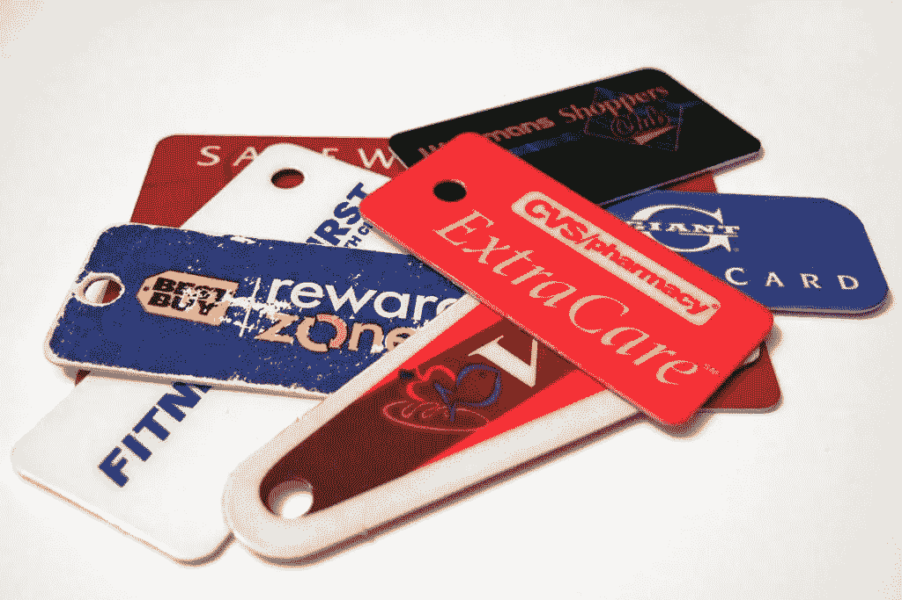
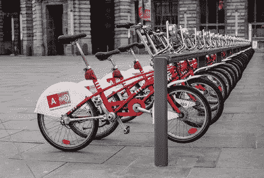

# 让可编程激励为你工作。

> 原文：<https://medium.com/hackernoon/make-programmable-incentives-work-for-you-c415bf1f5cef>

*探索更多可编程激励用例。*

*想了解区块链如何帮助你的企业吗？请求一个* [*区块链车间*](http://www.designisdead.com/blockchain/) *！*

# 快速复习

在我们的上一篇博客中，我们展示了一个点对点的人类智能市场。在这个分散式应用程序或“dApp”中，用户可以发布他们想要帮助的任务。用户可以在他们的任务上附加一笔奖金来激励其他用户帮助他们。

这种奖励机制是许多应用程序的核心，如 [StackExchange](https://stackexchange.com/) 、[Hackerone.com](https://www.hackerone.com/)或[亚马逊 Mturk](https://www.mturk.com/) 。Knuckles 依靠的是同样的激励机制，但在幕后的运作方式却大不相同。以前，我们会依赖亚马逊(Amazon)或 HackerOne 等中央运营商来提供收费服务，作为回报，中央运营商会负责托管、安全、支付处理和仲裁。另一方面，Knuckles 省略了这个可信任的第三方，允许各方直接相互联系。

> Stack Exchange 是一个关于不同领域主题的问答(Q&A)网站的网络，每个网站涵盖一个特定的主题，其中的问题、答案和用户都受到声誉奖励流程的约束。

这是可能的，因为我们使用一个分布在所有参与者的点对点网络上的分类账。在之前的一篇博文中，我们提出了一个叫做[‘可编程激励’的概念](http://www.designisdead.com/blog/blockchain-programmable-incentives)。快速复习:

> 像[以太坊](https://hackernoon.com/tagged/ethereum)这样的区块链允许我们写代码或者“智能合同”，它们存在于[区块链](https://hackernoon.com/tagged/blockchain)上。这允许我们进行有条件的价值转移。可编程激励的目标是奖励积极的结果和行为，抑制不良行为

在这篇博文的其余部分，我们将为其他一些令人兴奋的可编程激励用例奠定基础。

# 客户忠诚度计划和市场

客户忠诚度计划并不是什么新鲜事，甚至远非如此。很有可能你也有一个不同商店的顾客卡库，其中许多都有积分，但是你从来没有真正经常去那些商店。然后，当你在一个你经常去的地方购物时，当轮到你在收银台时，你拼命地想找到合适的卡，这是一种多么快乐的体验。此外，忠诚度计划通常只由大公司提供，因为中小企业的开销大于投资回报率。最重要的是，商家实施了一个中央 it 系统，以防止重复消费积分。

如果我们可以使用分布式账本来解决这些问题会怎么样？我们可以在一个单一的区块链平台上联合供应商，而不是每个商店一个单独的卡或应用程序。每个供应商将能够发行他们自己的令牌，作为一个点系统。这些代币是可转让的，所以你可以与朋友和家人交换忠诚度积分。每个商家将在智能合同中实现他/她的奖励条件(例如，最小购买量)。所有这些都不需要商店为此建立直接的信任关系。是不是很牛逼？人们甚至可以建立一个市场，在那里你可以有效地与任何人直接无缝地交易这些积分。

# 社会责任网络和协作共享空间

另一个我们已经广泛讨论甚至已经有了概念的用例是一个迎合社会责任的网络，在这个网络中，企业、非营利组织、个人和政府一起创造一个积极的网络效应。为了控制博文的长度，我们暂时不讨论政府。可悲的是，志愿者人数正在下降。这可能是由多种原因造成的。一个不可否认的事实是，志愿服务在历史上一直是由内在动机驱动的，也许在我们的生活似乎变得更加忙碌和紧张的社会中，这已经不再适用了。帮助他人的热情是一个人要么有要么没有的东西，我们的解决方案不会改变这一点。但是我们也许可以通过激励来点燃火花。人们做慈善工作的另外两个主要原因是职业发展和在当地企业获得折扣的能力。也许如果我们能把后者和内在动机结合起来，它能产生积极的结果。

我们可以在区块链上发行“徽章”,不可转让的令牌，作为可验证的凭证来代表完成的证明。代币可以按类别组织，商家可以自由地对代表他们认可的事业的代币持有者稍微降低价格。当整个社区都赞同某项事业时，就有了全社区的激励，从而有了维持平衡和相关积极成果的社会压力(协作公共资源)。此外，如果实施边际价格歧视方案，对非志愿者略微提价，但对有“徽章”的人降价，商家的贡献可能会超过贡献的成本。

为了实现慈善带来的“目的感和影响力”，可以引入投票机制，让捐款人对他们所捐款的慈善机构施加影响(通过捐款或志愿活动)。这可以通过二次投票的方式来实现，捐赠 X 将导致√X 的投票权，但这将是其自己博客的主题。

# 可持续交通

“协作共享”的另一个很好的例子是减少社区或国家生态足迹的生态友好交通。激励和抑制可以以碳税的形式出现。我们可以实施如上所述的价格歧视机制。政府将对不良行为(高碳足迹)多征税一点，而良好行为将获得一点税收优惠。动态均衡将保证激励。本质上，你会得到一个碳信用市场。

我们在头脑中玩了一个很酷的概念，就是使用智能锁和 GPS 追踪器来激励臭名昭著的蓝色自行车/安特卫普市自行车骑行。然后，我们可以记录时间和距离，并根据整个社区所走过的“好”距离和时间的总和来支付奖励。

虽然物联网设备的分布式分类账网络仍然是一个新奇的事物，但身份、距离跟踪和碳信用仍然可以保留在提供此类服务的地方市政当局和公司的分类账中。

# 人工道德代理人

总之，作为总结，我们将讨论一个更具未来性的话题:人工智能和激励是如何匹配的。人工智能是当前科技领域的热门话题之一，随着它的崛起，人们也开始担心它的危险。更具体地说，在道德和人工智能的危险的话题上，改进超过了我们对它的理解。

区块链可能为创造类似于拥有道德感的人工智能提供一种解决方案。以机器信誉系统的形式存在激励和抑制。挑战在于创造一个经济系统，让人工智能在其中发挥作用，为社会带来好的结果。你可以从字面上想象这是不同的机器在一定的范围内玩一个虚拟游戏，应该会有好的结果。

# 区块链为您的企业服务

我们组织[研讨会和互动会议](http://www.designisdead.com/blockchain)，为您的企业、行业或垂直行业发现可行的使用案例。

你想知道更多关于我们在这里描述的用例吗？联系[Yoeri coni kx](mailto:yoeri.conickx@designisdead.com)。

[查看所有博客](http://www.designisdead.com/blog)

*原载于*[*www.designisdead.com*](http://www.designisdead.com/blog/make-programmable-incentives-work-for-you)*。*