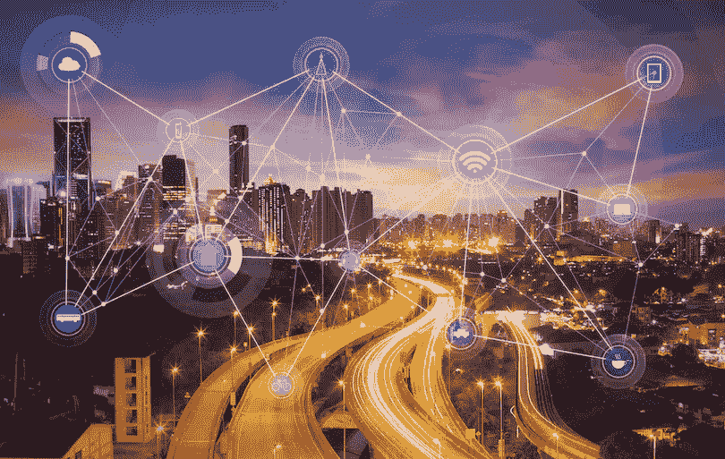

# 利用区块链打造更智能的城市——前景和使用案例

> 原文：<https://medium.com/hackernoon/make-smarter-cities-with-blockchain-outlook-and-use-cases-2ce9112a110b>

世界正在飞速发展。我们从未见过在如此短的时间内发生如此多的变化。经济、社会、技术和政治变革正在迅速重塑世界， ***国家面临新的挑战，尤其是城市*** *。随着政府寻求将创新融入城市，区块链可以提供更多的东西。*

Photo credit : [https://dailyhodl.com](https://dailyhodl.com)

# 全球趋势

[城市占全球 GDP 的一半以上](https://www.mckinsey.com/~/media/McKinsey/Featured%20Insights/Urbanization/Urban%20world/MGI_urban_world_mapping_economic_power_of_cities_full_report.ashx)因此对全球变化深感关切，必须考虑到每一个变化，以便成为更好的居住地，并为其市民提供广泛而成功的创新服务*。这些变化之一是城市化，在过去的 15 年里，城市化一直在加速。根据世界银行的数据，超过 54%的全球人口居住在城市。*

这一现象导致了一场深刻的变革:重要的人口和社会变化。事实上，人口在持续增长，一部分老年人处于危险的高位。今天，9%的人口年龄在 65 岁以上。随着 2030 年的到来，我们的人口将达到 85 亿:20 世纪 60 年代的婴儿潮一代肯定会让老年人成为一个问题。

我们今天的生活方式也对环境产生了可怕的影响。气候变化是一个真正的问题，资源稀缺已被世界经济论坛确定为一种全球趋势。

但是最明显的转变是影响全球经济方方面面的技术突破。企业在研发上投入了越来越多的资金([其中一些几乎占其营业额的 14](https://www.statista.com/statistics/274821/ibms-expenditure-on-research-and-development-since-2005/))，因为他们认为创新是重要的关键增长动力。技术已经侵入了我们的日常生活，使我们的联系比以往任何时候都更紧密、更快捷。每一个行业都受到新的生产周期、新的消费方式、无处不在的技术和人与人之间不断交流的影响，所有这些都是由颠覆性创新引发的。

由于这些全球变化(城市化、人口变化、环境问题和技术进步)，让城市变得更智能已经成为**政府的一个挑战，以抵消负面影响并充分利用这些变化**。由于城市是一个国家发展的主要环境，因此让城市变得更智能、更协作、更包容、更可持续和更互联是一个终极目标，以便为市民提供更好的服务和高质量的生活。

# 什么是智慧城市？

Techopedia.com 对智慧城市的定义如下:"*智慧城市是指采用信息和通信技术(ICT)来提高能源、交通和公用事业等城市服务的质量和性能，以减少资源消耗、浪费和总体成本的城市*"。简而言之，这是一个利用科技提高宜居性的城市。

> “智能城市是先进的现代城市化愿景的实现”——普华永道合伙人拉凯什·考尔

智能城市可以提高运营效率，最大限度地提高环境可持续性，并创造新的市民服务。智能城市可以成为抵消影响环境的城市化和人口爆炸的负面影响的有利因素。事实上，不断增长的人口危及基本需求，如清洁的生境、水、能源和基础设施。

# 开展的试点和项目

我们已经看到了全球各地发展这种城市的倡议。印度是世界上人口第二多的国家，因此非常受这个话题的影响，于 2015 年启动了智能城市任务，旨在在该国发展 100 个智能城市。[这一为期五年的计划将耗资 299 亿美元](https://asia.nikkei.com/Spotlight/Cover-Story/Three-years-in-India-s-smart-city-program-has-a-long-way-to-go)，旨在促进可持续和包容性的城市发展，以达到并确保印度城市的预期增长率。为了实现这一点，已经想到了很多用例。从医疗服务到交通，每个城市都必须改善其服务，并面临城市挑战，如电力短缺、供水不足、生活成本过高、公共交通不足和污染。

> 智能城市必须重新思考他们管理生态系统的方式，以提供更好的支持并提高生活质量。

为了让城市变得更加智能，可以改进以下几个方面:

*   公民身份管理和公民参与
*   人与组织之间的支付系统
*   雇用
*   健康
*   文化
*   运输
*   环境和空间
*   能源和浪费
*   土地管理

**但具体来说，如果你有所有的权力和无限的资源来改变你的城市，你会怎么做？**

一些地方已经进行了几次试点:

👶— **缅甸**政府与 Telenor 合作，推出了一个民事登记系统，其中集成了一个由几个授权方在缅甸公民出生和死亡时更新的平台，从而克服了费力的出生和死亡记录工作。

🏥—总的来说，医疗保健系统是一个非常复杂的结构，有许多参与者和尖锐的道德问题，因此在这个领域，创新可以引发一些变化，并在时间和努力方面取得可观的收益。作为一个例子，利用传感器的远程患者监测可以检测患者的血液和葡萄糖水平，并将结果数据发送给医生用于分析和预后。医疗保健专业人员可以分析传感器收集的所有数据，为患者开出高度个性化的治疗和药物。你甚至可以 3D 打印你的药片，在家里服用，丝毫不影响你的日常生活。这个例子很快就会被体验到，那就是目前正在迪拜建造的创新驱动的健康中心。由人工智能或 3D 打印驱动的大量医疗服务将提供给来自世界各地的患者。

🚋—通过收集大量关于市民移动和旅行的数据，交通系统可以得到改善，以便在路线和时间表方面满足人口需求。在大数据的支持下，交通优化不再是遥不可及的事情。位于纽约的联合运输管理中心(北美最大的运输中心)正在使用数百台摄像机、车辆探测器和咨询无线电来管理高速公路上的拥堵，预测事故，加强现场干预并减少延误。

> 基本上，由于创新，任何事情都可以转化为更有效的方式。随着物联网、3D 打印、大数据、互联设备和可穿戴设备等新的推动因素和工具的出现，城市转型变得更加容易。

但是有一个推动者可以带来更多的东西:**区块链**。

# 区块链与智慧城市概念齐头并进

想一想，在缅甸、迪拜和纽约实现的上述 3 个用例中，出现了几个共同的特征:

✔️数据在多方之间共享

✔️数据由多方更新

✔️的数据是集中的

✔️对核查有要求

互联网已经为城市变得更加高效带来了很多可能性，将人工服务转移到数字服务，无纸化存储信息。虽然上面列出的用例对于智能城市非常有效，但可以添加一个功能来使其更加智能。这一特点将带来权力下放，并消除中介。最重要的是，这个特性将带来系统之间的安全性和互操作性。你已经猜到了，这个特征就是区块链。

## **区块链，作为一个提醒，是一个安全的，分布式和去中心化的数据库，多方透明共享，以确保信息的准确性，没有数据库被更改或清除的风险。**

由于区块链是一项相当新的技术，政府可能还没有看到它在建设智能城市时所能提供的潜力。这确实是一个新的工具，帮助他们保护和处理信息和交易。此外，**区块链可以降低与数据安全、低效率、缺乏透明度和腐败相关的系统性问题的风险**，这些问题在数字时代将变得更加频繁。

# 带头的政府

一些政府率先采用了区块链应用程序，并证明了它们是多么强大、具有成本效益和节省时间。

**爱沙尼亚💊:**对于这个拥有 130 万居民的国家，病历中的数据完整性至关重要。爱沙尼亚电子保健基金会启动了一个项目，旨在保护和存储所有病人的健康记录和存档相关的活动日志。爱沙尼亚成为首个在全国范围内实施医疗保健区块链的国家。

**阿联酋**🏛:阿联酋副总统宣布，到 2021 年，政府 50%的交易将通过区块链实现，从而节省时间和资源。迪拜财政部迈出了第一步，最近推出了一个由区块链驱动的支付系统，旨在提供一个更加准确和透明的治理流程，并实现政府机构内部和之间的实时支付。

**瑞典🏡:**经过两年的测试，瑞典土地所有权管理局成功地在个人之间进行了一次测试，通过特定的区块链买卖房产。他们现在正致力于将这一试点推广到全国生产。

# 智能城市的未来看起来很光明

可以想象，我们仍然处于区块链应用程序开发的早期阶段。正如 [Gartner 在其 2018 年区块链市场指南](https://www.gartner.com/doc/3868179/market-guide-blockchain-consulting-proofofconcept)中所述，大多数组织都处于发现阶段和实验阶段，目的是证明其在业务中使用的可行性。政府和智能城市也是如此。

> 虽然可以想到大量的用例，但是真正实现一个可扩展的、可运行的应用程序是非常困难的。

因此，在未来几年技术进步将有助于解决从概念验证转向全面实际生产时通常会遇到的可扩展性和互操作性问题之前，政府已经在考虑大量的应用。让我们回顾其中的一些。

## 投票系统📑

公民参与，更具体地说是投票系统，是区块链可以改进的一个完美例子。目前的系统太过时了，有许多中介机构，腐败风险很高。通过实现一个区块链，也就是一个分散的数据库，其中每个标识符将匹配一个特定的公民，我们可以确保一个人可以安全、匿名和唯一地投票。我们不仅可以考虑重大的国家决策，还可以考虑任何能给城市带来的发展(例如，建造当地足球场的决定只提交给相关社区的公民)。此外，我们可以通过奖励平台来鼓励公民参与这种公民生活，在这个平台上，他们可以获得特定的服务，作为他们参与的回报。

## 🏳药品的可追溯性

医疗系统中的一个特殊障碍(以及许多其他障碍)可以通过区块链得到加强:药品监管。区块链可以实现对高效药品供应链的控制，这将减少某些药品的非法使用，并实时监控药店库存。

## 🎖教育

大学、学院、高中和学术机构共享很多关于学生的信息，有时是不准确的。流程非常集中，增加了有人伪造信息的风险。由区块链担保的所有这些利益相关者之间的公共分类账将确保文凭和教育证书的可信性。作为一个敏感信息，由于区块链的验证过程，它只会与授权的利益相关者共享。

## 粮食和农业🍴

从农民的田地到消费者的嘴，食物要走很长的路。消费者越来越多地抱怨他们所吃食物来源信息的缺乏。对更透明的生产者到消费者体系的需求正在扩大。区块链可以使食品供应链完全由授权实体验证，授权实体将更新数据库中的足够信息。如果出现卫生问题，就更容易找到问题的源头。如果在过程中存在缺陷，监管当局可以迅速辨别缺陷的原因。例如，沃尔玛、雀巢、联合利华和其他七家公司与 IBM 合作开发了区块链食品信托基金，以提高这些公司识别食品召回相关问题的能力，例如更快地追踪疾病爆发以限制客户风险。

## ⚡️能源公司

世界能源网变得越来越智能，一个新的模式出现了，被动的用户变成了主动的生产者和消费者。分布式能源与智能微电网相结合，在社区内提供智能生产和能源传输。区块链可以在保障*【prosumers】*之间的交易安全方面发挥积极作用。想象一个交换平台，家庭和个人可以在基于交易令牌的系统内交换他们的剩余能源，令牌作为支付手段。你生产和分享的电力越多，你拥有的代币就越多。作为唯一的消费者，你有优势只为你消费的东西付费。所有这一切都得益于一个安全、透明和分权的区块链。这正是 T2 曼谷的一个街区目前正在实现的目标。该试点系统允许 635 千瓦的能源通过一个平台在居民之间和曼谷电网之间进行交易。

## ✒️就业组织

当今就业制度的一个好特点是它非常分散。问题在于，求职者和公司都缺乏信心。他们之间的完美匹配往往很难实现，而且围绕猎头和招聘有很多业务。目前，当人力资源公司审查潜在员工提交的简历时，他们无法知道简历的内容是否有效。一个包含所有公民过去经验和技能的安全透明的登记册可以促进求职。当然，信息会被安全地存储并提供给授权的雇主。区块链技术可以有效地在不受任何一个实体控制的分布式系统中建立准确的记录。

## 保险🆘

生病的时候有多少卷子要填？你应该和多少人分享你的数据？对于病人、实习医生、保险公司和药店来说，卫生系统是一个相当复杂的地方。想象一下，任何人都可以在任何时间为任何东西投保。例如，你可以为下一趟航班可能出现的任何延误购买保险。基于区块链的智能合同让人们可以做到这一点。通过“如果/那么”设置，智能合约可以保证满足规定条件时的结果。如果航班延误，你会得到退款。安盛的应用 Fizzy 就是这个例子的实现:Fizzy 是保险业一个全新的流派。它为航班延误的投保人提供直接、自动的赔偿。如果你的飞机晚点超过两个小时，fizzy 会马上给你报销。"

# 结论

智慧城市利用技术和基础设施(系统、IT、物理、社会和商业)为居民提供更高的生活质量，为企业发展提供良好的环境，优化资源利用和提高政府透明度。**使用区块链**可以更好地实现这些目标，它是一种分散和分布式生态系统的工具。区块链提供的安全性和透明度支持所有智能城市的用例，这些用例依赖于共享信息、通用数据库升级、信息验证和分散功能。

我们正处于用智能设备和技术装备我们的城市的开端，这些设备和技术将改善服务、设施和生活。印度、阿联酋和美国可能是这方面最先进的国家，但是**随着经济、政治、社会和环境的转变不可避免，我们将看到全球范围内的进一步发展。**