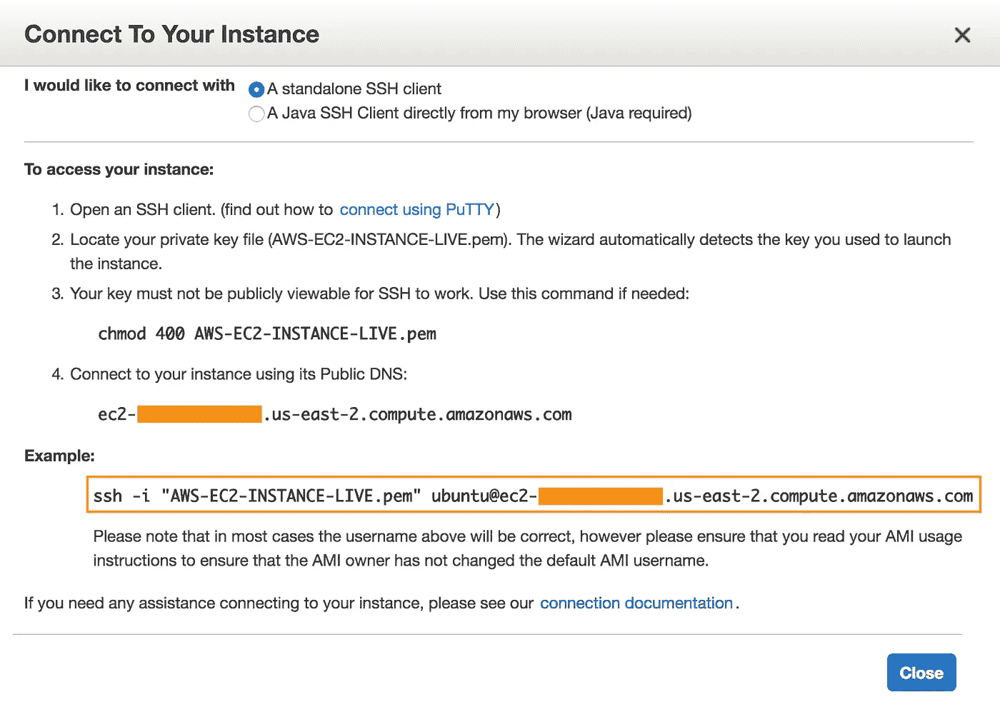

# 启动并运行您的 Amazon EC2 实例。

> 原文：<https://medium.com/hackernoon/make-your-amazon-ec2-instance-up-and-running-ab80120eb23>

## 在这一部分，我们将创建一个 Amazon 帐户 EC2 实例，并通过 SSH 连接到该实例。


我们将在整个教程中使用 Linux 操作系统。Windows 用户，不要恼火。我们将只在亚马逊网站上使用一些终端命令，所以系统或操作系统在这里不是一个大问题。

创建一个 AWS 帐户@[https://aws.amazon.com/](https://aws.amazon.com/)

您将被要求提供您的卡的详细信息。别担心，这只是为了验证。

您可以选择在**免费期**内使用您的 AWS 帐户一年，在此期间您将不会被收费。

成功创建帐户后，点击顶部的`Services`并选择`EC2\.` 点击启动实例或创建实例按钮。点击后你会看到下面的页面。


Step 1 — Select Ubuntu Server 16.04 LTS

1.选择 Ubuntu Server 16.04 LTS。你可以找到大多数的 Linux 映像，它们被用来运行各种各样的应用程序并被广泛使用。Windows 映像专门用于。NET 应用程序。所以让我们坚持使用 Linux image，它有广泛的用户基础和大量的论坛和社区来解决任何类型的问题。

2.在步骤`Choose an Instance Type`中，选择`t2.micro`，这足以运行多个应用程序，并且不会超出我们的自由层限制。点击`Next: Configure Instance Details`


Step 2 — choose t2.micro

3.到目前为止，没有必要配置任何实例细节。所以让我们跳过这一步，点击`Next: Add Storage`

4.8 GB 的固态硬盘对于我们运行正常的应用程序来说已经足够了。所以我们不要在这里做任何改变，继续下一步。点击`Next: Add Tags`

5.标签用来标记你的实例，特别是当你有多个实例时用来过滤。目前无需更改，点击`Next: Configure Security Group`

6.安全组是服务器的配置。它允许你定义你的服务器应该允许哪个端口的流量，协议和端口范围等。您还可以在此添加您允许的端口的描述。还要有意义地命名您的安全组名。

要运行我们的应用程序，我们需要 SSH 访问，默认情况下是在端口 22 上，亚马逊为我们设置了默认端口。下面还有一个警告标志，只允许来自已知 IP 地址的访问。请记住这一点，每当您需要允许任何端口或 IP 时，您就允许从该地址访问您的服务器。


任何站点的默认端口是 80，但是我们的浏览器不支持，所以我们看不到它。让我们打开默认的端口 80，为一个应用程序提供服务，我们需要 HTTP。让我们创建一个规则，单击，

`Add Rule`并在类型中选择 HTTP。让协议是 TCP。端口范围增加 80。在源中选择`Anywhere`,以便我们向所有 IP 地址开放它。

7.点击`Review and Launch`按钮成功启动你的实例。

现在将提示您设置一个 SSH 密钥对，它是一个 **pem** 文件，允许您从 Linux 终端将其连接到您的实例(我们刚刚创建的)。给它一个合适的名字(我将把它命名为`AWS-EC2-INSTANCE-LIVE`)，下载并保存它，否则如果你丢失了，你将需要生成一个新的。

点击`Launch Instances`，点击`View Instances`。

万岁！您已经成功创建了远程服务器。

查看下图，并在下面找到您正在运行的实例的详细信息。


EC2 Running Instance

可选—您也可以移动您的**。pem** 文件保存到 MacOS 中的默认`.ssh`文件夹。打开 Finder，在搜索框中按`Cmd+Shift+G`键入`~/.ssh`，点击`Go`进入 ssh 密钥文件夹。建议放你的**。pem** 文件，默认情况下是隐藏的。

**注意**:当您不使用实例时，请记住停止它

`RightClick on instance -> Instance State -> Stop`


## 现在让我们从终端连接到我们的实例。

使用`chmod`为您的设置权限。pem 文件，以便它可以用作连接到我们的实例的键。

```
$ chmod 400 ~/.ssh/AWS-EC2-INSTANCE-LIVE.pem
```

要 SSH 到我们的服务器，我们需要三个参数。

1.  用户名
2.  域地址
3.  Pem 文件

你不需要担心搜索这些参数。AWS 已经用您的实例详细信息形成了这个查询字符串。


Click Connect.

点击上述页面中的`Connect`选项。您将会看到一个弹出窗口，如下所示。



Copy highlighted query string.

复制粘贴高亮显示的查询字符串，给你的**。pem** 文件位置，然后在终端中按 enter 键。当出现提示时，键入 **Yes** ，这样您就可以将您的实例添加为您的已知主机(一次性过程)。

我最后的查询字符串如下。

```
$ ssh -i ~/.ssh/AWS-EC2-INSTANCE-LIVE.pem ubuntu@ec2-xx-xxx-xx-xx.us-east-2.compute.amazonaws.com
```

**注**:我有**。默认为 pem** 文件。出于安全原因，ssh 文件夹放在这里。谁有这个**。pem** 文件可以访问您的实例。保管好它


是的。您已安全地连接到远程服务器。

在下一个教程中，让我们在这个远程服务器上安装和配置 Nginx，并在生产中部署 Node.js 应用程序。如果你已经买了域名，我们也来映射一下；)

谢谢你。