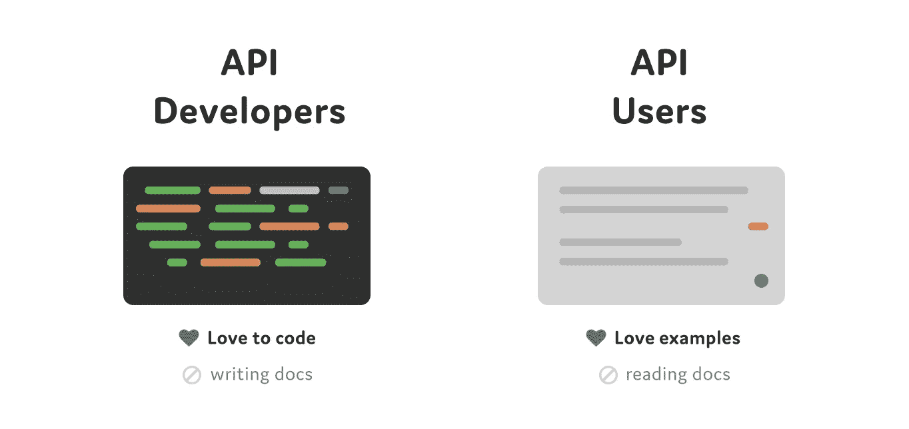
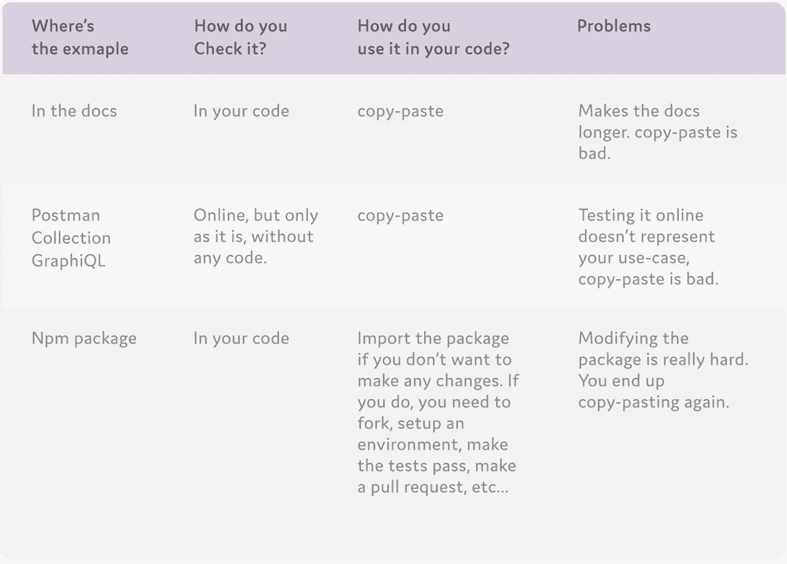
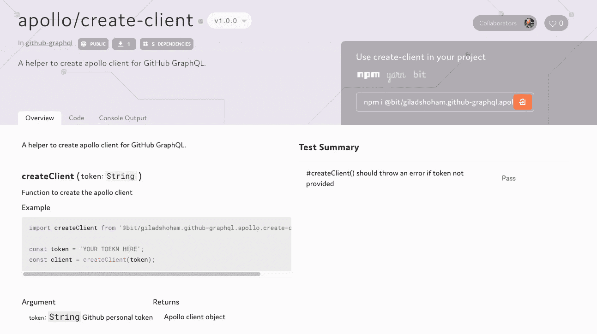
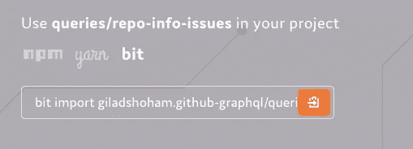
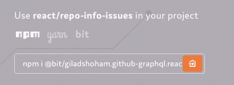

# 通过组件使您的 GraphQL API 更容易被采用

> 原文：<https://medium.com/hackernoon/make-your-graphql-api-easier-to-adopt-through-components-74b022f195c1>

[改善](https://hackernoon.com/tagged/improving)第一次使用新的 [GraphQL](https://hackernoon.com/tagged/graphql) API 的体验对于用户采用和参与你的产品至关重要。

然而，让人们第一次使用你的 API 是很棘手的。为了创造首次使用 API 的成功体验，你必须让它既**可以理解**又**有用**，让人们在自己的项目环境中轻松开始工作。

示例是为新用户创建沙盒开始游戏的好方法。问题是，在用户的项目环境中使用示例可能很棘手。

[Bit](https://bitsrc.io) 是一个开源项目，可以帮助用户在自己的项目中动手使用你的 API 示例。这是它的工作原理。

# API 文档悖论



Code and examples

理解你的 API 通常从你的文档开始。

矛盾的是，大多数开发人员并不真正喜欢编写和阅读文档。这使得您和您的用户都很难为第一次使用您的 API 创造良好的体验。

当开发一个新的 API 时，大多数开发人员真正寻找的是可以在他们的项目中使用并且容易使用的例子。问题是，在用户的项目中修改示例可能很难，也很棘手。



GraphQL API examples can be tricky

这就是为什么让示例成为一个“沙箱”对于用户来说很重要，让他们可以开始玩，在他们自己的项目中进行更改，并快速进入与我们的 API 的实际接触。

# API 示例一个带 Bit 的沙箱

在外部环境中尝试示例并不真正适用于您的用户当前的用例。因此，你必须确保他们能够在他们自己的项目中实际运用这些例子。

[**Bit**](https://bitsrc.io) 是一个加速和简化项目间代码共享的工具。

使用 Bit，你可以从任何库隔离和共享代码，用 NPM 把它安装在其他项目中(不需要安装 Bit ),从任何其他库或项目中轻松地修改代码本身。

当涉及到 GraphQL API 时，这最后一部分非常有用，因为用户可以将您的 API 示例作为可重用组件导入到他们自己的代码中，并轻松地对其进行更改以满足他们的需求。让我们快速看一个例子。

# 例如:GitHub 的 GraphQL API



GitHub’s GraphQl Apollo/create-client API component shared with Bit

假设 Github 的人想让他们的 GraphQL API 更容易被开发者使用。

API 的使用范围包括 GraphQL 查询，创建一个连接到 Github GraphQL API 的 [Apollo 客户端](https://bitsrc.io/giladshoham/github-graphql/apollo/create-client)，甚至可能是一个调用 API 的 React 组件的示例。

让我们使用[位](https://bitsrc.io)来共享所有这些组件，并从另一个项目的上下文中对相关示例进行更改。

# 共享您的 GraphQL API

这里有一个包含 GitHub 的 GraphQL API 的模板项目。

我们可以使用 Bit 将 API 共享到一个组件集合(称为 Scope) [中，就像这个](https://bitsrc.io/giladshoham/github-graphql)一样，用户可以将它导入到自己的代码中。

## 与 Bit 共享我们的 API

下面分享一下来自[模板项目](https://github.com/GiladShoham/github-graphql-template)的 GitHub 的 API 组件。

对于这个特殊的例子，我们必须[生成一个 github 令牌](http://creating-a-personal-access-token-for-the-command-line)来访问 GitHub 的 API。然后，让我们将生成的令牌复制到`./src/App.js`目录，而不是“YOUR TOEKN HERE”字符串，并运行 NPM 安装。

```
npm i
npm start
```

就像 Git 一样，您可以在任何服务器上设置 Bit 作用域。为了简单起见，让我们使用免费的 Bit Hub 和[创建一个我们自己的](https://bitsrc.io/signup)范围。

让我们为项目安装 Bit 并初始化它。

```
# install Bit
npm install bit-bin -g# init new bit scope
cd github-graphql-template
bit init
```

现在让我们为将要共享的代码添加构建和测试环境。Bit 将在免费 Hub 上的隔离环境中运行它们。

```
# adding compiler to make sure we can compile our code from any project
bit import bit.envs/compilers/react -c# adding mocha as tester environment so we can run tests from any project
bit import bit.envs/testers/mocha -t
```

接下来，让我们使用 Bit 来跟踪想要共享的代码，并在共享之前标记它以锁定它的版本并定义它的依赖关系。

我们还将运行 status 命令来查看一切正常。

```
# tracking all components with Bit
bit add src/*/*  -t src/{PARENT}/{FILE_NAME}.spec.js# lock a version for all components
bit tag --all 1.0.0# see the tagged components waiting to be exported
bit status
```

最后，让我们将 API 组件共享到我们创建的范围中。

```
# export the components to your own scope
bit export [USERNAME.SCOPENAME]
```

对于本教程，我已经[分享了这个作用域](https://bitsrc.io/giladshoham/github-graphql)作为例子。这些组件现在可以使用 NPM 从 Bit 的注册表安装到用户的项目中，即使他们没有使用 Bit，也从来没有安装过。

用户还可以使用`bit import`带来组件的实际源代码，并从他们自己的项目环境中进行修改。

# 用户可以在他们自己的项目中使用您的 API

假设一个新用户正在尝试采用我们的 API。

一旦接触到我们创建的范围，他们可以将这些例子中的任何一个导入到他们自己的项目中，并开始改变它以适应他们的真实用例。

这里是另一个代表用户项目的[示例项目](https://github.com/GiladShoham/github-graphql)。正如你在`[pakcgae.jso](https://github.com/GiladShoham/github-graphql/blob/master/package.json)n`中看到的，用户甚至用 NPM 安装了组件。让我们克隆它来模拟一个用户的项目。

为了这个 GitHub API 示例，让我们也用[生成](https://help.github.com/articles/creating-a-personal-access-token-for-the-command-line/)令牌并将其复制到`./src/App.js`中，而不是再次复制到“YOUR TOEKN HERE”字符串中，然后运行 NPM 安装。

## 更改用户项目中的示例

让我们假设试图采用我们的 API 的开发人员想要将回购标签列表添加到我们的应用程序中。通常，这将是一个混乱的过程。



有了 Bit，他们可以使用`bit import`将[查询/回购信息发布](https://bitsrc.io/giladshoham/github-graphql/queries/repo-info-issues)组件的源代码导入到他们自己的项目中进行修改。

```
# init Bit for the project
bit init# bring the component's source code into your project
bit import giladshoham.github-graphql/queries/repo-info-issues
```

现在他们可以看到 components/queries/repo-info-issues 下的代码，并打开`index.js`文件添加他们需要的代码，以在 nameWithOwner 下添加 10 个标签的列表。

```
labels (last:10) {
  edges {
    node {
      name,
      color
    }
  }
}
```

一旦更改，他们还需要更改我们的 react 组件来显示列表。同样，有了 Bit，这个工作流程变得简单了。



用户可以将 react 组件导入他们的项目。

```
# bring the component source code into your project
bit import giladshoham.github-graphql/react/repo-info-issues
```

代码现在可以在 components/react/repo-info-issues 下看到，他们可以在 issues ul 下添加标签列表。

```
<ul style={{'listStyleType': 'none'}}>
  { repository.labels.edges.map( label => (
    <li style={{'textAlign': 'left', 'color': `#${label.node.color}`}} key={label.node.name}>{label.node.name}
    </li>) ) }
</ul>
```

现在他们也可以编译新代码了。

```
bit build
```

如您所见，Bit 安装了编译组件所需的所有东西，因此我们的用户甚至不需要安装任何东西就可以工作。

现在他们可以简单地运行项目。

```
npm start
```

如您所见，您已经正确渲染了新组件。

如果他们想要共享组件的新版本，他们可以标记并导出到他们自己的范围，并使用任何项目的更新版本。

```
# see our status
bit status
# tag a new version of the modified components
bit tag -am "added labels list"
# export back to bitsrc.io
bit export [USERNAME.SCOPENAME]
```

仅此而已。

# 结论

改善首次使用新 GraphQL API 的体验对于提高产品的采用率和参与度至关重要。

为了理解如何使你的 GraphQL API 更容易被采用，我们把自己放在必须采用我们的 API 的开发人员的位置上。

我们可以使用 [Bit](https://bitsrc.io) 来帮助他们轻松获取我们的 API，并根据他们自己的用例和项目环境对其进行定制，从而更快、更简单地采用我们的 API，而不必阅读冗长的文档或使用他们真实用例和项目上下文之外的示例。

欢迎[向](https://gitter.im/bit-src/Bit)询问任何问题，[建议反馈](https://github.com/teambit/bit)和[试一试](https://bitsrc.io)。

我[无论什么时候发布新帖子都会推文](https://twitter.com/ShohamGilad)，保证！✍