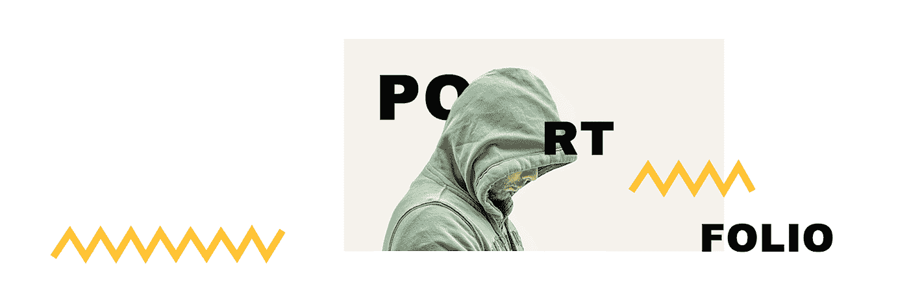

# 在加热披萨的时候制作自己的网站

> 原文：<https://medium.com/hackernoon/make-your-own-website-while-heating-up-a-pizza-slice-c0dfcea81e19>

[**Ucraft**](https://www.ucraft.com/) 是一个易于使用的网站构建器，让每个人都可以为自己的个人品牌创建一个令人惊叹的网站。Ucraft 为您提供打造一流网站所需的一切！

[凯文·威廉·大卫](https://medium.com/u/8ea7bd91b1a4?source=post_page-----c0dfcea81e19--------------------------------)采访了 [Gev Balyan、](https://medium.com/u/dc39ffe3d6f4?source=post_page-----c0dfcea81e19--------------------------------)u craft**创始人了解更多。**

****

## **你能告诉我们你正在做什么吗？什么是 Ucraft？**

**首先， [Ucraft](https://medium.com/u/9c0e58fd2c7d?source=post_page-----c0dfcea81e19--------------------------------) 是一个拖放式的网站构建器，它提供了创建全功能网站的工具，从[创建你自己的 logo](https://logo-maker.ucraft.com) 到设计页面并针对搜索引擎进行优化。**

## **告诉我更多关于你为什么要建立这个的信息？**

**Ucraft 背后的愿景主要是让客户在没有技术或设计技能的情况下创建专业外观的网站，无论是登录页面、完整的网站还是在线商店。**

**我们还倾向于提供负担得起的定价模型，以使产品完全适合不同的个人和企业。**

## **Ucraft 与市场上已经存在的产品有何不同？**

**我们首先想到的是设计，因为无论我们在 Ucraft 做什么，都会想到 UX 和设计。我们将设计和 UI 放在首位，以保证流畅和直观的体验。此外，Ucraft 还提供 24/7 全天候客户支持，让创作过程更加轻松和有趣。**

## **谁用 Ucraft？您的客户在他们的公司中担任什么样的角色？**

**理想的答案是，任何人都可以为自己的个人或公司品牌创建网站。换句话说，所有的小企业主、营销人员、设计师和自由职业者。所有的设计师模板都被分类到不同的行业和主题中，因此任何人都可以找到一个完全符合他们的视觉效果的模板。**

## **您的客户如何使用 Ucraft？你能分享一些不同的使用案例吗？**

**我们客户的需求各不相同，使用 Ucraft 的场景也各不相同。比方说，你可以通过建立一个免费的登录页面来创造更多的线索和流量，或者通过创建一个漂亮的个人作品集网站来展示你的作品。可信的公司网站和成功的在线商店是使用 Ucraft 建立高效在线形象的下一个案例。**

****

## **Ucraft 有没有你没有想到或预料到的独特用例？**

**在我们的数据库中，有许多由超级创意人士创建的独特网站，但最令人震惊的是一家位于加州的在线商店网站 weed delivery。伙计们用 Ucraft 创建了一个奇妙的网站，然后变成了一个名为 El Chocho 的模板:[https://demo-El-Chocho . u craft . me](https://demo-el-chocho.ucraft.me)**

****

## **有什么早期的“成长秘诀”或策略促成了你现在的成功吗？**

**我们团队所信奉的所谓策略是，从项目启动之初就开始倾听客户的反馈。它确实帮助我们建立了一个平台，我们现在称之为 Ucraft。一个不断发展和进步的平台，拥有大量强大的集成、高度热情的团队和专注的客户群。**

****

## **在早期构建产品时，最大的挑战是什么？你是如何解决的？**

**不言而喻，创办一家[初创公司](https://hackernoon.com/tagged/startup)是一件相当具有挑战性的事情。在最开始的时候，我有一个由优秀的开发人员和设计人员组成的小团队来支持这个项目，并且有一个必须实现的清晰愿景:最终的平台会是什么样子，它应该包括哪些功能，等等。**

**然而，当我在三个月的不眠之夜后被呈现出 Ucraft 的 demo 时，事实证明一切都与我的预期相差甚远。**

**所以，当开发人员那天晚上回家后，我删除了同事们 3000 个小时的工作。不，这不是一个错误:)。我知道这是冒险和唐突的，但我确信没有什么能挽救这种局面，而不是从头开始。**

**第二天早上我把这个消息告诉了开发商。不用说，他们很生气，但这一经历确实帮助他们在今后的工作中做得更好。而且，它教会了我们整个剧组齐心协力，变成一个真正的“团队”。**

## **你加入的最有趣的整合是什么？有什么对你特别有影响的吗？**

**Ucraft 与网络上最有影响力的平台建立了大量强有力的友谊。这使得建筑商的营销水平达到了一个新的高度。现在，不仅要创建漂亮的网站，还要尽可能以最好的方式进行营销。 [**Google Analytics**](https://siftery.com/google-analytics) 和[**hot jar**](https://siftery.com/hotjar')[hot jar](https://medium.com/u/449cb2a51a18?source=post_page-----c0dfcea81e19--------------------------------)因其出色的分析功能或 [**Zendesk**](https://siftery.com/zendesk) 和 Intercom 因与客户建立强有力的纽带，仅举几例。**

**有趣的是，不能错过与 [Unsplash](https://medium.com/u/2053395ac335?source=post_page-----c0dfcea81e19--------------------------------) free stock 的集成，这就像让世界上最慷慨的摄影师社区为您的网站提供引人注目的视觉效果。**

## **最后，你运营公司所依赖的顶级产品是什么&你如何使用它们？**

**作为一名搜索引擎优化爱好者，我显然应该提到[Ahrefs.com](https://medium.com/u/d1d1e5a5594a?source=post_page-----c0dfcea81e19--------------------------------)，因为我们非常依赖这个平台提供的数据来增加我们的有机搜索流量，以及 [SEMrush](https://medium.com/u/66ea53c1199c?source=post_page-----c0dfcea81e19--------------------------------) 为我们客户的搜索引擎优化优化我们的构建器。**

**然后我会选择 [**对讲机**](https://medium.com/u/7ca8972daf76?source=post_page-----c0dfcea81e19--------------------------------) ，作为一个一体化平台，帮助我们与用户保持联系，并在用户体验的每个阶段对他们进行教育。**

***最初发表于*[*siftery.com*](https://siftery.com/stories/make-your-own-website-while-heating-up-a-pizza-slice)*。***