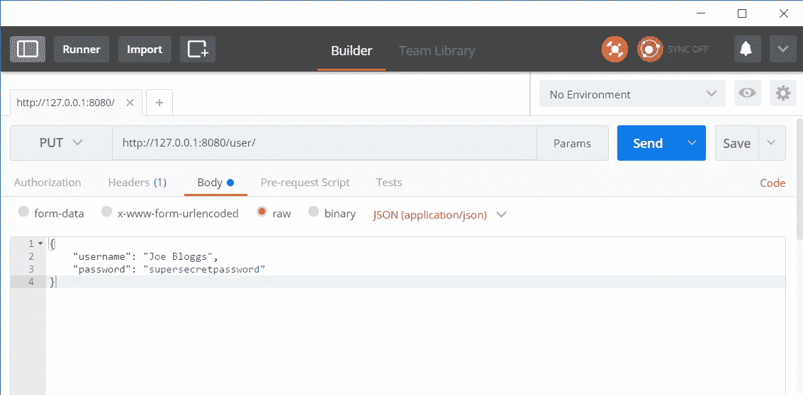
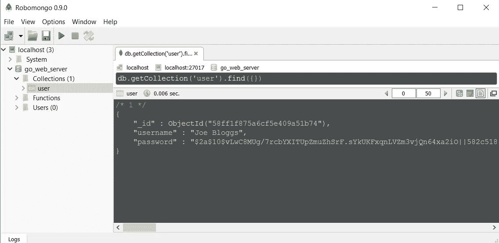

# 用 MongoDb 让自己成为一个 Go web 服务器。继续，继续，继续…

> 原文：<https://medium.com/hackernoon/make-yourself-a-go-web-server-with-mongodb-go-on-go-on-go-on-48f394f24e>


我主要用 c#和 node.js 编程，这篇文章是我最近涉猎围棋的结果。我开始在 go 中创建一个简单的 web 后端，看看它与 node 相比如何。我喜欢 node，因为它允许我非常快速地创建 API，但缺点是大多数项目严重依赖外部库，导致巨大的代码膨胀和[潜在的恶意代码](https://hackernoon.com/im-harvesting-credit-card-numbers-and-passwords-from-your-site-here-s-how-9a8cb347c5b5)。

我创建了一个小应用程序来演示如何设置 rest api、测试、散列用户密码以及在 MongoDb 中存储数据，完整代码可以在这里查看:

[](https://github.com/eamonnmcevoy/go_rest_api.git) [## eamonnmcevoy/go_rest_api

### go_rest_api -使用 mongoDb 运行 web 服务器

github.com](https://github.com/eamonnmcevoy/go_rest_api.git) 

1.  [从 mongoDb 创建和检索用户](#a432)
2.  [加盐密码](#7aa1)
3.  [REST API —创建和检索用户](#6c9c)
4.  [cmd 文件夹—链接所有内容](#9207)
5.  [认证(一种)](#bb74)

# 包装布局

在这个项目中，我试图遵循本·约翰逊描述的“标准包装布局”。

这看起来是这样的:

```
go_rest_api
  /cmd
    /app
      -app.go
      -main.go
  /pkg
    /mongo
    /server
    /mock
    -user.go
```

在`/cmd`文件夹中，我们有我们的主应用程序代码，这只是用来连接我们的依赖项和启动服务器。

文件夹是我们大部分代码所在的地方。在根级别，我们定义我们的域类型和接口，我们的根包不依赖于任何其他包。

# 第 0 部分—环境设置

如果你还没有安装 Go，那就去做:[安装指南](https://golang.org/doc/install)

如果你还没有学会围棋的基础知识，那就去学吧:[围棋赛](https://tour.golang.org/welcome/1)

确保您的 GOPATH 目录采用以下格式:

```
GOPATH/
    /bin (to output your built executable files)
    /pkg (to store your projects dependencies)
    /src (your code goes here)
```

我们将在这个项目中使用一些外部依赖，所以让我们现在下载它们。在 GOPATH 目录中运行以下命令。

```
//required
go get gopkg.in/mgo.v2                   //MongoDb driver
go get golang.org/x/crypto/bcrypt        //password hashing//could live without
go get github.com/gorilla/mux            //http router
go get github.com/gorilla/handlers       //http request logging
go get github.com/google/uuid            //generate password salt
```

我们可以在没有 Gorilla 的情况下实现这个项目，这要感谢 Go 的内置 http 库。然而，一旦您的 rest api 开始增加复杂性，像 Gorilla 这样功能更全的路由工具包将会非常方便。

最后但同样重要的是，安装一个版本的 MongoDb，并通过在命令行运行`mongod`来启动服务器。

【https://docs.mongodb.com/manual/installation/】

# 第 1 部分—从 Mongo 创建和检索用户

让我们开始吧，我们首先需要的是一个用户数据类型。在`pkg`文件夹中创建文件`user.go`并定义类型和服务接口。

go_web_server/pkg/user.go

接下来我们需要实现我们的`UserService`，因为我们已经决定使用 MongoDb 作为我们的数据库，让我们创建一个`mongo`包并在其中实现服务。

创建一个文件夹`pkg/mongo`，并添加两个文件`user_model.go`，和`user_service.go`

go_web_server/pkg/mongo/user_model.go

在这个文件中，我们定义了 3 件重要的事情

1.  我们将插入 Mongo 的文档结构— `userModel`。我们在这里没有使用`root.Model`，这样我们可以将对`gopkg/mgo.v2/bson`的依赖限制在`mongo`包中。
2.  [应用于我们的用户集合的索引](https://godoc.org/labix.org/v2/mgo#Index)。这个索引允许我们在`Username`字段上快速查询 Mongo，并防止重复的`Username`。
3.  `newUserModel`和`toRootUser`用于在`userModel`和`root.User`之间转换

你可能已经注意到了这个模型中明显的安全缺陷，我们以纯文本的形式存储密码；不要担心，我们将在第 2 部分用 salted hash 解决这个问题。

go_web_server/pkg/mongo/user_service.go

这是我们`UserService`实现的基础。构造函数从`session`参数中获取一个集合，并设置用户索引。

go_web_server/pkg/mongo/user_service.go

实现我们的接口非常简单。`Create`函数非常简单，将`root.User`转换为`userModel`并插入到我们的集合中。`GetByUsername`使用匹配的`username`为单个用户执行 M [ongo 查找操作](https://docs.mongodb.com/manual/reference/method/db.collection.find/)。

最后，我们将创建一个`session.go`文件来管理到 Mongo 的连接。

go_web_server/pkg/mongo/session.go

该文件定义了三个简单的函数来创建、访问和关闭 Mongo 会话，并从该会话中获取一个指向集合的指针。

就这样，我们完全实现了`root`包中定义的`UserService`，并导出了创建和维护 Mongo 会话的函数；是时候写一些测试了，看看它是否有效。在 Mongo 包中创建另一个新文件`mongo_test.go`

go_web_server/pkg/mongo/mongo_test.go

在这个集成测试中，我们将一个用户插入到数据库中，验证集合中存在一个用户，并且他们与我们的测试数据相匹配。转到命令行并运行测试

```
➜ go test ./src/go_rest_api/pkg/mongo/
ok      go_rest_api/pkg/mongo    0.145s
```

成功！

…或者是吗？你会注意到，如果我们第二次运行测试，我们会得到一个错误。

```
2017/03/14 22:58:04 Unable to create user: E11000 duplicate key error collection: test_db.user index: username_1 dup key: { : "integration_test_user" }
```

我们需要一种清理测试数据库的方法，让我们扩展`session.go`来提供一个删除数据库的功能。打开`session.go`，增加以下功能:

go_web_server/pkg/mongo/session.go

然后修改`mongo_test.go`中的延期语句

go_web_server/pkg/mongo/mongo_test.go

现在我们运行测试我们的心满意足！

# 第 2 部分—加盐密码

在第 1 部分中，我们实现了一个在 MongoDb 中存储用户文档的服务；但是，我们以明文形式存储用户密码。让我们引入一个新的 go 包，允许我们生成和比较加盐散列。

在根包中为我们的散列函数定义一个接口:

go_web_server/pkg/hash.go

和实现，在`/pkg/crypto/hash.go`

go_web_server/pkg/crypto/hash.go

我们的实现生成了一个格式为`{hash}||{salt}`的 hash，这使得存储 hash-salt 组合稍微方便一些，因为我们只在一个数据库字段中存储，而不是两个。我们现在需要测试我们的实现，看看它是否工作，我们将测试我们是否可以成功地将生成的散列与输入字符串进行比较，检测何时进行了不正确的尝试，以及每次调用生成的散列都会产生不同的结果。

现在我们知道我们的`cryto`包正在工作，让我们修改`user_service.go`来存储散列密码而不是纯文本。扩展`NewUserService`函数以接受`root.Hash`的实例，然后使用它在`Create`中生成散列密码。

到目前为止还不错，但是 Mongo 测试现在由于增加了参数而中断了。我们需要创建一个模拟的`Hash`实现来保持包之间的分离。在`pkg/mock/hash.go`中创建一个非常简单的模拟

然后，在`mongo_test.go`中，简单地用模拟散列实现实例化`UserService` 实例。

就这样，在这一节中，我们创建了一个加密包来处理密码加盐，添加了包之间的交互，并创建了第一个模拟实现

# 第 3 部分—用于创建和检索用户的 REST API

系统中的下一个主要组件是 http 路由器，我们将使用 [Gorrilla mux](http://www.gorillatoolkit.org/pkg/mux) 包来配置我们的 rest 端点。这个包将包含三个文件:

```
go_web_server/pkg/server/
      server.go           -- configure router & starts listening
      response.go         -- helper functions for sending responses
      user_router.go      -- routes for our user service
```

go_web_server/pkg/server/server.go

`NewServer`函数初始化服务器和用户子路由器，这允许我们将所有以`/user`开头的请求指向`user_router.go`文件。`Start`简单地在端口`8080`上启动我们的服务器，我们另外通过 gorilla `LoggingHandler`传递所有请求，以提供对 stdout 的自动请求记录。

go_web_server/pkg/server/user_router.go

用户路由器公开了两个 rest 端点，用于与 Mongo 服务进行交互。

1.  `PUT /users/`用于向数据库添加新用户。
2.  `GET /users/{username}`用于搜索具有给定用户名的用户。

您会注意到对`Json`和`Error`的一些不常见的函数调用，这些是在`response.go`中定义的帮助函数

go_web_server/pkg/server/response.go

# 第 4 部分—`cmd`文件夹，链接所有内容

既然`server` `mongo`和`crypto`包已经可以工作了，我们可以将它们连接到一个正常工作的 web 服务器中。创建文件夹`go_web_server/cmd/app`并添加`main.go`

现在我们可以编译并运行服务器了:

```
 ➜  go install ./src/go_web_server/cmd/app
➜  ./bin/app.exe
2017/04/25 13:50:35 Listening on port 8080
```

使用 postman，我们可以很容易地测试服务器端点。



我们现在有一个工作服务器，此时我们可以将它连接到 web 前端或移动应用程序，并开发一个用户注册表单。我们需要的下一个主要功能是认证用户和保护终端的能力。(当然，您不应该在这里返回用户密码)。

# 第 5 部分—用户认证(某种程度上)

我不会在这里创建一个完整的用户认证系统，只是一个验证用户凭证的端点。在我的下一篇文章中，我将展示如何将这一责任交给神奇的 [kong api gateway](https://getkong.org/about/) 。

按照我们在前面几节中使用的相同模式，我添加了一个简单的端点来接受用户名/密码组合，并在数据库中找到具有匹配凭证的用户。如果找到用户，则返回它们，否则返回一个错误。

在所有这些工作之后，我们创造了一个相当无用的 api，但它是我们的，我们热爱它。

如果你想被说服学习围棋，我推荐这篇文章:[https://medium . com/@ keval Patel 2106/why-should-you-learn-go-f 607681 fad 65](/@kevalpatel2106/why-should-you-learn-go-f607681fad65)

这篇文章阅读更多关于我在这个项目中使用的文件夹结构:[https://medium . com/@ benbjohnson/standard-package-layout-7 cdbc 8391 fc1](/@benbjohnson/standard-package-layout-7cdbc8391fc1)