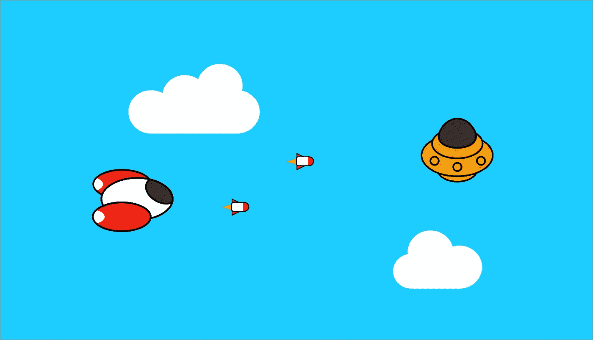
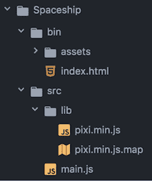

# 用 Javascript 制作游戏:第 1 部分

> 原文：<https://medium.com/hackernoon/making-a-game-with-javascript-and-pixijs-part-1-e3235139cd6f>

## 从动画背景开始

## 介绍

我很想写一个关于我喜欢使用的游戏技术的教程，所以在这里。在这个故事中，我们将开始用 PixiJS 制作一个小的射击游戏，这是一个非常简单和酷的 Javascript 库。

我们要做的就是让一艘宇宙飞船能够移动和射击，敌人的波浪穿过，以及一个美丽的移动的云的动画背景。第一部分(这个故事)将重点放在背景上。

准备好了吗？让我们搞定它！

## 入门指南

让我们从设置我们的项目开始:我上传了一个已经设置好的代码结构，所以我们都在同一个基础上工作。但是如果你想自己制作，我把我的文件夹的图片放在 **:** 下面

[点击这里下载入门项目](https://github.com/Karzam/Spaceship_Tutorial_Starter_Project)

Project folder structure

我们需要一个本地服务器来运行这个游戏:我邀请你下载 **WAMP** 如果你用的是 Windows，或者 **MAMP** 用于 macOS，它们都是免费且易于使用的。让我们**把你的游戏文件夹放到服务器 one**(MAMP 的*htdocs*/WAMP 的 *www* )里，在你最喜欢的浏览器里输入 localhost 链接(对我来说:*http://localhost:8888/Spaceship/bin/*)

在*index.html*中，我们正在导入头文件中的 javascript 文件:

…并且**我们需要为我们制作的每个文件做同样的事情**。接下来是 Pixi 的初始化(基于 WebGL 渲染引擎):

对于本教程，我们告诉游戏覆盖整个浏览器窗口，所以如果你现在尝试，你会得到一个全黑的背景。

*main.js* 文件是所有游戏开始的地方。它就像一个管理器，拥有游戏首先执行的功能，以及我们可以告诉游戏在每一帧上需要做什么的循环。我们想要的是游戏开始时天空的蓝色背景，所以让**更新 *init* 函数:**

Pixi 使用的是*十六进制*颜色格式，所以**你需要在 *0x*** 之前写你的颜色代码。让我们保存并在您的浏览器中查看结果！

## 到处都是云

这个背景很无聊，我们来加点浮云吧。

首先，让我们**在 *src* 文件夹中添加一个新的***cloud manager***类文件(它将创建并移动云):**

**不要忘记将**添加到 index.html**文件**的** *中，就像我们对 *main.js* 所做的那样:***

**构造函数是这个类的入口点，我们可以在这里为我们的云添加 spawn 函数。我们想要的基本上是一种能够每 X 秒创建一个云的方法，这很好，因为有一个 javascript 工具可以做到这一点:**

**这段放在构造函数中的代码，每隔 **1000 毫秒** (= 1 秒)，就会**调用小胡子括号里面的内容。****

**让我们**在** *资产* **文件夹**中添加云精灵，因为它更好，我们有 2 个不同的图像:(**云是白色的，背景透明，所以它们在这个页面上是不可见的，但这里有 GitHub** 上的链接；)**

> **[https://github . com/Karzam/space ship _ Tutorial _ Part _ 1/blob/master/bin/assets/cloud _ 1 . png](https://github.com/Karzam/Spaceship_Tutorial_Part_1/blob/master/bin/assets/cloud_1.png)**
> 
> **[https://github . com/Karzam/space ship _ Tutorial _ Part _ 1/blob/master/bin/assets/cloud _ 2 . png](https://github.com/Karzam/Spaceship_Tutorial_Part_1/blob/master/bin/assets/cloud_2.png)**

**我们需要在游戏开始前加载精灵，所以**将它们添加到***pixi . loader . add***函数:****

**好了，现在我们可以在 *CloudManager* 的 *setInterval* 方法中显示云了:**

**要恢复此代码:**

*   **首先，我们**正在计算一个介于 0 和 1 之间的随机数**，它要么小于 0.5，所以我们将第一个精灵存储在一个常量中，要么就是第二个精灵。**
*   **然后，我们用在前一行中得到的图像创建一个新的 sprite 对象。**
*   **这个精灵的原点将是它的左上角，所以我们**将它的锚点设置在中间。****
*   **我们要**显示超出屏幕右边界的云**，这样它就可以通过屏幕向左移动:***renderer . width * 1.2***就是左边界位置+屏幕宽度+其宽度的 20%。我们可以确定我们不会看到它产卵。对于 y 位置，***renderer . height * math . random()***是介于 0 和窗口高度之间的数字。因此云的垂直位置将位于屏幕顶部和底部之间的**。****
*   **最后，我们把 ***addChild*** 这个云带到舞台上。**

**如果你运行这段代码，什么都不会出现，这是故意的，因为它们必须弹出来。所以现在我们必须让他们搬走。**

**更新功能是做这件事的地方。但是我们需要将云存储在一个数组中，这样我们就可以迭代并设置它们的位置。让我们**在** *CloudManager* **中初始化一个新数组构造函数:****

**…并在 *stage.addChild* 函数后将云推入:**

**现在我们可以在 *update* 中**迭代数组，并设置每个云的位置**:**

**现在成功了！**

****

**Moving clouds!**

**哦，等等，有件事应该让我们烦恼:**那些云都去哪里了？****

**是的，如果我们在它们离开屏幕后不删除它们，它们将继续存在，这可能会导致一些性能问题**。**让我们在 *forEach* 中添加一条语句，当它们的水平位置稍微低于屏幕的左边界时，删除它们(这样我们就看不到它们突出来了):**

**我们不玩云了！**

**对云的大小做一个随机的变化怎么样？**将此添加到云创建块:****

****

**Random clouds size**

**如果你的代码中缺少/没有工作， [**你可以在这里查看结果**](https://github.com/Karzam/Spaceship_Tutorial_Part_1) **。****

## **[下一部分:玩家飞船](https://hackernoon.com/making-a-game-with-javascript-part-2-8154bd6e2de1)**

**感谢您的阅读！**