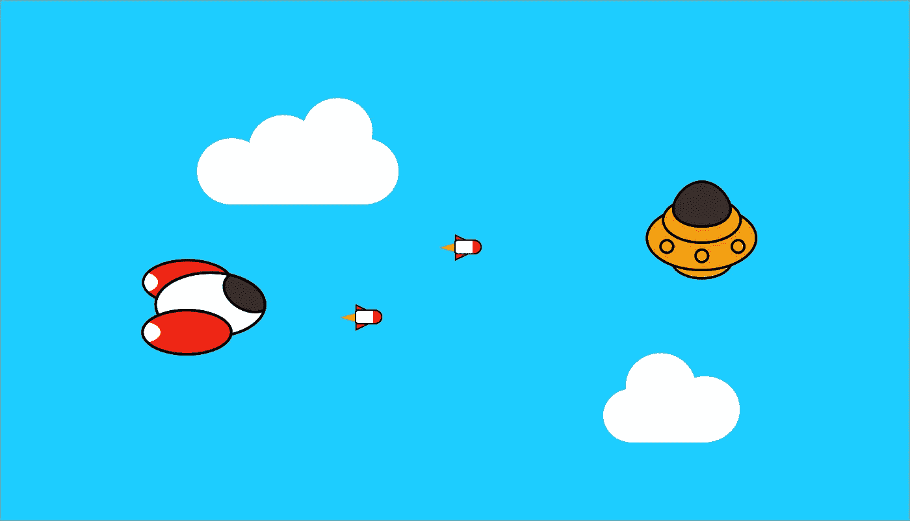

# 用 Javascript 制作游戏:第 2 部分

> 原文：<https://medium.com/hackernoon/making-a-game-with-javascript-part-2-8154bd6e2de1>

## 建造宇宙飞船

## 迎头赶上

大家好！本文是我用 Javascript 制作一个小游戏的教程的第二部分。 [**你可以在这里阅读 Part 1**](https://hackernoon.com/making-a-game-with-javascript-and-pixijs-part-1-e3235139cd6f)**。**

[**本教程的完整源代码可以在这里找到**](https://github.com/Karzam/Spaceship_Tutorial_Part_2) **。**

## 创造宇宙飞船

现在背景完成了，我们终于可以开始设置我们的飞船了！

让我们**创建一个** *Player.js* **文件****添加到***index.html*作为脚本(同 *CloudManager* )。

这是一个在几分钟内设计出来的(漂亮的)飞船，你可以**添加到你的** *资产* **文件夹**和 *main.js* 的 loader 函数中:

Spaceship

基本上，我们希望这艘船出现在屏幕左边附近。我们还需要**的锚点**(对象的位置点)在精灵的中心**，因为它可能太大了，我们可以重新调整它的大小:**

当然，我们必须将**声明为** *main.js* 文件的全局变量，这样它就可以在游戏中实例化:

…和同一文件的 *init* **函数中的**(就在 *CloudManager* 之后):****

现在你应该看到闪闪发光的宇宙飞船巡航。

然而，如果你等待几秒钟，你应该得到一些麻烦:

***飞船在云层后面飞行！***

是的，因为事实上，**最后一个创建的对象正在移动到前一个的后面。飞船实例化后，云正在生成，所以我们需要云管理器在对象列表的底部生成云。为此，我们只需对**更新一点***addChild***中的***cloud manager***类:********

*****addChildAt* 允许我们传递第二个参数，即**舞台对象列表**中的位置。它越远，精灵在屏幕上就越远。****

****“0”表示对象列表中的第一个索引**，所以每次我们创建一个新的云，我们**会把它添加到列表**的第一个位置，确保**会出现在飞船后面。********

**现在完成了，我们可以启动飞船控制器了。**

## **移动宇宙飞船**

**让我们回到 *Player.js* 类，**在构造函数**中添加一些行:**

**这允许游戏捕捉**键盘事件**(当一个键被按下和释放时)。当其中一个事件发生时，将执行每行末尾的方法。**

*****注*** *:通过添加”。bind(this)”在函数的最后，我们将对象的上下文传递给它，这意味着我们仍然可以通过调用“this”来访问它的属性。如果我们不这样写，回调函数就不能确定我们正在处理哪个对象。请记住，如果您一个回调函数得到一个“undefined this”错误，您可能必须像这样绑定您的对象。***

**让我们**在同一个类**中定义两个空方法(我们稍后将填充这些方法):**

**我们还需要 3 个变量来移动飞船:它的**水平和垂直方向** (X & Y)和**速度**(它们都在构造函数中):**

**该对象基本上是键码和方向值的关联:**

*   **37 是**左箭头键**，要向左移动我们的飞船，我们需要减少它的 X 位置。**
*   **38 是**向上箭头键**，要将我们的飞船移动到顶部，我们需要降低它的 Y 位置。**
*   **39 是**右箭头键**，要向右移动我们的飞船，我们需要增加它的 X 位置。**
*   **40 是**向下箭头键**，要将我们的飞船移到底部，我们需要增加它的 Y 位置。**

**每次按下一个键，我们检索相应的方向:**

**这看起来很奇怪，但让我们解释一下:**如果键码是 37 或 39(这意味着左箭头键或右箭头键)，那么我们只需设置 X 方向**。如果是 38 或 40，你可以猜猜发生了什么(是的，实际上是垂直方向)。仅此而已！**

**再来**加上玩家**的更新方法([像云经理，还记得吗？](https://hackernoon.com/making-a-game-with-javascript-and-pixijs-part-1-e3235139cd6f)):**

**…当然还有，**别忘了在 *main.js* 的循环函数**中调用它！**

**如果你保存并重新加载游戏，它(应该)会运行良好，除了当我们释放方向键时船**继续移动。很明显是因为我们没有完成 *onKeyUp* 功能，也就是**抓住刚刚发布的键**。这样，我们可以通过将*方向 X* 或*方向*设置为 0 来停止它。****

**这里有一个小问题:**如果我们将方向设置为 0，因为我们释放了左键，但右键仍被按下，这是怎么回事？****

**是的，宇宙飞船要停下来了，而**我们必须再次按下右键来移动**，这不太符合逻辑。**

**那么，为什么不检查右键或左键是否仍然被按下，这样我们就可以**将方向重置为这个先前被按下的键？****

**这就是我们将要做的。为此，我们需要将每个键的状态存储在一个布尔值中，按下或释放(*真*或*假*)。让我们将所有这些状态放入*播放器*构造函数的一个对象变量中:**

**如果一个键(由它自己的代码识别)被按下，那么**我们就把它的状态改变为*真*，如果它被释放，我们就把它设置为*假*。很简单，对吧？****

**让我们在 *onKeyDown* 的开头加上这一行:**

**…还有这个在 *onKeyUp* 里的:**

**现在我们可以继续 *onKeyUp* 逻辑:**如果水平或垂直键中的一个被释放，但另一个仍然被按下，我们将方向改变到最后一个**。**如果** **他们两个都被释放，我们停船**:**

*****注:*** *处理飞船移动有多种方式，这当然不是最干净的一种，但我认为这是最简单易懂的一种。***

**我们都准备好了，保存&重新加载&享受！**

****升级:** *飞船可以退出屏幕了！尝试在更新它之前检查它的位置。* [你可以在这里查看结果](https://github.com/Karzam/Spaceship_Tutorial_Part_2/blob/master/src/Player.js)。**

## **发射火箭**

**既然我们能控制飞船，我们希望它能发射火箭。**

**让我们从**开始在** *资产* **文件夹中添加精灵:****

****

**…然后**像往常一样将其添加到资产加载器**:**

****在 *src* 文件夹中创建一个名为 *Rocket.js* 的新文件**，并**将其添加到*index.html*中，与其他人一起:****

**让我们回到*玩家*类。我们希望它能够**发射火箭，如果他按下空格键按钮**。 *onKeyDown* 函数已经在捕捉这样的事件了，所以我们只需要**用我们想要的键码**(本例中为空格键)做一个条件:**

**我们在火箭构造器中给出了飞船的位置，所以在里面我们只需**将其位置设置为飞船一号**(有一个偏移量使其出现在飞船的前面而不是中间)。**

**那么我们开始吧，用构造函数初始化 *Rocket.js* :**

**好吧，如果你保存并重新装弹，**你可以按空格键发射(静态)火箭！****

**为了让它们移动，我们需要**创建一个数组变量**包含游戏中存在的所有火箭(我们不知道有多少在舞台上):**

***_list* 变量位于类之外，因为它是静态的，这意味着它的**值是唯一的，并且不仅仅是一个对象的属性**(不像*这个*)。然而，我们可以得到它，并根据我们的需要设置它(使用类的前 2 行)。**

**我们可以**将当前对象推入这个列表**(在构造函数内)并且**同时声明** *速度* **变量**:**

**…并且**添加了** *更新* **方法**:**

**这基本上和以前一样，我们**更新火箭**的***x 位置(而不是 y 位置，因为它不是垂直移动的)并且像云一样，当它超出屏幕限制**时，我们**移除它，除了这次是右边。*****

***之后，在 *main.js* 的循环中，我们只需**解析火箭列表**和**为每个元素调用** *更新* **函数:*****

***保存和重新加载，并尝试它！***

***它在射击，但不是自动的。你必须按下每个火箭的按键，当你不动的时候，这有点奇怪，因为它的发射速度非常快。我们想要的是能够在按键保持按下的情况下**自动拍摄，速度可调。*****

***让我们**在** *玩家* **构造器**中定义两个新变量:开火速度(可以修改)和冷却时间，这将是计时器值:***

***我们还需要**更新** *按键状态*到**添加空格键**，因为我们想知道它是否被按下:***

***下面是我们用来拍摄的函数(需要在播放器的 *更新* **中**调用):*******

***这里非常简单:**我们只需将计时器从 0 增加到我们设定的射击速度**，如果按键被按下，计时器已经达到该值，我们**就会产生一个火箭，并将计时器重置为 0。*****

***该功能在播放器的*更新*循环中永久执行:***

***工作完成！如果你想让它更快，只要降低射击速度变量(并增加它为较慢的速度)。***

******

***Firing some rockets***

## ***下一个帖子:我们正在增加一些敌人！***

***感谢您的阅读！***

******如果有什么问题或者建议，请告诉我，我好改进下一条！******