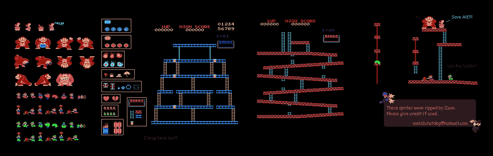
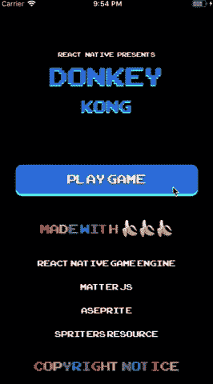
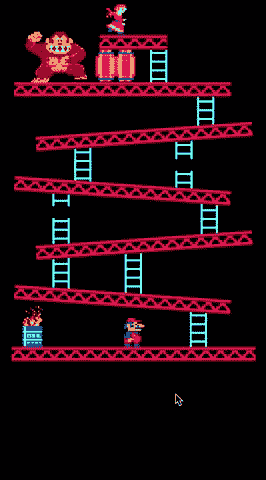
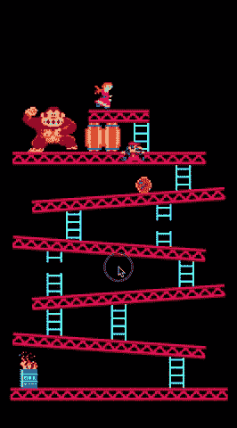
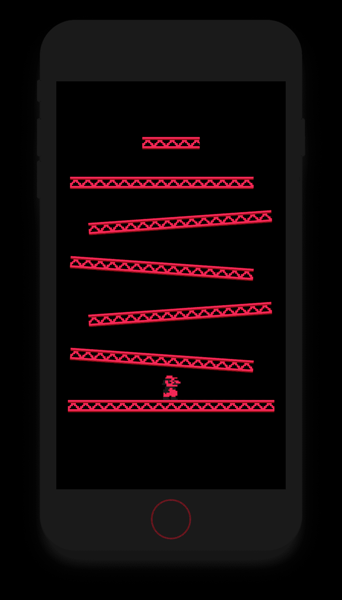

# 用 React Native 制作平台游戏

> 原文：<https://medium.com/hackernoon/making-a-platforming-game-with-react-native-4682b4d4d209>



在这一系列帖子中，我们将使用 React Native 和 [React Native 游戏引擎](https://github.com/bberak/react-native-game-engine)开发经典的大金刚街机游戏的翻拍版。由于这将是一款仅支持移动设备的游戏，我们将大大简化原始游戏的控制——我们的游戏应该只需要一根手指就可以玩。

以下是我们努力实现的目标的预览:



Our player needs to ascend a series of sloping ramps whilst avoiding barrels that are being thrown by Kong

如果你不熟悉原版游戏，我们的角色马里奥(最初被称为 Jump Man)试图拯救公主(最初被称为 Pauline)，同时躲避主要对手孔从一系列坡道上扔下的桶。前往 [Youtube 观看我们正在开发的应用程序的游戏演示](https://youtu.be/rIcbgMdxKdw)。

为了保持良好的进度，这将不是一个逐行的教程，我们将涵盖一些重要的和有价值的主题。完整源代码见 [React 原生大金刚](https://github.com/bberak/react-native-donkey-kong)。

# 项目设置

在您初始化了 vanilla React Native 或 [Expo 项目](https://expo.io/)之后，安装以下先决条件:

## [React 原生游戏引擎](https://github.com/bberak/react-native-game-engine)

这个库将帮助我们循环运行我们的游戏，并管理/操纵我们的游戏实体(玩家；射弹；敌人；梯子；平台等。).特别是，我们将使用 GameEngine 组件，它是[组件-实体-系统](https://github.com/bberak/react-native-game-engine#managing-complexity-with-component-entity-systems)模式的松散实现。

```
npm install — save react-native-game-engine
```

## [事项 JS](http://brm.io/matter-js/)

这是一个 2D 物理图书馆，它将帮助我们模拟从一系列斜坡上投掷物体的过程。这也将有助于我们移动我们的角色马里奥上斜坡走向公主。

```
npm install --save matter-js
```

## 其他 NPM 套餐

```
npm install --save lodash # Always good to have
npm install  --save d3-interpolate # Will help us create a nice jump curve
```

## [Spriters 资源](https://www.spriters-resource.com)

我从网站 [Spriters Resource](https://www.spriters-resource.com) 上找到了一些很棒的艺术品和资产。我在这里找到了大金刚的原始雪碧床单。他们拥有大量其他游戏的资产。

特别是，非常感谢 Zeon 的精彩的大金刚雪碧，我在整个游戏中广泛使用了它。

## [无菌纸](https://www.aseprite.org)

为了编辑、切割和缩放游戏中的精灵，我使用了一个叫做 [Aseprite](https://www.aseprite.org) 的伟大的像素艺术工具。

在本教程中，我们不需要编辑任何插图——我们将简单地使用来自[React Native Donkey Kong](https://github.com/bberak/react-native-donkey-kong)repo 的图像精灵。

# 启动游戏实体

游戏实体是我们游戏世界中的所有游戏对象(它们也不一定是可见的)，我们可以随心所欲地添加和删除它们。在我们的游戏中，这将包括马里奥；平台；桶；公主；孔；梯子等。

首先，让我们为平台实体编写组件代码。创建以下文件 ***platform.js*** :

让我们跟着 ***mario.js*** (玩家控制的角色):

你可能已经注意到我们引用了一个 ***constants.js*** 文件。它包含一个碰撞类别的地图，我们的物理引擎使用它来确定哪些游戏实体应该碰撞。

让我们创建我们的第一个(也是唯一的)关卡，创建一个名为 ***的文件 entities.js*** :

接下来让我们更新我们的 ***App.js*** 文件:

> 请注意，我们可以将孩子传递到我们的游戏引擎组件中，他们将在我们的实体之后呈现。



# 运行我们的游戏

现在我们可以启动我们的应用程序***react-native run-IOs***，希望我们能够看到我们的游戏引擎组件正在渲染我们的七个平台和马里奥

我应该指出，我们所做的一切也适用于 Android——为了简洁起见，我还是坚持使用 iOS。

# 接下来

在下一篇文章中，我们将开始连接我们的系统，并用一些简单的手势移动我们的角色。

关注我( [bberak](https://medium.com/u/f8b321946d25?source=post_page-----4682b4d4d209--------------------------------) )敬请关注。

# 链接和资源

[](https://github.com/bberak/react-native-game-engine) [## bberak/react-本地游戏引擎

### react-native-game-engine -一个轻量级游戏引擎，用于 React Native 🕹⚡🎮

github.com](https://github.com/bberak/react-native-game-engine) [](https://github.com/bberak/react-native-donkey-kong) [## bber AK/react-原生-大金刚

### 使用 react-native-game-engine 重制大金刚🙉

github.com](https://github.com/bberak/react-native-donkey-kong) [](https://github.com/liabru/matter-js) [## 利亚布鲁/matter-js

### matter-js -一个 2D 刚体物理引擎

github.com](https://github.com/liabru/matter-js) [](https://www.aseprite.org/) [## 无菌晶体

### 动画精灵编辑器和像素艺术工具

www.aseprite.or](https://www.aseprite.org/)