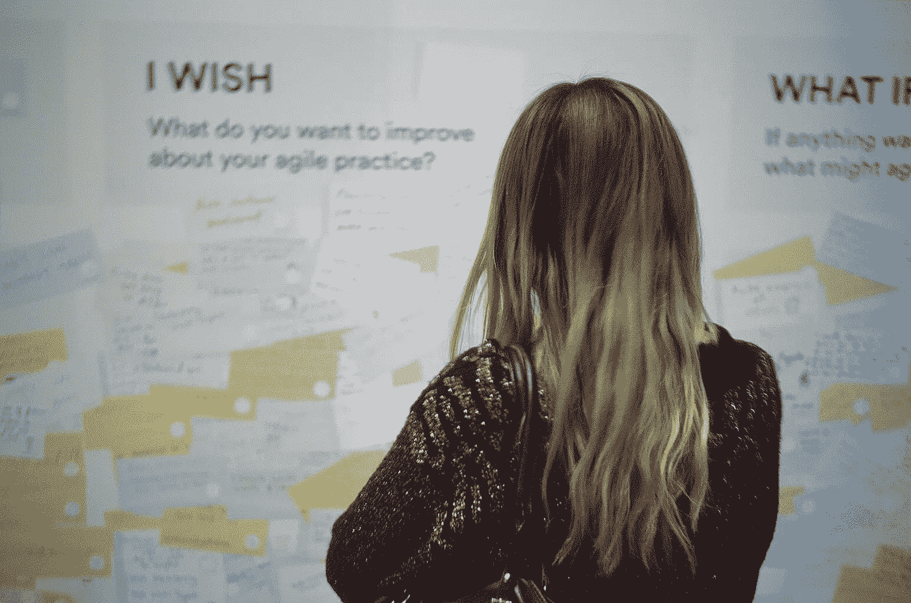
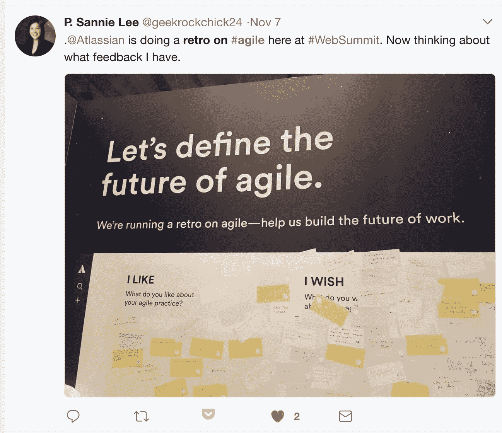
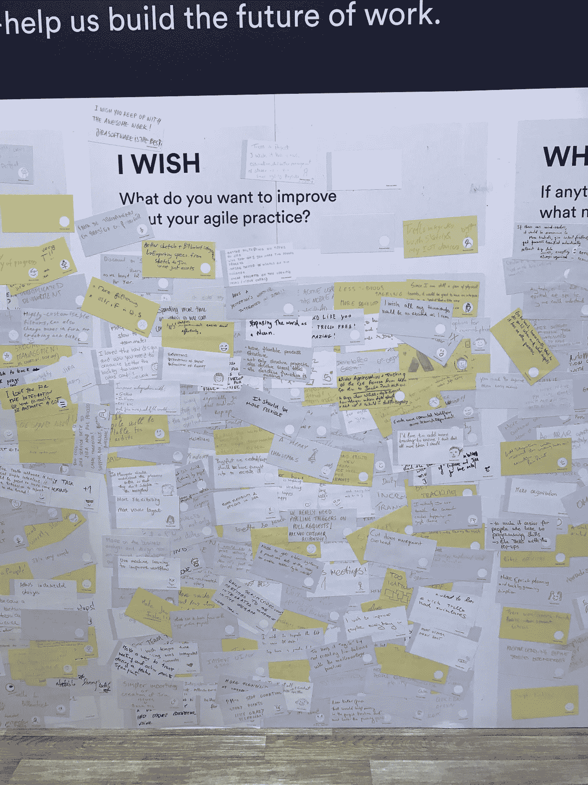
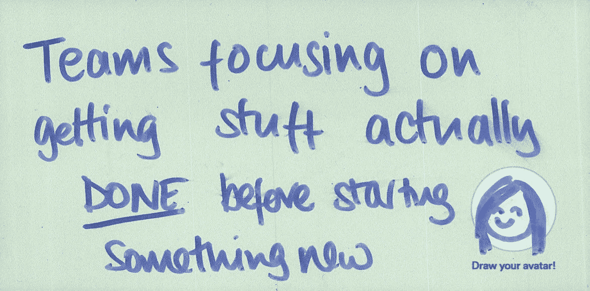

# 让敏捷开源# RetroOnAgile

> 原文：<https://medium.com/hackernoon/making-agile-open-source-retroonagile-3d817aa25dff>

> 通过参加 Atlassian 的全球敏捷回顾，与成千上万定义软件开发未来的人一起。#复古

## TL；速度三角形定位法(dead reckoning)

反思你的[软件开发](http://software development)经历，并点击以下链接进入 twitter:

1.  告诉我们你喜欢什么
2.  告诉我们你不喜欢什么
3.  思考未来，然后[填空](https://twitter.com/intent/tweet?text=%23WhatIf(in%20an%20impossibly%20good%20future%20what%20might%20your%20agile%20practice%20look%20like)%20%23RetroOnAgile)

## 看看目前为止我们收到的数千个回复。

我喜欢软件的一点是它的开源基因。当有数百种方法来解决一个问题时，当人们公开分享他们的解决方案时，这就创造了一个公平的竞争环境——在这个环境中，一个人可以像一个大公司一样产生影响。这种开源文化确保了即使软件巨头们，比如 DHH，分享他们的观点，他们也只是观点。

我把这种热情带到了 Atlassian，作为一个个体，我很高兴能为软件开发的未来做出贡献。我从与客户交谈中了解到的第一件事是令人难以置信的沮丧。我了解到[敏捷](https://hackernoon.com/tagged/agile)软件开发是令人惊讶的*而不是*开源。

我们在任何事件中得到的最常见的问题是这样的:“我不确定我是否做对了敏捷。能帮忙吗？”所以 Atlassian 的许多客户觉得他们一定是在敏捷方面做错了，或者他们只是不太擅长。他们害羞地分享他们如何“认为”他们“有点”在做 scrum，好像 scrum 是一个严格的框架，必须照章办事。最让我沮丧的是，当有人分享他们为什么不利用吉拉软件的一些特性时，他们一定不是 100%敏捷的。这种基于工具的敏捷观是一个巨大的问题，不仅仅是对 Atlassian 而言。

任何企业都需要向客户学习，任何行业都需要有前瞻性思维的参与者。敏捷软件开发的基于工具的观点给我们两者都没有。敏捷需要思想开放、开源的思维，像 Atlassian 这样的软件公司需要考虑的不仅仅是功能需求。

# 问题是:吉拉≠敏捷，亚特兰大≠敏捷

我交谈过的许多人都将吉拉软件等同于敏捷。作为 Atlassian 的代表，他们期望我告诉他们如何“正确地”进行敏捷他们把我为[敏捷蔻驰](https://www.atlassian.com/agile)写的内容看做教条的真理。他们希望他们的工具能够定义他们的工作流。他们期望敏捷是一个即插即用的过程，当他们推出我们的吉拉软件时就会发生。Atlassian 认为敏捷是一种思考、组织和工作的方式，我们的工具使敏捷团队更加高效。我们相信，让我们的客户接触到所有不同的工作方式，让他们能够选择对他们最有意义的方式。

# 机会:让敏捷开源

这么多人问我们关于他们的敏捷实践，我们抓住了一个机会去深入了解敏捷的好/坏/丑，并以一种有组织的方式去做。我们组织了一个团队，订了去葡萄牙里斯本的机票。我们在 2017 年网络峰会上赞助了一个展位，我们没有为注册或赠品进行优化，而是将超过一半的展位用于了解更多关于这个问题的信息。我们竖起了一面巨大的磁性墙，我们制作了 1000 多张磁性便利贴，我们要求展位参观者“回归敏捷”思考他们的软件开发经验并回答三个提示:

> 我喜欢:你喜欢敏捷实践的哪一点？
> 
> 我希望:你想在敏捷实践中提高什么？
> 
> 假设:如果一切皆有可能，你的软件开发会是什么样子？

如果说我们对敏捷董事会的复古已经开始，这是一种保守的说法。我的工作是把人们拉进展位，征求他们的反馈，在第一天进行到一半时，我再也跟不上了。一旦有几十张牌出来，我甚至都不需要给出指示。人们刚刚得到它。他们知道什么是复古，也知道在敏捷实践中什么可行，什么不可行。

当然，我们会分发 t 恤让大家参与，但在我们用完赠品后很久，人们仍然很兴奋地参与。事实上，参与者明显松了口气，甚至感谢我给了他们提交反馈的机会。在第一天结束时，我们必须把胶粘物拉下来，因为它们粘得太厚，磁铁吸不住。就在那天晚上，在记下数百个回复的时候，我们知道我们有所发现。截至 2008 年底，网络峰会收到了近 1000 份回复。

看到反馈，我很受鼓舞。我们开始了解人们想要从他们的敏捷实践中得到什么，而不仅仅是他们的敏捷工具。称之为回顾，并将提示集中在敏捷上，似乎很有效。分析数据后，不到一半的卡片提到了 Atlassian 产品。剩余的卡片，没有功能级别的反馈，被数字化、分类并分发给公司的各个团队考虑。

# 下一步是什么

自从网络峰会以来，我们已经在不同的形式和地点测试了这个概念。我们对敏捷的了解比以往任何时候都多，并以 Atlassian 十多年来所做的工作和研究为基础。客户对话已经从关注吉拉转移到关注敏捷。从教条的“资本-A”敏捷到更广泛的敏捷讨论。我们觉得我们很接近，但还没有完全结束这个对话——把一个关于敏捷的大讨论变成一个为敏捷而构建的新产品。为了到达那里，我们需要你的帮助。

# 我们向任何人开放我们的敏捷复古。

现在轮到你了。用[# retronagile](https://twitter.com/hashtag/RetroOnAgile)发布你的回顾。反思你的软件开发经历，简单的回应。告诉我们你喜欢你的敏捷实践的什么，你认为你可以改进什么，以及敏捷不可能的美好未来可能是什么样子。

会发生两件事之一:

## 1.你将定义敏捷的未来，并为开源敏捷铺平道路

## 2.我们将满足于大量的吉拉反馈，并打造最好的产品。

你的电话。要么关注敏捷，帮助定义软件开发的未来，要么帮助构建我们的敏捷工具吉拉软件的下一个版本。不管怎样，敏捷是赢家。你可以从今天开始。twitterverse 正在等待。

# 行动呼吁

思考您的软件开发经验，并通过以下链接访问 twitter:

1.  告诉我们你喜欢什么
2.  告诉我们你不喜欢[什么](https://twitter.com/intent/tweet?text=%23IWish%20(what%27s%20one%20thing%20you%27d%20like%20to%20improve%20about%20your%20agile%20practice)%20%23RetroOnAgile)
3.  思考未来，然后[填空](https://twitter.com/intent/tweet?text=%23WhatIf(in%20an%20impossibly%20good%20future%20what%20might%20your%20agile%20practice%20look%20like)%20%23RetroOnAgile)