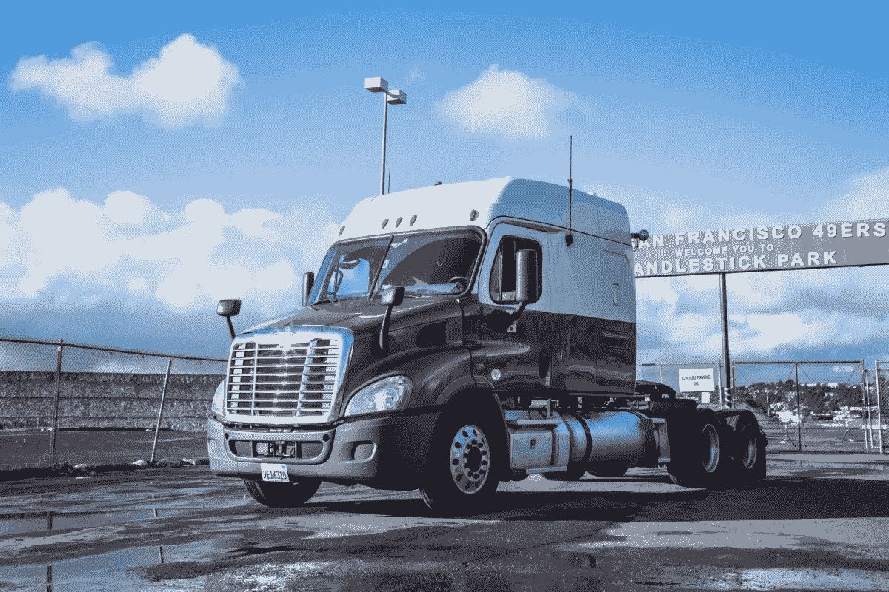
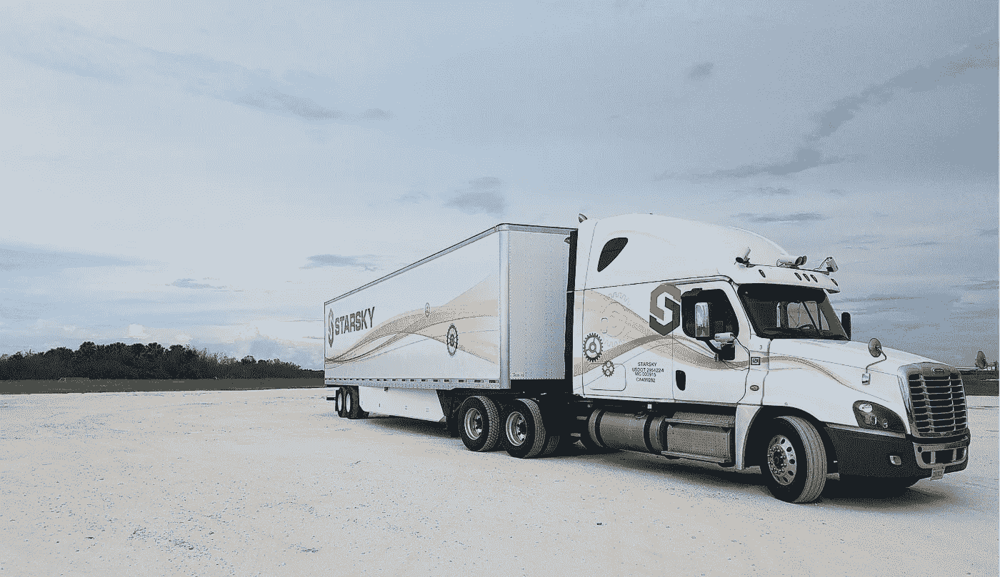
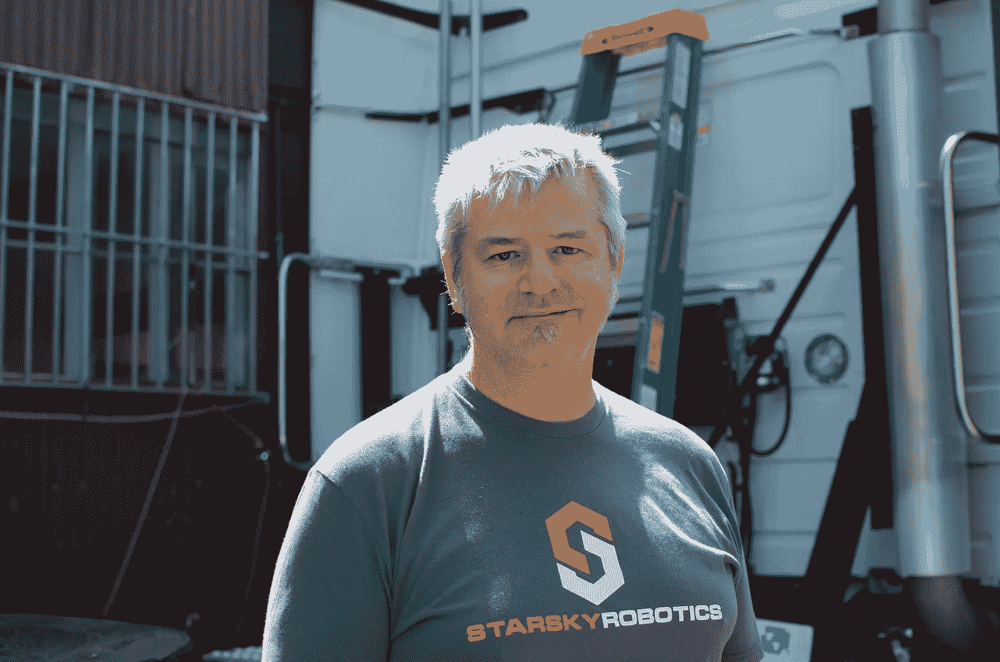

# 让(自主)卡车运输变得安全

> 原文：<https://medium.com/hackernoon/making-autonomous-trucking-safe-a282a99d8081>

我有很多理由相信卡车是自动驾驶汽车明智的第一步。卡车运输业占美国经济的近 4%，其中四分之一用于劳动力成本。目前劳动力短缺(这增加了每一件实物买卖的成本)，但自动化最大的论点是卡车非常危险。

卡车驾驶是这个国家最致命的职业之一，致命事故屡见不鲜。[这些 80000 磅重的车辆中，有四分之一的司机报告上个月在驾驶时睡着了](https://g3helpme.com/02/fatigued-truck-driver-driving-amazing-statistics/)，并且通常每晚只睡 5 个小时，所以毫不奇怪，在 2015 年超过 32000 起死亡事故中，近 3900 起[涉及大型卡车](https://www.fmcsa.dot.gov/safety/data-and-statistics/2017-pocket-guide-large-truck-and-bus-statistics)或公共汽车(超过十分之一)。

这并不是因为司机们胆大妄为，而是因为他们在一个只按运输里程付费的系统中工作。这可能迫使他们在安全驾驶和支付租金之间做出选择。

我在 Starsky Robotics 的团队正在夜以继日地工作，以使无人定期服务早日成为现实。这意味着，与该领域的许多人不同，我们不能“以后”再考虑安全问题现在就需要安全。

Starsky Robotics’ first truck: Rosebud in 2017

## 汽车安全(或者说，我如何学会不再担心并爱上 ISO 26262)

虽然在硅谷相对不为人知，但安全工程已经成为汽车工程的核心学科之一超过 100 年了。有充分的理由:当你建造可能伤害人的东西时，重要的是开发允许你的团队提出问题、理解风险和安全设计的过程。

前者很重要。前几周，在 Mapbox 的 Locate 会议上，有人问我，自动驾驶工程师是否应该像希波克拉底一样宣誓。这个问题有一定的依据:作为一名制造自动驾驶卡车的工程师，你可能会因为担心代码中的一行不好的内容会伤害到某人而感到麻痹。让我们的团队有机会表达他们可能有的任何担忧，这一点非常重要。如果我们选择继续前进，Starsky 的领导层会这样做，同时承担那些提出担忧的人(以及开发系统的人)的责任。

虽然 ISO 26262(汽车安全圣经)可能被过度引用，但在设计安全的汽车产品时，它仍然和以往一样重要。ISO 26262 将(子)系统的风险定义为三个值的乘积:严重性(故障)、暴露性(故障)和可控性(故障情况下)。

> 风险分值=严重性*暴露程度*可控性

为了避免我们对汽车事故的不同场景进行冗长的(似乎不可避免的)判断，我们可以将系统范围内的故障的严重性判断为一个常数。如果我们的系统完全失灵，将会造成不可挽回的重大损失。

曝光很好理解。那次失败会影响你多少动力？你总是需要刹车，但是你多久需要一次左转向灯呢？某个特定(子系统)系统出现故障的可能性有多大:是你的右前轮胎还是你的感知系统？

可控性更细致入微。本质上，可控性是指你需要有多熟练的驾驶员来安全地处理故障。几乎任何人都可以在高速公路上安全地行驶。

综上所述，我们看到轮胎的风险评分足以允许偶尔爆胎是可以接受的。彻底的感知失败的不可控性是为什么几乎每个自治团队都需要大量的感知冗余。

“欺骗”自动驾驶汽车可控性的最简单方法是始终让一名训练有素的驾驶员坐在方向盘后面……这是大多数自动驾驶汽车行业正在做的事情。这就是为什么它如此重要，以至于[我们已经完成了完全无人驾驶的测试](https://hackernoon.com/starskyunmanned-de7af7e5a38b)。

In February 2018, Starsky Robotics completed a 7-mile fully driverless trip in Florida without a single human in the truck

## 安全:一部 AV 最重要的特征

总结一下:安全对于自动驾驶卡车来说非常重要。在 Starsky，我们希望快速让无人驾驶卡车上路。如果没有一个人作为后援，很难设计出一个安全的系统。

这就是为什么我们很快发现，我们的第一个高级雇员不会是一名控制兽医或机器学习专家，而是一名安全主管。

我们制造了一个能开卡车的机器人。我们已经建造了遥控操作系统，能够将一辆 53 英尺长的拖车停在另外两辆拖车之间，每辆拖车的间隙为 1 英尺。我们已经建立了高速公路自动驾驶仪，能够在大风大雨的车道上保持 45，000 磅的拖车。

但是，确保该系统在没有人在场的情况下在开车的公众中安全地定期外出是一个真正的挑战。

## 不结实的长凳

当我们开始在自动驾驶领域和周围会见安全工程师时，我们注意到了一些事情:虽然每个人和他们的兄弟都想为自动驾驶汽车进行机器学习，但几乎没有人在安全方面工作。许多肩负安全职责的人都看错了方向。

有一次，我们甚至有一个“大人物”安全人员问我们，为什么我们甚至需要设计一个没有人在里面也是安全的系统，因为“无人驾驶汽车有什么意义？”

我们遇到了一些人，他们愿意审核他人的工作，但不愿意制定安全政策(反之亦然)。那些对硬件有很好想法，但遇到软件时却踌躇不前的人(反之亦然)。许多人不知道如何在这个行业起步，在一段时间内，我们将成为最严格的批评者。

然后我们遇到了沃尔特。

## 沃尔特·斯托克威尔:斯塔奇机器人公司的安全政策主管

上述所有人的明显例外是沃尔特·斯托克威尔，我非常高兴地宣布他加入斯塔奇，成为我们的安全政策总监。

Walter Stockwell, Director of Safety Policy at Starsky Robotics

从我们与他的第一次谈话开始，Walter 帮助我们转变了对“安全”的看法，从天真但普遍的安全概念转变为将安全视为一个过程，以及一系列*限定的陈述。*

一个系统在完成“n”次测试后并不一定安全，无论 n 是一次试驾还是[兰德的 11B](https://www.rand.org/content/dam/rand/pubs/research_reports/RR1400/RR1478/RAND_RR1478.pdf) 英里。系统变得更加安全，因为它被设计为安全的，并经过严格的验证测试。一个系统永远不会绝对安全地抵御所有可能的威胁，但是它需要能够在指定的操作设计领域内运行，而不存在不可接受的风险。

Walter 不仅带来了这种程度的工程成熟度，还带来了多年的硬件/软件经验、安全系统工程经验、发展组织以提出安全问题的实践，以及他在 DJI 的最后一份工作中制定国家安全政策的领导经验。

> “Starsky Robotics 已经成为自动驾驶汽车领域的领跑者。它已经成功解决了无人驾驶卡车面临的一些最复杂的挑战。很明显，Starsky 的每个人从一开始就关注安全，他们在竞争中遥遥领先。我很高兴能加入这个极具创新性和前瞻性的团队，”Walter 说。

有 Walter 在我们的团队，我非常期待未来的发展。

继续前进

斯特凡

(附注:我们仍在寻找大量团队成员来帮助我们让无人驾驶卡车上路，尤其是在控制工程、机器学习和许多其他领域。可以在 [starsky.io](http://starsky.io/) 申请。

我还要感谢朱莉娅·伊琳娜、卡尔凯·提瓦瑞和沃尔特·斯托克威尔阅读(并大量编辑)了本文的早期版本。