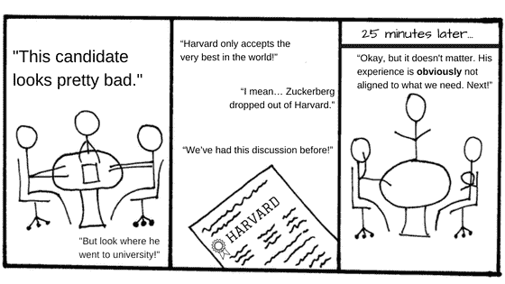
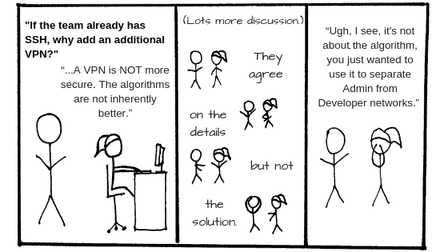
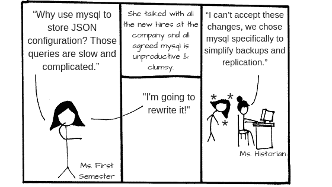
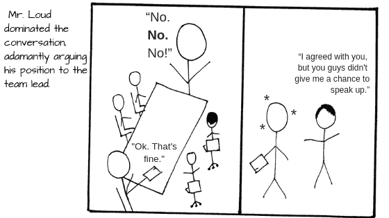
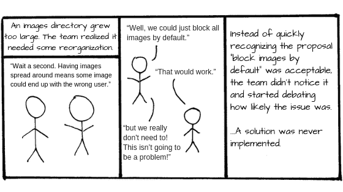
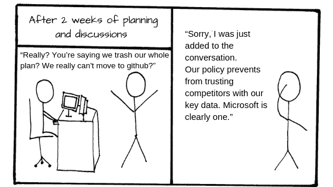
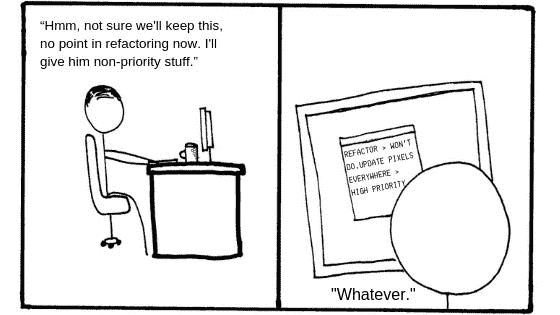
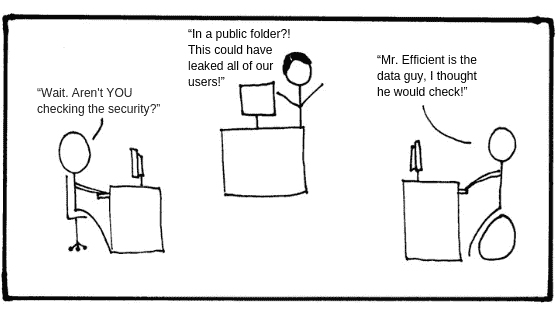
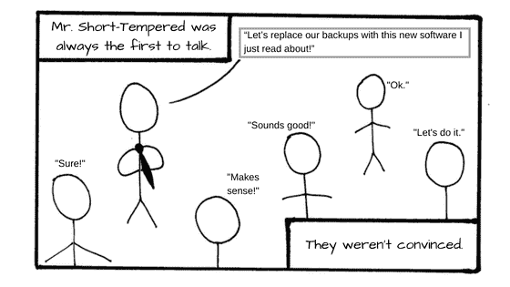

# 在技术团队中做出复杂的决策

> 原文：<https://medium.com/hackernoon/making-complex-decisions-in-technical-teams-33c7e6f93996>

# 工作场所的问题解决和决策

作为专业技术人员，我们有系统让我们知道数据何时结构良好，测试何时完成，或者代码何时编译。我们设计了在找到解决方案时通知我们的机制。

但是对于工作中人的一面，就不一样了。

在我们管理技术团队的经验中，**每个人处理会议、长长的电子邮件链或没完没了的无聊对话的方式都不同**。低效的沟通往往会导致生产力的巨大损失。

以下是技术团队在试图解决复杂问题或做出群体决策时面临的一些常见场景:

# 1.决策进展缓慢

技术员工有陷入日常维护和工作的倾向，通常以重要但不紧急的决策为代价。许多团队缺乏特定的协议来确保他们在需要复杂分析的决策上取得进展。

# 2.关于不相关话题的长时间辩论

通常，一个不会影响决策结果的无关紧要的话题会引发激烈的争论，并破坏整个对话。这些题外话浪费时间，抢了决定解决方案的真正对话的风头。

# 3.难以确定分歧的根源

个人倾向于对他们认为的最佳解决方案有一个直观的认识。当一名团队成员提议用不同的方式来阐述问题时——使用不同的假设或优先级——讨论开始了，这种内部心理状态的转移可能并不是每个人都很明显。

即使团队在“利弊”上达成一致，他们可能**不同意每一个的重要性**。也许团队同意有风险，但不**它发生的可能性有多大。考虑的人越多，考虑的因素越多，就越难理解每个人的立场，也越难理解为什么。**

# 4.新团队成员的知识转移

新的团队成员可能是福也可能是祸。当一个新成员加入时，有时他们会看到事态的发展，并根据他们过去的经验提出改变。但是他们经常缺乏关于你的团队迄今为止的过程的知识。他们遗漏了背景故事。文档通常不存在，或者不适合阅读。

# 5.大人物主导讨论

某些团队成员经常主导谈话，而其他人则倾向于保持沉默。这发生在会议中，但也通过电子邮件或 Slack。通常**一个直言不讳的成员会通过写充满细节的长消息来强制对话**，这将需要很长时间来回应，通常与此人的职能不相称。这有时会以牺牲其他团队成员的利益为代价，而这些团队成员往往有更有分寸和更有价值的输入。

# 6.难以知道是否以及何时达成共识

对于在办公室和完全远程的团队来说，当试图满足一组复杂的标准时，**很难——有时甚至不可能——掌握群体意见的汇总视图。如果你甚至不确定是否每个人都同意团队可以接受的替代方案，达成妥协是不可能的。**

# 7.缺少关键信息

让每个人都放下工作，让他们参与影响许多人的大型集体讨论，成本可能会很高。因此，一些相关的利益相关者经常会开会讨论所有的选项。当他们达成一个解决方案并将其提交给整个团队时，人们通常会添加一些以前没有考虑到的新信息。当每个团队成员被告知并添加新的缺失部分时，必须一次又一次地进行整体的重新评估。

# 8.认知偏差

我们的大脑进化是为了帮助我们生存，而不一定是为了帮助我们评估概率，做出合乎逻辑的、基于证据的决定。现代办公室与我们祖先曾经遇到的任何事物都不一样。

## 与工作场所决策相关的常见偏见示例:

**可用性启发:**你有一个暂时的短缺，突然你把所有的优先事项切换到性能问题。

**确认偏差:**你不同意你的队友和谷歌:“队友意见烂透了”。然后你读了一篇文章，这篇文章让你觉得自己的行为是正当的。

沉没成本谬论:在一个项目上投入一周的工作后，你发现有一个开源项目也在做同样的事情。虽然安装只需要一个小时，但即使你知道这将花费你几天时间，你仍然选择继续完成原来的项目。

# 9.低买入

人们越觉得自己被卖给了别人，他们就越有可能抵制或忽视提议的行动方案。反复强迫你的团队做出自上而下的决定会激起团队成员的怨恨和冷漠。真正的认同至少包含一些共同创造的元素。没有讨论或辩论，你会错过重要的反馈，你的团队也不会对结果有归属感。

# 10.角色不明确

明确的角色有助于高效的团队，同时改善责任和协作。当角色定义不明确时，人们花更多的时间协商责任，而花更少的时间做实际工作。事情也更容易被忽视或无人认领——拖延重要的决策过程。

# 11.群体思维

有时团队会做出不合理或有问题的决策，因为他们的成员重视和谐与一致，而不是精确的分析和批判性的评估。其他时候，个人可以获得强烈不鼓励不同意见的隐含信息，导致他们将自己的想法和感受放在一边，毫无疑问地听从领导和/或其他团队成员的话。无论如何，群体思维可以关闭一个有价值的反馈回路，并导致决策失误。

# 设计解决方案

当我们从 5 人发展到 500 多人时，这些问题是我们在 SaaS 一家企业 B2B 公司产品开发中的日常问题。

虽然你可以通过良好的公司政策和管理来缓解这些问题，但目前还没有一套最佳实践或机制来帮助你。你最好的办法是将通用工具缝合在一起，组成你自己的过程，并监督你的团队遵守。但是你的工作越复杂，这些问题似乎就越被放大。

我们计划在未来的博客文章中更深入地解决这些问题，并且[提出解决方案](http://resolutt.com)。敬请关注。

埃泽基埃尔·巴斯克斯和奥古斯丁·费尔南德斯

我们错过什么了吗？请在下面的评论中告诉我们，或者发电子邮件至 ezequiel@resolutt.com[或 agustin@resolutt.com](mailto:ezequiel@resolutt.com)[或](mailto:agustin@resolutt.com)，我们很想知道你的技术团队在做出复杂决策时遇到了哪些令人头疼的问题。