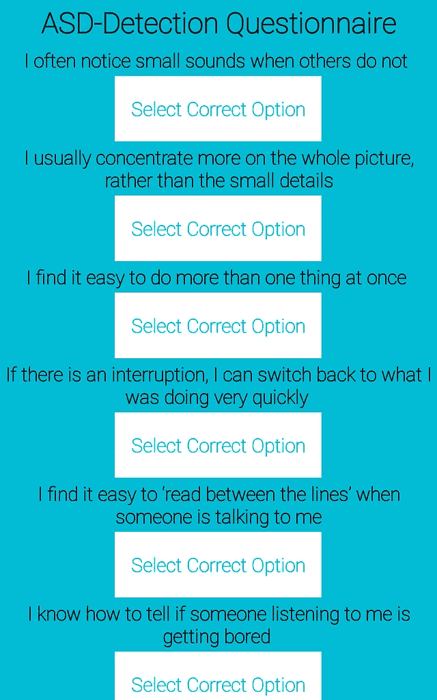

# 通过机器学习让医疗保健更智能:智能 ASD(自闭症谱系障碍)检测 API

> 原文：<https://medium.com/hackernoon/making-healthcare-smarter-via-machine-learning-a-smart-asd-autism-spectrum-disorder-detection-e26cafec08e7>

对应的 GitHub 项目:[https://github.com/ritabratamaiti/Autism-Detection-API](https://github.com/ritabratamaiti/Autism-Detection-API)

也可以在 https://ritabratamaiti.github.io/RapidML 的[查看 RapidML 文档](https://ritabratamaiti.github.io/RapidML)

也请阅读我关于普遍基本收入的中型文章:[如果你的工作可以自动化，它很可能会自动化；为什么这是一件好事…](/@ritabratamaiti/if-your-job-can-be-automated-it-most-probably-will-be-and-why-thats-a-good-thing-353ec6b6a768)

美国国家精神卫生研究所(NIMH)将自闭症谱系障碍(ASD)定义为:

> 自闭症谱系障碍(ASD)是一种影响交流和行为的发育障碍。虽然自闭症可以在任何年龄被诊断出来，但它被称为“发育障碍”，因为症状一般出现在生命的头两年。

此外，在进行诊断时会考虑以下症状:

*   难以与其他人交流和互动
*   受限的兴趣和重复的行为
*   伤害人在学校、工作和其他生活领域正常运作能力的症状

*(来源:NIMH)*

本文是关于自闭症检测 API 的创建和使用的全面指南，关于自闭症的更严格的讨论可以在 https://www . nimh . NIH . gov/health/topics/Autism-spectrum-disorders-ASD/index . shtml 找到

API [设计](https://hackernoon.com/tagged/design)可以分为三个部分:

*   生成适当的机器[学习](https://hackernoon.com/tagged/learning)模型，并根据我们的数据训练该模型。这是通过 [RapidML](https://rapidml.readthedocs.io/en/latest/) 完成的

*   使用助手模块，在从 API 的 URL、从实际的 Flask API 接收输入时进行预测

**重要:**

在这里找到笔记本:[https://github . com/ritabratamaiti/Autism-Detection-API/blob/master/RapidML _ ASD _ prediction . ipynb](https://github.com/ritabratamaiti/Autism-Detection-API/blob/master/RapidML_ASD_Prediction.ipynb)

(包含各种格式的数据描述)

# API 演示:

探访:[http://ritabratamaiti.pythonanywhere.com/query?ip=0，0，0，0，0，0，1，0，1，2，30.0，m，白欧，不，不，爱尔兰，不，Self，不](http://ritabratamaiti.pythonanywhere.com/query?ip=0,0,0,0,0,0,0,1,0,1,2,30.0,m,White-European,no,no,Ireland,no,Self,NO)

你会在你的浏览器上得到一个 0 的值，表明这个人没有患自闭症。

分配给 ip 的值:(0，0，0，0，0，0，0，1，0，1，2，30.0，m，欧洲白人，no，no，Ireland，no，Self，NO)表示根据[数据集描述](https://github.com/ritabratamaiti/Autism-Detection-API/blob/master/Manual_and_description/Dataset_Description.pdf)的各种特征。您可以随意更改 API 参数来探索不同的结果。1 = ASD 存在；0 = ASD 不存在

# 应用演示:

上述 API 可用于广泛的应用中，从网络应用、脚本和用于 ASD 检测的移动应用。在这里，我使用 API 制作了一个 android 应用程序，它获取用户输入，然后在云端进行预测，并交付输出。

你可以在这里测试这个应用:[https://github . com/ritabratamaiti/Autism-Detection-API/tree/master/Android % 20 app % 20 based % 20 on % 20 API](https://github.com/ritabratamaiti/Autism-Detection-API/tree/master/Android%20App%20Based%20on%20API)

# 关于这个项目:

我真的很高兴你检查了这个项目。作为一名人工智能研究人员，将 AI 和通用机器学习应用于医疗保健和医学领域一直是我的梦想。这是我目前正在进行的几个项目之一，探索医疗保健中的机器学习。

如果您能通过以下方式支持我的工作，我将不胜感激

*   在[https://rapidml.readthedocs.io/](https://rapidml.readthedocs.io/)检查 RapidML
*   主演我的 GitHub 项目库:[https://github.com/ritabratamaiti/Autism-Detection-API](https://github.com/ritabratamaiti/Autism-Detection-API)
*   访问我的医学影像 AI 建议书网站:[https://ritabratamaiti.wixsite.com/aimedicine](https://ritabratamaiti.wixsite.com/aimedicine)
*   通过此表格提供您关于医学成像人工智能的宝贵建议/意见:[https://docs . Google . com/forms/d/e/1 faipqlsfdtibkns 4 owv 3 pqw 9 ebex 2s gosuko _ pzz M4 dl 5 q 7 ixm 4 jelq/view form](https://docs.google.com/forms/d/e/1FAIpQLSfdtiBknS4OWv3pQW9eBex2sGoSUKO_PZzM4DL5Q7ixM4JeLQ/viewform)
*   查看 pythonanywhere，这是一个托管 python web 应用程序的惊人解决方案。此外，如果你想升级你的帐户，请点击这个链接:[https://www.pythonanywhere.com/?affiliate_id=003915da](https://www.pythonanywhere.com/?affiliate_id=003915da)(注意，这是一个附属链接。)
*   通过 paypal.me/ritabratamaiti 为继续发展提供任何数额的资金支持